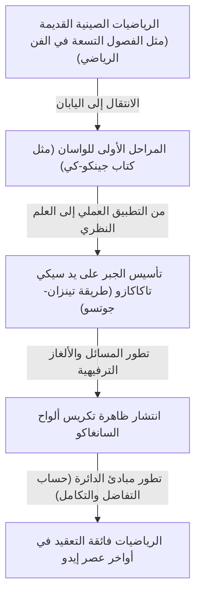
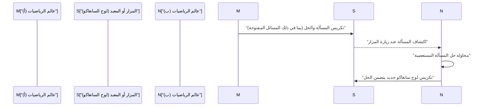

## 1. ما هي رياضيات «الواسان» (Wasan)؟ معجزة رياضية وليدة العزلة

خلال عصر إيدو (1603–1867م)، تبنت اليابان سياسة عزلة صارمة عن العالم الخارجي عُرفت باسم «ساكوكو» (Sakoku). ومع ذلك، وفي قلب هذه العزلة الثقافية والمكانية، ازدهرت ثقافة رياضية متقدمة وفريدة من نوعها عُرفت باسم **«الواسان» (Wasan)**، أي الرياضيات اليابانية التقليدية.

في تلك الحقبة، كان إسحاق نيوتن وغوتفريد لايبنتس يؤسسان لعلم التفاضل والتكامل في أوروبا، لكن في الوقت ذاته تقريباً، كانت اليابان تطور مفاهيم تضاهي حساب التفاضل والتكامل في سياق مستقل تماماً. بدأت رياضيات الواسان من حسابات عملية تتعلق بالمساحة وضبط التقويم، ثم سرعان ما ارتقت لتصبح ألعاباً فكرية رياضية بحتة، بل ضرباً من ضروب الفن الرفيع.



### 1.1 كتاب «جينكو-كي»: الكتاب الأكثر مبيعاً

كانت الشرارة التي أدت إلى الانتشار المذهل للواسان هي صدور كتاب «جينكو-كي» (Jinkoki) عام 1627م للمؤلف يوشيدا ميتسويوشي (Yoshida Mitsuyoshi). شمل الكتاب شروحاً مصورة ومبسطة لكل شيء، بدءاً من طريقة استخدام المعداد اليدوي (السوربان)، وحساب المساحات والأحجام، وصولاً إلى مسائل ترفيهية ذكية مثل «مسألة توالد الفئران» (Nezumizan).

```python
# محاكاة مسألة توالد الفئران (تنفيذ باستخدام Python)
def nezumizan(months):
    # الزوج الأول من الفئران
    pairs = 1
    for month in range(1, months + 1):
        # افتراض إنجاب 12 فأراً (6 أزواج) كل شهر
        pairs += pairs * 6
    return pairs * 2 # إجمالي عدد الفئران

print(f"عدد الفئران بعد 12 شهراً: {nezumizan(12)} فأراً")
# المخرجات: عدد الفئران بعد 12 شهراً: 27682574402 فأراً
```

حقّق هذا الكتاب مبيعات منقطعة النظير، مدعوماً بارتفاع نسبة التعليم ومحو الأمية في اليابان خلال عصر إيدو، مما جذب قلوب أعداد غفيرة من الناس لسحر الرياضيات وشغفها.

## 2. العبقري سيكي تاكاكازو وطريقة «تينزان-جوتسو»

في النصف الثاني من القرن السابع عشر، ارتقى عالم الرياضيات الفذ **سيكي تاكاكازو (Seki Takakazu)** بالواسان لتصل إلى أرقى المستويات العالمية في عصره. لُقب سيكي بـ «قديس الرياضيات»، وعُرف كذلك بـ «نيوتن اليابان».

كان أعظم إنجازات سيكي تاكاكازو هو ابتكاره لنظام «تينزان-جوتسو» (Tenzanjutsu)، وهو ترميز جبري رمزي يمثل المجاهيل برياضيات مكتوبة لصياغة المعادلات. بفضل هذا الابتكار، تجاوزت الرياضيات القيود التي فرضتها «أعواد الحساب» (سانغي - Sangi) الصينية التقليدية، وأصبح من الممكن إجراء حسابات جبرية بالغة التعقيد مباشرة على الورق.

### اكتشاف المحددات (Determinants)
سبق سيكي تاكاكازو الفيلسوف وعالم الرياضيات الأوروبي لايبنتس بنحو عقد من الزمان في ابتكار مفهوم «المحددات» لحل أنظمة المعادلات الخطية. وثّق سيكي في كتابه الشهير «كاي-فوكوداي-نو-هو» (طريقة حل المسائل المجهولة) منهجية حسابية تطابق جوهرياً فك المحددات الحديث.

$$ \Delta = a_{11}a_{22} - a_{12}a_{21} $$

## 3. «السانغاكو» (Sangaku): ألواح الرياضيات المعلقة في المعابد والمزارات

لا يمكن الحديث عن الواسان دون التوقف عند ثقافة **«السانغاكو» (Sangaku)** الفريدة. والسانغاكو هي ألواح خشبية نذرية تُعلّق في مزارات الشنتو ومعابد البوذية، كُتبت عليها مسائل هندسية معقدة وحلولها، مصحوبة برسوم وأشكال هندسية في غاية الدقة والجمال.

### 3.1 شكر للآلهة... وتحدٍ مفتوح بين الرياضيين

لماذا نذر اليابانيون مسائل الرياضيات في المعابد والمزارات؟
1. **التعبير عن الشكر والامتنان**: اعترافاً بأن التوصل لحل مسألة مستعصية كان بفضل البركة والإلهام الإلهي.
2. **إثبات المهارة والتواصل**: وسيلة لإبراز البراعة العلمية أمام المجتمع، وفي الوقت نفسه تقديم «تحدٍ مفتوح» (يُعرف بـ إيداي - Idai) يسأل الرياضيين الآخرين: «هل بمقدوركم حل هذه المسألة؟».

شارك في إعداد ألواح السانغاكو مختلف أطياف المجتمع بغض النظر عن طبقاتهم، من فلاحي القرى ومحاربي الساموراي والتجار، إلى النساء والأطفال. فكانت هذه الظاهرة ثقافة رياضية شعبية وتشاركية لا نظير لها في تاريخ العالم.



### 3.2 مسائل السانغاكو النموذجية: مبادئ الدائرة (إنري)

كانت النسبة العظمى من مسائل ألواح السانغاكو تركز على الهندسة الإقليدية، وتحديداً مسائل الدوائر المتماسة والأشكال المضلعة المحصورة داخل دوائر كبرى.

**【نموذج لمسألة شهيرة】**
«داخل دائرة كبرى (خارجية)، توجد ثلاث دوائر متطابقة ومتماسة فيما بينها (دوائر أ)، وتلامسها دائرة أصغر في الوسط (دائرة ب). إذا عُلم قطر إحدى الدوائر (أ)، فما هو قطر الدائرة الصغيرة (ب)؟»

ولحل هذه المسائل الهندسية المعقدة، طوّر علماء الواسان طريقة عُرفت باسم **«إنري» (Enri - مبادئ الدائرة)**، وهي معالجة حسابية تعتمد على حساب النهايات وتكافئ التكامل في عصرنا الحاضر. واستطاعوا من خلالها حساب قيمة الثابت المصدري $\pi$ (باي) بدقة متناهية تصل لعشرات الخانات العشرية، وحساب أطوال المنحنيات المعقدة وأحجام المجسمات الفراغية بدقة بالغة.

## 4. نهاية الواسان وبداية الاتصال بالرياضيات الحديثة

مع بداية عصر ميجي (1868م وما بعده)، انطلقت اليابان في حركة تحديث وتغريب متسارعة. وضمن إصلاحات المنظومة التعليمية، قررت حكومة ميجي إلغاء تدريس الواسان نظراً لرموزها المحلية الخاصة التي تختلف عن المعايير الدولية، واعتمدت رسمياً الرياضيات الغربية في المناهج والجامعات.

رغم أن هذا القرار أدى إلى تراجع الواسان السريع واندثارها تدريجياً، إلا أن «التفكير الرياضي العميق» و«الشغف المعرفي بحل الألغاز» اللذين بنتهما ثقافة الواسان شكّلا قوة الدفع الأساسية التي مكّنت اليابانيين في عصر ميجي من استيعاب العلوم والرياضيات الغربية الحديثة بسرعة مذهلة أدهشت العالم.

## 5. روح الواسان الحية في عصرنا الحاضر

حتى يومنا هذا، لا يزال ما يقارب 900 لوح من ألواح السانغاكو محفوظاً بعناية في المعابد والمزارات في مختلف أنحاء اليابان ككنوز وثروات ثقافية وتاريخية ثمينة. بالإضافة إلى ذلك، تشهد مسائل السانغاكو اليوم اهتماماً متجدداً في التعليم الرياضي الحديث باعتبارها أدوات تعليمية ملهمة لتنمية التفكير المنطقي وروح الاستكشاف.

إن تلك الألغاز الرياضية التي نقشها عباقرة عصر إيدو على ألواح الخشب، ما زالت بعد كل هذه القرون تنبض بالحياة، لتعلمنا جمال الرياضيات والبهجة الحقيقية التي نشعر بها عند حل ألغازها.
