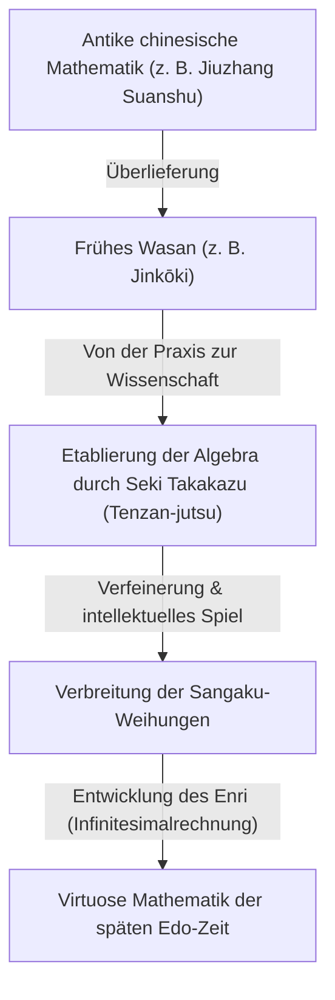
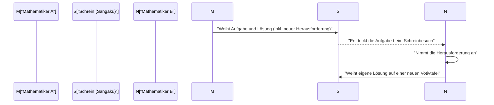

## 1. Was ist Wasan? Das mathematische Wunder der nationalen Abschließung

Während der Edo-Zeit (1603–1867) verfolgte Japan eine Politik der strikten nationalen Isolation, bekannt als „Sakoku“. Doch innerhalb dieses kulturell und physisch abgeschotteten Raumes blühte eine eigenständige, hochentwickelte mathematische Kultur auf: das **Wasan (和算)**.

Zur selben Zeit begründeten Newton und Leibniz in Europa die Infinitesimalrechnung (Differential- und Integralrechnung). Im zeitgleichen Japan entstanden jedoch aus einem völlig anderen Kontext heraus Konzepte, die der europäischen Analysis in nichts nachstanden. Wasan begann mit praktischen Anwendungen wie Landvermessung und Kalenderberechnung, entwickelte sich jedoch nach und nach zu einem reinen intellektuellen Spiel und stieg schließlich zu einer wahren Kunstform auf.



### 1.1 Der Bestseller „Jinkōki“

Den Anstoß für die explosionsartige Verbreitung von Wasan gab das 1627 von Yoshida Mitsuyoshi veröffentlichte Werk *Jinkōki* (塵劫記). Von der Bedienung des Abakus (Soroban) über die Berechnung von Flächen und Volumina bis hin zu unterhaltsamen Rätseln wie der „Mäusevermehrungsrechnung“ (Nezumizan) enthielt das Buch leicht verständliche, reich illustrierte Erklärungen.

```python
# Simulation der Mäusevermehrung (Nezumizan in Python)
def nezumizan(months):
    # Erstes Mäusepaar
    pairs = 1
    for month in range(1, months + 1):
        # Annahme: Bringt jeden Monat 12 Nachkommen (6 Paare) zur Welt
        pairs += pairs * 6
    return pairs * 2 # Gesamtzahl der Mäuse

print(f"Anzahl der Mäuse nach 12 Monaten: {nezumizan(12)}")
# Ausgabe: Anzahl der Mäuse nach 12 Monaten: 27682574402
```

Begünstigt durch die bemerkenswert hohe Alphabetisierungsrate in der Edo-Zeit entwickelte sich dieses Buch zu einem beispiellosen Bestseller und entfachte bei unzähligen Japanern die Begeisterung für die Mathematik.

## 2. Das Genie Seki Takakazu und das „Tenzan-jutsu“

In der zweiten Hälfte des 17. Jahrhunderts hob **Seki Takakazu** (auch Seki Kōwa genannt) Wasan auf internationales Spitzenniveau. Er wurde als „Heiliger der Rechenkunst“ (Sansei) verehrt und wird oft als der „japanische Newton“ bezeichnet.

Sekis größte Errungenschaft war die Entwicklung des „Tenzan-jutsu“ (点竄術), einer Methode zur Formulierung von Gleichungen mithilfe von Symbolen für Unbekannte. Dadurch überwand er die Grenzen der aus China stammenden physischen Rechenstäbchen (*Sangi*) und ermöglichte es, komplexe algebraische Berechnungen direkt auf Papier durchzuführen.

### Die Entdeckung der Determinante
Seki Takakazu entdeckte das Konzept der Determinante zur Lösung linearer Gleichungssysteme rund zehn Jahre vor Leibniz in Europa. In seinem Werk *Kai-fukudai no Hō* (解伏題之法) beschrieb er Berechnungsmethoden, die im Wesentlichen der modernen Determinantenentwicklung entsprechen.

$$ \Delta = a_{11}a_{22} - a_{12}a_{21} $$

## 3. Mathematische Votivtafeln an Schreinen und Tempeln: „Sangaku“

Ein unverzichtbarer Bestandteil der Wasan-Kultur sind die **Sangaku (算額)**. Dabei handelt es sich um eine besondere Art von Votivtafeln (Ema) aus Holz, auf denen mathematische Aufgabenstellungen und deren Lösungen zusammen mit kunstvollen geometrischen Zeichnungen dargestellt und in Shinto-Schreinen oder buddhistischen Tempeln geweiht wurden.

### 3.1 Dank an die Götter und Herausforderungen unter Mathematikern

Warum wurden mathematische Probleme an heiligen Stätten dargebracht?
1. **Ausdruck der Dankbarkeit**: Ein Zeichen des Dankes für göttlichen Beistand („Dass ich dieses schwierige Problem lösen konnte, verdanke ich dem Schutz der Götter und Buddhas“).
2. **Selbstdarstellung und intellektueller Dialog**: Der Wunsch, das eigene Können öffentlich zu demonstrieren, kombiniert mit einer offenen Herausforderung (*Idai*) an andere Gelehrte: „Könnt ihr dieses Problem lösen?“

Von Bauern über Samurai und Kaufleute bis hin zu Frauen und Kindern beteiligten sich Menschen aller gesellschaftlichen Schichten an der Erstellung von Sangaku. Dies war eine weltweit einzigartige, partizipative mathematische Volkskultur.



### 3.2 Typische Sangaku-Probleme (Enri)

Die Mehrheit der Sangaku-Aufgaben befasste sich mit euklidischer bzw. ebener Geometrie. Besonders beliebt waren Aufgabenstellungen mit sich gegenseitig berührenden Kreisen und Polygonen, die in größere Kreise eingeschrieben waren.

**【Typisches Beispiel eines Problems】**
„In einem äußeren Kreis befinden sich drei gleich große Kreise (Kreis A), die einander berühren, sowie ein kleinerer Kreis (Kreis B), der alle drei berührt. Bestimmen Sie den Durchmesser von Kreis B, wenn der Durchmesser von Kreis A gegeben ist.“

Um derart komplexe geometrische Probleme zu lösen, entwickelten die Wasan-Mathematiker das sogenannte „**Enri (円理)**“ – eine Methode der Grenzwertberechnung, die im Wesentlichen der modernen Integralrechnung entspricht. Sie berechneten die Kreiszahl $\pi$ auf Dutzende Nachkommastellen genau und bestimmten Bogenlängen komplexer Kurven sowie das Volumen dreidimensionaler Körper.

## 4. Das Ende von Wasan und der Übergang zur modernen Mathematik

Mit dem Beginn der Meiji-Zeit (ab 1868) trieb Japan eine rasante Modernisierung und Verwestlichung voran. Im Zuge der Reform des Bildungswesens beschloss die Meiji-Regierung, das traditionelle Wasan aufgrund seiner isolierten Symbolik und geringeren industriellen Anwendbarkeit abzuschaffen und stattdessen die westliche Mathematik offiziell im Lehrplan zu verankern.

Zwar führte dies zu einem raschen Niedergang von Wasan, doch die dadurch geförderte ausgeprägte mathematische Denkfähigkeit und die spielerische intellektuelle Neugier bildeten das Fundament dafür, dass japanische Wissenschaftler moderne westliche Naturwissenschaften und Mathematik in atemberaubender Geschwindigkeit adaptieren konnten.

## 5. Das Erbe von Wasan in der heutigen Zeit

Bis heute sind in Schreinen und Tempeln in ganz Japan rund 900 Sangaku-Tafeln erhalten geblieben, die als wertvolles regionales Kulturgut gehütet werden. Auch in der modernen mathematischen Bildung erfahren die rätselartigen Aufgaben der Sangaku eine Renaissance als Lehrmittel zur Förderung von logischem Denken und Forschergeist.

Die mathematischen Rätsel, die die Genies der Edo-Zeit auf hölzerne Tafeln bannten, vermitteln auch uns über die Jahrhunderte hinweg die zeitlose Schönheit der Mathematik und die reine Freude am Lösen von Problemen.
