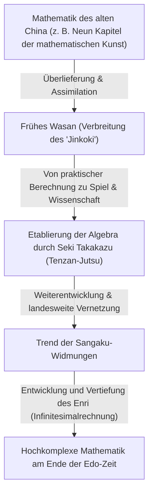
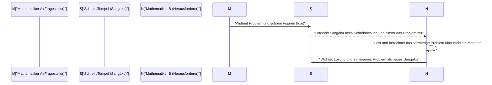

## 1. Einführung: Das "mathematische Wunder" im isolierten Japan

Von dem 17. Jahrhundert bis zur Mitte des 19. Jahrhunderts verfolgte Japan eine strikte Politik der nationalen Isolation, bekannt als "Sakoku". In dieser Zeit, als der Austausch mit westlicher Wissenschaft und Kultur extrem eingeschränkt war, ereignete sich in Japan ein einzigartiges Phänomen. Es war die Blüte einer eigenständigen, hochentwickelten mathematischen Kultur Japans: **"Wasan" (japanische Mathematik)**.

Zur gleichen Zeit wurde in Europa durch [Isaac Newton](/de/p/newton/) und [Gottfried Leibniz](/de/p/leibniz/) die Infinitesimalrechnung begründet und die moderne Mathematik entwickelte sich rasant. Erstaunlicherweise entstanden auch in Japan, einem Inselstaat im Fernen Osten, völlig unabhängig davon hochentwickelte mathematische Konzepte, die der Infinitesimalrechnung ebenbürtig waren.

In diesem Artikel werden wir die Geschichte des Wasan detailliert entwirren, das von praktischer Vermessung und Berechnung ausging und sich schließlich zu reinen intellektuellen Spielen und einer Art Kunst erhob. Wir betrachten die genialen Mathematiker, die diese Entwicklung vorantrieben, sowie die weltweit einzigartige Kultur der "Sangaku".

## 2. Die Dämmerung des Wasan: Der Bestseller "Jinkoki", der den Mathematik-Boom auslöste

Der entscheidende Auslöser für die explosionsartige Verbreitung der mathematischen Kultur in Japan war das Buch "Jinkoki" von Yoshida Mitsuyoshi, das 1627 in der frühen Edo-Zeit veröffentlicht wurde.

Bis dahin bestand die japanische Arithmetik hauptsächlich aus schwer verständlichem Wissen, das aus China stammte und nur von wenigen Intellektuellen und Beamten gehandhabt wurde. Das "Jinkoki" erklärte jedoch mit zahlreichen Illustrationen auf äußerst verständliche Weise alles: von der Verwendung des Abakus für alltägliche Handelsgeschäfte über die Berechnung von Feldflächen und Reissackvolumina bis hin zu Rätseln und unterhaltsamen Problemen wie "Mäusevermehrung" (Nezumizan) oder "Mamakodate" (Josephus-Problem).

Die Edo-Zeit war zufällig eine Zeit, in der die Alphabetisierungsrate der einfachen Leute durch die Verbreitung von Terakoya (Tempelschulen) im weltweiten Vergleich ein erstaunlich hohes Niveau erreichte. "Jinkoki" wurde zu einem beispiellosen Bestseller, von dem unzählige Raubdrucke und überarbeitete Auflagen erschienen. Durch dieses Buch entdeckten nicht nur Samurai, sondern auch Kaufleute und Bauern die "Faszination der Mathematik".

## 3. Japans Newton, das Auftreten des "Mathematik-Heiligen" Seki Takakazu

In der zweiten Hälfte des 17. Jahrhunderts tauchte ein unvergleichliches Genie auf, das Wasan, das bis dahin nicht über Unterhaltung und praktische Anwendung hinausgegangen war, in die hochgradig abstrakte Mathematik auf Weltniveau hob. Sein Name war **Seki Takakazu**. Er wurde später als "Sansei" (Heiliger der Mathematik) bezeichnet und wurde zur wichtigsten Figur in der japanischen Mathematikgeschichte.

### 3.1 Tenzan-Jutsu: Die Etablierung der Algebra
Eine der größten Errungenschaften von Seki Takakazu war die Entwicklung einer eigenen schriftlichen algebraischen Methode namens "Tenzan-Jutsu". Zuvor war die physische Methode der Berechnung durch das Anordnen von Holzstäbchen, sogenannten "Sangi", auf einem Brett vorherrschend, womit es jedoch schwierig war, komplexe Gleichungen mit mehreren Variablen zu lösen. Seki Takakazu etablierte eine Methode (Zeichenausdrücke), bei der Unbekannte durch Kanji dargestellt wurden und Gleichungen durch Manipulation von mathematischen Ausdrücken auf Papier aufgestellt wurden. Dadurch wurde die japanische Mathematik von physischen Einschränkungen befreit und machte eine sprunghafte Entwicklung durch.

### 3.2 Die Entdeckung von Determinanten und Bernoulli-Zahlen
Eine Episode, die die Genialität von Seki Takakazu zeigt, ist die gleichzeitige Entdeckung mit europäischen Mathematikern. In seinem Buch "Kai-Fukudai-no-Ho" (1683) präsentierte er das Konzept der "Determinante" zur Lösung linearer Gleichungssysteme. Dies geschah etwa 10 Jahre bevor Leibniz in Europa ein ähnliches Konzept vorschlug.

Darüber hinaus sind auch die "Bernoulli-Zahlen", die in den Formeln der Potenzsummen vorkommen, in Seki Takakazus nachgelassenem Werk "Katsuyo Sanpo" (1712) klar dokumentiert, etwa zur gleichen Zeit wie die Veröffentlichung des Schweizers Jakob Bernoulli (1713).

## 4. Herausforderung an das Limit: "Enri" und Takebe Katahiro

Nach dem Tod von Seki Takakazu entwickelten seine besten Schüler, wie **Takebe Katahiro**, Wasan weiter. Das größte Problem, dem sie sich stellten, waren Berechnungen im Zusammenhang mit dem "Kreis".

Die Wasan-Mathematiker erfanden eine Methode namens **"Enri"**, die der modernen Differential- und Integralrechnung entspricht. Takebe Katahiro entwickelte eine Methode mit unendlichen Reihenentwicklungen (entsprechend der Taylorreihe), um die Bogenlänge und die Fläche von Kreissegmenten zu berechnen. Es wird gesagt, dass er durch unfassbare Handrechnungen den Wert von Pi ($\pi$) bis auf 41 Nachkommastellen genau berechnete.

$$ \pi \approx 3.14159265358979323846264338327950288419716\dots $$

Diese Ergebnisse gingen über praktische Zwecke hinaus und entsprangen reiner mathematischer Neugier: dem Wunsch, "die Wahrheit zu suchen".

## 5. Eine weltweit einzigartige mathematische Kultur: "Sangaku"

Das Symbol dafür, dass Wasan nicht nur eine Kultur einer elitären Schicht war, sondern von der breiten Masse geliebt wurde, ist das **"Sangaku"**.

Sangaku sind Holztafeln (eine Art Ema), auf denen man selbst gelöste mathematische Probleme, schöne geometrische Figuren und Lösungswege aufzeichnete, um sie dann Schreinen und Tempeln zu widmen. Dieser Brauch begann Mitte des 17. Jahrhunderts und erfreute sich während der gesamten Edo-Zeit landesweit großer Beliebtheit.

### 5.1 Warum widmete man Mathematik in Schreinen und Tempeln?

Die Sangaku-Widmung hatte hauptsächlich drei Bedeutungen:
1. **Dank an die Götter und Buddhas**: Ein Ausdruck des reinen Dankes: "Dass ich dieses schwierige Problem lösen konnte, ist dem Schutz der Götter und Buddhas zu verdanken."
2. **Selbstdarstellung und Präsentationsort**: Eine Plattform, um das eigene mathematische Talent der Öffentlichkeit zu präsentieren – ähnlich den heutigen wissenschaftlichen Papern oder Posterpräsentationen.
3. **Herausforderung an andere**: Sangaku hatten oft die Form "Idai" (hinterlassene Probleme), bei der nur das Problem ohne Lösung präsentiert wurde. Dies war eine Herausforderung: "Wenn es jemanden gibt, der das lösen kann, dann versuche es." Ein anderer Mathematiker, der dies sah, widmete die Lösung als neues Sangaku, wodurch eine intellektuelle Kommunikation entstand.

### 5.2 Ein standesübergreifendes Wissensnetzwerk

Am erstaunlichsten ist, dass die Personen, die Sangaku widmeten, nicht auf berühmte Gelehrte oder Samurai beschränkt waren. Auf den erhaltenen Sangaku finden sich die Namen von Kaufleuten, Dorfbauern und sogar von Frauen und Teenagern. Durch die Existenz von reisenden Mathematikern (Yureki-ka, Personen, die reisten und Mathematik unterrichteten) funktionierte der gesamte japanische Archipel wie eine gigantische "Online-Mathematik-Community". In der Edo-Zeit, in der das Klassensystem sehr streng war, war allein die Welt der Mathematik eine reine Leistungsgesellschaft, in der ein gleichberechtigter, standesübergreifender Austausch stattfand.

## 6. Das Ende des Wasan und sein stiller Beitrag zur Modernisierung

Nach der Meiji-Restauration von 1868 begann Japan rasch den Weg der Verwestlichung und Modernisierung. Für die Meiji-Regierung, die auf die Stärkung der Nation und die Förderung der Industrie abzielte, wurde das Wasan, das stark in Richtung Rätsel und Spiele ging und ein eigenes auf Kanbun basierendes Zeichensystem hatte, als Hindernis für die Einführung westlicher Wissenschaft und Technologie angesehen.

Infolgedessen wurde 1872 durch das Bildungssystem-Edikt (Gakusei) beschlossen, in den Schulen nur noch westliche Mathematik zu unterrichten. Die jahrhundertealte Tradition des Wasan verfiel daraufhin rapide.

Wasan ist jedoch keineswegs umsonst verschwunden. Während der Edo-Zeit hatten sich "logisches Denkvermögen", die "Fähigkeit, abstrakte Konzepte zu handhaben" und vor allem "intellektuelle Neugier, das Lernen selbst zu genießen", tief bei den einfachen Leuten im ganzen Land verwurzelt. Dass Japan ab der Meiji-Zeit in erstaunlichem Tempo die westliche höhere Mathematik und moderne Wissenschaft absorbieren und zur Weltspitze aufschließen konnte, lag zweifellos an diesem "Boden des Wasan".

## 7. Fazit: Die Romantik der Mathematik, die in der Gegenwart weiterlebt

Auch heute noch existieren an Schreinen und Tempeln in ganz Japan etwa 900 Sangaku, die als wichtige regionale Kulturgüter sorgfältig bewahrt und erforscht werden. In den letzten Jahren haben geometrische Probleme aus Sangaku in der modernen mathematischen Bildung wieder Aufmerksamkeit erregt – als hervorragendes Lehrmaterial, um die Freude am "selbstständigen Entdecken und Erforschen von Problemen" zu vermitteln, statt nur auswendig zu lernen.

Die Leidenschaft für die Mathematik, die die Menschen der Edo-Zeit in Holztafeln einritzten, spricht auch heute noch, über die Zeit hinweg, leise zu uns über die Romantik des intellektuellen Strebens und die Freude am Lösen von Problemen.
