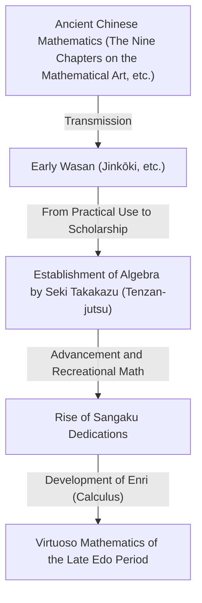
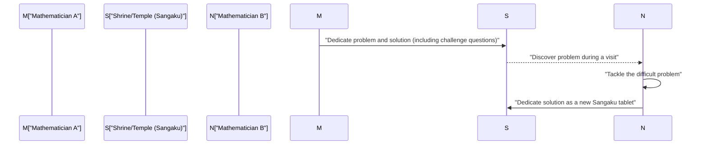

## 1. What is Wasan? The Miracle of Mathematics Born from Isolation

During the Edo period (1603–1867), Japan maintained a foreign isolation policy known as *sakoku*. Yet within this culturally and physically enclosed environment, a unique and advanced mathematical culture blossomed: **Wasan (Japanese Mathematics)**.

In Europe at that time, Isaac Newton and Gottfried Wilhelm Leibniz were establishing calculus. Meanwhile, in Japan during the same era, concepts equivalent to calculus emerged from an entirely different context. Wasan began with practical surveying and calendar calculations, gradually evolving into pure mathematical play—and even an art form.



### 1.1 Jinkōki: The Explosive Bestseller

The catalyst for the explosive spread of Wasan was *Jinkōki*, published by Yoshida Mitsuyoshi in 1627. Richly illustrated and accessible, the book covered everything from abacus usage to methods for calculating areas and volumes, and even recreational puzzles such as the "rat calculation" (exponential reproduction problem).

```python
# Simulation of the "rat calculation" (Nezumi-zan implemented in Python)
def nezumizan(months):
    # Initial pair
    pairs = 1
    for month in range(1, months + 1):
        # Assume 12 offspring (6 pairs) born each month
        pairs += pairs * 6
    return pairs * 2 # Total count of rats

print(f"Number of rats after 12 months: {nezumizan(12)}")
# Output: Number of rats after 12 months: 27682574402
```

Coupled with the remarkably high literacy rate of the Edo period, this book became an unprecedented bestseller, captivating countless Japanese people with the fascination of mathematics.

## 2. Seki Takakazu: The Mathematical Genius and "Tenzan-jutsu"

In the latter half of the 17th century, **Seki Takakazu** (also known as Seki Kōwa) elevated Wasan to world-class standards. Revering him as the "Arithmetic Sage" (Sansei), many refer to him as the "Newton of Japan."

Seki's greatest achievement was inventing *Tenzan-jutsu*, a system of written algebra that used symbolic notation to represent unknowns in equations. This overcame the limitations of *sangi* (counting rods)—a physical calculation tool imported from China—allowing mathematicians to perform complex algebraic calculations on paper.

### Discovery of the Determinant
More than a decade before Leibniz in Europe, Seki Takakazu discovered the concept of the **determinant** as a method for solving systems of linear equations. In his treatise *Kai-Fukudai no Hō* (Method of Solving Concealed Problems, 1683), he described a calculation technique essentially identical to modern determinant expansion.

$$ \Delta = a_{11}a_{22} - a_{12}a_{21} $$

## 3. Mathematical Votive Tablets at Shrines and Temples: "Sangaku"

An indispensable part of Wasan culture is **Sangaku**. Sangaku are wooden votive tablets (*ema*) inscribed with mathematical problems, elegant geometric diagrams, and solutions, dedicated to Shinto shrines and Buddhist temples.

### 3.1 Expressions of Gratitude to the Gods and Challenges to Fellow Mathematicians

Why were mathematical problems dedicated to shrines and temples?
1. **Expressions of Gratitude**: A way to thank the kami (deities) and buddhas, believing that "solving difficult problems was thanks to divine blessing and guidance."
2. **Self-Expression and Communication**: A platform to demonstrate one's academic prowess to the public, while posing challenges (*idai*) to other mathematicians: "Can you solve this?"

From rural farmers to samurai, merchants, and even women and children, people from all walks of life participated in creating Sangaku. It was a uniquely public, participatory mathematical culture unprecedented anywhere else in the world.



### 3.2 Typical Problems of Sangaku: "Enri" (Circle Principle)

The majority of Sangaku problems dealt with geometry. In particular, problems involving intricate configurations of mutually tangent circles and polygons inscribed within larger circles were especially popular.

**[Example of a Classic Problem]**
"Inside an outer circle, three identical circles (Circle A) touch each other and the outer circle, and a smaller circle (Circle B) touches them. Given the diameter of Circle A, find the diameter of Circle B."

To solve such complex geometric problems, Wasan mathematicians developed limit calculation techniques known as **Enri** (the Circle Principle), corresponding to modern integral calculus. They accurately calculated the value of $\pi$ to dozens of decimal places and determined arc lengths of complex curves as well as volumes of three-dimensional solids.

## 4. The End of Wasan and the Transition to Modern Mathematics

With the advent of the Meiji period (1868–), Japan aggressively pursued rapid modernization and Westernization. In reforming the national education system, the Meiji government decided to phase out Wasan—which had unique notation systems and was deemed less practical for Western industrial technology—and officially adopt Western mathematics instead.

Although Wasan declined rapidly as a formal discipline, the "advanced mathematical thinking" and "intellectual curiosity in tackling puzzles" nurtured by Wasan served as the driving force that enabled Japanese scholars in the Meiji era to absorb Western modern science and mathematics at breathtaking speed.

## 5. The Living Spirit of Wasan in the Modern Era

Today, approximately 900 Sangaku tablets still survive in shrines and temples throughout Japan, carefully preserved as precious local cultural properties. Furthermore, in contemporary mathematics education, the puzzle-like problems of Sangaku are being revisited as inspiring teaching materials that foster logical thinking and a spirit of inquiry.

The mathematical mysteries that Edo-period geniuses carved onto wooden boards have transcended time, continuing to convey to us today the timeless beauty of mathematics and the sheer joy of solving problems.
