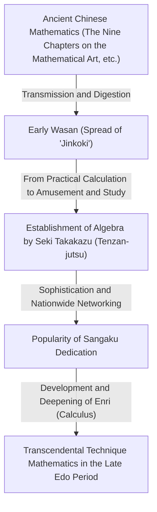
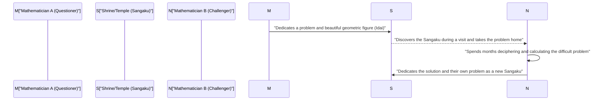

## 1. Introduction: A "Mathematical Miracle" in Isolated Japan

From the 17th century to the mid-19th century, Japan adopted a strict policy of national isolation known as "Sakoku." During this era, when interactions with Western science and culture were extremely restricted, a unique phenomenon unparalleled in the world occurred within Japan. This was the blossoming of Japan's own advanced mathematical culture, **"Wasan"**.

Around the same time in Europe, calculus was founded by [Isaac Newton](/en/p/newton/) and [Gottfried Leibniz](/en/p/leibniz/), leading to the rapid development of modern mathematics. Surprisingly, in the Far Eastern island nation of Japan, highly advanced mathematical concepts comparable to calculus were born completely independently.

In this article, we will closely unravel the history of Wasan, which began with practical surveying and calculation, eventually evolving into pure intellectual amusement and a kind of art. We will also introduce the genius mathematicians who drove its development, and the unique culture of "Sangaku" that has no parallel in the world.

## 2. The Dawn of Wasan: The Bestseller "Jinkoki" Ignites a Math Boom

The decisive trigger for the explosive spread of mathematical culture in Japan was the publication of the book "Jinkoki" by Yoshida Mitsuyoshi in 1627, during the early Edo period.

Until then, arithmetic in Japan consisted mainly of esoteric knowledge introduced from China, handled only by a few intellectuals and officials. However, "Jinkoki" explained everything from abacus calculation methods for daily commercial transactions to calculating the area of fields and the volume of rice bales, and even puzzle-like recreational problems such as "mouse multiplication" (geometric progression) and the "Josephus problem." It used abundant illustrations to make these concepts extremely easy to understand.

Coincidentally, the Edo period was a time when the literacy rate of the common people reached an astonishingly high level globally, thanks to the spread of Terakoya (temple schools). "Jinkoki" became an unprecedented massive bestseller, and numerous pirated and revised editions were published. Through this book, not only samurai but also merchants and farmers awakened to the "fun of mathematics."

## 3. Japan's Newton, the Appearance of the "Math Saint" Seki Takakazu

In the late 17th century, a peerless genius appeared who elevated Wasan from the realm of amusement and practical use to world-class, advanced abstract mathematics. This was **Seki Takakazu**. He was later called the "Math Saint" and became the most important figure in the history of Japanese mathematics.

### 3.1 Tenzan-jutsu: The Establishment of Algebra
One of Seki Takakazu's greatest achievements was devising a unique algebraic notation system called "Tenzan-jutsu." Before this, the physical method of placing wooden sticks called "sangi" on a board to calculate was mainstream, but this made it difficult to solve complex multivariable equations. Seki Takakazu established a method of expressing unknown variables with Chinese characters and manipulating mathematical expressions on paper to set up equations (algebraic expressions). As a result, Japanese mathematics was freed from physical constraints and made a dramatic leap forward.

### 3.2 Discovery of Determinants and Bernoulli Numbers
An episode demonstrating Seki Takakazu's genius is his simultaneous discovery of concepts with European mathematicians. In his book "Kai-Fukudai-no-Ho" (1683), he presented the concept of "Determinants" for finding solutions to simultaneous linear equations. This occurred about 10 years before Leibniz proposed a similar concept in Europe.

Furthermore, the "Bernoulli numbers" that appear in the formula for the sum of powers were clearly recorded in Seki Takakazu's posthumous manuscript "Katsuyo Sanpo" (1712), around the same time as the publication by the Swiss mathematician Jacob Bernoulli (1713).

## 4. Challenging the Limits: "Enri" and Takebe Katahiro

After Seki Takakazu's death, his leading disciple, **Takebe Katahiro**, and others further developed Wasan. The greatest challenge they took on was calculations related to the "circle."

Wasan mathematicians devised a method called **"Enri" (Circle Principle)**, which corresponds to modern differential and integral calculus. Takebe Katahiro devised a method using infinite series expansion (equivalent to Taylor series) to calculate the length of an arc and the area of a circular segment. It is said that through mind-boggling manual calculations, he accurately calculated the value of pi ($\pi$) to 41 decimal places.

$$ \pi \approx 3.14159265358979323846264338327950288419716\dots $$

These achievements transcended practical purposes and were born from a pure mathematical inquisitiveness to "seek the truth."

## 5. A Mathematical Culture Unparalleled in the World: "Sangaku"

What most symbolizes that Wasan was a culture loved widely by the masses, not just some elite, is **"Sangaku"**.

Sangaku are a type of ema (votive wooden tablets) on which people painted mathematical problems they had solved, their beautiful geometric figures, and solutions, and dedicated them to shrines and temples. This custom began in the mid-17th century and became hugely popular throughout Japan during the Edo period.

### 5.1 Why Dedicate Mathematics to Shrines and Temples?

There were three main meanings to dedicating Sangaku:
1. **Gratitude to the Gods and Buddha**: A pure expression of gratitude, meaning, "I was able to solve this difficult problem thanks to the divine protection of the Gods and Buddha."
2. **A Place for Self-Display and Presentation**: A role similar to modern academic papers or poster presentations, to show off one's mathematical talent to the public.
3. **A Letter of Challenge to Others**: Sangaku often took the form of "presenting only the problem without recording the solution (Idai)." This was a challenge saying, "If anyone can solve this problem, try solving it," and intellectual communication was established as another mathematician who saw this would dedicate the solution as a new Sangaku.

### 5.2 A Network of Knowledge Transcending Social Class

The most surprising thing is that those who dedicated Sangaku were not limited to renowned scholars and samurai. Existing Sangaku bear the names of merchants, village farmers, and even women and teenage children. With the presence of itinerant mathematicians traveling across the country teaching mathematics, the entire Japanese archipelago functioned like a massive "online mathematical community." In the Edo period, where the class system was strict, the world of mathematics was purely meritocratic, and equal exchanges transcending class took place.

## 6. The End of Wasan and Its Quiet Contribution to Modernization

Following the Meiji Restoration in 1868, Japan rapidly embarked on the path of Westernization and modernization. For the Meiji government, which aimed for national wealth, military strength, and industrial development, Wasan—which had become highly puzzle-like and recreational and possessed its own unique kanbun-style notation system—was seen as a barrier to introducing Western science and technology.

As a result, with the promulgation of the Education System Order in 1872 (Meiji 5), it was decided that only Western mathematics would be taught in school education, and the tradition of Wasan that had lasted for hundreds of years quickly declined.

However, Wasan did not simply vanish in vain. During the Edo period, the "ability to think logically," the "ability to handle abstract concepts," and above all, the "intellectual curiosity to enjoy learning itself" had deeply taken root even among the common people throughout the country. The reason Japan was able to absorb Western higher mathematics and modern science at an astonishing speed after the Meiji era and catch up with the world's top level was undoubtedly due to this "foundation of Wasan."

## 7. Conclusion: The Romance of Mathematics Living on Today

Even today, about 900 Sangaku tablets still exist in shrines and temples across Japan, carefully preserved and researched as important local cultural assets. In recent years, in modern mathematics education, the geometric problems of Sangaku are once again attracting attention as excellent teaching materials to teach the "joy of discovering and exploring problems oneself" rather than rote learning.

The passion for mathematics that the people of the Edo period carved into wooden boards continues to quietly speak to us across time of the romance of intellectual exploration and the joy of solving.
