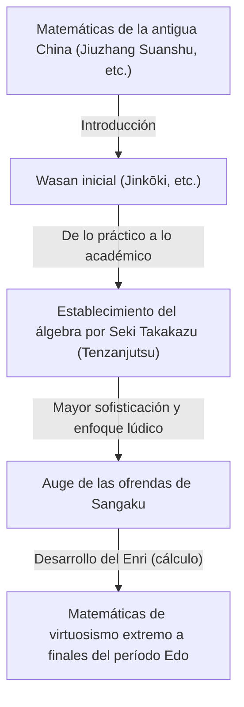
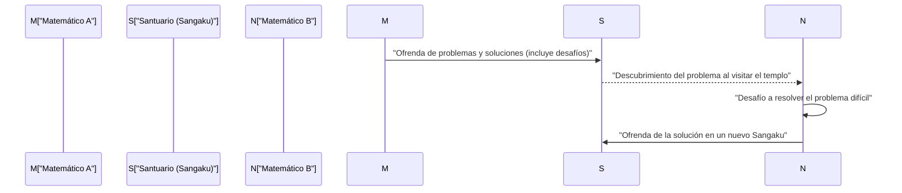

## 1. ¿Qué es el Wasan?: El milagro matemático nacido del aislamiento (Sakoku)

Durante el período Edo (1603-1867), Japón mantuvo una política de aislamiento del exterior conocida como *sakoku*. Sin embargo, dentro de este espacio cultural y físicamente cerrado, floreció una cultura matemática avanzada y completamente original. Eso es el **Wasan (matemáticas tradicionales japonesas)**.

En la Europa de aquella época, Newton y Leibniz estaban fundando el cálculo infinitesimal; simultáneamente en Japón, a partir de un contexto completamente diferente, surgían conceptos comparables al cálculo. El Wasan comenzó con cálculos prácticos para la agrimensura y la confección del calendario, y gradualmente se sublimó en un juego puramente matemático, o incluso en una forma de arte.



### 1.1 El Jinkōki se convierte en un éxito de ventas

El detonante de la explosión y popularización del Wasan fue el *Jinkōki* (塵劫記), publicado en 1627 por Yoshida Mitsuyoshi. Con explicaciones claras e ilustraciones, abarcaba desde el uso del ábaco (*soroban*) hasta el cálculo de áreas y volúmenes, e incluso problemas recreativos como la "reproducción de ratones" (*nezumizan*).

```python
# Simulación de Nezumizan (cría de ratones) en Python
def nezumizan(months):
    # Pareja inicial
    pairs = 1
    for month in range(1, months + 1):
        # Se asume que cada mes nacen 12 crías (6 parejas)
        pairs += pairs * 6
    return pairs * 2 # Número total de ratones

print(f"Número de ratones tras 12 meses: {nezumizan(12)}")
# Salida: Número de ratones tras 12 meses: 27682574402
```

Combinado con las altas tasas de alfabetización del período Edo, este libro se convirtió en un éxito de ventas sin precedentes, y un gran número de japoneses quedaron fascinados por el encanto de las matemáticas.

## 2. El genio Seki Takakazu y el "Tenzanjutsu"

En la segunda mitad del siglo XVII, **Seki Takakazu** elevó el Wasan al más alto nivel mundial. Venerado como el "sabio del cálculo" (*Sansei*), a menudo se le conoce como el Newton de Japón.

El mayor logro de Seki Takakazu fue la invención del *Tenzanjutsu*, un método que permitía representar incógnitas con símbolos y formular ecuaciones algebraicas. Gracias a esto, superó las limitaciones de las varillas de cálculo físicas (*sangi*) transmitidas desde China, haciendo posible realizar complejos cálculos algebraicos directamente sobre el papel.

### El descubrimiento de los determinantes
Seki Takakazu descubrió el concepto de **determinante** como método para resolver sistemas de ecuaciones lineales una década antes que Leibniz en Europa. En su obra *Kai-fukudai no Hō* (Método para resolver problemas ocultos), describió un procedimiento de cálculo esencialmente equivalente a la expansión moderna de determinantes.

$$ \Delta = a_{11}a_{22} - a_{12}a_{21} $$

## 3. Tablillas votivas matemáticas en templos y santuarios: Los "Sangaku"

Un aspecto fundamental al hablar del Wasan es la cultura de los **Sangaku**. Los Sangaku eran un tipo de tablilla votiva de madera (*ema*) en la que se inscribían problemas matemáticos y sus soluciones acompañados de elegantes figuras geométricas, dedicadas en santuarios sintoístas y templos budistas.

### 3.1 Gratitud a los dioses y desafíos entre matemáticos

¿Por qué se ofrendaban problemas matemáticos en santuarios y templos?
1. **Expresión de gratitud**: La devoción de agradecer la resolución de un problema difícil gracias a la protección y bendición de las divinidades (*kami* y budas).
2. **Afirmación personal y comunicación**: Mostrar la propia habilidad matemática al público y, a la vez, plantear un desafío (*idai* o problemas abiertos) a otros matemáticos con la pregunta: "¿Puedes resolver esto?".

Desde campesinos de aldeas hasta samuráis, comerciantes, e incluso mujeres y niños, personas de cualquier clase social participaron en la creación de Sangaku. Esta fue una cultura matemática participativa popular sin parangón en el mundo.



### 3.2 Problemas típicos de Sangaku (Enri)

La gran mayoría de los problemas de Sangaku pertenecían al campo de la geometría. En particular, eran muy populares los problemas de tangencias que involucraban múltiples círculos o polígonos inscritos dentro de un círculo principal.

**【Ejemplo de problema representativo】**
"Dentro de un círculo exterior hay tres círculos iguales (círculos A) que son tangentes entre sí, y un círculo más pequeño (círculo B) que es tangente a ellos. Dado el diámetro del círculo A, calcula el diámetro del círculo B."

Para resolver estos complejos problemas geométricos, los matemáticos del Wasan desarrollaron el "**Enri**" (円理), un método de cálculo de límites equivalente al cálculo integral moderno. Lograron calcular el valor de pi ($\pi$) con precisión hasta varias decenas de decimales, además de determinar la longitud de curvas complejas y los volúmenes de sólidos tridimensionales.

## 4. El fin del Wasan y su conexión con las matemáticas modernas

Con el inicio de la era Meiji (1868-), Japón impulsó una rápida modernización y occidentalización. Durante la reforma del sistema educativo, el gobierno Meiji decidió abolir el Wasan —considerado menos práctico debido a su notación singular— y adoptar formalmente las matemáticas occidentales en los planes de estudio oficiales.

Aunque esto provocó el rápido declive del Wasan, el "pensamiento matemático avanzado" y la "curiosidad intelectual por disfrutar de los acertijos" cultivados por esta disciplina se convirtieron en el motor que permitió a los japoneses de la era Meiji asimilar la ciencia y las matemáticas modernas occidentales a una velocidad asombrosa.

## 5. El espíritu del Wasan que perdura en la actualidad

Hoy en día, se conservan alrededor de 900 tablillas Sangaku en santuarios y templos de todo Japón, cuidadosamente protegidas como valioso patrimonio cultural regional. Asimismo, en la educación matemática contemporánea, los problemas tipo rompecabezas del Sangaku están siendo revalorizados como excelente material didáctico para fomentar el pensamiento lógico y el espíritu de indagación.

Los enigmas matemáticos que los genios del período Edo tallaron sobre tablas de madera trascienden el tiempo para transmitirnos, incluso hoy, la belleza intrínseca de las matemáticas y la inmensa alegría de resolverlas.
