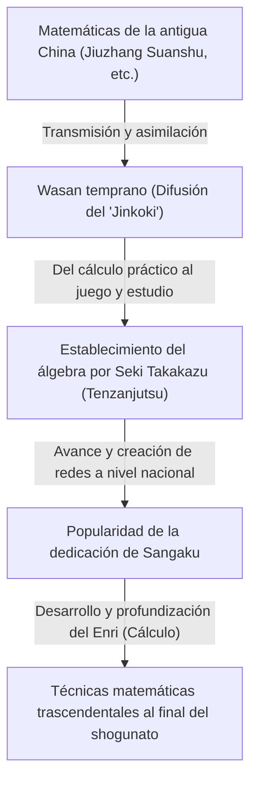
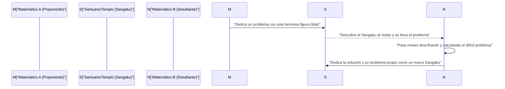

## 1. Introducción: El "milagro matemático" en el Japón aislado

Desde el siglo XVII hasta mediados del siglo XIX, Japón adoptó una estricta política de aislamiento nacional conocida como "Sakoku". En esta era donde la interacción con la ciencia y la cultura occidental estaba extremadamente limitada, ocurrió un fenómeno singular en Japón, sin precedentes en el mundo. Fue el florecimiento de una cultura matemática avanzada y exclusiva de Japón, el **"Wasan"**.

En la misma época en Europa, [Isaac Newton](/es/p/newton/) y [Gottfried Leibniz](/es/p/leibniz/) creaban el cálculo, y las matemáticas modernas se desarrollaban rápidamente. Sorprendentemente, en la nación insular del Lejano Oriente, Japón, surgieron conceptos matemáticos avanzados comparables al cálculo, de forma totalmente independiente.

En este artículo, detallaremos la historia del Wasan, que comenzó con cálculos y mediciones prácticas y se transformó en un puro juego intelectual y un tipo de arte. Exploraremos a los genios matemáticos que impulsaron este desarrollo y la singular cultura de los "Sangaku", única en el mundo.

## 2. El amanecer del Wasan: El éxito de ventas "Jinkoki" enciende el boom matemático

El catalizador decisivo para la explosiva popularidad de la cultura matemática japonesa fue el libro "Jinkoki", publicado en 1627 a principios del período Edo por Yoshida Mitsuyoshi.

Hasta entonces, la aritmética japonesa consistía principalmente en conocimientos esotéricos traídos de China, manejados solo por un puñado de intelectuales y funcionarios. Sin embargo, "Jinkoki" explicaba de manera muy clara y con abundantes ilustraciones, desde métodos de cálculo con ábaco para transacciones comerciales diarias, cómo encontrar el área de los campos o el volumen de los fardos de arroz, hasta problemas recreativos y rompecabezas como el "cálculo de ratones" (progresión geométrica) y el "Mamakodate" (el problema de Josefo).

Casualmente, el período Edo fue una época en la que la tasa de alfabetización de la gente común alcanzó un nivel asombrosamente alto a nivel mundial gracias a la difusión de los Terakoya (escuelas privadas en templos). "Jinkoki" se convirtió en un éxito de ventas sin precedentes, publicándose numerosas ediciones piratas y revisadas. A través de este libro, no solo los samuráis, sino también comerciantes y campesinos descubrieron la "diversión de las matemáticas".

## 3. El Newton japonés, el "Santo de las Matemáticas" Seki Takakazu

A finales del siglo XVII, surgió un genio sin igual que elevó el Wasan, el cual no había pasado de ser práctico o de entretenimiento, al nivel de las matemáticas abstractas de élite mundial. Fue **Seki Takakazu**. Más tarde sería aclamado como el "Sansei (Santo de las matemáticas)" y se convirtió en la figura más importante de la historia matemática de Japón.

### 3.1 Tenzanjutsu: El establecimiento del álgebra
Uno de los mayores logros de Seki Takakazu fue idear un método propio de álgebra escrita llamado "Tenzanjutsu". Anteriormente, el método predominante era un enfoque físico calculando con varillas de madera llamadas "Sangi" dispuestas sobre un tablero, lo cual dificultaba la resolución de ecuaciones multivariables complejas. Seki Takakazu estableció un método para formular ecuaciones manipulando fórmulas en papel utilizando caracteres kanji para representar incógnitas (expresiones literales). Gracias a esto, las matemáticas japonesas se liberaron de las limitaciones físicas y lograron una evolución espectacular.

### 3.2 El descubrimiento de los determinantes y los números de Bernoulli
Un episodio que demuestra la genialidad de Seki Takakazu es su descubrimiento simultáneo con los matemáticos europeos. En su libro "Kaifukudai no Ho" (1683), presentó el concepto de "Determinante" para encontrar soluciones a sistemas de ecuaciones lineales. Esto ocurrió unos 10 años antes de que Leibniz propusiera un concepto similar en Europa.

Además, sobre los "Números de Bernoulli" que aparecen en las fórmulas para las sumas de potencias, estos están claramente registrados en la obra póstuma de Seki Takakazu, "Katsuyo Sanpo" (1712), en la misma época en que fueron presentados por Jacob Bernoulli en Suiza (1713).

## 4. El desafío del límite: "Enri" y Takebe Katahiro

Después de la muerte de Seki Takakazu, su mejor discípulo, **Takebe Katahiro**, y otros desarrollaron aún más el Wasan. El mayor problema al que se enfrentaron fueron los cálculos relacionados con el "círculo".

Los matemáticos del Wasan idearon un método llamado **"Enri"**, equivalente al cálculo diferencial e integral moderno. Takebe Katahiro ideó un método que utilizaba expansiones de series infinitas (equivalente a la serie de Taylor) para encontrar la longitud de los arcos y el área de los segmentos circulares. Se dice que calculó el valor de pi $\pi$ de manera precisa hasta 41 decimales a través de cálculos manuales asombrosamente laboriosos.

$$ \pi \approx 3.14159265358979323846264338327950288419716\dots $$

Estos fueron resultados nacidos del puro afán de investigación matemática de "buscar la verdad", superando los propósitos prácticos.

## 5. Una cultura matemática única en el mundo: "Sangaku"

Lo que mejor simboliza que el Wasan fue una cultura amada no solo por una élite, sino por las masas, es el **"Sangaku"**.

Un Sangaku es un tipo de tablilla votiva (ema) de madera donde uno dibujaba un problema matemático que había resuelto, su hermosa figura o método de resolución, y lo dedicaba en un santuario o templo. Esta costumbre comenzó a mediados del siglo XVII y se hizo enormemente popular en todo Japón a lo largo del período Edo.

### 5.1 ¿Por qué se dedicaban matemáticas a santuarios y templos?

La dedicación de Sangaku tenía principalmente 3 significados:
1. **Agradecimiento a los dioses y budas**: Una pura expresión de gratitud afirmando que "gracias a la protección divina, pude resolver este difícil problema".
2. **Exhibición personal y lugar de presentación**: Un papel similar a los artículos académicos modernos o presentaciones de pósters para mostrar el propio talento matemático al público.
3. **Un desafío a los demás**: Los Sangaku a menudo tomaban la forma de "Idai", donde "se presentaba solo el problema sin mostrar la solución". Era una carta de desafío que decía "si hay alguien que pueda resolver este problema, que intente resolverlo", y se establecía una comunicación intelectual donde otro matemático que lo veía dedicaba la solución en un nuevo Sangaku.

### 5.2 Una red de conocimiento más allá de las clases sociales

Lo más sorprendente es que quienes dedicaban Sangaku no se limitaban a eruditos famosos o samuráis. En los Sangaku que se conservan en la actualidad, se encuentran registrados nombres de comerciantes, campesinos de aldeas, e incluso mujeres y adolescentes. Con la existencia de viajeros matemáticos que recorrían todo el país (personas que viajaban mientras enseñaban matemáticas), todo el archipiélago japonés funcionaba como una enorme "comunidad matemática en línea". En el período Edo, cuando el sistema de clases era estricto, solo el mundo de las matemáticas era una completa meritocracia, donde se producía un intercambio igualitario más allá del estatus social.

## 6. El fin del Wasan y su contribución silenciosa a la modernización

Tras la Restauración Meiji en 1868, Japón comenzó su rápido camino hacia la occidentalización y modernización. Para el gobierno Meiji, que buscaba enriquecer al país y fortalecer el ejército así como fomentar la industria, el Wasan, que se había convertido en un sistema muy basado en acertijos y juegos con su propio sistema de símbolos tipo chino (kanbun), fue visto como una barrera para la introducción de la ciencia y tecnología occidentales.

Como resultado, con la promulgación del Sistema Educativo en 1872 (año 5 de Meiji), se decidió que en la educación escolar solo se enseñarían matemáticas occidentales, y la tradición del Wasan, que había durado cientos de años, entró en rápido declive.

Sin embargo, el Wasan no desapareció en vano. Durante el período Edo, "la capacidad de pensar lógicamente", "la habilidad para manejar conceptos abstractos" y, sobre todo, "la curiosidad intelectual para disfrutar del aprendizaje en sí mismo" se arraigaron profundamente incluso en la gente común en todos los rincones del país. La razón por la que Japón pudo absorber las matemáticas superiores occidentales y la ciencia moderna a una velocidad asombrosa y alcanzar el máximo nivel mundial después de la era Meiji, fue, sin duda, gracias a este "suelo del Wasan".

## 7. Conclusión: El romanticismo matemático que sigue vivo en la actualidad

Incluso hoy en día, alrededor de 900 Sangaku se conservan en santuarios y templos de todo Japón, siendo cuidadosamente preservados e investigados como importantes bienes culturales de la región. En los últimos años, en el campo de la educación matemática moderna, los problemas geométricos de los Sangaku están atrayendo nuevamente la atención como un excelente material didáctico para enseñar "la alegría de descubrir y explorar problemas por uno mismo" en lugar del aprendizaje memorístico.

La pasión por las matemáticas que la gente del período Edo grabó en tablillas de madera nos habla en silencio a través del tiempo, compartiendo el romanticismo de la exploración intelectual y la alegría de resolver en la actualidad.
