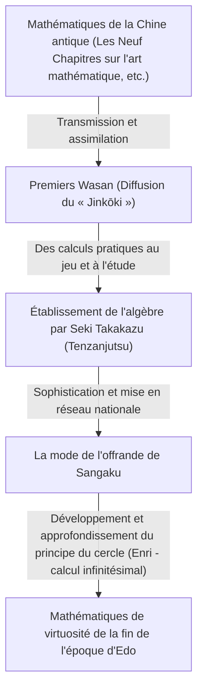
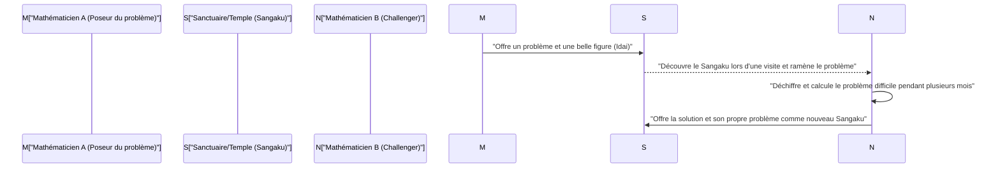

## 1. Introduction : Le "miracle mathématique" dans le Japon isolé

Du 17e siècle jusqu'au milieu du 19e siècle, le Japon a adopté une politique d'isolement strict appelée "Sakoku". Durant cette époque où les échanges avec les sciences et la culture occidentales étaient extrêmement limités, un phénomène singulier et sans précédent dans le monde s'est produit au Japon. C'est l'éclosion d'une culture mathématique avancée et propre au Japon, le **« Wasan » (Wasan)**.

À la même époque en Europe, le calcul infinitésimal était fondé par Isaac Newton et Gottfried Leibniz, et les mathématiques modernes se développaient rapidement. De manière surprenante, dans ce pays insulaire d'Extrême-Orient qu'est le Japon, des concepts mathématiques avancés comparables au calcul différentiel et intégral naissaient de manière totalement indépendante.

Dans cet article, nous examinerons en détail l'histoire du Wasan, qui a commencé par des mesures et des calculs pratiques pour s'élever au rang de pur jeu intellectuel puis d'une forme d'art, les mathématiciens de génie qui ont mené ce développement, et la culture unique au monde du "Sangaku".

## 2. L'aube du Wasan : Le best-seller "Jinkōki" qui a déclenché le boom des mathématiques

L'événement décisif qui a conduit à la diffusion explosive de la culture mathématique japonaise a été la publication en 1627, au début de l'époque d'Edo, du livre "Jinkōki" par Yoshida Mitsuyoshi.

Jusque-là, l'arithmétique japonaise consistait principalement en des connaissances complexes importées de Chine et n'était manipulée que par une poignée d'intellectuels et de fonctionnaires. Cependant, le "Jinkōki" expliquait de manière extrêmement claire, avec de nombreuses illustrations, depuis les méthodes de calcul avec le boulier utilisées dans les transactions commerciales quotidiennes jusqu'au calcul de la surface des champs et du volume des sacs de riz, en passant par des problèmes de réflexion et de divertissement tels que le "calcul des souris" et le "Mamakodate".

Coïncidence, l'époque d'Edo était une période où le taux d'alphabétisation des gens du commun atteignait un niveau incroyablement élevé à l'échelle mondiale, grâce à la diffusion des Terakoya (écoles de temple). Le "Jinkōki" est devenu un best-seller sans précédent et d'innombrables éditions pirates et révisées ont été publiées. Grâce à ce livre, non seulement les samouraïs, mais aussi les marchands et les paysans se sont éveillés à "l'intérêt des mathématiques".

## 3. L'apparition de Seki Takakazu, le "Saint des mathématiques", le Newton japonais

Dans la seconde moitié du 17ème siècle, un génie hors du commun est apparu. Il a élevé le Wasan, qui n'avait pas dépassé le stade du divertissement ou de la pratique, au rang de mathématiques abstraites avancées de niveau mondial. Il s'agit de **Seki Takakazu**. Il sera plus tard appelé "Sansei" (Saint des mathématiques) et est devenu la figure la plus importante de l'histoire des mathématiques japonaises.

### 3.1 Le Tenzanjutsu : l'établissement de l'algèbre
L'une des plus grandes réalisations de Seki Takakazu est l'invention d'une méthode de notation algébrique unique appelée "Tenzanjutsu". Auparavant, la méthode physique consistant à aligner des bâtonnets en bois appelés "Sangi" sur un plateau pour calculer était prédominante, mais il était difficile de résoudre des équations complexes à plusieurs variables avec cette méthode. Seki Takakazu a établi une méthode (expression littérale) permettant de manipuler des formules mathématiques sur papier et de poser des équations, en représentant les inconnues par des caractères chinois. Cela a libéré les mathématiques japonaises de leurs contraintes physiques, entraînant une évolution spectaculaire.

### 3.2 La découverte des déterminants et des nombres de Bernoulli
Un épisode démontrant le génie de Seki Takakazu est sa découverte simultanée avec des mathématiciens européens. Dans son ouvrage "Kaifukudai no Hō" (1683), il a présenté le concept de "déterminant" pour trouver la solution d'un système d'équations linéaires. Cela s'est produit environ 10 ans avant que Leibniz ne propose un concept similaire en Europe.

De plus, concernant les "nombres de Bernoulli" qui apparaissent dans la formule de la somme des puissances, ils sont clairement décrits dans l'ouvrage posthume de Seki Takakazu, "Katsuyō Sanpō" (1712), à la même époque que la publication de Jakob Bernoulli en Suisse (1713).

## 4. Le défi de la limite : le "Principe du cercle" (Enri) et Takebe Katahiro

Après la mort de Seki Takakazu, son éminent disciple **Takebe Katahiro** et d'autres ont continué à développer le Wasan. Le plus grand défi qu'ils ont relevé était le calcul du "cercle".

Les mathématiciens du Wasan ont conçu une méthode appelée **"Enri" (principe du cercle)**, qui correspond au calcul différentiel et intégral moderne. Takebe Katahiro a inventé une méthode utilisant le développement en série infinie (équivalent au développement de Taylor) pour trouver la longueur d'un arc de cercle et la surface d'un segment circulaire. On dit qu'il a calculé avec précision la valeur de Pi $\pi$ jusqu'à 41 décimales par d'incroyables calculs à la main.

$$ \pi \approx 3.14159265358979323846264338327950288419716\dots $$

Ces résultats ont transcendé les objectifs pratiques et sont nés d'une pure curiosité mathématique, "la recherche de la vérité".

## 5. Une culture mathématique unique au monde : le "Sangaku"

Ce qui symbolise le mieux le fait que le Wasan était une culture aimée non seulement par une élite, mais par le grand public, c'est le **"Sangaku"**.

Le Sangaku est une sorte d'Ema (plaque votive en bois) sur laquelle on dessinait des problèmes mathématiques que l'on avait résolus, de belles figures géométriques, ou des méthodes de résolution, pour les offrir aux sanctuaires et aux temples. Cette coutume a commencé au milieu du 17ème siècle et est devenue très populaire dans tout le Japon pendant l'époque d'Edo.

### 5.1 Pourquoi offrir des mathématiques aux sanctuaires et aux temples ?

L'offrande de Sangaku avait principalement trois significations :
1. **Remerciement aux dieux et aux bouddhas** : Une pure expression de gratitude : "Si j'ai pu résoudre ce problème difficile, c'est grâce à la protection des dieux et des bouddhas."
2. **Lieu d'exposition et de publication de soi** : Un rôle similaire aux articles universitaires ou aux présentations par affiches modernes, pour montrer son talent mathématique au monde entier.
3. **Lettre de défi aux autres** : Les Sangaku prenaient souvent la forme de présenter seulement le problème sans noter la solution ("Idai"). C'était une lettre de défi disant "Si quelqu'un peut résoudre ce problème, qu'il essaie", et une communication intellectuelle s'établissait lorsqu'un autre mathématicien voyant cela offrait la solution sous forme d'un nouveau Sangaku.

### 5.2 Un réseau du savoir par-delà les classes sociales

Le plus surprenant est que les donateurs de Sangaku n'étaient pas limités aux érudits et aux samouraïs célèbres. Les noms de marchands, de paysans de village, et même de femmes et d'adolescents figurent sur les Sangaku existants. Avec l'existence de mathématiciens itinérants parcourant tout le pays (des gens voyageant tout en enseignant les mathématiques), l'ensemble de l'archipel japonais fonctionnait comme une immense "communauté mathématique en ligne". À l'époque d'Edo, où le système de classes était strict, seul le monde des mathématiques était une pure méritocratie, avec des échanges égalitaires transcendant les classes.

## 6. La fin du Wasan et sa contribution silencieuse à la modernisation

Après la restauration de Meiji en 1868, le Japon a entamé la voie d'une occidentalisation et d'une modernisation rapides. Pour le gouvernement de Meiji visant à enrichir le pays et à renforcer l'armée et l'industrie, le Wasan, devenu un jeu très complexe ressemblant à des puzzles et possédant son propre système de notation basé sur le chinois classique, était considéré comme un obstacle à l'introduction des sciences et technologies occidentales.

En conséquence, la promulgation du système éducatif en 1872 (Meiji 5) a décidé que seules les mathématiques occidentales seraient enseignées dans les écoles, et la tradition du Wasan qui avait duré des centaines d'années a décliné rapidement.

Cependant, le Wasan n'a nullement disparu en vain. Pendant l'époque d'Edo, "la capacité de penser logiquement", "la capacité de manipuler des concepts abstraits", et surtout "la curiosité intellectuelle de s'amuser à apprendre en soi" s'étaient profondément enracinées chez les gens du commun dans tout le pays. Si, après Meiji, le Japon a pu absorber les mathématiques supérieures occidentales et les sciences modernes à une vitesse fulgurante et rattraper le meilleur niveau mondial, c'est sans doute grâce à ce "terreau du Wasan".

## 7. Conclusion : Le romantisme des mathématiques qui continue de vivre aujourd'hui

Aujourd'hui encore, environ 900 Sangaku subsistent dans les sanctuaires et les temples à travers le Japon, précieusement conservés et étudiés comme des biens culturels importants au niveau régional. De plus, ces dernières années, dans le domaine de l'enseignement des mathématiques modernes, les problèmes de géométrie des Sangaku attirent à nouveau l'attention en tant qu'excellent matériel pédagogique pour enseigner "la joie de découvrir et d'explorer des problèmes par soi-même", plutôt qu'un apprentissage basé sur la mémorisation.

La passion pour les mathématiques que les gens de l'époque d'Edo ont gravée sur des planches de bois continue, à travers le temps, de nous parler doucement, à nous autres modernes, du romantisme de la quête intellectuelle et de la joie de résoudre.
