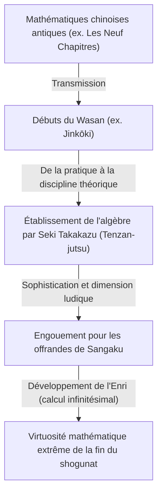
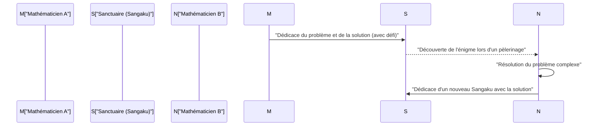

## 1. Qu'est-ce que le Wasan ? Les mathématiques miraculeuses nées de l'isolement du Japon

Durant l'époque d'Edo (1603–1867), le Japon a adopté une politique d'isolement national connue sous le nom de *Sakoku*. Pourtant, au sein de cet espace culturellement et géographiquement clos, une culture mathématique avancée et unique au monde a vu le jour et s'est épanouie : le **Wasan (和算)**.

À la même époque en Europe, Newton et Leibniz posaient les fondements du calcul infinitésimal (différentiel et intégral). Simultanément au Japon, dans un contexte complètement distinct et sans influence extérieure, des concepts tout à fait comparables au calcul infinitésimal voyaient le jour. Débutant par des applications pratiques comme l'arpentage ou l'élaboration de calendriers astronomiques, le Wasan s'est progressivement sublimé pour devenir un jeu intellectuel pur, voire une véritable forme d'art.



### 1.1 Le succès phénoménal du *Jinkōki*

Le point de départ de l'engouement fulgurant pour le Wasan fut la publication en 1627 du *Jinkōki* (塵劫記) par Yoshida Mitsuyoshi. Ce manuel expliquait de manière claire et abondamment illustrée le maniement du boulier japonais (*soroban*), le calcul d'aires et de volumes, ainsi que des énigmes récréatives telles que le problème de la prolifération des souris (*nezumizan*).

```python
# Simulation du Nezumizan (prolifération des souris en Python)
def nezumizan(months):
    # Couple initial
    pairs = 1
    for month in range(1, months + 1):
        # On suppose que chaque couple donne naissance à 12 petits (6 couples) par mois
        pairs += pairs * 6
    return pairs * 2 # Nombre total de souris

print(f"Nombre de souris après 12 mois : {nezumizan(12)}")
# Sortie : Nombre de souris après 12 mois : 27682574402
```

Grâce au taux d'alphabétisation remarquablement élevé de l'époque d'Edo, cet ouvrage devint un best-seller sans précédent, fascinant d'innombrables Japonais par la beauté et le plaisir des mathématiques.

## 2. Le génie Seki Takakazu et le « Tenzan-jutsu »

Dans la seconde moitié du XVIIe siècle, un homme hissa le Wasan au plus haut niveau mondial : **Seki Takakazu** (関孝和, souvent appelé Seki Kōwa). Vénéré comme le « saint des mathématiques » (*sansei*), il est fréquemment qualifié de « Newton japonais ».

La contribution majeure de Seki fut l'invention du **Tenzan-jutsu** (点竄術), un système de notation algébrique permettant de représenter les inconnues par des symboles et de poser des équations sur le papier. Cette avancée permit de s'affranchir des limites des baguettes de calcul traditionnelles (*sangi*), d'origine chinoise, ouvrant la voie à des calculs algébriques complexes d'une ampleur inédite.

### La découverte du déterminant
Seki Takakazu découvrit le concept de **déterminant** pour résoudre les systèmes d'équations linéaires environ dix ans avant Leibniz en Europe. Dans son traité *Kai-fukudai no Hō* (解伏題之法, 1683), il décrivit une méthode de calcul qui correspond essentiellement au développement moderne des déterminants.

$$ \Delta = a_{11}a_{22} - a_{12}a_{21} $$

## 3. Les énigmes suspendues aux sanctuaires et temples : les « Sangaku »

On ne saurait évoquer le Wasan sans mentionner la tradition singulière des **Sangaku (算額)**. Il s'agissait d'ex-voto en bois (tablettes votives) sur lesquels étaient peints des problèmes géométriques raffinés et leurs solutions, que l'on consacrait et suspendait dans les sanctuaires shintoïstes et les temples bouddhistes.

### 3.1 Entre gratitude divine et défi ouvert aux autres mathématiciens

Pourquoi offrait-on ainsi des énigmes mathématiques dans des lieux sacrés ?
1. **L'expression d'une gratitude divine** : remercier les dieux et bouddhas d'avoir accordé l'inspiration nécessaire pour résoudre un problème particulièrement difficile.
2. **Affirmation de soi et émulation collective** : démontrer ses compétences au public, tout en lançant un défi ouvert — appelé *idai* (遺題) — aux autres érudits de passage : « Serez-vous capable de résoudre ceci ? »

Des paysans aux samouraïs, en passant par les marchands, les femmes et même les enfants, des passionnés de toutes les classes sociales participaient à la création et à la dédicace de ces tablettes. Il s'agissait d'un phénomène culturel participatif unique dans l'histoire universelle des mathématiques.



### 3.2 Un problème typique de Sangaku : la théorie du cercle (*Enri*)

La grande majorité des problèmes présentés sur les Sangaku relevaient de la géométrie euclidienne. Les figures composées de cercles tangents mutuellement imbriqués à l'intérieur d'un grand cercle ou de polygones étaient particulièrement prisées.

**【 Exemple d'énigme emblématique 】**
« À l'intérieur d'un cercle extérieur se trouvent trois cercles identiques mutuellement tangents (cercles A), ainsi qu'un petit cercle (cercle B) tangent à ces trois derniers. Connaissant le diamètre des cercles A, déterminez le diamètre du cercle B. »

Pour résoudre ces énigmes géométriques élaborées, les maîtres du Wasan développèrent une méthode de calcul infinitésimal appelée **Enri (円理, « principe du cercle »)**, équivalente au calcul intégral moderne. Ils calculèrent ainsi le nombre $\pi$ avec une précision de plusieurs dizaines de décimales et déterminèrent avec exactitude la longueur de courbes complexes ou le volume de solides géométriques.

## 4. Le déclin du Wasan et la transition vers les mathématiques occidentales

Avec l'avènement de l'ère Meiji (à partir de 1868), le Japon s'engagea dans une modernisation et une occidentalisation à marche forcée. Lors de la réforme du système éducatif national, le gouvernement Meiji prit la décision d'abandonner le Wasan — jugé peu adapté aux impératifs technologiques et militaires modernes en raison de son système de notation propre — pour adopter officiellement les mathématiques occidentales.

Bien que cette décision ait entraîné le déclin rapide du Wasan, la rigueur de la pensée mathématique et la curiosité intellectuelle forgées par des générations de passionnés constituèrent un terreau fertile. C'est précisément cette base solide qui permit aux Japonais de l'époque Meiji d'assimiler les sciences et les mathématiques occidentales à une vitesse qui stupéfia le monde.

## 5. L'héritage vivant de l'esprit du Wasan

Aujourd'hui encore, environ 900 tablettes Sangaku subsistent dans des sanctuaires et temples à travers tout le Japon, précieusement conservées comme trésors du patrimoine culturel. De plus, dans l'enseignement moderne des mathématiques, les problèmes récréatifs issus des Sangaku connaissent un regain d'intérêt comme outils pédagogiques stimulants pour éveiller la pensée logique et le goût de la recherche.

Gravées dans le bois par les esprits brillants de l'époque d'Edo, ces énigmes continuent, par-delà les siècles, de nous transmettre la beauté intemporelle des mathématiques et la pure joie de la résolution.
