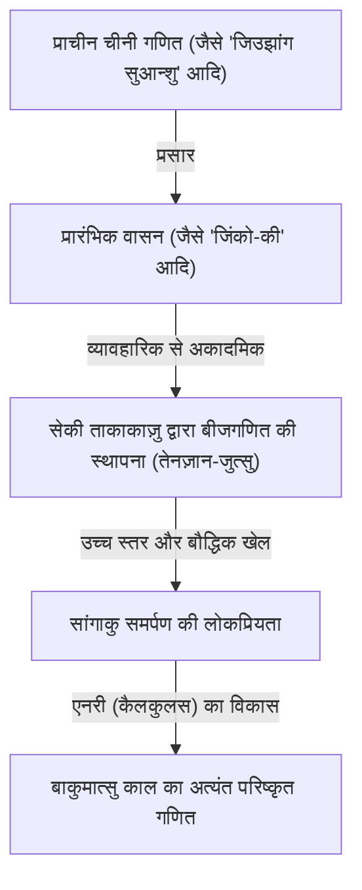
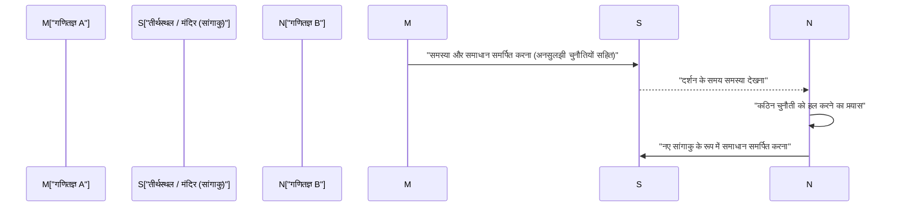

## 1. वासन (Wasan) क्या है: सकोकु (अलगाव) द्वारा जन्मा चमत्कारी गणित

एदो काल (1603–1867) के दौरान, जापान ने "सकोकु" (Sakoku) नामक राष्ट्रीय अलगाव की नीति अपना रखी थी। हालांकि, इस सांस्कृतिक और भौतिक रूप से बंद वातावरण में, एक अनूठी और अत्यधिक उन्नत गणितीय संस्कृति विकसित हुई। इसे **वासन (Wasan)** कहा जाता है।

उस समय यूरोप में न्यूटन और लाइबनिज कैलकुलस (कलन) की नींव रख रहे थे, लेकिन उसी दौर में जापान में भी पूरी तरह से स्वतंत्र संदर्भ में कैलकुलस के समकक्ष अवधारणाओं का जन्म हो रहा था। वासन की शुरुआत व्यावहारिक सर्वेक्षण और पंचांग (कैलेंडर) की गणनाओं से हुई थी, जो धीरे-धीरे शुद्ध गणितीय कौतुक और एक प्रकार की कला के रूप में विकसित हो गई।



### 1.1 'जिंको-की' की अत्यधिक लोकप्रियता (बेस्टसेलर बनना)

वासन के व्यापक प्रसार का प्रमुख कारण 1627 में योशिदा मित्सुयोशी द्वारा प्रकाशित पुस्तक 『जिंको-की (Jinkōki)』 थी। इसमें अबेकस (सोरोबान) के उपयोग से लेकर क्षेत्रफल और आयतन की गणना, तथा यहाँ तक कि "चूहों के प्रजनन की समस्या" (नेज़ुमिज़ान) जैसी मनोरंजक पहेलियों को चित्रों के माध्यम से सरल और स्पष्ट तरीके से समझाया गया था।

```python
# नेज़ुमिज़ान (चूहे की पहेली) का अनुकरण (Python में कार्यान्वयन)
def nezumizan(months):
    # शुरुआती जोड़ा
    pairs = 1
    for month in range(1, months + 1):
        # मान लेते हैं कि प्रत्येक महीने 12 बच्चे (6 जोड़े) पैदा होते हैं
        pairs += pairs * 6
    return pairs * 2 # चूहों की कुल संख्या

print(f"12 महीने बाद चूहों की संख्या: {nezumizan(12)}")
# आउटपुट: 12 महीने बाद चूहों की संख्या: 27682574402
```

एदो काल की उच्च साक्षरता दर के कारण यह पुस्तक अभूतपूर्व रूप से लोकप्रिय (बेस्टसेलर) बनी, और बड़ी संख्या में जापानी लोग गणित के आकर्षण में बंध गए।

## 2. विलक्षण प्रतिभा सेकी ताकाकाज़ु और "तेनज़ान-जुत्सु"

17वीं शताब्दी के उत्तरार्ध में, वासन को विश्व के शीर्ष स्तर पर पहुँचाने का श्रेय **सेकी ताकाकाज़ु (Seki Takakazu)** को जाता है। उन्हें "गणित का संत" (सान्सेई) कहा जाता है और वे "जापान के न्यूटन" के रूप में भी जाने जाते हैं।

सेकी ताकाकाज़ु की सबसे बड़ी उपलब्धि "तेनज़ान-जुत्सु" (Tenzan-jutsu) का आविष्कार था, जिसमें अज्ञात राशियों को प्रतीकों द्वारा दर्शाकर समीकरण तैयार किए जाते थे। इसने चीन से आए "सांगी" (गिनती की छड़ें) जैसे भौतिक गणना उपकरणों की सीमाओं को पार कर दिया और कागज़ पर जटिल बीजगणितीय गणनाएँ करना संभव बना दिया।

### सारणिक (डिटर्मिनेंट) की खोज
सेकी ताकाकाज़ु ने यूरोप में लाइबनिज से लगभग 10 वर्ष पहले ही रैखिक समीकरणों की प्रणालियों को हल करने के लिए "सारणिक" (Determinant) की अवधारणा खोज ली थी। उनकी पुस्तक 『काई-फुकुदाई नो हो (Kai-Fukudai no Hō)』 में आधुनिक सारणिक प्रसार (expansion) के मूल रूप से समान गणना पद्धति का उल्लेख मिलता है।

$$ \Delta = a_{11}a_{22} - a_{12}a_{21} $$

## 3. मंदिरों और तीर्थस्थलों में अर्पित गणितीय पट्टिकाएँ: "सांगाकु (Sangaku)"

वासन की चर्चा करते समय **सांगाकु (Sangaku)** की संस्कृति का उल्लेख अत्यंत आवश्यक है। सांगाकु लकड़ी की ऐसी पट्टिकाएँ (एमा का एक रूप) थीं, जिन पर गणितीय समस्याओं और उनके हलों को सुंदर ज्यामितीय आकृतियों के साथ चित्रित करके शिंतो तीर्थस्थलों और बौद्ध मंदिरों में समर्पित (भेंट) किया जाता था।

### 3.1 ईश्वर के प्रति आभार और गणितज्ञों की खुली चुनौती

गणित को मंदिरों और तीर्थस्थलों में क्यों समर्पित किया जाता था?
1. **कृतज्ञता की अभिव्यक्ति**: "कठिन समस्या का हल ईश्वर और बुद्ध की कृपा से ही संभव हुआ" – इसके प्रति आभार व्यक्त करना।
2. **आत्म-प्रदर्शन और संवाद**: अपनी विद्वता को समाज के सामने प्रस्तुत करना और साथ ही अन्य गणितज्ञों के समक्ष "क्या आप इसे हल कर सकते हैं?" जैसी खुली चुनौती (ईदाई / Idai) रखना।

गाँव के किसानों से लेकर समुराई, व्यापारियों, और यहाँ तक कि महिलाओं व बच्चों तक, सामाजिक वर्ग की परवाह किए बिना विभिन्न लोगों ने सांगाकु निर्माण में भाग लिया। यह विश्व भर में अद्वितीय और अभूतपूर्व जन-भागीदारी वाली गणितीय संस्कृति थी।



### 3.2 सांगाकु की विशिष्ट समस्याएँ (एनरी)

सांगाकु की अधिकांश समस्याएँ ज्यामिति (रेखागणित) से संबंधित थीं। विशेष रूप से, एक वृत्त के भीतर परस्पर स्पर्श करते हुए कई वृत्तों या बहुभुजों वाली आकृतियों की समस्याएँ अत्यधिक लोकप्रिय थीं।

**【एक प्रतिनिधि समस्या का उदाहरण】**
"एक बड़े बाह्य वृत्त के भीतर परस्पर स्पर्श करने वाले तीन समान वृत्त (वृत्त 'क') और उन्हें स्पर्श करने वाला एक छोटा वृत्त (वृत्त 'ख') स्थित है। यदि वृत्त 'क' का व्यास ज्ञात हो, तो वृत्त 'ख' का व्यास ज्ञात कीजिए।"

ऐसी जटिल ज्यामितीय समस्याओं को हल करने के लिए, वासन गणितज्ञों ने "**एनरी (Enri)**" नामक विधि विकसित की, जो आधुनिक समाकलन (कैलकुलस / इंटीग्रेशन) के समकक्ष सीमा (limit) गणना की तकनीक थी। उन्होंने पाई ($\pi$) का मान दशमलव के दर्जनों अंकों तक बिल्कुल सटीक निकाला और जटिल वक्रों की लंबाई तथा त्रिविमीय ठोसों के आयतन की गणना की।

## 4. वासन का अवसान और आधुनिक गणित से जुड़ाव

मेइजी काल (1868–) के आरंभ के साथ, जापान ने तीव्र आधुनिकीकरण (पश्चिमीकरण) की राह पकड़ी। शिक्षा प्रणाली के सुधार में मेइजी सरकार ने वासन को—जो अपनी अनूठी प्रतीक प्रणाली के कारण वैश्विक संदर्भ में कम व्यावहारिक माना गया—समाप्त करने और पश्चिमी गणित को आधिकारिक विषय के रूप में अपनाने का निर्णय लिया।

इसके परिणामस्वरूप वासन का तेजी से पतन हुआ, लेकिन वासन के माध्यम से विकसित "उच्च स्तरीय गणितीय सोच" और "पहेलियों का आनंद लेने जैसी बौद्धिक जिज्ञासा" ने मेइजी काल के बाद जापानी लोगों द्वारा पश्चिमी आधुनिक विज्ञान और गणित को आश्चर्यजनक गति से अपनाने में मुख्य प्रेरक शक्ति (इंजन) का कार्य किया।

## 5. आधुनिक युग में जीवित वासन की चेतना

आज भी पूरे जापान के मंदिरों और तीर्थस्थलों में लगभग 900 सांगाकु पट्टिकाएँ सुरक्षित हैं, जिन्हें स्थानीय सांस्कृतिक धरोहर के रूप में सहेज कर रखा गया है। इसके अतिरिक्त, आधुनिक गणितीय शिक्षा में भी तार्किक सोच और खोजी प्रवृत्ति को बढ़ावा देने वाली पहेली-नुमा शिक्षण सामग्री के रूप में सांगाकु की समस्याओं का पुनर्मूल्यांकन किया जा रहा है।

एदो काल के प्रतिभावान विद्वानों ने लकड़ी की पट्टियों पर जो गणितीय रहस्य उकेरे थे, वे समय की सीमाओं को पार कर आज भी हमें गणित के सौंदर्य और पहेलियों को सुलझाने के आनंद का अहसास कराते हैं।
