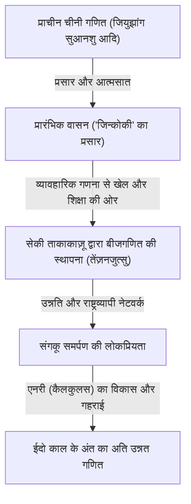
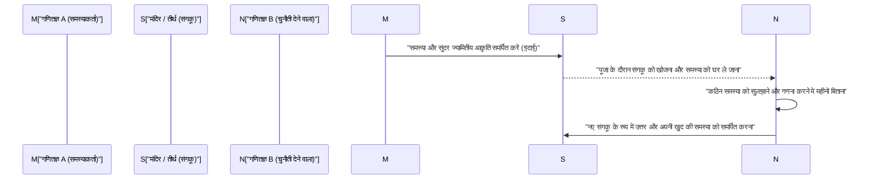

## 1. परिचय: अलगाव के दौरान जापान में हुआ "गणितीय चमत्कार"

17वीं सदी से लेकर 19वीं सदी के मध्य तक, जापान ने "सकोकू" नामक एक सख्त अलगाववादी नीति अपनाई थी। इस युग में जब पश्चिमी विज्ञान और संस्कृति के साथ आदान-प्रदान अत्यधिक सीमित था, जापान के भीतर एक अनोखी घटना घट रही थी जो दुनिया में कहीं और नहीं देखी गई। वह थी जापान की अनूठी उन्नत गणितीय संस्कृति **"वासन (Wasan)"** का विकास।

उसी समय यूरोप में, [आइजैक न्यूटन](/hi/p/newton/) और गोटफ्रीड लाइबनिज द्वारा कैलकुलस (कलन) की स्थापना की गई थी, और आधुनिक गणित तेजी से विकसित हो रहा था। आश्चर्यजनक रूप से, सुदूर पूर्व के द्वीप राष्ट्र जापान में भी, उनसे पूरी तरह से स्वतंत्र रूप से कैलकुलस के बराबर उन्नत गणितीय अवधारणाएं जन्म ले रही थीं।

इस लेख में, हम वासन के इतिहास का विस्तार से पता लगाएंगे, जो व्यावहारिक सर्वेक्षण और गणनाओं से शुरू होकर एक शुद्ध बौद्धिक खेल और कला के रूप में विकसित हुआ। साथ ही उन प्रतिभाशाली गणितज्ञों के बारे में भी जानेंगे जिन्होंने इसके विकास का नेतृत्व किया, और अद्वितीय "संगकू" संस्कृति पर भी प्रकाश डालेंगे जो दुनिया में बेजोड़ है।

## 2. वासन का उदय: बेस्टसेलर "जिन्कोकी" (Jinkoki) जिसने गणितीय उछाल को प्रज्वलित किया

जापानी गणितीय संस्कृति के विस्फोटक प्रसार का निर्णायक मोड़ 1627 में ईदो काल की शुरुआत में प्रकाशित योशिदा मित्सुयोशी की पुस्तक "जिन्कोकी" थी।

उस समय तक, जापान में अंकगणित मुख्य रूप से चीन से आया जटिल ज्ञान था, जिसे केवल कुछ बुद्धिजीवी और अधिकारी ही संभालते थे। हालाँकि, "जिन्कोकी" ने दैनिक व्यापार में इस्तेमाल होने वाले अबेकस की गणनाओं से लेकर खेतों के क्षेत्रफल और चावल की बोरियों की मात्रा की गणना करने के तरीकों, और यहाँ तक कि पहेलियों और मनोरंजक समस्याओं को बहुत ही सरल तरीके से प्रचुर चित्रों के साथ समझाया।

ईदो काल वह समय था जब तेराकोया (मंदिर के स्कूल) के प्रसार के कारण आम लोगों की साक्षरता दर विश्व स्तर पर आश्चर्यजनक रूप से उच्च स्तर तक पहुँच गई थी। "जिन्कोकी" एक अभूतपूर्व बेस्टसेलर बन गई, और इसके कई संशोधित और पायरेटेड संस्करण प्रकाशित हुए। इस पुस्तक के माध्यम से न केवल समुराई, बल्कि व्यापारी और किसान भी "गणित के आनंद" के प्रति जागरूक हो गए।

## 3. जापान के न्यूटन: "गणित के संत" सेकी ताकाकाज़ू का आगमन

17वीं सदी के उत्तरार्ध में, एक बेजोड़ प्रतिभा का आगमन हुआ जिसने वासन को मनोरंजन और व्यावहारिकता से बाहर निकालकर विश्व स्तरीय उन्नत अमूर्त गणित के स्तर तक पहुँचाया। वे थे **सेकी ताकाकाज़ू**। उन्हें बाद में "सेंसेई" (गणित के संत) के रूप में जाना गया और वे जापानी गणित के इतिहास में सबसे महत्वपूर्ण व्यक्ति बन गए।

### 3.1 तेंज़नजुत्सु (Tenzanjutsu): बीजगणित की स्थापना
सेकी ताकाकाज़ू की सबसे बड़ी उपलब्धियों में से एक "तेंज़नजुत्सु" नामक अपनी खुद की लिखित बीजगणितीय व्यंजक प्रणाली का आविष्कार था। उससे पहले, "संगी" नामक लकड़ी की छड़ियों को बोर्ड पर रखकर गणना करने की भौतिक विधि मुख्यधारा में थी, लेकिन इससे जटिल बहु-चर समीकरणों को हल करना मुश्किल था। सेकी ताकाकाज़ू ने अज्ञात चरों को कांजी (चीनी वर्णों) से दर्शाकर और कागज पर गणितीय सूत्रों में हेरफेर करके समीकरण स्थापित करने की विधि (शाब्दिक व्यंजक) स्थापित की। इससे जापानी गणित भौतिक बाधाओं से मुक्त हो गया और उसने तेजी से विकास किया।

### 3.2 सारणिक (Determinant) और बर्नौली संख्याओं की खोज
सेकी ताकाकाज़ू की प्रतिभा का प्रमाण यूरोपीय गणितज्ञों के साथ एक साथ की गई खोजों से मिलता है। अपनी पुस्तक "काईफुकुदई नो हो" (1683) में, उन्होंने रेखीय समीकरणों की प्रणालियों को हल करने के लिए "सारणिक" की अवधारणा प्रस्तुत की। यह यूरोप में लाइबनिज द्वारा इसी तरह की अवधारणा प्रस्तावित करने से लगभग 10 साल पहले हुआ था।

इसके अलावा, घात योग के सूत्र में दिखाई देने वाली "बर्नौली संख्याएँ" स्विस गणितज्ञ जैकब बर्नौली के प्रकाशन (1713) के समय ही सेकी ताकाकाज़ू की मरणोपरांत पांडुलिपि "कात्सुयो संम्पो" (1712) में भी स्पष्ट रूप से वर्णित हैं।

## 4. चरम को चुनौती: "एनरी" (Enri) और ताकेबे काताहिरो

सेकी ताकाकाज़ू की मृत्यु के बाद, उनके शीर्ष शिष्य **ताकेबे काताहिरो** और अन्य लोगों ने वासन को और विकसित किया। उनके द्वारा सुलझाई गई सबसे बड़ी चुनौती "वृत्त" से संबंधित गणनाएँ थीं।

वासन के विद्वानों ने **"एनरी" (वृत्त का सिद्धांत)** नामक एक विधि ईजाद की, जो आधुनिक कैलकुलस (अवकलन और समाकलन) के समतुल्य है। ताकेबे काताहिरो ने वृत्ताकार चापों की लंबाई और खंडों के क्षेत्रफल को ज्ञात करने के लिए अनंत श्रेणी विस्तार (टेलर विस्तार के समतुल्य) का उपयोग करने की एक विधि तैयार की। कहा जाता है कि उन्होंने अविश्वसनीय मैनुअल गणनाओं के माध्यम से दशमलव के बाद 41 स्थानों तक पाई $\pi$ के मूल्य की सटीक गणना की थी।

$$ \pi \approx 3.14159265358979323846264338327950288419716\dots $$

ये उपलब्धियां व्यावहारिक उद्देश्यों से परे जाकर "सच्चाई की खोज" की शुद्ध गणितीय जिज्ञासा से उत्पन्न हुई थीं।

## 5. दुनिया की अनूठी गणितीय संस्कृति "संगकू" (Sangaku)

वासन केवल कुलीन वर्ग का ही नहीं था, बल्कि यह आम जनता द्वारा पसंद की जाने वाली संस्कृति थी, और इसका सबसे बड़ा प्रतीक **"संगकू"** है।

संगकू एक प्रकार की लकड़ी की पट्टिका (एमा) है जिस पर लोग खुद हल की गई गणितीय समस्याओं, उनके सुंदर ज्यामितीय आकृतियों और समाधान विधियों को बनाते थे और उन्हें मंदिरों और तीर्थों में समर्पित करते थे। यह प्रथा 17वीं सदी के मध्य में शुरू हुई और पूरे ईदो काल में पूरे जापान में बेहद लोकप्रिय रही।

### 5.1 मंदिरों और तीर्थों में गणित क्यों समर्पित किया गया?

संगकू समर्पण के मुख्य रूप से 3 अर्थ थे:
1. **देवताओं के प्रति आभार**: "इस कठिन समस्या को हल कर पाना देवताओं की कृपा के कारण ही संभव हो पाया," यह शुद्ध कृतज्ञता की अभिव्यक्ति थी।
2. **आत्म-प्रदर्शन और प्रस्तुति का स्थान**: अपनी गणितीय प्रतिभा को दुनिया के सामने प्रदर्शित करने के लिए, आधुनिक समय के शैक्षणिक शोध पत्रों या पोस्टर प्रस्तुतियों की तरह।
3. **दूसरों के लिए चुनौती**: अक्सर संगकू का प्रारूप ऐसा होता था कि "उत्तर दिए बिना केवल समस्या प्रस्तुत की जाती थी (इदाई)"। यह एक तरह की चुनौती थी कि "अगर कोई इस समस्या को हल कर सकता है, तो हल करके दिखाए," और इसे देखने वाला दूसरा गणितज्ञ एक नए संगकू के रूप में अपना उत्तर समर्पित करता था। इस तरह एक बौद्धिक संचार स्थापित होता था।

### 5.2 वर्गों से परे ज्ञान का नेटवर्क

सबसे आश्चर्यजनक बात यह थी कि संगकू को समर्पित करने वाले लोग केवल प्रसिद्ध विद्वानों या समुराई तक सीमित नहीं थे। मौजूदा संगकू में व्यापारियों, किसानों और यहाँ तक कि महिलाओं और किशोरों के नाम भी दर्ज हैं। पूरे देश में यात्रा करने वाले गणित शिक्षकों के अस्तित्व के कारण, संपूर्ण जापानी द्वीपसमूह एक विशाल "ऑनलाइन गणितीय समुदाय" की तरह काम करता था। ईदो काल में जहां वर्ग व्यवस्था बहुत सख्त थी, केवल गणित की दुनिया पूरी तरह से योग्यता पर आधारित थी, और वर्गों से परे समान रूप से विचारों का आदान-प्रदान होता था।

## 6. वासन का अंत और आधुनिकीकरण में इसका शांत योगदान

1868 के मीजी पुनरुद्धार के बाद, जापान ने तेजी से पश्चिमीकरण और आधुनिकीकरण का मार्ग अपनाना शुरू किया। राष्ट्रीय धन और सैन्य शक्ति तथा औद्योगिक विकास का लक्ष्य रखने वाली मीजी सरकार के लिए, अत्यधिक पहेली-नुमा और अपनी खुद की चीनी शैली की प्रतीक प्रणाली वाला वासन पश्चिमी विज्ञान और प्रौद्योगिकी की शुरूआत में एक बाधा माना जाने लगा।

परिणामस्वरूप, 1872 (मीजी 5) की स्कूल प्रणाली की घोषणा के साथ, यह निर्णय लिया गया कि स्कूलों में केवल पश्चिमी गणित ही पढ़ाया जाएगा, और सदियों पुरानी वासन की परंपरा तेजी से घटने लगी।

हालाँकि, वासन व्यर्थ में गायब नहीं हुआ। ईदो काल के दौरान, पूरे देश के आम लोगों तक "तार्किक सोच की क्षमता," "अमूर्त अवधारणाओं को संभालने की क्षमता," और सबसे बढ़कर "सीखने की खुशी का बौद्धिक कौतूहल" गहराई से जड़ें जमा चुका था। मीजी काल के बाद, जापान आश्चर्यजनक गति से पश्चिमी उन्नत गणित और आधुनिक विज्ञान को आत्मसात करने में सक्षम हुआ और दुनिया के शीर्ष स्तर तक पहुंच गया, इसमें कोई संदेह नहीं कि यह "वासन की नींव" के कारण ही संभव हो पाया।

## 7. निष्कर्ष: आधुनिक समय में भी जीवित रहने वाला गणितीय रोमांस

आज भी, जापान भर के मंदिरों और तीर्थों में लगभग 900 संगकू पट्टिकाएं मौजूद हैं, जिन्हें सावधानीपूर्वक संरक्षित किया गया है और महत्वपूर्ण स्थानीय सांस्कृतिक संपत्तियों के रूप में उनका अध्ययन किया जाता है। हाल के वर्षों में, आधुनिक गणित शिक्षा में, रटकर सीखने के बजाय "समस्याओं की खोज करने और स्वतंत्र रूप से अन्वेषण करने के आनंद" को सिखाने के लिए एक उत्कृष्ट शैक्षिक सामग्री के रूप में संगकू की ज्यामितीय समस्याओं पर फिर से ध्यान आकर्षित किया गया है।

ईदो काल के लोगों द्वारा लकड़ी की पट्टियों पर उकेरा गया गणित के प्रति उनका जुनून आज भी हमें पार कर बौद्धिक खोज के रोमांस और समस्याओं को हल करने की खुशी के बारे में शांति से बताता है।
