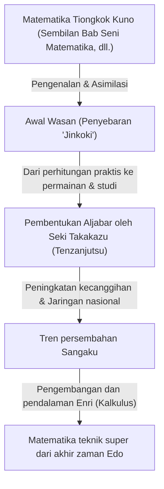
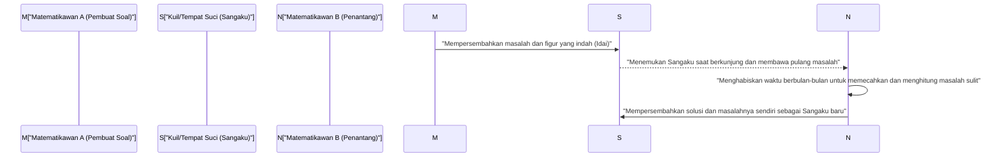

## 1. Pendahuluan: "Keajaiban Matematika" yang Terjadi di Jepang pada Masa Isolasi

Dari abad ke-17 hingga pertengahan abad ke-19, Jepang mengadopsi kebijakan isolasi ketat yang disebut "Sakoku". Di era ketika pertukaran dengan sains dan budaya Barat sangat dibatasi ini, sebuah fenomena luar biasa yang tak tertandingi di dunia sedang terjadi di dalam Jepang. Itu adalah mekarnya budaya matematika tingkat tinggi yang unik di Jepang, **"Wasan"**.

Pada saat yang sama di Eropa, kalkulus sedang dirintis oleh [Isaac Newton](/id/p/newton/) dan [Gottfried Leibniz](/id/p/leibniz/), dan matematika modern berkembang pesat. Secara mengejutkan, di negara pulau di Timur Jauh, Jepang, konsep matematika tingkat tinggi yang sebanding dengan kalkulus lahir secara independen.

Artikel ini akan mengungkap secara rinci sejarah Wasan, yang dimulai dari pengukuran dan perhitungan praktis, kemudian perlahan menyublim menjadi permainan intelektual murni, dan bahkan semacam seni, serta para ahli matematika jenius yang mendorong perkembangannya, dan budaya unik "Sangaku" yang tak tertandingi di dunia.

## 2. Fajar Wasan: Buku Terlaris "Jinkoki" Memicu Demam Matematika

Pemicu yang menentukan penyebaran budaya matematika di Jepang secara eksplosif adalah penerbitan buku "Jinkoki" karya Mitsuyoshi Yoshida pada tahun 1627 di awal zaman Edo.

Hingga saat itu, aritmetika Jepang sebagian besar merupakan pengetahuan kompleks yang diperkenalkan dari Tiongkok, dan hanya digunakan oleh sebagian intelektual dan pejabat. Namun, "Jinkoki" menjelaskan dengan sangat mudah dipahami beserta banyak ilustrasi, mulai dari cara menggunakan sempoa (soroban) untuk transaksi komersial sehari-hari, cara menghitung luas sawah dan volume karung beras, hingga masalah teka-teki dan hiburan seperti "Nezumizan" (pertumbuhan tikus) dan "Mamakodate" (perhitungan eliminasi).

Secara kebetulan, zaman Edo adalah periode ketika tingkat melek huruf rakyat jelata mencapai tingkat yang mengejutkan secara global berkat meluasnya Terakoya (sekolah kuil). "Jinkoki" menjadi buku terlaris yang belum pernah terjadi sebelumnya, dan edisi bajakan serta edisi revisi diterbitkan berkali-kali. Melalui buku ini, tidak hanya samurai, tetapi juga pedagang dan petani menyadari "kesenangan matematika".

## 3. Newton-nya Jepang, Kemunculan "Sansei" Seki Takakazu

Pada akhir abad ke-17, muncul seorang jenius langka yang mengangkat Wasan, yang belum melampaui batas hiburan dan kepraktisan, menjadi matematika abstrak tingkat tinggi berkelas dunia. Dia adalah **Seki Takakazu**. Ia kemudian dikenal sebagai "Sansei (Orang Suci Matematika)" dan menjadi tokoh paling penting dalam sejarah matematika Jepang.

### 3.1 Tenzanjutsu: Pembentukan Aljabar
Salah satu pencapaian terbesar Seki Takakazu adalah penemuan rumus aljabar tulisan tangan unik yang disebut "Tenzanjutsu". Sebelumnya, metode fisik berupa penyusunan tongkat kayu yang disebut "Sangi" di atas papan untuk menghitung adalah hal yang umum, namun hal ini membuat sulit untuk memecahkan persamaan multivariabel yang kompleks. Seki Takakazu merepresentasikan besaran yang tidak diketahui dengan karakter Kanji, dan menetapkan metode (ekspresi karakter) untuk merumuskan persamaan dengan memanipulasi ekspresi matematika di atas kertas. Dengan ini, matematika Jepang dibebaskan dari kendala fisik dan mencapai evolusi yang drastis.

### 3.2 Penemuan Determinan dan Bilangan Bernoulli
Sebagai sebuah episode yang menunjukkan kegeniusan Seki Takakazu, penemuan simultan dengan matematikawan Eropa dapat disebutkan. Dalam bukunya "Kai Fukudai no Ho" (1683), ia mempresentasikan konsep "Determinan" (Determinant) untuk mencari penyelesaian sistem persamaan linear. Ini terjadi sekitar 10 tahun lebih awal daripada saat Leibniz mengajukan konsep serupa di Eropa.

Selain itu, mengenai "Bilangan Bernoulli" yang muncul dalam rumus jumlah pangkat, hal ini dituliskan dengan jelas dalam karya anumerta Seki Takakazu "Katsuyo Sanpo" (1712), sezaman dengan publikasinya oleh Jacob Bernoulli dari Swiss (1713).

## 4. Menantang Batas: "Enri" dan Takebe Katahiro

Setelah kematian Seki Takakazu, murid utamanya **Takebe Katahiro** dan yang lainnya mengembangkan Wasan lebih jauh. Masalah tersulit yang mereka tantang adalah perhitungan yang berkaitan dengan "lingkaran".

Para ahli matematika Wasan merancang sebuah metode bernama **"Enri"**, yang setara dengan kalkulus diferensial dan integral modern. Takebe Katahiro menemukan metode menggunakan ekspansi deret tak terhingga (setara dengan [deret Taylor](/id/p/taylor-and-maclaurin-series/)) untuk menghitung panjang busur dan luas tembereng. Melalui perhitungan manual yang melelahkan, ia dikatakan telah menghitung nilai pi $\pi$ secara akurat hingga 41 tempat desimal.

$$ \pi \approx 3.14159265358979323846264338327950288419716\dots $$

Pencapaian ini melampaui tujuan praktis dan lahir dari hasrat murni eksplorasi matematika untuk "mencari kebenaran".

## 5. Budaya Matematika "Sangaku" yang Tak Tertandingi di Dunia

Hal yang paling melambangkan bahwa Wasan merupakan budaya yang dicintai tidak hanya oleh kalangan elit, tetapi juga oleh masyarakat luas adalah **"Sangaku"**.

Sangaku adalah sejenis Ema (papan kayu nazar) tempat orang melukis soal matematika yang telah mereka pecahkan, figur geometrisnya yang indah, solusi, dll., dan mempersembahkannya ke kuil atau tempat suci. Kebiasaan ini dimulai sekitar pertengahan abad ke-17 dan menjadi sangat populer di seluruh Jepang selama zaman Edo.

### 5.1 Mengapa Mempersembahkan Matematika ke Kuil dan Tempat Suci?

Ada tiga makna utama dalam persembahan Sangaku:
1. **Rasa Terima Kasih kepada Dewa dan Buddha**: Ekspresi rasa syukur yang murni bahwa "Berkat perlindungan ilahilah saya mampu memecahkan masalah sulit ini".
2. **Ajang Pamer Diri dan Presentasi**: Berperan seperti makalah akademis atau presentasi poster modern untuk memamerkan bakat matematika seseorang kepada dunia.
3. **Surat Tantangan untuk Orang Lain**: Sangaku sering kali mengambil format "hanya menyajikan masalah tanpa menuliskan jawabannya (Idai)". Ini adalah surat tantangan yang mengatakan "Jika ada yang bisa memecahkan masalah ini, cobalah," dan ahli matematika lain yang melihat ini akan mempersembahkan solusinya sebagai Sangaku yang baru, menciptakan komunikasi intelektual.

### 5.2 Jaringan Pengetahuan Melampaui Status Sosial

Hal yang paling mengejutkan adalah bahwa penyumbang Sangaku tidak terbatas pada cendekiawan terkenal atau samurai. Pada Sangaku yang masih ada, terdapat pula nama-nama pedagang, petani desa, bahkan wanita dan remaja. Ada juga penjelajah matematika yang bepergian keliling negeri (orang-orang yang bepergian sambil mengajar matematika), dan seluruh kepulauan Jepang berfungsi seperti "komunitas matematika online" raksasa. Di zaman Edo, yang sistem kelas sosialnya ketat, hanya dunia matematika yang sepenuhnya merupakan meritokrasi, di mana pertukaran setara tanpa memandang status sosial terjadi.

## 6. Akhir dari Wasan dan Kontribusi Sunyi Menuju Modernisasi

Melalui Restorasi Meiji pada tahun 1868, Jepang mulai melangkah di jalur westernisasi dan modernisasi yang pesat. Bagi pemerintahan Meiji, yang bertujuan untuk memperkaya negara dan memperkuat militer serta mengembangkan industri, Wasan, yang telah sangat berubah menjadi teka-teki dan permainan dan memiliki sistem simbol Kanji yang unik, dipandang sebagai penghalang untuk memperkenalkan sains dan teknologi Barat.

Akibatnya, dengan diumumkannya Sistem Pendidikan pada tahun 1872 (Meiji 5), diputuskan bahwa hanya matematika Barat yang akan diajarkan di pendidikan sekolah, dan tradisi Wasan yang telah berlangsung selama ratusan tahun mulai menurun dengan cepat.

Namun, Wasan tidak pernah hilang sia-sia. Selama zaman Edo, "kemampuan untuk berpikir logis", "kemampuan untuk menangani konsep abstrak", dan di atas segalanya, "keingintahuan intelektual untuk menikmati pembelajaran itu sendiri" telah berakar dalam hingga ke rakyat jelata di seluruh pelosok negeri. Tidak diragukan lagi bahwa Jepang mampu menyerap matematika tingkat lanjut dan sains modern Barat dengan kecepatan yang luar biasa sejak zaman Meiji dan mengejar tingkat puncak dunia berkat "fondasi Wasan" ini.

## 7. Penutup: Romantika Matematika yang Terus Hidup di Era Modern

Hingga hari ini, ada sekitar 900 panel Sangaku yang masih bertahan di berbagai kuil dan tempat suci di seluruh Jepang, dan dilestarikan serta dipelajari dengan hati-hati sebagai aset budaya yang penting. Selain itu, dalam beberapa tahun terakhir, masalah geometris Sangaku kembali menarik perhatian sebagai bahan pengajaran yang sangat baik di pendidikan matematika modern untuk mengajarkan "kegembiraan menemukan dan mengeksplorasi masalah sendiri", bukan belajar dengan hafalan.

Gairah terhadap matematika yang diukir pada panel kayu oleh orang-orang zaman Edo secara diam-diam terus berbicara kepada kita saat ini, melampaui waktu, menyampaikan romantika eksplorasi intelektual dan sukacita pemecahan masalah.
