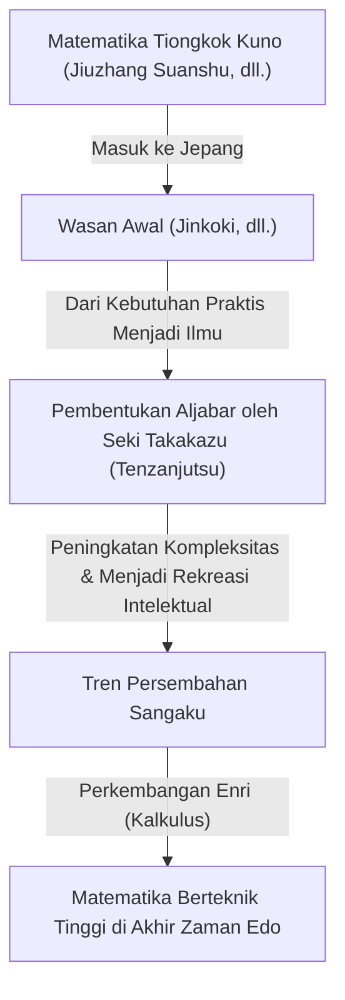
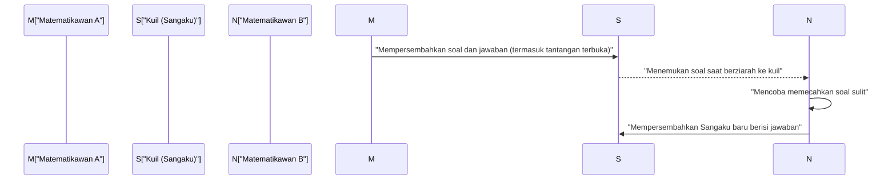

## 1. Apa Itu Wasan: Keajaiban Matematika yang Lahir dari Kebijakan Isolasi (Sakoku)

Selama zaman Edo (1603–1867), Jepang menerapkan kebijakan isolasi terhadap dunia luar yang dikenal sebagai *Sakoku*. Namun, di dalam ruang yang tertutup secara budaya dan fisik ini, berkembang sebuah budaya matematika tingkat tinggi yang sangat unik. Itulah yang disebut **Wasan** (matematika tradisional Jepang).

Pada masa yang sama di Eropa, Isaac Newton dan Gottfried Wilhelm Leibniz sedang meletakkan dasar-dasar kalkulus diferensial dan integral. Namun di Jepang pada periode yang serupa, konsep-konsep yang setara dengan kalkulus juga lahir secara mandiri dari konteks yang sama sekali berbeda. Wasan bermula dari perhitungan praktis untuk survei tanah dan penyusunan kalender, kemudian secara bertahap bertransformasi menjadi permainan matematika murni atau bahkan sebuah bentuk seni.



### 1.1 Jinkoki Menjadi Buku Terlaris (Bestseller)

Pemicu meluasnya Wasan secara eksponensial adalah terbitnya buku *Jinkoki* karya Yoshida Mitsuyoshi pada tahun 1627. Buku ini menyajikan penjelasan yang mudah dipahami disertai ilustrasi grafis, mulai dari cara penggunaan sempoa (*soroban*), cara menghitung luas dan volume, hingga soal-soal rekreasi intelektual seperti *nezumizan* (perhitungan perkembangbiakan tikus).

```python
# Simulasi Nezumizan (perkembangbiakan tikus menggunakan Python)
def nezumizan(months):
    # Pasangan awal
    pairs = 1
    for month in range(1, months + 1):
        # Asumsikan setiap pasang melahirkan 12 anak (6 pasang) setiap bulan
        pairs += pairs * 6
    return pairs * 2 # Jumlah total ekor

print(f"Jumlah tikus setelah 12 bulan: {nezumizan(12)} ekor")
# Output: Jumlah tikus setelah 12 bulan: 27682574402 ekor
```

Didukung oleh tingginya tingkat melek huruf pada zaman Edo, buku ini menjadi *bestseller* luar biasa yang belum pernah terjadi sebelumnya, memikat banyak orang Jepang untuk terpukau oleh keindahan matematika.

## 2. Sang Jenius Seki Takakazu dan "Tenzanjutsu"

Pada paruh kedua abad ke-17, tokoh yang mengangkat Wasan ke tingkat puncak dunia adalah **Seki Takakazu**. Ia dihormati sebagai "Sansei" (Santo Matematika) dan sering dijuluki sebagai Newton-nya Jepang.

Prestasi terbesar Seki Takakazu adalah merumuskan *Tenzanjutsu*, sebuah metode untuk menyusun persamaan aljabar dengan melambangkan variabel tak diketahui menggunakan simbol-simbol khusus. Berkat penemuan ini, matematikawan Jepang berhasil melampaui batasan alat hitung fisik berupa batang hitung (*sangi*) yang berasal dari Tiongkok kuno, sehingga memungkinkan perhitungan aljabar yang rumit dilakukan langsung di atas kertas.

### Penemuan Determinan
Seki Takakazu menemukan konsep "Determinan" sebagai metode untuk menyelesaikan sistem persamaan linear secara simultan sekitar 10 tahun lebih awal daripada Leibniz di Eropa. Dalam karyanya, *Kai-Fukudai no Ho*, ia mencatat metode perhitungan yang pada hakikatnya sama dengan ekspansi determinan modern.

$$ \Delta = a_{11}a_{22} - a_{12}a_{21} $$

## 3. Plakat Kayu Matematika yang Dipersembahkan di Kuil: "Sangaku"

Salah satu aspek yang paling unik dan tak terpisahkan dalam sejarah Wasan adalah budaya **Sangaku**. Sangaku adalah semacam papan persembahan kayu (*ema*) yang memuat soal-soal matematika beserta penyelesaiannya, dihiasi dengan gambar-gambar geometri yang indah, dan dipersembahkan ke kuil Shinto maupun kuil Buddha.

### 3.1 Rasa Syukur kepada Para Dewa dan Surat Tantangan Terbuka bagi Para Matematikawan

Mengapa mereka mempersembahkan soal matematika ke kuil?
1. **Ungkapan Rasa Syukur**: Sebagai bentuk terima kasih bahwa keberhasilan memecahkan soal sulit adalah berkat berkah dan perlindungan dari para dewa dan Buddha.
2. **Unjuk Kemampuan dan Komunikasi Intelektual**: Untuk menunjukkan kecakapan akademis mereka kepada khalayak umum, sekaligus berfungsi sebagai tantangan terbuka (*idai*) kepada matematikawan lain dengan pesan: "Dapatkah Anda memecahkan soal ini?"

Mulai dari petani pedesaan, samurai, pedagang, hingga wanita dan anak-anak, banyak orang dari berbagai lapisan sosial turut berpartisipasi dalam pembuatan Sangaku. Ini merupakan fenomena budaya matematika partisipatif yang jarang dijumpai tandingannya di belahan dunia mana pun.



### 3.2 Contoh Soal Khas Sangaku (Enri)

Sebagian besar masalah dalam Sangaku berkaitan dengan geometri. Secara khusus, permasalahan yang melibatkan lingkaran-lingkaran atau poligon yang saling bersinggungan di dalam sebuah lingkaran besar sangat digemari.

**[Contoh Soal Klasik]**
"Di dalam sebuah lingkaran luar, terdapat tiga lingkaran berukuran sama (lingkaran A) yang saling bersinggungan satu sama lain, serta lingkaran-lingkaran kecil (lingkaran B) yang menyinggung lingkaran-lingkaran tersebut. Jika diketahui diameter lingkaran A, carilah diameter lingkaran B."

Untuk memecahkan masalah geometri yang rumit seperti ini, para matematikawan Wasan mengembangkan metode perhitungan limit yang dikenal sebagai "**Enri**" (prinsip lingkaran), yang setara dengan metode kalkulus integral modern. Mereka mampu menghitung nilai pi ($\pi$) dengan akurat hingga puluhan digit di belakang koma, serta menghitung panjang kurva yang kompleks dan volume bentuk-bentuk ruang tiga dimensi.

## 4. Berakhirnya Wasan dan Transisi Menuju Matematika Modern

Memasuki era Meiji (1868–1912), Jepang bergerak cepat mendorong modernisasi (westernisasi). Dalam reformasi sistem pendidikan nasional, pemerintah Meiji memutuskan untuk menghapuskan Wasan—yang dianggap kurang praktis untuk teknologi industri serta memiliki sistem simbolik yang terisolasi—dan secara resmi mengadopsi matematika Barat sebagai kurikulum standar.

Meskipun hal ini menyebabkan Wasan meredup dengan cepat, "daya pikir matematis tingkat tinggi" dan "keingintahuan intelektual layaknya memecahkan teka-teki" yang telah ditempa melalui Wasan justru menjadi motor penggerak bagi masyarakat Jepang pada zaman Meiji untuk menyerap ilmu pengetahuan dan matematika modern Barat dengan kecepatan yang luar biasa.

## 5. Semangat Wasan yang Tetap Hidup di Masa Kini

Hingga saat ini, sekitar 900 plakat Sangaku masih bertahan di berbagai kuil di seluruh penjuru Jepang dan dilestarikan dengan baik sebagai cagar budaya daerah yang berharga. Terlebih lagi, dalam pendidikan matematika modern, soal-soal bernuansa teka-teki dari Sangaku kini dievaluasi kembali sebagai materi ajar yang sangat efektif untuk menumbuhkan pemikiran logis dan rasa ingin tahu.

Misteri-misteri matematika yang diukirkan oleh para jenius zaman Edo di atas papan-papan kayu itu terus melintasi ruang dan waktu, menyampaikan keindahan matematika serta kegembiraan dalam memecahkan masalah kepada kita semua di masa modern.
