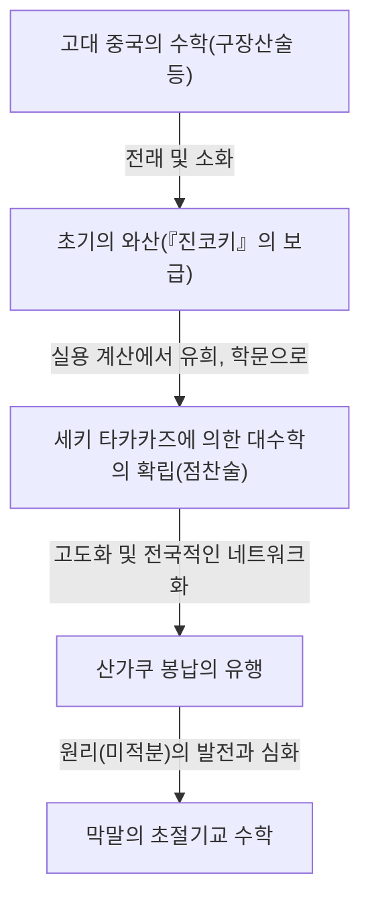
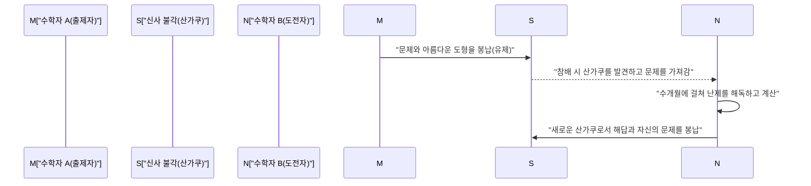

## 1. 서론: 쇄국 치하의 일본에서 일어난 '수학의 기적'

17세기부터 19세기 중반에 걸쳐, 일본은 '쇄국'이라고 불리는 엄격한 대외 고립 정책을 취하고 있었습니다. 서양의 과학이나 문화와의 교류가 극단적으로 제한되었던 이 시대, 일본 국내에서는 세계에서도 유례없는 특이한 현상이 일어나고 있었습니다. 그것은 일본 독자적인 고도의 수학 문화 **'와산(Wasan)'**의 개화입니다.

동시대의 유럽에서는 [아이작 뉴턴](/ko/p/newton/)이나 [고트프리트 라이프니츠](/ko/p/leibniz/) 등에 의해 미적분학이 창시되어 근대 수학이 급속히 발전하고 있었습니다. 놀랍게도 극동의 섬나라인 일본에서도 그것들과는 전혀 독립적인 형태로 미적분에 필적하는 고도의 수학적 개념이 탄생하고 있었던 것입니다.

본 기사에서는 실용적인 측량이나 계산에서 시작하여 이윽고 순수한 지적 유희, 그리고 일종의 예술로 승화되어 간 와산의 역사와 그 발전을 견인한 천재 수학자들, 그리고 세계에 유례없는 '산가쿠'라는 독특한 문화에 대해 자세히 풀어보고자 합니다.

## 2. 와산의 여명: 베스트셀러 『진코키(塵劫記)』가 불을 지핀 수학 붐

일본의 수학 문화가 폭발적으로 보급되는 결정적인 계기가 된 것이 에도 시대 초기인 1627년에 출판된 요시다 미쓰요시(吉田光由)의 저서 『진코키』입니다.

그때까지 일본의 산술은 주로 중국에서 전래된 난해한 지식이었으며, 일부 지식인이나 관리만이 다루는 것이었습니다. 그러나 『진코키』는 일상적인 상거래에서 사용하는 주판 계산법부터 논밭의 면적이나 쌀가마니의 부피를 구하는 방법, 나아가 '쥐산(네즈미산)'이나 '계자립(마마코다테)'과 같은 퍼즐 및 오락적인 문제까지 풍부한 삽화와 함께 매우 알기 쉽게 해설하고 있었습니다.

마침 에도 시대는 서당(테라코야)의 보급으로 서민들의 식자율이 세계적으로 보아도 경이로운 높이에 달했던 시기였습니다. 『진코키』는 전대미문의 대형 베스트셀러가 되어 수차례에 걸쳐 해적판이나 개정판이 출판되었습니다. 이 책을 통해 무사뿐만 아니라 상인이나 농민들까지도 '수학의 재미'에 눈을 뜨게 된 것입니다.

## 3. 일본의 뉴턴, '산성' 세키 타카카즈의 등장

17세기 후반, 오락이나 실용의 범주를 벗어나지 못했던 와산을 세계 최고 수준의 고도화된 추상 수학으로 끌어올린 불세출의 천재가 등장합니다. 그가 바로 **세키 타카카즈(関孝和)**입니다. 그는 훗날 '산성(수학의 성인)'으로 불리며 일본 수학사에 있어 가장 중요한 인물이 되었습니다.

### 3.1 점찬술(点竄術): 대수학의 확립
세키 타카카즈의 가장 큰 공적 중 하나는 '점찬술'이라고 불리는 독자적인 필산 대수식을 고안한 것입니다. 그 이전에는 '산기(算木)'라고 불리는 나무 막대를 판 위에 늘어놓고 계산하는 물리적인 수법이 주류였는데, 이로는 복잡한 다변수 방정식을 풀기가 어려웠습니다. 세키 타카카즈는 미지수를 한자로 나타내어 종이 위에서 수식을 조작해 방정식을 세우는 수법(문자식)을 확립했습니다. 이로 인해 일본의 수학은 물리적인 제약에서 해방되어 비약적인 진화를 이룹니다.

### 3.2 행렬식과 베르누이 수의 발견
세키 타카카즈의 천재성을 보여주는 에피소드로 유럽 수학자와의 동시 발견을 들 수 있습니다. 그는 저서 『해복제지법(解伏題之法)』(1683년)에서 연립 일차 방정식의 해를 구하기 위한 '행렬식(Determinant)'의 개념을 제시했습니다. 이는 유럽에서 라이프니츠가 유사한 개념을 제창한 것보다 약 10년 빠른 일이었습니다.

또한 거듭제곱의 합 공식에 나타나는 '베르누이 수'에 대해서도 스위스의 야코프 베르누이에 의한 발표(1713년)와 동시대에 세키 타카카즈의 유고인 『괄요산법(括要算法)』(1712년)에 명확히 기록되어 있습니다.

## 4. 극한에 대한 도전: '원리'와 타케베 카타히로

세키 타카카즈의 사후, 그의 수제자인 **타케베 카타히로(建部賢弘)** 등이 와산을 더욱 발전시켰습니다. 그들이 도전한 최대의 난제가 '원'에 관한 계산이었습니다.

와산가들은 현대의 미분적분학에 해당하는 **'원리(円理)'**라는 수법을 짜냈습니다. 타케베 카타히로는 원호의 길이나 활꼴의 면적을 구하기 위해 무한급수 전개(테일러 전개에 해당)를 이용하는 수법을 고안했습니다. 그는 아득해질 정도로 긴 수계산을 통해 원주율 $\pi$의 값을 소수점 이하 41자리까지 정확하게 산출해 냈다고 전해집니다.

$$ \pi \approx 3.14159265358979323846264338327950288419716\dots $$

이것들은 실용적인 목적을 초월하여 '진리를 탐구한다'는 순수한 수학적 탐구심에서 태어난 성과였습니다.

## 5. 세계에 유례없는 수학 문화 '산가쿠(Sangaku)'

와산이 일부 엘리트층뿐만 아니라 널리 대중에게 사랑받은 문화임을 가장 잘 상징하는 것이 **'산가쿠(Sangaku, 算額)'**입니다.

산가쿠란 자신이 푼 수학 문제나 그 아름다운 도형, 해법 등을 나무 판자에 그려 신사나 사찰에 봉납한 에마(絵馬)의 일종입니다. 이 풍습은 17세기 중반부터 시작되어 에도 시대를 거치며 일본 전국에서 크게 유행했습니다.

### 5.1 왜 신사와 사찰에 수학을 봉납했을까?

산가쿠 봉납에는 주로 3가지의 의미가 있었습니다.
1. **신불에 대한 감사**: "이 난제를 푼 것은 신불의 가호 덕분이다"라는 순수한 감사의 표현.
2. **자기 과시 및 발표의 장**: 자신의 수학적 재능을 세상에 피로하기 위한, 현대의 학술 논문이나 포스터 발표와 같은 역할.
3. **타인에 대한 도전장**: 산가쿠에는 종종 "해답을 적지 않고 문제만을 제시하는(유제, 遺題)" 형식이 취해졌습니다. 이는 "이 문제를 풀 수 있는 자가 있다면 풀어 보아라"라는 도전장이며, 이를 본 다른 수학자가 해답을 새로운 산가쿠로서 봉납하는 지적인 커뮤니케이션이 성립되어 있었습니다.

### 5.2 신분을 초월한 지식의 네트워크

가장 놀라운 점은 산가쿠의 봉납자가 고명한 학자나 무사에 국한되지 않았다는 점입니다. 현존하는 산가쿠에는 상인, 마을의 농민, 심지어 여성이나 10대 아이들의 이름도 기록되어 있습니다. 전국 각지를 도는 수학 유력가(수학을 가르치며 여행하는 사람들)의 존재도 있어서, 일본 열도 전체가 거대한 '온라인 수학 커뮤니티'처럼 기능하고 있었습니다. 신분 제도가 엄격했던 에도 시대에 수학의 세계만큼은 완전한 실력주의였으며, 신분을 초월한 평등한 교류가 이루어지고 있었던 것입니다.

## 6. 와산의 종언과 근대화를 향한 조용한 공헌

1868년 메이지 유신을 거치며 일본은 급속한 서구화와 근대화의 길을 걷기 시작했습니다. 부국강병과 산업 육성을 목표로 하는 메이지 정부에게 있어, 고도로 퍼즐화 및 유희화되고 독자적인 한문적 기호 체계를 가진 와산은 서양의 과학 기술을 도입하기 위한 장벽으로 간주되었습니다.

그 결과 1872년(메이지 5년)의 학제 반포에 의해 학교 교육에서는 서양 수학만을 가르치는 것으로 결정되었고, 수백 년간 이어진 와산의 전통은 급속히 쇠퇴하게 됩니다.

그러나 와산은 결코 헛되이 사라진 것이 아닙니다. 에도 시대 동안 전국 방방곡곡의 서민들에 이르기까지 '논리적으로 사고하는 힘', '추상적인 개념을 다루는 능력', 그리고 무엇보다 '배우는 것 자체를 즐기는 지적 호기심'이 깊이 뿌리내려 있었습니다. 메이지 이후 일본이 경이로운 속도로 서양의 고등 수학이나 근대 과학을 흡수하여 세계 최고 수준을 따라잡을 수 있었던 것은 틀림없이 이 '와산의 토양'이 있었기 때문입니다.

## 7. 맺음말: 현대에 살아 숨 쉬는 수학의 로망

오늘날에도 일본 각지의 신사와 사찰에는 약 900면의 산가쿠가 현존하고 있으며, 지역의 중요한 문화재로서 소중하게 보존 및 연구되고 있습니다. 또한 최근에는 현대 수학 교육 현장에서 암기식 학습이 아닌 '스스로 문제를 발견하고 탐구하는 즐거움'을 가르치기 위한 훌륭한 교재로서 산가쿠의 도형 문제가 다시금 주목을 받고 있습니다.

에도 시대 사람들이 나무 판자에 새겨 넣은 수학에 대한 열정은 시대를 넘어 현대의 우리들에게도 지적 탐구의 로망과 푸는 기쁨을 조용히 이야기해 주고 있습니다.
