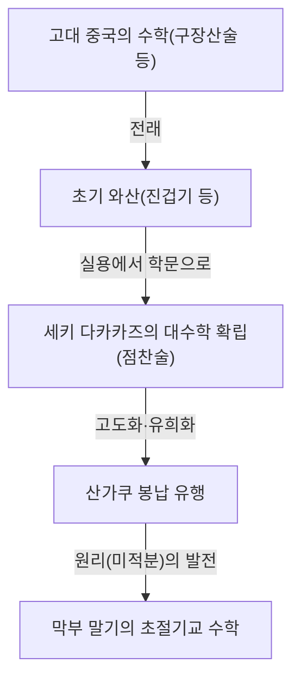
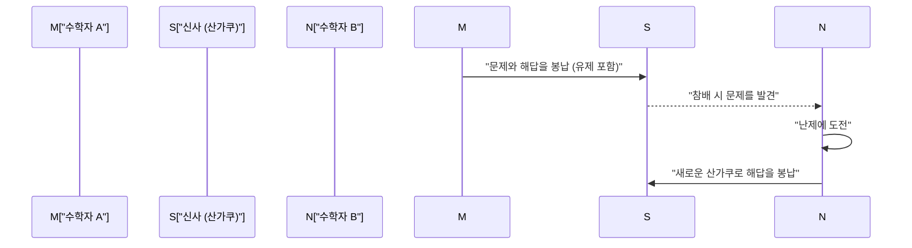

## 1. 와산(Wasan)이란 무엇인가: 쇄국이 낳은 기적의 수학

에도 시대(1603년~1867년), 일본은 '쇄국'이라 불리는 대외 고립 정책을 취하고 있었습니다. 그러나 이 문화적·물리적인 폐쇄 공간 속에서 독자적이고 고도화된 수학 문화가 꽃을 피웠습니다. 그것이 바로 **와산(Wasan)**입니다.

당시 유럽에서는 뉴턴과 라이프니츠가 미적분학을 창시하고 있었지만, 같은 시기 일본에서도 완전히 다른 맥락에서 미적분에 필적하는 개념이 탄생하고 있었습니다. 와산은 실용적인 측량이나 역법(달력) 계산에서 출발하여 점차 순수한 수학적 유희, 혹은 일종의 예술로 승화되었습니다.



### 1.1 진겁기(塵劫記)의 베스트셀러화

와산의 폭발적인 보급에 기폭제가 된 것은 1627년에 출판된 요시다 미쓰요시의 『진겁기(塵劫記)』입니다. 주판의 사용법부터 면적과 부피를 구하는 법, 나아가 쥐 번식 계산(네즈미잔)과 같은 오락적인 문제까지 그림을 곁들여 알기 쉽게 해설되어 있었습니다.

```python
# 네즈미잔(쥐 번식 문제) 시뮬레이션 (Python 구현)
def nezumizan(months):
    # 최초의 한 쌍
    pairs = 1
    for month in range(1, months + 1):
        # 매달 12마리(6쌍)를 낳는다고 가정
        pairs += pairs * 6
    return pairs * 2 # 총 마릿수

print(f"12개월 후 쥐의 수: {nezumizan(12)}마리")
# 출력: 12개월 후 쥐의 수: 27682574402마리
```

이 책은 에도 시대의 높은 식자율과 맞물려 전례 없는 대베스트셀러가 되었으며, 많은 일본인이 수학의 매력에 빠져들게 되었습니다.

## 2. 천재 세키 다카카즈와 '점찬술(点竄術)'

17세기 후반, 와산을 세계 최고 수준으로 끌어올린 인물이 바로 **세키 다카카즈(Seki Takakazu)**입니다. 그는 '산성(算聖)'으로 칭송받으며, 일본의 뉴턴이라고도 불립니다.

세키 다카카즈의 가장 큰 공적은 미지수를 기호로 나타내어 방정식을 세우는 '점찬술'을 고안한 것입니다. 이를 통해 중국에서 전래된 산목(算木, 산가지)이라는 물리적 계산 도구의 한계를 뛰어넘어, 종이 위에서 복잡한 대수 계산을 수행할 수 있게 되었습니다.

### 행렬식의 발견
세키 다카카즈는 유럽의 라이프니츠보다 10년 앞서 연립일차방정식의 해법으로 '행렬식(Determinant)'의 개념을 발견했습니다. 그의 저서 『해복제지법』에는 현대의 행렬식 전개와 본질적으로 동일한 계산 기법이 기록되어 있습니다.

$$ \Delta = a_{11}a_{22} - a_{12}a_{21} $$

## 3. 신사와 사찰에 걸린 수학 에마: '산가쿠(Sangaku)'

와산을 이야기할 때 빼놓을 수 없는 것이 바로 **산가쿠(Sangaku)** 문화입니다. 산가쿠란 수학 문제와 그 풀이를 아름다운 도형과 함께 나무 판에 그려 신사나 사찰에 봉납했던 에마(絵馬)의 일종입니다.

### 3.1 신을 향한 감사와 수학자들의 도전장

왜 수학 문제를 신사와 사찰에 봉납했을까요?
1. **감사의 표현**: "난제를 풀 수 있었던 것은 신불의 가호 덕분"이라는 감사.
2. **자기과시와 소통**: 자신의 학문적 기량을 세상에 알리는 동시에, "이 문제를 풀 수 있는가?"라며 다른 수학자들에게 던지는 도전장(유제)으로서의 역할.

마을 농민부터 무사, 상인, 심지어 여성과 어린이에 이르기까지 신분을 가리지 않고 많은 사람들이 산가쿠 제작에 참여했습니다. 이는 세계적으로도 유례를 찾아보기 힘든 대중 참여형 수학 문화였습니다.



### 3.2 산가쿠의 전형적인 문제 (원리)

산가쿠 문제의 대부분은 기하학에 관한 것이었습니다. 특히 원 안에 여러 개의 원이나 다각형이 접해 있는 도형 문제가 큰 인기를 끌었습니다.

**【대표적인 문제 예시】**
"외원 안에 서로 접하는 3개의 동일한 원(갑원)과, 그 원들에 접하는 작은 원(을원)이 있다. 갑원의 지름이 주어졌을 때 을원의 지름을 구하라."

이러한 복잡한 도형 문제를 풀기 위해 와산가들은 현대의 적분법에 해당하는 극한 계산 기법인 '**원리(円理)**'를 발전시켰습니다. 그들은 원주율 $\pi$의 값을 소수점 이하 수십 자리까지 정확하게 계산해 냈고, 복잡한 곡선의 길이나 입체 도형의 부피를 구해냈습니다.

## 4. 와산의 종언과 근대 수학으로의 연결

메이지 시대(1868년~)에 들어서자 일본은 급속한 근대화(서구화)를 추진했습니다. 메이지 정부는 교육 제도 개혁 과정에서 실용성이 떨어지고 독자적인 기호 체계를 가진 와산을 폐지하고 서양 수학을 공식 학문으로 채택하기로 결정했습니다.

이로 인해 와산은 급격히 쇠퇴했지만, 와산을 통해 길러진 '고도의 수학적 사고력'과 '퍼즐을 즐기듯 탐구하던 지적 호기심'은 메이지 이후 일본인들이 서양의 근대 과학과 수학을 놀라운 속도로 흡수하는 원동력이 되었습니다.

## 5. 현대에 살아 숨 쉬는 와산의 정신

현재에도 일본 전역의 신사와 사찰에는 약 900점의 산가쿠가 현존하고 있으며, 지역의 문화재로서 소중히 보존되고 있습니다. 또한 현대의 수학교육에서도 논리적 사고력과 탐구심을 기르는 교재로서 산가쿠의 퍼즐 같은 문제들이 재조명받고 있습니다.

에도 시대의 천재들이 나무 판에 새겨 넣은 수학의 수수께끼는 시대를 초월하여 현대의 우리에게도 수학의 아름다움과 문제를 푸는 즐거움을 전해주고 있습니다.
