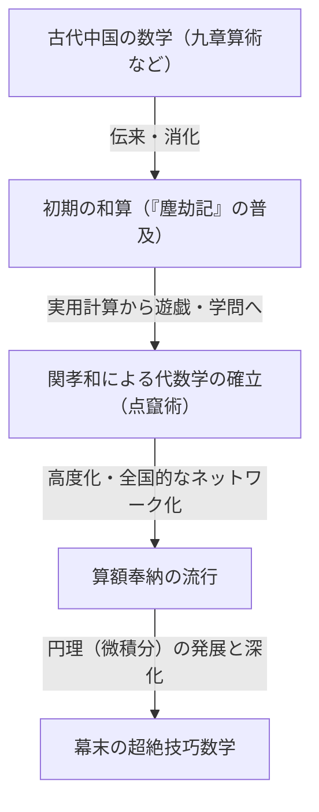
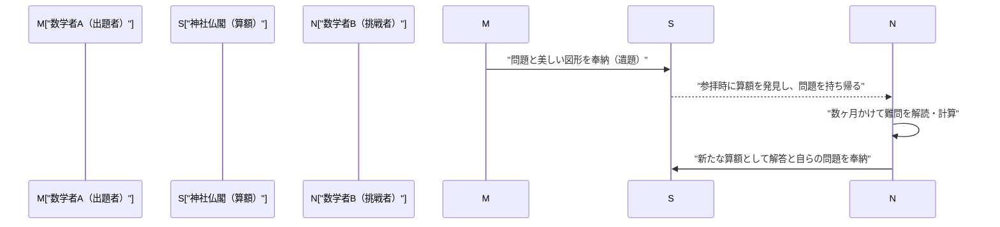

## 1. はじめに：鎖国下の日本で起きた「数学の奇跡」

17世紀から19世紀半ばにかけて、日本は「鎖国」と呼ばれる厳格な対外孤立政策をとっていました。西洋の科学や文化との交流が極端に制限されていたこの時代、日本国内では世界でも類を見ない特異な現象が起きていました。それは、日本独自の高度な数学文化**「和算（Wasan）」**の開花です。

同時期のヨーロッパでは、アイザック・ニュートンやゴットフリート・ライプニッツらによって微積分学が創始され、近代数学が急速に発展していました。驚くべきことに、極東の島国である日本でも、それらとは全く独立した形で、微積分に匹敵する高度な数学的概念が誕生していたのです。

本記事では、実用的な測量や計算から始まり、やがて純粋な知的な遊戯、そして一種の芸術へと昇華していった和算の歴史と、その発展を牽引した天才数学者たち、そして世界に類を見ない「算額」というユニークな文化について詳しく紐解いていきます。

## 2. 和算の夜明け：ベストセラー『塵劫記』が火をつけた数学ブーム

日本の数学文化が爆発的に普及する決定的な契機となったのが、江戸時代初期の1627年に出版された吉田光由（よしだ みつよし）の著書『塵劫記（じんこうき）』です。

それまでの日本の算術は、主に中国から伝来した難解な知識であり、一部の知識人や役人のみが扱うものでした。しかし『塵劫記』は、日常の商取引で使うそろばんの計算方法から、田畑の面積や米俵の体積の求め方、さらには「ネズミ算」や「継子立て（ままこだて）」のようなパズル・娯楽的な問題まで、豊富な挿絵とともに極めて分かりやすく解説していました。

折しも江戸時代は、寺子屋の普及によって庶民の識字率が世界的に見ても驚異的な高さに達していた時期でした。『塵劫記』は空前の大ベストセラーとなり、幾度となく海賊版や改訂版が出版されました。この本を通じて、武士だけでなく、商人や農民までもが「数学の面白さ」に目覚めていったのです。

## 3. 日本のニュートン、「算聖」関孝和の登場

17世紀後半、娯楽や実用の域を出なかった和算を、世界トップレベルの高度な抽象数学へと引き上げた不世出の天才が登場します。それが**関孝和（せき たかかず）**です。彼は後に「算聖（数学の聖人）」と称され、日本の数学史において最も重要な人物となりました。

### 3.1 点竄術（てんざんじゅつ）：代数学の確立
関孝和の最大の功績の一つは、「点竄術」と呼ばれる独自の筆算代数式を考案したことです。それ以前は「算木（さんぎ）」と呼ばれる木の棒を盤の上に並べて計算する物理的な手法が主流でしたが、これでは複雑な多変数の方程式を解くことが困難でした。関孝和は未知数を漢字で表し、紙の上で数式を操作して方程式を立てる手法（文字式）を確立しました。これにより、日本の数学は物理的な制約から解放され、飛躍的な進化を遂げます。

### 3.2 行列式とベルヌーイ数の発見
関孝和の天才性を示すエピソードとして、ヨーロッパの数学者との同時発見が挙げられます。彼は著書『解伏題之法』（1683年）の中で、連立一次方程式の解を求めるための「行列式（Determinant）」の概念を提示しました。これは、ヨーロッパでライプニッツが同様の概念を提唱するよりも約10年早い出来事でした。

また、べき乗和の公式に現れる「ベルヌーイ数」についても、スイスのヤコブ・ベルヌーイによる発表（1713年）と同時代に、関孝和の遺稿である『括要算法』（1712年）に明確に記されています。

## 4. 極限への挑戦：「円理」と建部賢弘

関孝和の死後、その高弟である**建部賢弘（たけべ かたひろ）**らが和算をさらに発展させました。彼らが挑んだ最大の難問が「円」に関する計算でした。

和算家たちは、現代の微分積分学に相当する**「円理（えんり）」**という手法を編み出しました。建部賢弘は、円弧の長さや弓形の面積を求めるために、無限級数展開（テイラー展開に相当）を用いる手法を考案しました。彼は気の遠くなるような手計算によって、円周率 $\pi$ の値を小数点以下41桁まで正確に算出したと言われています。

$$ \pi \approx 3.14159265358979323846264338327950288419716\dots $$

これらは実用的な目的を超越し、「真理を探求する」という純粋な数学的探究心から生まれた成果でした。

## 5. 世界に類を見ない数学文化「算額（Sangaku）」

和算が一部のエリート層だけでなく、広く大衆に愛された文化であることを最も象徴しているのが**「算額（Sangaku）」**です。

算額とは、自分が解いた数学の問題や、その美しい図形、解法などを木の板に描き、神社や寺院に奉納した絵馬の一種です。この風習は17世紀中頃から始まり、江戸時代を通じて日本全国で大流行しました。

### 5.1 なぜ神社仏閣に数学を奉納したのか？

算額奉納には、主に3つの意味がありました。
1. **神仏への感謝**: 「この難問が解けたのは、神仏の御加護のおかげである」という純粋な感謝の表現。
2. **自己顕示と発表の場**: 自分の数学的才能を世間に披露するための、現代の学術論文やポスター発表のような役割。
3. **他者への挑戦状**: 算額にはしばしば「解答を記さず、問題だけを提示する（遺題）」という形式がとられました。これは「この問題が解ける者がいるなら、解いてみよ」という挑戦状であり、これを見た別の数学者が解答を新たな算額として奉納するという、知的なコミュニケーションが成立していました。

### 5.2 身分を超えた知のネットワーク

最も驚くべきは、算額の奉納者が高名な学者や武士に限られなかったことです。現存する算額には、商人、村の農民、さらには女性や10代の子供の名前も記されています。全国各地を巡る数学の遊歴家（数学を教えながら旅をする人々）の存在もあり、日本列島全体が巨大な「オンラインの数学コミュニティ」のように機能していました。身分制度が厳しかった江戸時代において、数学の世界だけは完全な実力主義であり、身分を超えた平等な交流が行われていたのです。

## 6. 和算の終焉と、近代化への静かなる貢献

1868年の明治維新を経て、日本は急速な西洋化と近代化への道を歩み始めました。富国強兵と産業育成を目指す明治政府にとって、高度にパズル化・遊戯化し、独自の漢文的記号体系を持つ和算は、西洋の科学技術を導入するための障壁と見なされました。

その結果、1872年（明治5年）の学制発布により、学校教育では西洋数学のみを教えることが決定され、数百年続いた和算の伝統は急速に衰退していくことになります。

しかし、和算は決して無駄に消え去ったわけではありません。江戸時代の間に、全国津々浦々の庶民に至るまで「論理的に思考する力」「抽象的な概念を扱う能力」、そして何より「学ぶこと自体を楽しむ知的好奇心」が深く根付いていました。明治以降、日本が驚異的なスピードで西洋の高等数学や近代科学を吸収し、世界のトップレベルに追いつくことができたのは、間違いなくこの「和算の土壌」があったからこそです。

## 7. おわりに：現代に生き続ける数学のロマン

今日でも、日本各地の神社仏閣には約900面の算額が現存しており、地域の重要な文化財として大切に保存・研究されています。また近年では、現代の数学教育の現場において、暗記型の学習ではなく「自ら問題を発見し、探求する楽しさ」を教えるための優れた教材として、算額の図形問題が再び注目を集めています。

江戸時代の人々が木の板に刻み込んだ数学への情熱は、時を超えて現代の私たちにも、知的探求のロマンと解く喜びを静かに語りかけてくれています。
