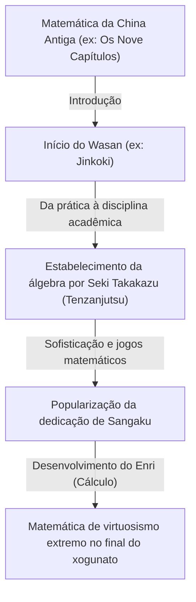
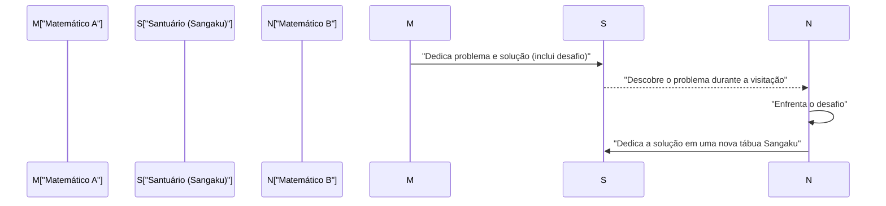

## 1. O que é o Wasan: O milagre matemático nascido do isolamento (Sakoku)

Durante o período Edo (1603–1867), o Japão adotou uma política de isolamento em relação ao exterior conhecida como *Sakoku*. No entanto, dentro desse espaço cultural e físico fechado, floresceu uma cultura matemática singular e altamente sofisticada. Essa tradição é chamada de **Wasan (和算)**.

Na Europa da mesma época, Isaac Newton e Gottfried Wilhelm Leibniz fundavam o cálculo diferencial e integral. Simultaneamente, no Japão, conceitos comparáveis ao cálculo emergiam em um contexto completamente independente. O Wasan teve início com aplicações práticas, como medições topográficas e cálculos de calendários, transformando-se gradualmente em um jogo puramente matemático e até mesmo em uma forma de arte refinada.



### 1.1 O sucesso de vendas do Jinkoki

O catalisador para a disseminação explosiva do Wasan foi o livro *Jinkoki* (塵劫記), publicado em 1627 por Yoshida Mitsuyoshi. A obra explicava de maneira acessível e ricamente ilustrada desde o uso do ábaco (*soroban*) até fórmulas para calcular áreas e volumes, além de problemas recreativos engenhosos, como a reprodução geométrica dos ratos (*nezumizan*).

```python
# Simulação do cálculo de ratos (implementação em Python)
def nezumizan(months):
    # Casal inicial
    pairs = 1
    for month in range(1, months + 1):
        # Supondo que geram 12 filhotes (6 casais) a cada mês
        pairs += pairs * 6
    return pairs * 2 # Número total de ratos

print(f"Número de ratos após 12 meses: {nezumizan(12)}")
# Saída: Número de ratos após 12 meses: 27682574402
```

Combinado à alta taxa de alfabetização da sociedade do período Edo, o livro tornou-se um best-seller sem precedentes, encantando multidões de japoneses com o fascínio da matemática.

## 2. O gênio Seki Takakazu e a técnica "Tenzanjutsu"

Na segunda metade do século XVII, a figura responsável por elevar o Wasan ao nível dos mais avançados centros matemáticos do mundo foi **Seki Takakazu** (também conhecido como Seki Kowa). Reverenciado como o "Santo da Aritmética" (*Sansei*), ele é frequentemente chamado de "o Newton do Japão".

A maior contribuição de Seki foi a criação do *Tenzanjutsu* (点竄術), um sistema de notação algébrica que utilizava símbolos para representar incógnitas e formular equações polinomiais. Com isso, ele superou as limitações físicas das varetas de contagem tradicionais (*sangi*), originárias da China, permitindo a resolução de cálculos algébricos complexos diretamente no papel.

### A descoberta do determinante
Mais de uma década antes de Leibniz na Europa, Seki Takakazu já havia formulado o conceito de **determinante** como método para resolver sistemas lineares simultâneos. Em sua obra *Kai-Fukudai no Ho* (解伏題之法), ele descreveu métodos de expansão de determinantes que correspondem exatamente aos fundamentos teóricos aplicados hoje.

$$ \Delta = a_{11}a_{22} - a_{12}a_{21} $$

## 3. As tábuas matemáticas votivas dedicadas a santuários e templos: "Sangaku"

Um dos aspectos mais fascinantes e singulares do Wasan é a cultura do **Sangaku (算額)**. Os Sangaku eram tábuas de madeira votivas (*ema*) onde problemas matemáticos e suas soluções geométricas eram pintados com ilustrações detalhadas e cores vivas, sendo então dedicados a santuários xintoístas e templos budistas.

### 3.1 Gratidão aos deuses e desafios intelectuais abertos

Por que consagrar a matemática em locais sagrados?
1. **Expressão de gratidão**: Um ato de devoção para agradecer aos deuses e budas pela iluminação intelectual que possibilitou desvendar problemas difíceis.
2. **Reconhecimento e desafio acadêmico**: Uma forma de demonstrar a maestria matemática publicamente e, simultaneamente, lançar desafios abertos (*idai*) com perguntas como: "Você consegue resolver este enigma?".

De camponeses e samurais a comerciantes, mulheres e crianças, pessoas de todas as classes sociais participavam da criação e resolução de Sangaku. Tratava-se de um movimento matemático de participação popular sem precedentes na história mundial.



### 3.2 Problemas típicos dos Sangaku (Enri)

A grande maioria dos problemas apresentados nos Sangaku envolvia geometria euclidiana avançada. Havia uma predileção especial por arranjos em que múltiplos círculos tangentes e polígonos eram inscritos dentro de um círculo maior.

**【Exemplo de problema clássico】**
"Dentro de um círculo externo, encontram-se três círculos idênticos (círculos A) mutuamente tangentes, além de um círculo menor (círculo B) tangente a eles. Dado o diâmetro do círculo A, determine o diâmetro do círculo B."

Para resolver essas configurações geométricas intrincadas, os matemáticos do Wasan desenvolveram o **Enri (円理)**, um método de cálculo de limites análogo à integração moderna. Por meio do Enri, eles calcularam o valor de $\pi$ com precisão de dezenas de casas decimais e determinaram comprimentos de curvas complexas e volumes de sólidos geométricos.

## 4. O fim do Wasan e a transição para a matemática moderna

Com a chegada da Restauração Meiji (a partir de 1868), o Japão iniciou um processo acelerado de modernização e ocidentalização. No âmbito das reformas do sistema educacional, o governo Meiji decidiu descontinuar o ensino do Wasan — considerando sua notação isolada e menos prática para a tecnologia industrial — e adotar oficialmente a matemática ocidental como currículo padrão.

Embora o Wasan tenha entrado em rápido declínio, o pensamento matemático rigoroso e a curiosidade intelectual cultivados por essa tradição serviram como base essencial. Essa herança permitiu que os estudiosos japoneses absorvessem as ciências exatas e a tecnologia moderna do Ocidente com uma velocidade surpreendente.

## 5. O espírito do Wasan no mundo contemporâneo

Hoje em dia, cerca de 900 tábuas de Sangaku ainda sobrevivem em templos e santuários por todo o Japão, sendo preservadas com apreço como patrimônio histórico e cultural. Além disso, na educação matemática contemporânea, os problemas lúdicos dos Sangaku têm sido resgatados como excelentes recursos didáticos para estimular o raciocínio lógico e o entusiasmo pela descoberta.

Os enigmas matemáticos gravados em madeira pelos gênios do período Edo atravessaram séculos e continuam, até hoje, a nos transmitir a elegância sublime da matemática e o prazer inigualável de solucionar um mistério.
