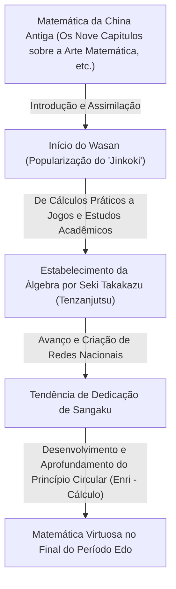
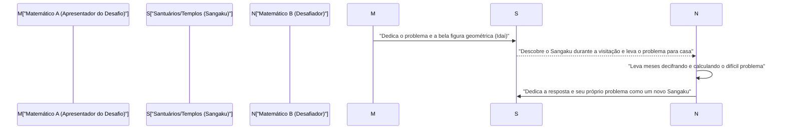

## 1. Introdução: O "Milagre Matemático" Ocorrido no Japão Durante o Isolamento Nacional

Do século XVII até meados do século XIX, o Japão adotou uma rigorosa política de isolamento externo chamada "Sakoku". Nesta época, quando o intercâmbio com a ciência e a cultura ocidentais era extremamente limitado, um fenômeno singular ocorria dentro do Japão, sem paralelo no mundo. Foi o florescimento da cultura matemática altamente desenvolvida e única do Japão, o **"Wasan"**.

Na mesma época na Europa, o cálculo diferencial e integral foi fundado por [Isaac Newton](/pt/p/newton/), [Gottfried Leibniz](/pt/p/leibniz/) e outros, e a matemática moderna se desenvolvia rapidamente. Surpreendentemente, no Japão, uma nação insular no Extremo Oriente, conceitos matemáticos avançados comparáveis ao cálculo nasceram de forma totalmente independente deles.

Neste artigo, desvendaremos detalhadamente a história do Wasan, que começou a partir de levantamentos topográficos e cálculos práticos, para depois se sublimar em pura brincadeira intelectual, e até em uma espécie de arte, os gênios matemáticos que impulsionaram seu desenvolvimento e a cultura única do "Sangaku", sem precedentes no mundo.

## 2. O Alvorecer do Wasan: O Bestseller "Jinkoki" e o Boom da Matemática

O momento decisivo que popularizou explosivamente a cultura matemática do Japão foi o livro "Jinkoki", de Yoshida Mitsuyoshi, publicado em 1627, no início do período Edo.

Até então, a aritmética japonesa consistia principalmente de conhecimentos complexos trazidos da China, manipulados apenas por alguns intelectuais e oficiais. No entanto, o "Jinkoki" explicava com extrema clareza e ricas ilustrações desde o uso do ábaco em transações comerciais diárias, até métodos para calcular a área de campos e o volume de sacas de arroz, além de problemas recreativos e quebra-cabeças como o "Nezumizan" (cálculo de camundongos) e o "Mamakodate".

Naquela época do período Edo, a taxa de alfabetização da população comum havia alcançado níveis surpreendentemente altos globalmente devido à popularização dos Terakoya (escolas para plebeus). O "Jinkoki" se tornou um sucesso sem precedentes, e edições piratas e revisadas foram publicadas várias vezes. Através deste livro, não apenas os samurais, mas também os comerciantes e agricultores despertaram para a "diversão da matemática".

## 3. O Newton do Japão: O Aparecimento do "Santo da Matemática" Seki Takakazu

No final do século XVII, surge um gênio incomparável que elevou o Wasan, até então confinado a entretenimento e uso prático, para uma matemática abstrata de nível mundial. Trata-se de **Seki Takakazu**. Mais tarde chamado de "Sansei (Santo da Matemática)", ele se tornou a figura mais importante da história da matemática japonesa.

### 3.1 Tenzanjutsu: O Estabelecimento da Álgebra
Uma das maiores conquistas de Seki Takakazu foi a invenção de uma fórmula algébrica escrita única chamada "Tenzanjutsu". Antes disso, o método físico de colocar bastões de madeira chamados "Sangi" em um tabuleiro para calcular era a norma, o que dificultava a resolução de equações complexas com múltiplas variáveis. Seki Takakazu estabeleceu um método de representar incógnitas com caracteres kanji e manipular fórmulas no papel para formular equações (fórmulas com letras). Isso libertou a matemática japonesa das restrições físicas e a fez evoluir drasticamente.

### 3.2 A Descoberta de Determinantes e dos Números de Bernoulli
Um episódio que demonstra a genialidade de Seki Takakazu é a descoberta simultânea à de matemáticos europeus. Em seu livro "Kaifukudai no Ho" (1683), ele apresentou o conceito de "Determinantes" para encontrar soluções de sistemas de equações lineares. Isso ocorreu cerca de 10 anos antes de Leibniz propor um conceito semelhante na Europa.

Além disso, os "Números de Bernoulli", que aparecem na fórmula da soma das potências, estão claramente descritos nos manuscritos póstumos de Seki Takakazu, "Katsuyo Sanpo" (1712), na mesma época da publicação do suíço Jacob Bernoulli (1713).

## 4. O Desafio ao Limite: "Enri" (Princípio Circular) e Takebe Katahiro

Após a morte de Seki Takakazu, seu discípulo principal, **Takebe Katahiro**, e outros desenvolveram ainda mais o Wasan. O maior problema que eles desafiaram foram os cálculos relacionados aos "Círculos".

Os matemáticos de Wasan criaram o método chamado **"Enri"**, que corresponde ao cálculo diferencial e integral moderno. Takebe Katahiro criou um método usando expansão em série infinita (equivalente à Série de Taylor) para encontrar o comprimento do arco e a área de um segmento circular. Diz-se que ele calculou o valor de Pi $\pi$ com precisão até a 41ª casa decimal através de cálculos manuais incrivelmente demorados.

$$ \pi \approx 3.14159265358979323846264338327950288419716\dots $$

Esses resultados transcenderam os propósitos práticos e nasceram do puro desejo matemático de "buscar a verdade".

## 5. A Cultura Matemática Sem Precedentes "Sangaku"

O que mais simboliza o Wasan como uma cultura amada não apenas por uma elite, mas pelo público em geral, é o **"Sangaku"**.

Sangaku é um tipo de tabuleta votiva de madeira onde a pessoa pintava o problema matemático que havia resolvido, suas belas formas geométricas e o método de resolução, e a dedicava a santuários e templos. Esse costume começou em meados do século XVII e foi extremamente popular em todo o Japão ao longo do período Edo.

### 5.1 Por que deduzir matemática para santuários e templos?

A dedicação do Sangaku tinha principalmente três significados:
1. **Agradecimento aos deuses e budas**: Uma expressão pura de gratidão que dizia: "Consegui resolver esse problema difícil graças à proteção dos deuses e budas".
2. **Exibição pessoal e local de apresentação**: Servia a um papel semelhante ao de trabalhos acadêmicos ou apresentações de pôsteres modernos para mostrar ao mundo seus talentos matemáticos.
3. **Um desafio a outros**: Os Sangaku muitas vezes tomavam a forma de um "Idai", isto é, "apresentar apenas o problema sem registrar a solução". Isso era um desafio que dizia: "Se houver alguém que consiga resolver este problema, tente resolvê-lo". Outro matemático que o via resolveria o problema e dedicaria um novo Sangaku com a resposta, estabelecendo uma comunicação intelectual.

### 5.2 Uma Rede de Conhecimento que Transcendeu as Classes Sociais

O mais surpreendente é que os dedicantes do Sangaku não se limitavam a acadêmicos famosos e samurais. Nos Sangaku existentes, estão registrados os nomes de comerciantes, agricultores das aldeias, e até mesmo de mulheres e adolescentes. Havia também os viajantes matemáticos (pessoas que viajavam ensinando matemática) percorrendo todo o país, de modo que todo o arquipélago japonês funcionava como uma gigantesca "comunidade online de matemática". No período Edo, onde o sistema de classes era rigoroso, o mundo da matemática era a única meritocracia perfeita, com interação igualitária além do status social.

## 6. O Fim do Wasan e a Contribuição Silenciosa para a Modernização

Após a Restauração Meiji em 1868, o Japão embarcou em um rápido caminho de ocidentalização e modernização. Para o governo Meiji, que visava enriquecer o país e fortalecer as Forças Armadas através do desenvolvimento industrial, o Wasan, que havia se tornado um jogo/puzzle altamente complexo e tinha seu próprio sistema de símbolos baseado no chinês clássico (Kanbun), era visto como um obstáculo à introdução da ciência e tecnologia ocidentais.

Como resultado, a promulgação do Sistema Educacional em 1872 determinou que apenas a matemática ocidental seria ensinada na educação escolar, e a tradição de centenas de anos do Wasan entraria em rápido declínio.

No entanto, o Wasan nunca desapareceu em vão. Durante o período Edo, "a capacidade de pensar logicamente", "a capacidade de lidar com conceitos abstratos" e, acima de tudo, "a curiosidade intelectual para aproveitar o aprendizado em si" arraigaram-se profundamente até nos plebeus de todo o país. O fato de o Japão pós-Meiji ter conseguido absorver matemática avançada e ciência moderna ocidental em uma velocidade espantosa para se igualar ao nível mundial deve-se sem dúvida a este "solo do Wasan".

## 7. Conclusão: O Romance da Matemática que Continua Vivo Hoje

Ainda hoje, cerca de 900 tabuletas de Sangaku sobrevivem em santuários e templos por todo o Japão, sendo cuidadosamente preservadas e estudadas como importantes bens culturais locais. Além disso, nos últimos anos, no campo da educação matemática moderna, os problemas geométricos dos Sangaku voltaram a chamar a atenção como excelentes materiais didáticos para ensinar a "alegria de descobrir e explorar problemas por si mesmo", em vez de uma aprendizagem focada na memorização.

A paixão pela matemática que as pessoas do período Edo gravaram em tábuas de madeira, ultrapassou o tempo e fala silenciosamente conosco, transmitindo o romance da exploração intelectual e a alegria de resolver problemas.
