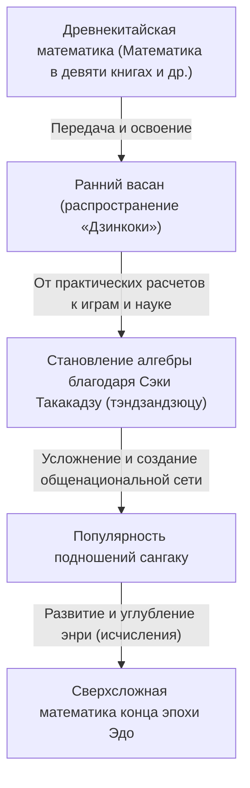
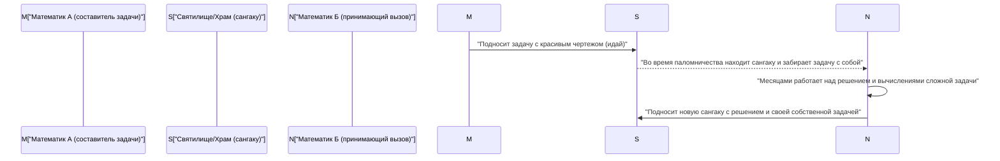

## 1. Введение: «Математическое чудо», произошедшее в изолированной Японии

С 17-го до середины 19-го века Япония придерживалась строгой политики изоляции, известной как «сакоку». В эту эпоху, когда контакты с западной наукой и культурой были крайне ограничены, в Японии происходил уникальный феномен, не имеющий аналогов в мире. Это был расцвет **«васан» (Wasan)** — уникальной, высокоразвитой японской математической культуры.

В то же время в Европе благодаря Исааку Ньютону и Готфриду Лейбницу зарождалось дифференциальное и интегральное исчисление, и современная математика стремительно развивалась. Удивительно, но в далекой островной Японии, совершенно независимо от этого, рождались сложные математические концепции, сопоставимые с исчислением.

В этой статье мы подробно рассмотрим историю васан, начавшуюся с практических вычислений и измерений, а затем превратившуюся в чистую интеллектуальную игру и своеобразное искусство. Мы узнаем о гениальных математиках, стоявших за её развитием, а также об уникальной в мировой практике культуре «сангаку».

## 2. Рассвет васан: бестселлер «Дзинкоки», разжегший математический бум

Решающим моментом, спровоцировавшим взрывное распространение математической культуры в Японии, стала публикация в 1627 году (в начале эпохи Эдо) книги Ёсиды Мицуёси под названием «Дзинкоки» (Jinkoki).

До этого математика в Японии состояла в основном из сложных знаний, пришедших из Китая, и была доступна лишь узкому кругу интеллектуалов и чиновников. Однако в «Дзинкоки» с использованием множества иллюстраций и предельно понятно объяснялись самые разные темы: от способов счета на соробане для повседневных коммерческих сделок до расчетов площади полей и объема рисовых тюков, а также головоломки и занимательные задачи, такие как «размножение мышей» и «задача об отчиме» (мамакодатэ).

К тому же, в эпоху Эдо благодаря распространению храмовых школ тэракоя уровень грамотности простых людей достиг поразительно высоких по мировым меркам значений. «Дзинкоки» стала невероятным бестселлером, неоднократно переиздавалась и выпускалась в пиратских копиях. Благодаря этой книге не только самураи, но и торговцы, и крестьяне открыли для себя «увлекательность математики».

## 3. Японский Ньютон, появление «математического святого» Сэки Такакадзу

Во второй половине 17 века появился непревзойденный гений, поднявший васан от уровня развлечений и практики до передовой, высокоабстрактной математики мирового класса. Это был **Сэки Такакадзу** (Seki Takakazu). Позже его назовут «сансэй» (святой математики), и он стал самой важной фигурой в истории японской математики.

### 3.1 Тэндзандзюцу: становление алгебры
Одним из величайших достижений Сэки Такакадзу стало создание оригинальной системы письменных алгебраических выражений под названием «тэндзандзюцу». До этого в основном использовался физический метод вычислений с помощью деревянных палочек («санги»), которые раскладывались на доске, что сильно затрудняло решение сложных уравнений с несколькими переменными. Сэки Такакадзу стал использовать китайские иероглифы для обозначения неизвестных и разработал метод (символьную алгебру) составления и решения уравнений на бумаге. Благодаря этому японская математика освободилась от физических ограничений и совершила резкий скачок в развитии.

### 3.2 Открытие определителей и чисел Бернулли
О гениальности Сэки Такакадзу свидетельствуют его одновременные с европейскими математиками открытия. В своей книге «Кайфукудай но хо» (Метод решения скрытых задач, 1683 г.) он представил концепцию «определителя» (детерминанта) для нахождения решений систем линейных уравнений. Это произошло примерно на 10 лет раньше, чем подобную концепцию предложил Лейбниц в Европе.

Кроме того, «числа Бернулли», появляющиеся в формулах суммы степеней, ясно описаны в посмертной рукописи Сэки Такакадзу «Кацуё сампо» (1712 г.) в ту же эпоху, когда о них объявил швейцарский математик Якоб Бернулли (1713 г.).

## 4. Вызов пределу: «Энри» и Такэбэ Катахиро

После смерти Сэки Такакадзу его выдающийся ученик **Такэбэ Катахиро** (Takebe Katahiro) и другие продолжили развивать васан. Самой сложной задачей, за которую они взялись, были расчеты, связанные с «кругом».

Математики васан разработали метод **«энри»** (принцип круга), эквивалентный современному дифференциальному и интегральному исчислению. Для нахождения длины дуги окружности и площади сегмента Такэбэ Катахиро разработал метод с использованием разложения в бесконечные ряды (аналог ряда Тейлора). Говорят, что путем невообразимо кропотливых ручных вычислений он точно рассчитал значение числа $\pi$ до 41 знака после запятой.

$$ \pi \approx 3.14159265358979323846264338327950288419716\dots $$

Эти достижения выходили за рамки практических целей и были результатом чистого математического любопытства и «поиска истины».

## 5. Уникальная в мире математическая культура «Сангаку» (Sangaku)

То, что васан был культурой, любимой не только элитой, но и широкими массами, ярче всего символизируют **«сангаку»** (Sangaku).

Сангаку — это разновидность деревянных табличек (эма), на которых записывали решенные математические задачи, их красивые чертежи и методы решения, а затем приносили в дар синтоистским святилищам и буддийским храмам. Этот обычай зародился в середине 17 века и пользовался огромной популярностью по всей Японии на протяжении всей эпохи Эдо.

### 5.1 Зачем приносили математику в дар храмам?

Подношение сангаку имело три основных смысла:
1. **Благодарность богам и буддам**: Чистое выражение благодарности, означающее: «Я смог решить эту сложную задачу благодаря покровительству богов и будд».
2. **Демонстрация себя и место для публикаций**: Роль, подобная современным научным статьям или постерным докладам, чтобы продемонстрировать свои математические таланты обществу.
3. **Вызов другим**: Часто на сангаку использовался формат «идай» (завещанная задача), когда писалось только условие задачи без решения. Это был вызов: «Если есть кто-то, кто может решить эту задачу — попробуй!». Другой математик, увидев это, решал задачу и приносил в дар новую сангаку с решением, таким образом устанавливая интеллектуальную коммуникацию.

### 5.2 Сеть знаний поверх сословных барьеров

Самое удивительное, что подносителями сангаку были не только известные ученые и самураи. На сохранившихся табличках можно встретить имена торговцев, крестьян, а также женщин и подростков. Благодаря существованию путешествующих математиков (людей, которые путешествовали по стране, обучая математике), весь Японский архипелаг функционировал как гигантское «онлайн-сообщество математиков». В эпоху Эдо со строгой сословной системой только в мире математики царила абсолютная меритократия и происходило равноправное общение независимо от социального статуса.

## 6. Конец васан и тихий вклад в модернизацию

После реставрации Мэйдзи 1868 года Япония вступила на путь стремительной вестернизации и модернизации. Для правительства Мэйдзи, стремившегося к обогащению страны, укреплению армии и развитию промышленности, васан с его сильным уклоном в сторону головоломок и игр, а также собственной системой символов на основе камбун (старокитайского), рассматривался как препятствие для внедрения западных науки и технологий.

В результате с принятием системы образования в 1872 году (5-й год Мэйдзи) было решено преподавать в школах только западную математику, и многовековая традиция васан начала стремительно приходить в упадок.

Однако васан не исчез бесследно. За время эпохи Эдо в сознании людей, вплоть до простых обывателей по всей стране, глубоко укоренились «способность мыслить логически», «умение обращаться с абстрактными понятиями» и, прежде всего, «интеллектуальное любопытство и удовольствие от самого процесса обучения». То, что с эпохи Мэйдзи Япония смогла с поразительной скоростью освоить западную высшую математику и современную науку, догнав мировой уровень, несомненно, стало возможным именно благодаря этой «почве васан».

## 7. Заключение: Романтика математики, живущая в наши дни

Даже сегодня в синтоистских святилищах и буддийских храмах по всей Японии сохранилось около 900 сангаку, которые бережно хранятся и изучаются как важные местные культурные ценности. Кроме того, в последние годы в современном математическом образовании геометрические задачи из сангаку вновь привлекают внимание как отличный учебный материал, чтобы научить детей не зубрежке, а «радости самостоятельного обнаружения и исследования задач».

Страсть к математике, которую люди эпохи Эдо вырезали на деревянных досках, спустя века тихо говорит и нам, современным людям, о романтике интеллектуального поиска и радости решения.
