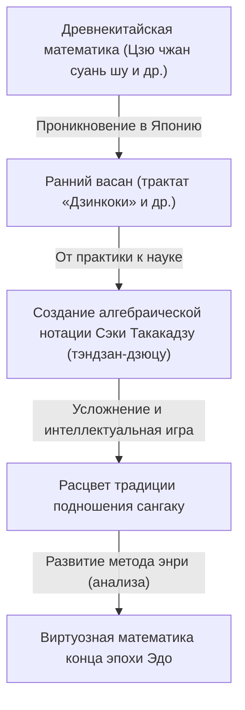
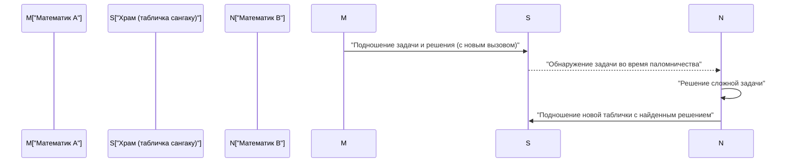

## 1. Что такое васан (Wasan): математическое чудо, рождённое изоляцией

В эпоху Эдо (1603–1867 гг.) Япония проводила политику внешней изоляции, известную как «сакоку». Однако в этом культурно и физически замкнутом пространстве расцвела уникальная высокоразвитая математическая культура. Она получила название **васан (Wasan)**.

В то время как в Европе Ньютон и Лейбниц закладывали основы математического анализа (дифференциального и интегрального исчисления), в Японии совершенно независимо зародились концепции, сопоставимые с исчислением бесконечно малых. Развившись из практических нужд геодезии и составления календарей, васан постепенно трансформировался в чистую интеллектуальную игру и даже в своего рода искусство.



### 1.1 «Дзинкоки» — математический бестселлер

Толчком к взрывному распространению васана послужило издание в 1627 году книги «Дзинкоки» (塵劫記), автором которой был Ёсида Мицуёси (Yoshida Mitsuyoshi). В этом иллюстрированном руководстве простым и доступным языком объяснялись правила работы со счётами соробан, способы вычисления площадей и объёмов, а также приводились развлекательные задачи, такие как «размножение мышей» (нэзумизан).

```python
# Моделирование геометрической прогрессии «нэзумизан» на Python
def nezumizan(months):
    # Исходная пара мышей
    pairs = 1
    for month in range(1, months + 1):
        # Предположим, каждый месяц рождается 12 мышат (6 пар)
        pairs += pairs * 6
    return pairs * 2 # Общее количество особей

print(f"Число мышей через 12 месяцев: {nezumizan(12)}")
# Вывод: Число мышей через 12 месяцев: 27682574402
```

Благодаря высокому уровню грамотности в Японии эпохи Эдо эта книга стала беспрецедентным бестселлером, и множество людей искренне увлеклись красотой и логикой математики.

## 2. Гений Сэки Такакадзу и метод «тэндзан-дзюцу»

Во второй половине XVII века математику васан на мировой уровень вывел **Сэки Такакадзу (Seki Takakazu)**. В Японии его почитают как «святого математики» (сансэй) и часто называют «японским Ньютоном».

Главное достижение Сэки Такакадзу — создание системы **тэндзан-дзюцу (тендзан)**, позволившей обозначать неизвестные величины символами и составлять алгебраические уравнения. Это позволило преодолеть ограничения традиционных счётных палочек санги, пришедших из Китая, и перенести сложнейшие алгебраические вычисления прямо на бумагу.

### Открытие определителей
Сэки Такакадзу сформулировал понятие определителя (детерминанта) для решения систем линейных уравнений на десять лет раньше, чем Лейбниц в Европе. В его труде «Кайфукудай-но хо» (解伏題之法, 1683 г.) описаны методы раскрытия определителей, по существу идентичные современным алгебраическим методам.

$$ \Delta = a_{11}a_{22} - a_{12}a_{21} $$

## 3. Математические таблички в храмах: феномен «сангаку» (Sangaku)

Говоря о васане, невозможно обойти вниманием уникальную традицию **сангаку (Sangaku)**. Сангаку — это разновидность вотивных деревянных табличек (эма), на которых мастера записывали математические задачи, теоремы и изящные геометрические чертежи, принося их в дар синтоистским святилищам и буддийским храмам.

### 3.1 Благодарность богам и вызов коллегам

Почему математические задачи вешали в храмах?
1. **Выражение благодарности**: Считалось, что озарение и решение трудной задачи снизошло благодаря покровительству ками или будд.
2. **Интеллектуальный вызов и коммуникация**: Это был способ продемонстрировать свои математические способности обществу и одновременно бросить вызов другим мыслителям («Сможете ли вы решить эту задачу?») — традиция так называемых «идаи» (нерешённых задач).

В создании сангаку принимали участие представители самых разных сословий: от крестьян и самураев до купцов, женщин и детей. Это сделало васан поистине массовым народным феноменом, не имеющим аналогов в мировой истории математики.



### 3.2 Типичные задачи сангаку и метод «энри»

Большинство задач сангаку относилось к евклидовой и проективной геометрии, особенно к задачам на касание окружностей и многоугольников, вписанных друг в друга.

**Пример классической задачи:**
«Внутри большой внешней окружности расположены три равных соприкасающихся круга (круги А), а между ними — меньший круг (круг Б), касающийся всех трёх. Зная диаметр кругов А, найти диаметр круга Б».

Для решения подобных геометрических задач японские математики разработали метод **энри (円理)** — систему предельных переходов, эквивалентную современному интегральному исчислению. С её помощью они вычисляли число $\pi$ с точностью до десятков знаков после запятой, находили длины сложных дуг и объёмы трёхмерных тел.

## 4. Закат васана и переход к современной математике

С наступлением эпохи Мэйдзи (1868 г.) Япония взяла курс на стремительную модернизацию и вестернизацию. В ходе реформы системы образования правительство Мэйдзи приняло решение отказаться от васана с его узкоспециализированной символикой и полностью перейти на преподавание европейской математики.

Хотя традиционный васан быстро угас, выработанные им культура строгого мышления и страсть к решению головоломок стали мощнейшим фундаментом. Благодаря им японские учёные смогли с поразительной скоростью освоить передовые достижения западной науки и внести выдающийся вклад в мировую математику уже в XX веке.

## 5. Наследие васана в наши дни

До наших дней в святилищах и храмах по всей Японии сохранилось около 900 оригинальных табличек сангаку, признанных ценными объектами культурного наследия. В современном образовании геометрические головоломки сангаку переживают ренессанс: их используют как великолепный материал для развития логического мышления и исследовательского азарта у школьников и студентов.

Загадки, высеченные на дереве мыслителями эпохи Эдо, и сегодня напоминают нам об универсальной красоте математики и чистой радости научного поиска.
