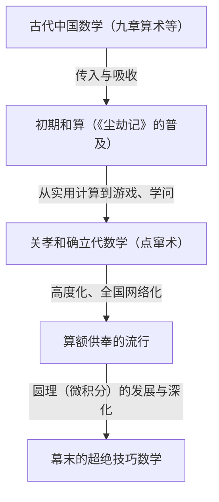
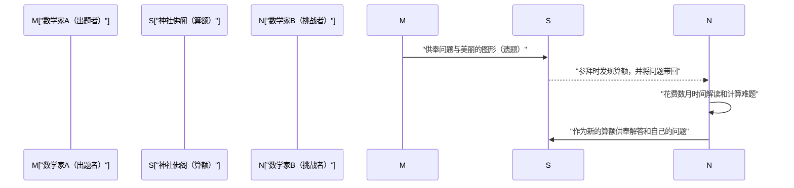

## 1. 引言：锁国日本发生的“数学奇迹”

17世纪至19世纪中叶，日本实行被称为“锁国”的严格对外孤立政策。在这个与西方科学及文化交流受到极大限制的时代，日本国内却发生了世界上独一无二的奇特现象。那就是日本独特的高度数学文化**“和算（Wasan）”**的繁荣。

在同时期的欧洲，[艾萨克·牛顿](/zh-cn/p/newton/)和[戈特弗里德·莱布尼茨](/zh-cn/p/leibniz/)等人创立了微积分学，近代数学迅速发展。令人惊叹的是，在远东的岛国日本，竟然也以完全独立的形式，诞生了足以与微积分相媲美的高度数学概念。

本文将从实用的测量和计算开始，详细解读逐渐升华为纯粹智力游戏乃至一种艺术的和算历史、引领其发展的天才数学家们，以及世界上独一无二的“算额”这一独特文化。

## 2. 和算的黎明：畅销书《尘劫记》点燃的数学热潮

日本数学文化爆炸性普及的决定性契机，是江户时代初期的1627年出版的吉田光由的著作《尘劫记》。

在此之前的日本算术，主要是从中国传来的深奥知识，仅由少数知识分子和官员掌握。然而，《尘劫记》从日常商业交易中使用的算盘计算方法，到田地面积和米袋体积的计算，再到“老鼠繁殖（等比数列）”和“继子立（约瑟夫环问题）”等谜题、娱乐性问题，都配以丰富的插图进行了极其易懂的解说。

恰逢江户时代，随着寺子屋（私塾）的普及，平民的识字率达到了在世界范围内也令人惊叹的高度。《尘劫记》成为了空前的大畅销书，多次出版盗版和修订版。通过这本书，不仅是武士，连商人和农民也开始觉醒于“数学的乐趣”。

## 3. 日本的牛顿，“算圣”关孝和的登场

17世纪后半叶，一位不世出的天才登场，他将原本停留在娱乐和实用领域的和算，提升到了世界顶尖水平的高度抽象数学。他就是**[关孝和](/zh-cn/p/seki-takakazu/)**。他后来被称为“算圣（数学圣人）”，成为了日本数学史上最重要的人物。

### 3.1 点窜术：代数学的确立
关孝和最大的功绩之一，是发明了被称为“点窜术”的独特笔算代数式。在此之前，主流是使用被称为“算木”的木棒在盘上排列计算的物理方法，但这很难解开复杂的多变量方程。关孝和确立了用汉字表示未知数、在纸上操作数学式来建立方程的方法（文字式）。由此，日本的数学摆脱了物理限制，实现了飞跃性的进化。

### 3.2 行列式和伯努利数的发现
能展现关孝和天才性的轶事之一，是他与欧洲数学家的同时期发现。他在著作《解伏题之法》（1683年）中，提出了为了求联立一次方程的解的“行列式（Determinant）”概念。这比欧洲的莱布尼茨提出类似概念早了约10年。

此外，关于出现在幂和公式中的“伯努利数”，在瑞士的雅各布·伯努利发表（1713年）的同一时代，[关孝和](/zh-cn/p/seki-takakazu/)的遗稿《括要算法》（1712年）中也有明确记载。

## 4. 挑战极限：“圆理”与建部贤弘

[关孝和](/zh-cn/p/seki-takakazu/)死后，他的高徒**建部贤弘**等人进一步发展了和算。他们挑战的最大难题是关于“圆”的计算。

和算家们编创出了相当于现代微积分学的**“圆理”**手法。为了求圆弧的长度和弓形的面积，建部贤弘发明了使用无限级数展开（相当于泰勒展开）的方法。据说他通过令人头晕目眩的手工计算，将圆周率 $\pi$ 的值准确计算到了小数点后41位。

$$ \pi \approx 3.14159265358979323846264338327950288419716\dots $$

这些超越了实用目的，是出于“探求真理”这一纯粹的数学探究心而诞生的成果。

## 5. 世界上独一无二的数学文化“算额（Sangaku）”

最能象征和算是一门不仅受到部分精英阶层，也受到广大群众喜爱的文化，就是**“算额（Sangaku）”**。

算额，是指将自己解开的数学问题、其美丽的图形、解法等画在木板上，供奉给神社或寺院的一种绘马。这种风俗始于17世纪中叶，在整个江户时代风靡全日本。

### 5.1 为什么要在神社佛阁供奉数学？

供奉算额主要有3个意义。
1. **感谢神佛**: 一种纯粹的感谢表达，“能解开这道难题，全靠神佛保佑”。
2. **自我展示与发表的场所**: 相当于现代学术论文或海报发表的作用，向世人展示自己的数学才能。
3. **向他人下战书**: 算额经常采用“不写解答，只提出问题（遗题）”的形式。这是在下战书：“如果有人能解开这道题，就试着解解看吧”，看到这个问题的其他数学家会把解答作为新的算额供奉，从而建立起了一种智力上的交流。

### 5.2 跨越身份的知识网络

最令人惊讶的是，算额的供奉者并不局限于著名的学者或武士。现存的算额中，还记载着商人、村里的农民，甚至是女性和十多岁孩子的名字。由于还有游历全国的数学漫游者（边教数学边旅行的人）的存在，整个日本列岛就像一个巨大的“在线数学社区”一样运作。在身份等级森严的江户时代，只有数学世界是完全的实力主义，进行着跨越身份的平等交流。

## 6. 和算的终结与对近代化的默默贡献

经历了1868年的明治维新，日本开始迅速走上西化和近代化的道路。对于旨在富国强兵和培育产业的明治政府来说，高度解谜化、游戏化，并拥有独特汉文符号体系的和算，被视为引进西方科学技术的障碍。

结果，随着1872年（明治5年）《学制》的颁布，决定在学校教育中只教授西方数学，延续了数百年的和算传统迅速衰退。

然而，和算绝不是白白消失了。在江户时代，甚至普及到全国各地平民百姓的“逻辑思考能力”、“处理抽象概念的能力”，以及最重要的是“享受学习本身乐趣的知识好奇心”已经深深扎根。明治以后，日本能够以惊人的速度吸收西方的等数学和近代科学，赶上世界顶尖水平，毫无疑问正是因为有了这片“和算的土壤”。

## 7. 结语：在现代继续存活的数学浪漫

时至今日，日本各地的神社佛阁中仍保存着约900块算额，作为地区重要的文化财产受到珍视、保存和研究。此外，近年来在现代数学教育的现场，为了教授不是死记硬背的学习，而是“自己发现问题并探求的乐趣”，算额的图形问题再次作为优秀的教材受到瞩目。

江户时代的人们刻在木板上的对数学的热情，跨越时空，正在向现代的我们静静地诉说着知性探求的浪漫和解题的喜悦。
