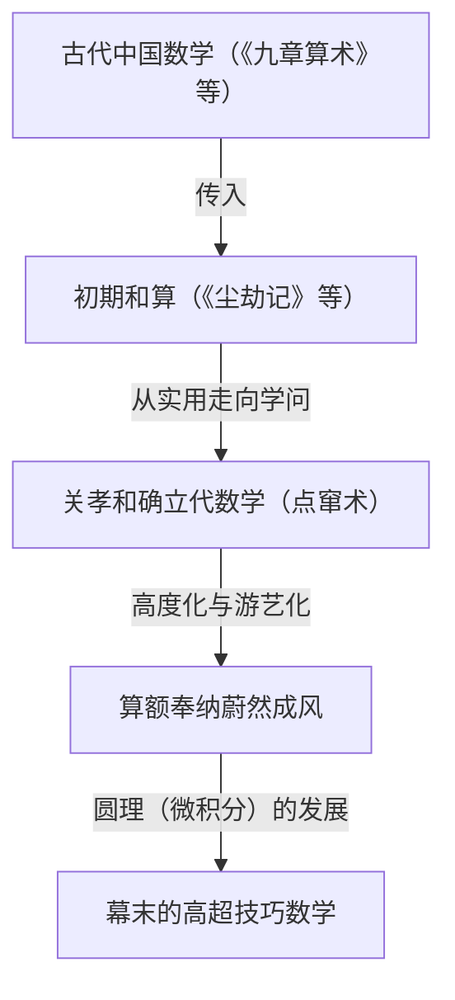
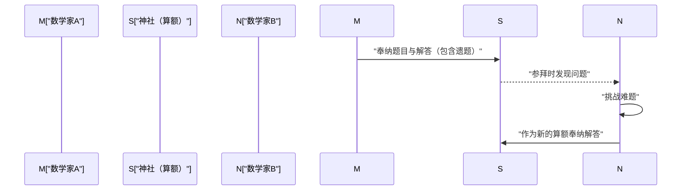

## 1. 什么是和算（Wasan）：锁国孕育的奇迹数学

在江户时代（1603年—1867年），日本实行了被称为“锁国”的对外孤立政策。然而，在这个文化与物理上的封闭空间内，却孕育并盛开出了独特而精深的数学之花。这便是**和算（Wasan）**。

当时的欧洲，牛顿和莱布尼茨开创了微积分学；而几乎同一时期的日本，也在完全不同的文化语境中诞生了堪比微积分的思想与概念。和算始于实用的测量与历法推算，随后逐渐升华成为一种纯粹的数学智力游戏，甚至是一种独特的艺术形式。



### 1.1 《尘劫记》引发的畅销狂潮

推动和算呈现爆发式普及的契机，是1627年由吉田光由出版的《尘劫记》。该书图文并茂、通俗易懂地讲解了算盘的使用方法、面积与体积的计算，乃至诸如“鼠算”（老鼠繁殖计算）等趣味娱乐性问题。

```python
# 老鼠繁殖问题（鼠算）模拟（Python 实现）
def nezumizan(months):
    # 最初的一对老鼠
    pairs = 1
    for month in range(1, months + 1):
        # 假设每月产下 12 只（6 对）
        pairs += pairs * 6
    return pairs * 2 # 总只数

print(f"12 个月后的老鼠数量: {nezumizan(12)} 只")
# 输出: 12 个月后的老鼠数量: 27682574402 只
```

伴随着江户时代极高的识字率，这本书成为了空前的超级畅销书，吸引了无数日本人沉浸于数学的魅力之中。

## 2. 天才关孝和与“点窜术”

17世纪后半叶，将和算提升至世界顶尖水平的关键人物是**关孝和（Seki Takakazu）**。他被尊为“算圣”，也被誉为“日本的牛顿”。

关孝和最大的功绩在于开创了用文字符号表示未知数并建立方程的“点窜术”。这突破了由中国传入的物理算具“算木”的局限，使得在纸面上进行复杂的代数运算成为可能。

### 行列式的发现
关孝和甚至比欧洲的莱布尼茨早10年就发现了作为多元一次方程组解法的“行列式（Determinant）”概念。他的著作《解伏题之法》中，记载了与现代行列式展开在本质上完全一致的计算手法。

$$ \Delta = a_{11}a_{22} - a_{12}a_{21} $$

## 3. 悬挂于神社寺庙的数学绘马：“算额（Sangaku）”

在谈论和算时，绝对不可忽视的便是**算额（Sangaku）**文化。所谓算额，是指将数学问题及其解法搭配优美的几何图形绘制在木匾上，供奉于神社或寺院中的一种特殊绘马。

### 3.1 对神佛的感恩与数学家们的挑战书

人们为什么会将数学问题供奉在神社与寺庙呢？
1. **表达感恩**：“能够解开难题全仰仗神佛庇佑”的虔诚感恩之情。
2. **展示自我与学术交流**：向世人展示自己的学问水平，同时也作为向其他数学家提出“你能解开这道题吗？”的挑战书（遗题）。

从乡村农民、武士、商人，乃至女性和儿童，跨越身份与阶层，许多人都参与了算额的制作。这是世界上独一无二的大众参与型数学文化。



### 3.2 算额的典型问题（圆理）

算额中的绝大部分题目都与几何学相关，尤其钟爱研究大圆内多个互相相切的圆或多边形等几何图形问题。

**【代表性题目示例】**
“外圆内有三个彼此相切的等圆（甲圆），以及与它们相切的一个小圆（乙圆）。已知甲圆的直径，求乙圆的直径。”

为了解决这类复杂的几何难题，和算家们发展出了一套被称为“**圆理（Enri）**”的方法，它相当于现代微积分中的极限计算。他们将圆周率 $\pi$ 的数值精确计算至小数点后数十位，并成功求出了复杂曲线的长度以及立体图形的体积。

## 4. 和算的终结与向近代数学的过渡

步入明治时代（1868年—）后，日本推进了迅猛的近代化（西洋化）。明治政府在教育制度改革中，认为和算实用性不足且拥有孤立独特的符号体系，因而决定废除和算，将西方数学正式定为正统学科。

尽管和算因此迅速走向衰落，但和算所孕育出的“高阶数学思维能力”以及“如解谜般享受思考的求知欲”，却成为了明治以后的日本人以惊人速度吸收西方近代科学与数学的核心原动力。

## 5. 存续至今的和算精神

即便在今天，日本各地的神社和寺庙中依然现存约900面算额，被作为地方珍贵的文化遗产妥善保存。此外，在现代数学教育中，算额那些富有趣味性与思考性的题目，也正作为培养逻辑思维与探究精神的宝贵教材而被重新审视。

江户时代的天才们镌刻在木匾上的数学谜题，跨越了时空的界限，至今仍在向我们传递着数学之美与求解的无限乐趣。
