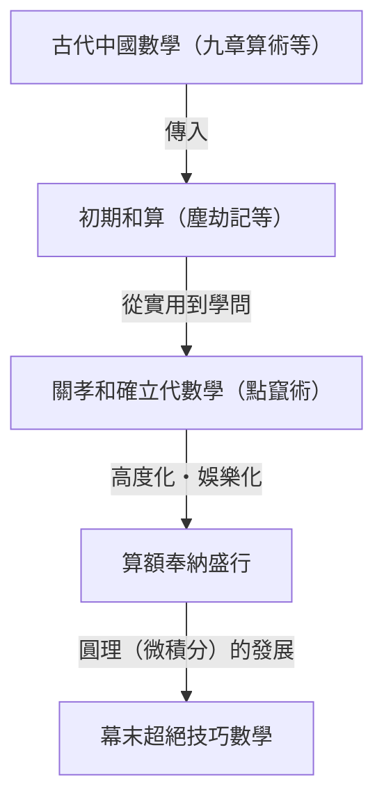
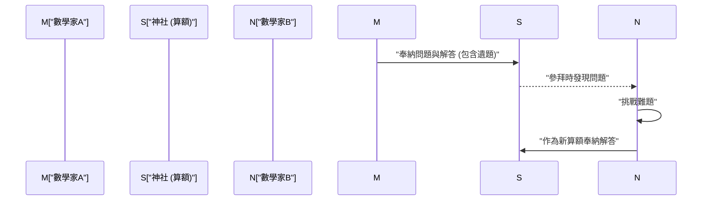

## 1. 和算（Wasan）是什麼：鎖國孕育出的奇蹟數學

江戶時代（1603年〜1867年），日本實行被稱為「鎖國」的對外孤立政策。然而，在這個文化與地理上的封閉空間中，卻孕育並盛開了獨特且高度發展的數學文化。這便是**和算（Wasan）**。

當時的歐洲，牛頓與萊布尼茲創立了微積分學；而在同一時期的日本，也從截然不同的脈絡中，誕生了足以與微積分媲美的概念。和算最初始於實用的土地測量與曆法推算，隨後逐漸昇華為純粹的數學遊戲，甚至成為一種藝術。



### 1.1 《塵劫記》的暢銷熱潮

引發和算爆發性普及的契機，是吉田光由在 1627 年出版的《塵劫記（じんこうき）》。書中透過豐富插圖與淺顯易懂的解說，涵蓋了從算盤的使用方法、面積與體積的計算，到類似「老鼠算（鼠算）」等趣味娛樂問題。

```python
# 老鼠算的模擬（使用 Python 實現）
def nezumizan(months):
    # 最初的一對老鼠
    pairs = 1
    for month in range(1, months + 1):
        # 假設每個月生出 12 隻（6 對）老鼠
        pairs += pairs * 6
    return pairs * 2 # 總隻數

print(f"12 個月後的老鼠數量: {nezumizan(12)}隻")
# 輸出: 12 個月後的老鼠數量: 27682574402隻
```

這本書再加上江戶時代極高的識字率，締造了空前的暢銷紀錄，讓無數日本人為數學的魅力所傾倒。

## 2. 天才・關孝和與「點竄術（てんざんじゅつ）」

17 世紀後半，將和算推向世界頂尖水準的關鍵人物，正是**關孝和（Seki Takakazu）**。他被尊稱為「算聖」，亦有「日本的牛頓」之美譽。

關孝和最重大的功績，在於發明了以符號表示未知數來建立方程式的「點竄術」。此舉突破了由中國傳入之「算木」這種實體計算工具的局限，使得在紙上進行複雜代數運算成為可能。

### 行列式的發現
關孝和比歐洲的萊布尼茲早了整整 10 年，便發現了作為聯立一次方程式解法的「行列式（Determinant）」概念。在他的著作《解伏題之法》中，記載了與現代行列式展開本質上相同的計算手法。

$$ \Delta = a_{11}a_{22} - a_{12}a_{21} $$

## 3. 懸掛於神社佛寺的數學繪馬：「算額（Sangaku）」

談到和算，絕不能忽視**算額（Sangaku）**文化。所謂算額，是指將數學問題及其解答連同優美幾何圖形繪製在木板上，奉納供奉於神社或寺院的一種繪馬。

### 3.1 對神明的感謝，以及數學家們的挑戰帖

為什麼要將數學奉納至神社佛寺呢？
1. **表達感謝**：「能解開難題全仰賴神佛庇佑」的心懷感激。
2. **展現自我與社群交流**：向世人展示自己的學問實力，同時扮演著向其他數學家發起「你能解開這題嗎？」的挑戰帖（遺題）角色。

從鄉村農民、武士、商人，乃至女性與孩童，不分身分階級，許多人都參與了算額的創作。這是世界上罕見、充滿大眾參與精神的數學文化。



### 3.2 算額的典型問題（圓理）

算額中的問題大多與幾何學相關。特別是圓內相切多個圓或多邊形的圖形問題最受青睞。

**【代表性問題範例】**
「於外圓之中，有三個彼此相切的等圓（甲圓），以及與其相切的小圓（乙圓）。若已知甲圓的直徑，求乙圓的直徑。」

為了求解這類複雜的圖形問題，和算家們發展出被稱為「**圓理（えんり）**」的極限計算法，其概念相當於現代的積分法。他們能將圓周率 $\pi$ 的數值精確計算至小數點後數十位，並求解複雜曲線的長度與立體圖形的體積。

## 4. 和算的落幕與近代數學的接軌

進入明治時代（1868年〜）後，日本全力推動急遽的近代化（西洋化）。明治政府在教育制度改革中，認為和算實用性較低且擁有獨特的符號系統，決定予以廢除，並正式採用西方數學作為正規學科。

和算雖然因此迅速走向衰落，但藉由和算所培育出的「高度數學思維能力」以及「如解謎般享受的求知好奇心」，成為明治以後的日本人以驚人速度吸收西方近代科學與數學的原動力。

## 5. 存續於現代的和算精神

即便在今日，全日本各地的神社與佛寺中仍留存約 900 面算額，作為珍貴的地域文化資產受到妥善保存。此外，在現代數學教育中，算額中如益智拼圖般的題目，也作為培養邏輯思維與探究心靈的優良教材而重新受到重視。

江戶時代的天才們刻在木板上的數學之謎，跨越了時空，至今依然向我們訴說著數學之美與解題的喜悅。
