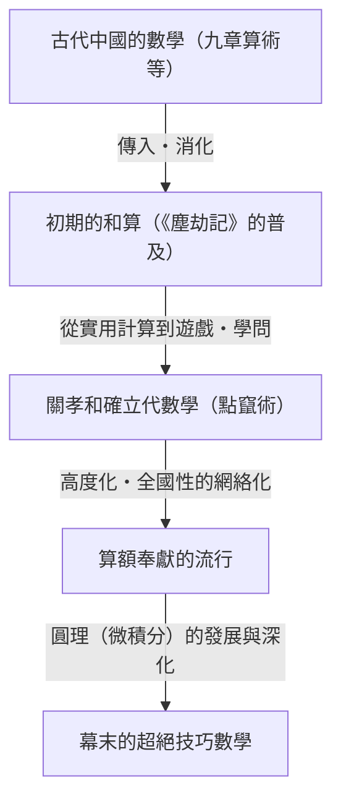
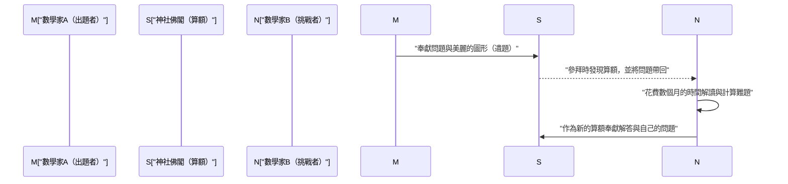

## 1. 前言：在鎖國下的日本發生的「數學奇蹟」

從17世紀到19世紀中葉，日本採取了被稱為「鎖國」的嚴格對外孤立政策。在這個極度限制與西方科學及文化交流的時代，日本國內卻發生了世界上獨一無二的奇特現象。那就是日本獨特的高度數學文化**「和算（Wasan）」**的開花結果。

在同期的歐洲，艾薩克·牛頓和戈特弗里德·萊布尼茨等人創立了微積分學，近代數學正在迅速發展。令人驚訝的是，在遠東的島國日本，竟然也以完全獨立的形式，誕生了足以匹敵微積分的高度數學概念。

本文將從實用的測量和計算開始，詳細探討逐漸昇華為純粹的智力遊戲、甚至是一種藝術的和算歷史，以及引領其發展的天才數學家們，還有世界上獨一無二的「算額」這種獨特文化。

## 2. 和算的黎明：暢銷書《塵劫記》點燃的數學熱潮

讓日本數學文化爆炸性普及的決定性契機，是江戶時代初期於1627年出版的吉田光由的著作《塵劫記》。

在此之前，日本的算術主要來自中國傳入的艱澀知識，只有少數知識分子和官員能夠掌握。然而，《塵劫記》從日常商業交易中使用的算盤計算方法，到田地面積和米袋體積的求法，甚至像「老鼠繁殖（ネズミ算）」和「繼子立（ままこだて）」這樣的解謎和娛樂性問題，都搭配豐富的插圖進行了極其淺顯易懂的解說。

剛好江戶時代是隨著寺子屋的普及，平民的識字率達到世界驚人高度的時期。《塵劫記》成為空前絕後的大暢銷書，多次出版了盜版和修訂版。透過這本書，不僅是武士，連商人和農民也開始覺醒到「數學的樂趣」。

## 3. 日本的牛頓、「算聖」關孝和的登場

17世紀後半，一位將原本停留在娛樂和實用層面的和算，提升至世界頂級的高度抽象數學的不世出天才登場了。他就是**關孝和**。他後來被尊稱為「算聖（數學的聖人）」，成為日本數學史上最重要的人物。

### 3.1 點竄術：代數學的確立
關孝和最大的功績之一，就是發明了被稱為「點竄術」的獨特筆算代數式。在此之前，主流是將被稱為「算木」的木棒排列在盤上進行計算的物理手法，但這很難解開複雜的多變量方程式。關孝和確立了用漢字表示未知數，在紙上操作數學符號來建立方程式的手法（文字式）。這使得日本的數學從物理限制中解放出來，實現了飛躍性的進化。

### 3.2 行列式與伯努利數的發現
展現關孝和天才特質的一個小插曲，是他與歐洲數學家的同時發現。他在著作《解伏題之法》（1683年）中，提出了用於求聯立一次方程式解的「行列式（Determinant）」概念。這比歐洲萊布尼茨提出類似概念早了約10年。

此外，關於出現在冪次方和公式中的「伯努利數」，在瑞士雅各布·伯努利發表（1713年）的同時期，關孝和的遺稿《括要算法》（1712年）中也有明確的記載。

## 4. 挑戰極限：「圓理」與建部賢弘

關孝和死後，他的高徒**建部賢弘**等人進一步發展了和算。他們挑戰的最大難題是關於「圓」的計算。

和算家們編創了相當於現代微積分學的**「圓理」**手法。建部賢弘為了求出圓弧的長度和弓形的面積，發明了使用無限級數展開（相當於泰勒展開）的手法。據說他透過令人眼花撩亂的手工計算，將圓周率 $\pi$ 的值準確計算到了小數點後第41位。

$$ \pi \approx 3.14159265358979323846264338327950288419716\dots $$

這些成果超越了實用目的，是出於「探索真理」這種純粹的數學探求心而產生的。

## 5. 世界上獨一無二的數學文化「算額（Sangaku）」

最能象徵和算不僅是少數菁英階層，更是廣受大眾喜愛的文化，就是**「算額（Sangaku）」**。

算額是一種繪馬，人們將自己解開的數學問題、其美麗的圖形及解法等畫在木板上，奉獻給神社或寺院。這種風俗始於17世紀中葉，並在整個江戶時代於日本全國大流行。

### 5.1 為什麼要將數學奉獻給神社佛閣？

算額奉獻主要有三個意義。
1. **對神佛的感謝**：純粹的感謝表現，認為「能解開這道難題，是多虧了神佛的庇佑」。
2. **自我表現與發表的場所**：用來向世人展示自己數學才華的平台，其作用類似於現代的學術論文或海報發表。
3. **對他人的挑戰書**：算額經常採用「不寫下解答，只提出問題（遺題）」的形式。這是一份挑戰書，意思是「如果有人能解開這個問題，就來解解看吧」，看到這個的其他數學家會將解答作為新的算額奉獻上去，從而成立了知性的交流。

### 5.2 跨越身分地位的知識網絡

最令人驚訝的是，算額的奉獻者不僅限於著名的學者或武士。現存的算額中，也記載著商人、村莊的農民，甚至是女性和十幾歲孩童的名字。加上巡迴全國各地的數學遊歷家（一邊教導數學一邊旅行的人們）的存在，整個日本列島就像是一個巨大的「線上數學社群」一樣在運作。在身分制度森嚴的江戶時代，只有數學的世界是完全的實力主義，進行著跨越身分的平等交流。

## 6. 和算的終結與對近代化的默默貢獻

經過1868年的明治維新，日本開始走上迅速西化與近代化的道路。對於以富國強兵和培育產業為目標的明治政府來說，高度謎題化、遊戲化，並擁有獨特漢文符號體系的和算，被視為引進西方科學技術的障礙。

結果，由於1872年（明治5年）發布的學制，決定在學校教育中只教授西方數學，延續了數百年的和算傳統便開始迅速衰退。

然而，和算絕不是白白消失的。在江戶時代期間，直到全國各地的平民百姓，「邏輯思考的能力」、「處理抽象概念的能力」，以及最重要的「享受學習本身樂趣的求知慾」，都已經深深紮根。明治以後，日本能夠以驚人的速度吸收西方的等高等數學與近代科學，並追趕上世界頂尖水準，毫無疑問正是因為有了這片「和算的土壤」。

## 7. 結語：在現代依然鮮活的數學浪漫

即使在今天，日本各地的神社佛閣中依然保存著約900面算額，作為地區重要的文化財產被珍重地保存和研究。此外，近年來在現代數學教育的現場，算額的圖形問題作為一種優良教材再次受到關注，用來教導學生「自己發現問題並探索的樂趣」，而不是死記硬背的學習。

江戶時代的人們刻在木板上的對數學的熱情，穿越了時空，向現代的我們靜靜地訴說著知識探索的浪漫與解題的喜悅。
