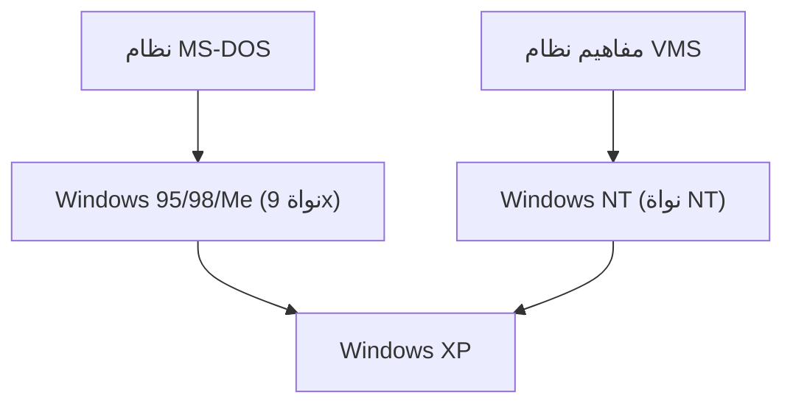

## 1. نظام MS-DOS و Windows 1.0 إلى 3.1
لم يكن الإصدار الأول من Windows نظام تشغيل مستقل، بل كان مجرد بيئة واجهة مستخدم رسومية (GUI) تعمل فوق نظام MS-DOS. ومع ذلك، فإن الانتشار الواسع لنظام Windows 3.1 كان حاسماً في تحويل أجهزة الكمبيوتر الشخصية نحو استخدام الواجهات الرسومية.

## 2. صدمة Windows 95
في عام 1995، تم إطلاق Windows 95. مع تقديم زر "ابدأ" وشريط المهام، بالإضافة إلى الميزات المدمجة للاتصال بالإنترنت، حقق النظام نجاحاً هائلاً في جميع أنحاء العالم.

## 3. التكامل مع بنية NT
كانت سلسلة أنوية 9x الموجهة للمستهلكين غير مستقرة، لكن نظام Windows NT الموجه للأعمال كان قوياً ومتيناً. وبفضل "Windows XP" في عام 2001، تم أخيراً دمج كلاهما تحت نواة NT.

## 4. أنظمة Windows 10/11 والوقت الحاضر
في الوقت الحاضر، يستمر التطور وفق مفهوم "Windows كخدمة" (Windows as a Service)، وقد شهدت بيئة النظام تغييرات كبيرة لتصبح صديقة للمطورين، مثل تضمين نظام Windows الفرعي لـ Linux (WSL).

## جزء التحقق التقني الإضافي 1

### 1. نظام MS-DOS و Windows 1.0 إلى 3.1
لم يكن الإصدار الأول من Windows نظام تشغيل مستقل، بل كان مجرد بيئة واجهة مستخدم رسومية (GUI) تعمل فوق نظام MS-DOS. ومع ذلك، فإن الانتشار الواسع لنظام Windows 3.1 كان حاسماً في تحويل أجهزة الكمبيوتر الشخصية نحو استخدام الواجهات الرسومية.

### 2. صدمة Windows 95
في عام 1995، تم إطلاق Windows 95. مع تقديم زر "ابدأ" وشريط المهام، بالإضافة إلى الميزات المدمجة للاتصال بالإنترنت، حقق النظام نجاحاً هائلاً في جميع أنحاء العالم.

### 3. التكامل مع بنية NT
كانت سلسلة أنوية 9x الموجهة للمستهلكين غير مستقرة، لكن نظام Windows NT الموجه للأعمال كان قوياً ومتيناً. وبفضل "Windows XP" في عام 2001، تم أخيراً دمج كلاهما تحت نواة NT.

### 4. أنظمة Windows 10/11 والوقت الحاضر
في الوقت الحاضر، يستمر التطور وفق مفهوم "Windows كخدمة" (Windows as a Service)، وقد شهدت بيئة النظام تغييرات كبيرة لتصبح صديقة للمطورين، مثل تضمين نظام Windows الفرعي لـ Linux (WSL).

## جزء التحقق التقني الإضافي 2

### 1. نظام MS-DOS و Windows 1.0 إلى 3.1
لم يكن الإصدار الأول من Windows نظام تشغيل مستقل، بل كان مجرد بيئة واجهة مستخدم رسومية (GUI) تعمل فوق نظام MS-DOS. ومع ذلك، فإن الانتشار الواسع لنظام Windows 3.1 كان حاسماً في تحويل أجهزة الكمبيوتر الشخصية نحو استخدام الواجهات الرسومية.

### 2. صدمة Windows 95
في عام 1995، تم إطلاق Windows 95. مع تقديم زر "ابدأ" وشريط المهام، بالإضافة إلى الميزات المدمجة للاتصال بالإنترنت، حقق النظام نجاحاً هائلاً في جميع أنحاء العالم.

### 3. التكامل مع بنية NT
كانت سلسلة أنوية 9x الموجهة للمستهلكين غير مستقرة، لكن نظام Windows NT الموجه للأعمال كان قوياً ومتيناً. وبفضل "Windows XP" في عام 2001، تم أخيراً دمج كلاهما تحت نواة NT.

### 4. أنظمة Windows 10/11 والوقت الحاضر
في الوقت الحاضر، يستمر التطور وفق مفهوم "Windows كخدمة" (Windows as a Service)، وقد شهدت بيئة النظام تغييرات كبيرة لتصبح صديقة للمطورين، مثل تضمين نظام Windows الفرعي لـ Linux (WSL).

## جزء التحقق التقني الإضافي 3

### 1. نظام MS-DOS و Windows 1.0 إلى 3.1
لم يكن الإصدار الأول من Windows نظام تشغيل مستقل، بل كان مجرد بيئة واجهة مستخدم رسومية (GUI) تعمل فوق نظام MS-DOS. ومع ذلك، فإن الانتشار الواسع لنظام Windows 3.1 كان حاسماً في تحويل أجهزة الكمبيوتر الشخصية نحو استخدام الواجهات الرسومية.

### 2. صدمة Windows 95
في عام 1995، تم إطلاق Windows 95. مع تقديم زر "ابدأ" وشريط المهام، بالإضافة إلى الميزات المدمجة للاتصال بالإنترنت، حقق النظام نجاحاً هائلاً في جميع أنحاء العالم.

### 3. التكامل مع بنية NT
كانت سلسلة أنوية 9x الموجهة للمستهلكين غير مستقرة، لكن نظام Windows NT الموجه للأعمال كان قوياً ومتيناً. وبفضل "Windows XP" في عام 2001، تم أخيراً دمج كلاهما تحت نواة NT.

### 4. أنظمة Windows 10/11 والوقت الحاضر
في الوقت الحاضر، يستمر التطور وفق مفهوم "Windows كخدمة" (Windows as a Service)، وقد شهدت بيئة النظام تغييرات كبيرة لتصبح صديقة للمطورين، مثل تضمين نظام Windows الفرعي لـ Linux (WSL).

## جزء التحقق التقني الإضافي 4

### 1. نظام MS-DOS و Windows 1.0 إلى 3.1
لم يكن الإصدار الأول من Windows نظام تشغيل مستقل، بل كان مجرد بيئة واجهة مستخدم رسومية (GUI) تعمل فوق نظام MS-DOS. ومع ذلك، فإن الانتشار الواسع لنظام Windows 3.1 كان حاسماً في تحويل أجهزة الكمبيوتر الشخصية نحو استخدام الواجهات الرسومية.

### 2. صدمة Windows 95
في عام 1995، تم إطلاق Windows 95. مع تقديم زر "ابدأ" وشريط المهام، بالإضافة إلى الميزات المدمجة للاتصال بالإنترنت، حقق النظام نجاحاً هائلاً في جميع أنحاء العالم.

### 3. التكامل مع بنية NT
كانت سلسلة أنوية 9x الموجهة للمستهلكين غير مستقرة، لكن نظام Windows NT الموجه للأعمال كان قوياً ومتيناً. وبفضل "Windows XP" في عام 2001، تم أخيراً دمج كلاهما تحت نواة NT.

### 4. أنظمة Windows 10/11 والوقت الحاضر
في الوقت الحاضر، يستمر التطور وفق مفهوم "Windows كخدمة" (Windows as a Service)، وقد شهدت بيئة النظام تغييرات كبيرة لتصبح صديقة للمطورين، مثل تضمين نظام Windows الفرعي لـ Linux (WSL).

## جزء التحقق التقني الإضافي 5

### 1. نظام MS-DOS و Windows 1.0 إلى 3.1
لم يكن الإصدار الأول من Windows نظام تشغيل مستقل، بل كان مجرد بيئة واجهة مستخدم رسومية (GUI) تعمل فوق نظام MS-DOS. ومع ذلك، فإن الانتشار الواسع لنظام Windows 3.1 كان حاسماً في تحويل أجهزة الكمبيوتر الشخصية نحو استخدام الواجهات الرسومية.

### 2. صدمة Windows 95
في عام 1995، تم إطلاق Windows 95. مع تقديم زر "ابدأ" وشريط المهام، بالإضافة إلى الميزات المدمجة للاتصال بالإنترنت، حقق النظام نجاحاً هائلاً في جميع أنحاء العالم.

### 3. التكامل مع بنية NT
كانت سلسلة أنوية 9x الموجهة للمستهلكين غير مستقرة، لكن نظام Windows NT الموجه للأعمال كان قوياً ومتيناً. وبفضل "Windows XP" في عام 2001، تم أخيراً دمج كلاهما تحت نواة NT.

### 4. أنظمة Windows 10/11 والوقت الحاضر
في الوقت الحاضر، يستمر التطور وفق مفهوم "Windows كخدمة" (Windows as a Service)، وقد شهدت بيئة النظام تغييرات كبيرة لتصبح صديقة للمطورين، مثل تضمين نظام Windows الفرعي لـ Linux (WSL).

## جزء التحقق التقني الإضافي 6

### 1. نظام MS-DOS و Windows 1.0 إلى 3.1
لم يكن الإصدار الأول من Windows نظام تشغيل مستقل، بل كان مجرد بيئة واجهة مستخدم رسومية (GUI) تعمل فوق نظام MS-DOS. ومع ذلك، فإن الانتشار الواسع لنظام Windows 3.1 كان حاسماً في تحويل أجهزة الكمبيوتر الشخصية نحو استخدام الواجهات الرسومية.

### 2. صدمة Windows 95
في عام 1995، تم إطلاق Windows 95. مع تقديم زر "ابدأ" وشريط المهام، بالإضافة إلى الميزات المدمجة للاتصال بالإنترنت، حقق النظام نجاحاً هائلاً في جميع أنحاء العالم.

### 3. التكامل مع بنية NT
كانت سلسلة أنوية 9x الموجهة للمستهلكين غير مستقرة، لكن نظام Windows NT الموجه للأعمال كان قوياً ومتيناً. وبفضل "Windows XP" في عام 2001، تم أخيراً دمج كلاهما تحت نواة NT.

### 4. أنظمة Windows 10/11 والوقت الحاضر
في الوقت الحاضر، يستمر التطور وفق مفهوم "Windows كخدمة" (Windows as a Service)، وقد شهدت بيئة النظام تغييرات كبيرة لتصبح صديقة للمطورين، مثل تضمين نظام Windows الفرعي لـ Linux (WSL).

## جزء التحقق التقني الإضافي 7

### 1. نظام MS-DOS و Windows 1.0 إلى 3.1
لم يكن الإصدار الأول من Windows نظام تشغيل مستقل، بل كان مجرد بيئة واجهة مستخدم رسومية (GUI) تعمل فوق نظام MS-DOS. ومع ذلك، فإن الانتشار الواسع لنظام Windows 3.1 كان حاسماً في تحويل أجهزة الكمبيوتر الشخصية نحو استخدام الواجهات الرسومية.

### 2. صدمة Windows 95
في عام 1995، تم إطلاق Windows 95. مع تقديم زر "ابدأ" وشريط المهام، بالإضافة إلى الميزات المدمجة للاتصال بالإنترنت، حقق النظام نجاحاً هائلاً في جميع أنحاء العالم.

### 3. التكامل مع بنية NT
كانت سلسلة أنوية 9x الموجهة للمستهلكين غير مستقرة، لكن نظام Windows NT الموجه للأعمال كان قوياً ومتيناً. وبفضل "Windows XP" في عام 2001، تم أخيراً دمج كلاهما تحت نواة NT.

### 4. أنظمة Windows 10/11 والوقت الحاضر
في الوقت الحاضر، يستمر التطور وفق مفهوم "Windows كخدمة" (Windows as a Service)، وقد شهدت بيئة النظام تغييرات كبيرة لتصبح صديقة للمطورين، مثل تضمين نظام Windows الفرعي لـ Linux (WSL).

## جزء التحقق التقني الإضافي 8

### 1. نظام MS-DOS و Windows 1.0 إلى 3.1
لم يكن الإصدار الأول من Windows نظام تشغيل مستقل، بل كان مجرد بيئة واجهة مستخدم رسومية (GUI) تعمل فوق نظام MS-DOS. ومع ذلك، فإن الانتشار الواسع لنظام Windows 3.1 كان حاسماً في تحويل أجهزة الكمبيوتر الشخصية نحو استخدام الواجهات الرسومية.

### 2. صدمة Windows 95
في عام 1995، تم إطلاق Windows 95. مع تقديم زر "ابدأ" وشريط المهام، بالإضافة إلى الميزات المدمجة للاتصال بالإنترنت، حقق النظام نجاحاً هائلاً في جميع أنحاء العالم.

### 3. التكامل مع بنية NT
كانت سلسلة أنوية 9x الموجهة للمستهلكين غير مستقرة، لكن نظام Windows NT الموجه للأعمال كان قوياً ومتيناً. وبفضل "Windows XP" في عام 2001، تم أخيراً دمج كلاهما تحت نواة NT.

### 4. أنظمة Windows 10/11 والوقت الحاضر
في الوقت الحاضر، يستمر التطور وفق مفهوم "Windows كخدمة" (Windows as a Service)، وقد شهدت بيئة النظام تغييرات كبيرة لتصبح صديقة للمطورين، مثل تضمين نظام Windows الفرعي لـ Linux (WSL).

## جزء التحقق التقني الإضافي 9

### 1. نظام MS-DOS و Windows 1.0 إلى 3.1
لم يكن الإصدار الأول من Windows نظام تشغيل مستقل، بل كان مجرد بيئة واجهة مستخدم رسومية (GUI) تعمل فوق نظام MS-DOS. ومع ذلك، فإن الانتشار الواسع لنظام Windows 3.1 كان حاسماً في تحويل أجهزة الكمبيوتر الشخصية نحو استخدام الواجهات الرسومية.

### 2. صدمة Windows 95
في عام 1995، تم إطلاق Windows 95. مع تقديم زر "ابدأ" وشريط المهام، بالإضافة إلى الميزات المدمجة للاتصال بالإنترنت، حقق النظام نجاحاً هائلاً في جميع أنحاء العالم.

### 3. التكامل مع بنية NT
كانت سلسلة أنوية 9x الموجهة للمستهلكين غير مستقرة، لكن نظام Windows NT الموجه للأعمال كان قوياً ومتيناً. وبفضل "Windows XP" في عام 2001، تم أخيراً دمج كلاهما تحت نواة NT.

### 4. أنظمة Windows 10/11 والوقت الحاضر
في الوقت الحاضر، يستمر التطور وفق مفهوم "Windows كخدمة" (Windows as a Service)، وقد شهدت بيئة النظام تغييرات كبيرة لتصبح صديقة للمطورين، مثل تضمين نظام Windows الفرعي لـ Linux (WSL).

## جزء التحقق التقني الإضافي 10

### 1. نظام MS-DOS و Windows 1.0 إلى 3.1
لم يكن الإصدار الأول من Windows نظام تشغيل مستقل، بل كان مجرد بيئة واجهة مستخدم رسومية (GUI) تعمل فوق نظام MS-DOS. ومع ذلك، فإن الانتشار الواسع لنظام Windows 3.1 كان حاسماً في تحويل أجهزة الكمبيوتر الشخصية نحو استخدام الواجهات الرسومية.

### 2. صدمة Windows 95
في عام 1995، تم إطلاق Windows 95. مع تقديم زر "ابدأ" وشريط المهام، بالإضافة إلى الميزات المدمجة للاتصال بالإنترنت، حقق النظام نجاحاً هائلاً في جميع أنحاء العالم.

### 3. التكامل مع بنية NT
كانت سلسلة أنوية 9x الموجهة للمستهلكين غير مستقرة، لكن نظام Windows NT الموجه للأعمال كان قوياً ومتيناً. وبفضل "Windows XP" في عام 2001، تم أخيراً دمج كلاهما تحت نواة NT.

### 4. أنظمة Windows 10/11 والوقت الحاضر
في الوقت الحاضر، يستمر التطور وفق مفهوم "Windows كخدمة" (Windows as a Service)، وقد شهدت بيئة النظام تغييرات كبيرة لتصبح صديقة للمطورين، مثل تضمين نظام Windows الفرعي لـ Linux (WSL).

## جزء التحقق التقني الإضافي 11

### 1. نظام MS-DOS و Windows 1.0 إلى 3.1
لم يكن الإصدار الأول من Windows نظام تشغيل مستقل، بل كان مجرد بيئة واجهة مستخدم رسومية (GUI) تعمل فوق نظام MS-DOS. ومع ذلك، فإن الانتشار الواسع لنظام Windows 3.1 كان حاسماً في تحويل أجهزة الكمبيوتر الشخصية نحو استخدام الواجهات الرسومية.

### 2. صدمة Windows 95
في عام 1995، تم إطلاق Windows 95. مع تقديم زر "ابدأ" وشريط المهام، بالإضافة إلى الميزات المدمجة للاتصال بالإنترنت، حقق النظام نجاحاً هائلاً في جميع أنحاء العالم.

### 3. التكامل مع بنية NT
كانت سلسلة أنوية 9x الموجهة للمستهلكين غير مستقرة، لكن نظام Windows NT الموجه للأعمال كان قوياً ومتيناً. وبفضل "Windows XP" في عام 2001، تم أخيراً دمج كلاهما تحت نواة NT.

### 4. أنظمة Windows 10/11 والوقت الحاضر
في الوقت الحاضر، يستمر التطور وفق مفهوم "Windows كخدمة" (Windows as a Service)، وقد شهدت بيئة النظام تغييرات كبيرة لتصبح صديقة للمطورين، مثل تضمين نظام Windows الفرعي لـ Linux (WSL).

## جزء التحقق التقني الإضافي 12

### 1. نظام MS-DOS و Windows 1.0 إلى 3.1
لم يكن الإصدار الأول من Windows نظام تشغيل مستقل، بل كان مجرد بيئة واجهة مستخدم رسومية (GUI) تعمل فوق نظام MS-DOS. ومع ذلك، فإن الانتشار الواسع لنظام Windows 3.1 كان حاسماً في تحويل أجهزة الكمبيوتر الشخصية نحو استخدام الواجهات الرسومية.

### 2. صدمة Windows 95
في عام 1995، تم إطلاق Windows 95. مع تقديم زر "ابدأ" وشريط المهام، بالإضافة إلى الميزات المدمجة للاتصال بالإنترنت، حقق النظام نجاحاً هائلاً في جميع أنحاء العالم.

### 3. التكامل مع بنية NT
كانت سلسلة أنوية 9x الموجهة للمستهلكين غير مستقرة، لكن نظام Windows NT الموجه للأعمال كان قوياً ومتيناً. وبفضل "Windows XP" في عام 2001، تم أخيراً دمج كلاهما تحت نواة NT.

### 4. أنظمة Windows 10/11 والوقت الحاضر
في الوقت الحاضر، يستمر التطور وفق مفهوم "Windows كخدمة" (Windows as a Service)، وقد شهدت بيئة النظام تغييرات كبيرة لتصبح صديقة للمطورين، مثل تضمين نظام Windows الفرعي لـ Linux (WSL).

## جزء التحقق التقني الإضافي 13

### 1. نظام MS-DOS و Windows 1.0 إلى 3.1
لم يكن الإصدار الأول من Windows نظام تشغيل مستقل، بل كان مجرد بيئة واجهة مستخدم رسومية (GUI) تعمل فوق نظام MS-DOS. ومع ذلك، فإن الانتشار الواسع لنظام Windows 3.1 كان حاسماً في تحويل أجهزة الكمبيوتر الشخصية نحو استخدام الواجهات الرسومية.

### 2. صدمة Windows 95
في عام 1995، تم إطلاق Windows 95. مع تقديم زر "ابدأ" وشريط المهام، بالإضافة إلى الميزات المدمجة للاتصال بالإنترنت، حقق النظام نجاحاً هائلاً في جميع أنحاء العالم.

### 3. التكامل مع بنية NT
كانت سلسلة أنوية 9x الموجهة للمستهلكين غير مستقرة، لكن نظام Windows NT الموجه للأعمال كان قوياً ومتيناً. وبفضل "Windows XP" في عام 2001، تم أخيراً دمج كلاهما تحت نواة NT.

### 4. أنظمة Windows 10/11 والوقت الحاضر
في الوقت الحاضر، يستمر التطور وفق مفهوم "Windows كخدمة" (Windows as a Service)، وقد شهدت بيئة النظام تغييرات كبيرة لتصبح صديقة للمطورين، مثل تضمين نظام Windows الفرعي لـ Linux (WSL).

## جزء التحقق التقني الإضافي 14

### 1. نظام MS-DOS و Windows 1.0 إلى 3.1
لم يكن الإصدار الأول من Windows نظام تشغيل مستقل، بل كان مجرد بيئة واجهة مستخدم رسومية (GUI) تعمل فوق نظام MS-DOS. ومع ذلك، فإن الانتشار الواسع لنظام Windows 3.1 كان حاسماً في تحويل أجهزة الكمبيوتر الشخصية نحو استخدام الواجهات الرسومية.

### 2. صدمة Windows 95
في عام 1995، تم إطلاق Windows 95. مع تقديم زر "ابدأ" وشريط المهام، بالإضافة إلى الميزات المدمجة للاتصال بالإنترنت، حقق النظام نجاحاً هائلاً في جميع أنحاء العالم.

### 3. التكامل مع بنية NT
كانت سلسلة أنوية 9x الموجهة للمستهلكين غير مستقرة، لكن نظام Windows NT الموجه للأعمال كان قوياً ومتيناً. وبفضل "Windows XP" في عام 2001، تم أخيراً دمج كلاهما تحت نواة NT.

### 4. أنظمة Windows 10/11 والوقت الحاضر
في الوقت الحاضر، يستمر التطور وفق مفهوم "Windows كخدمة" (Windows as a Service)، وقد شهدت بيئة النظام تغييرات كبيرة لتصبح صديقة للمطورين، مثل تضمين نظام Windows الفرعي لـ Linux (WSL).
