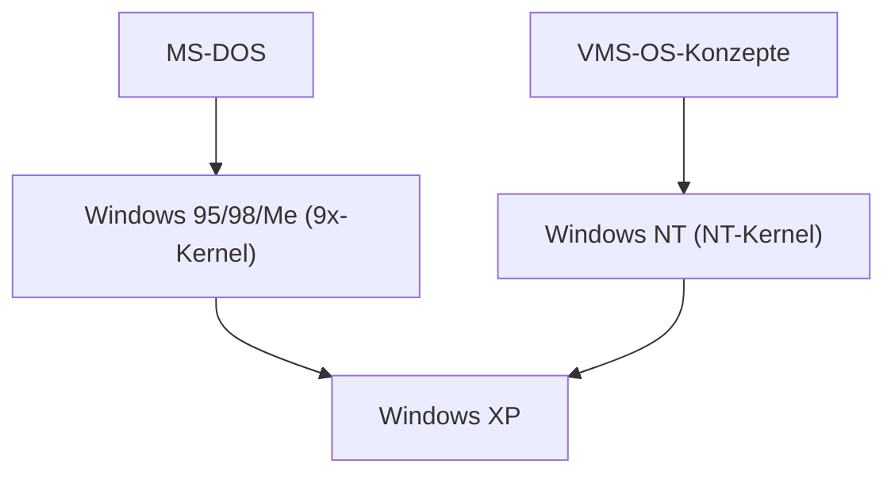

## 1. MS-DOS und Windows 1.0 bis 3.1
Das frühe Windows war kein unabhängiges Betriebssystem, sondern lediglich eine GUI-Shell-Umgebung, die auf MS-DOS lief. Jedoch wurde mit der weiten Verbreitung von Windows 3.1 der Übergang der PCs zur GUI besiegelt.

## 2. Der Einfluss von Windows 95
Im Jahr 1995 wurde Windows 95 veröffentlicht. Durch die Einführung des Startbuttons und der Taskleiste sowie der standardmäßigen Integration von Internetverbindungsfunktionen verzeichnete es weltweit einen explosiven Erfolg.

## 3. Integration in die NT-Architektur
Während der verbraucherorientierte 9x-Kernel instabil war, erwies sich das geschäftsorientierte Windows NT als robust. Mit „Windows XP“ im Jahr 2001 wurden schließlich beide in den NT-Kernel integriert.

## 4. Windows 10/11 und die Gegenwart
Heute entwickelt es sich als Windows as a Service weiter und hat sich durch die Integration von WSL (Windows Subsystem for Linux) zu einer äußerst entwicklerfreundlichen Umgebung gewandelt.

## Zusätzlicher technischer Verifizierungsteil 1

## Zusätzlicher technischer Verifizierungsteil 2

## Zusätzlicher technischer Verifizierungsteil 3

## Zusätzlicher technischer Verifizierungsteil 4

## Zusätzlicher technischer Verifizierungsteil 5

## Zusätzlicher technischer Verifizierungsteil 6

## Zusätzlicher technischer Verifizierungsteil 7

## Zusätzlicher technischer Verifizierungsteil 8

## Zusätzlicher technischer Verifizierungsteil 9

## Zusätzlicher technischer Verifizierungsteil 10

## Zusätzlicher technischer Verifizierungsteil 11

## Zusätzlicher technischer Verifizierungsteil 12

## Zusätzlicher technischer Verifizierungsteil 13

## Zusätzlicher technischer Verifizierungsteil 14

