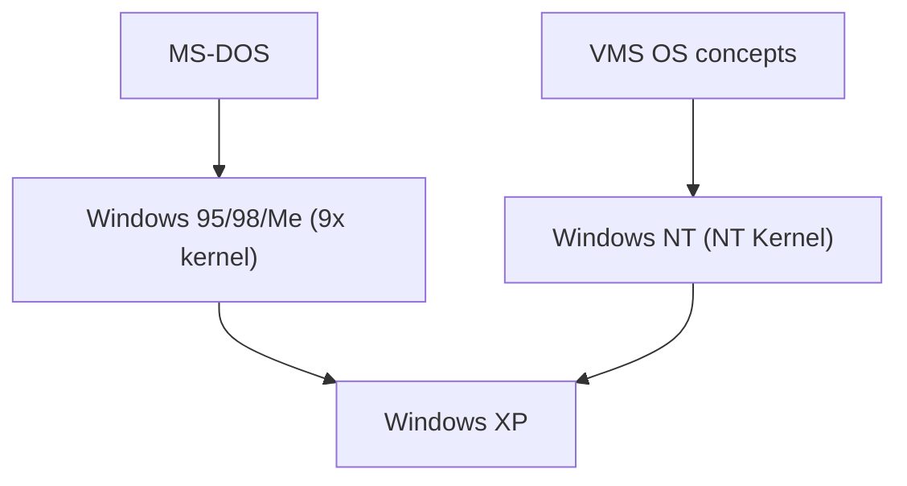

## 1. MS-DOS and Windows 1.0 - 3.1
Early Windows was not an independent OS, but merely a GUI shell environment running on MS-DOS. However, the widespread use of Windows 3.1 decisively established the GUI transition for PCs.

## 2. The Impact of Windows 95
In 1995, Windows 95 was released. The introduction of the Start button and taskbar, along with internet connectivity features included as standard, led to it recording a massive hit worldwide.

## 3. Integration into the NT Architecture
The 9x kernel for consumers was unstable, whereas the business-oriented Windows NT was robust. In 2001, with "Windows XP", both were finally integrated into the NT kernel.

## 4. Windows 10/11 and the Present
Currently, it continues to evolve as Windows as a Service, changing significantly into a developer-friendly environment by incorporating WSL (Windows Subsystem for Linux), among other features.

