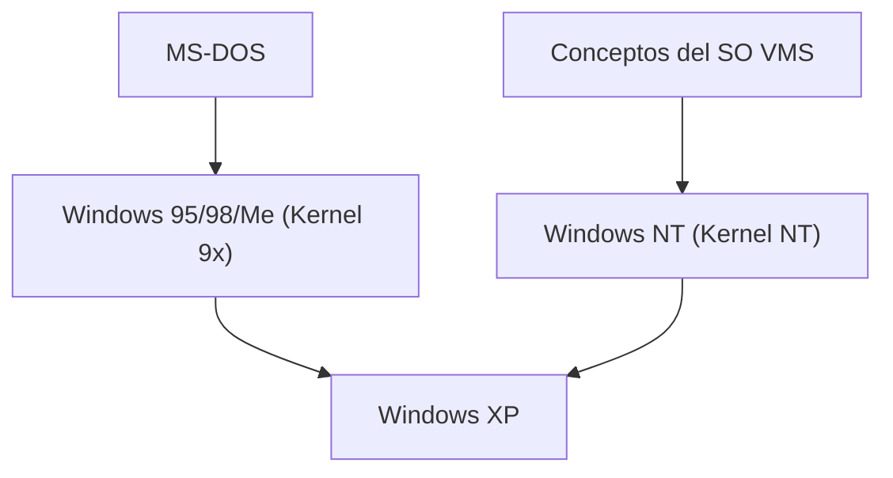

## 1. MS-DOS y Windows 1.0〜3.1
Las primeras versiones de Windows no eran un sistema operativo independiente, sino un entorno de shell GUI que se ejecutaba sobre MS-DOS. Sin embargo, la popularización de Windows 3.1 consolidó la adopción de la GUI en los PC.

## 2. El impacto de Windows 95
En 1995 se lanzó Windows 95. La introducción del botón de inicio y la barra de tareas, junto con la inclusión estándar de funciones de conexión a Internet, lo convirtieron en un éxito mundial explosivo.

## 3. Integración en la arquitectura NT
Mientras que el kernel de la familia 9x orientado a consumidores era inestable, Windows NT para empresas era robusto. En 2001, con "Windows XP", ambos se integraron finalmente en el kernel NT.

## 4. Windows 10/11 y el presente
Actualmente, sigue evolucionando como Windows as a Service, incorporando elementos como WSL (Windows Subsystem for Linux), transformándose drásticamente en un entorno más amigable para los desarrolladores.

## Parte 1 de verificación técnica adicional

### 1. MS-DOS y Windows 1.0〜3.1
Las primeras versiones de Windows no eran un sistema operativo independiente, sino un entorno de shell GUI que se ejecutaba sobre MS-DOS. Sin embargo, la popularización de Windows 3.1 consolidó la adopción de la GUI en los PC.

### 2. El impacto de Windows 95
En 1995 se lanzó Windows 95. La introducción del botón de inicio y la barra de tareas, junto con la inclusión estándar de funciones de conexión a Internet, lo convirtieron en un éxito mundial explosivo.

### 3. Integración en la arquitectura NT
Mientras que el kernel de la familia 9x orientado a consumidores era inestable, Windows NT para empresas era robusto. En 2001, con "Windows XP", ambos se integraron finalmente en el kernel NT.

### 4. Windows 10/11 y el presente
Actualmente, sigue evolucionando como Windows as a Service, incorporando elementos como WSL (Windows Subsystem for Linux), transformándose drásticamente en un entorno más amigable para los desarrolladores.

## Parte 2 de verificación técnica adicional

### 1. MS-DOS y Windows 1.0〜3.1
Las primeras versiones de Windows no eran un sistema operativo independiente, sino un entorno de shell GUI que se ejecutaba sobre MS-DOS. Sin embargo, la popularización de Windows 3.1 consolidó la adopción de la GUI en los PC.

### 2. El impacto de Windows 95
En 1995 se lanzó Windows 95. La introducción del botón de inicio y la barra de tareas, junto con la inclusión estándar de funciones de conexión a Internet, lo convirtieron en un éxito mundial explosivo.

### 3. Integración en la arquitectura NT
Mientras que el kernel de la familia 9x orientado a consumidores era inestable, Windows NT para empresas era robusto. En 2001, con "Windows XP", ambos se integraron finalmente en el kernel NT.

### 4. Windows 10/11 y el presente
Actualmente, sigue evolucionando como Windows as a Service, incorporando elementos como WSL (Windows Subsystem for Linux), transformándose drásticamente en un entorno más amigable para los desarrolladores.

## Parte 3 de verificación técnica adicional

### 1. MS-DOS y Windows 1.0〜3.1
Las primeras versiones de Windows no eran un sistema operativo independiente, sino un entorno de shell GUI que se ejecutaba sobre MS-DOS. Sin embargo, la popularización de Windows 3.1 consolidó la adopción de la GUI en los PC.

### 2. El impacto de Windows 95
En 1995 se lanzó Windows 95. La introducción del botón de inicio y la barra de tareas, junto con la inclusión estándar de funciones de conexión a Internet, lo convirtieron en un éxito mundial explosivo.

### 3. Integración en la arquitectura NT
Mientras que el kernel de la familia 9x orientado a consumidores era inestable, Windows NT para empresas era robusto. En 2001, con "Windows XP", ambos se integraron finalmente en el kernel NT.

### 4. Windows 10/11 y el presente
Actualmente, sigue evolucionando como Windows as a Service, incorporando elementos como WSL (Windows Subsystem for Linux), transformándose drásticamente en un entorno más amigable para los desarrolladores.

## Parte 4 de verificación técnica adicional

### 1. MS-DOS y Windows 1.0〜3.1
Las primeras versiones de Windows no eran un sistema operativo independiente, sino un entorno de shell GUI que se ejecutaba sobre MS-DOS. Sin embargo, la popularización de Windows 3.1 consolidó la adopción de la GUI en los PC.

### 2. El impacto de Windows 95
En 1995 se lanzó Windows 95. La introducción del botón de inicio y la barra de tareas, junto con la inclusión estándar de funciones de conexión a Internet, lo convirtieron en un éxito mundial explosivo.

### 3. Integración en la arquitectura NT
Mientras que el kernel de la familia 9x orientado a consumidores era inestable, Windows NT para empresas era robusto. En 2001, con "Windows XP", ambos se integraron finalmente en el kernel NT.

### 4. Windows 10/11 y el presente
Actualmente, sigue evolucionando como Windows as a Service, incorporando elementos como WSL (Windows Subsystem for Linux), transformándose drásticamente en un entorno más amigable para los desarrolladores.

## Parte 5 de verificación técnica adicional

### 1. MS-DOS y Windows 1.0〜3.1
Las primeras versiones de Windows no eran un sistema operativo independiente, sino un entorno de shell GUI que se ejecutaba sobre MS-DOS. Sin embargo, la popularización de Windows 3.1 consolidó la adopción de la GUI en los PC.

### 2. El impacto de Windows 95
En 1995 se lanzó Windows 95. La introducción del botón de inicio y la barra de tareas, junto con la inclusión estándar de funciones de conexión a Internet, lo convirtieron en un éxito mundial explosivo.

### 3. Integración en la arquitectura NT
Mientras que el kernel de la familia 9x orientado a consumidores era inestable, Windows NT para empresas era robusto. En 2001, con "Windows XP", ambos se integraron finalmente en el kernel NT.

### 4. Windows 10/11 y el presente
Actualmente, sigue evolucionando como Windows as a Service, incorporando elementos como WSL (Windows Subsystem for Linux), transformándose drásticamente en un entorno más amigable para los desarrolladores.

## Parte 6 de verificación técnica adicional

### 1. MS-DOS y Windows 1.0〜3.1
Las primeras versiones de Windows no eran un sistema operativo independiente, sino un entorno de shell GUI que se ejecutaba sobre MS-DOS. Sin embargo, la popularización de Windows 3.1 consolidó la adopción de la GUI en los PC.

### 2. El impacto de Windows 95
En 1995 se lanzó Windows 95. La introducción del botón de inicio y la barra de tareas, junto con la inclusión estándar de funciones de conexión a Internet, lo convirtieron en un éxito mundial explosivo.

### 3. Integración en la arquitectura NT
Mientras que el kernel de la familia 9x orientado a consumidores era inestable, Windows NT para empresas era robusto. En 2001, con "Windows XP", ambos se integraron finalmente en el kernel NT.

### 4. Windows 10/11 y el presente
Actualmente, sigue evolucionando como Windows as a Service, incorporando elementos como WSL (Windows Subsystem for Linux), transformándose drásticamente en un entorno más amigable para los desarrolladores.

## Parte 7 de verificación técnica adicional

### 1. MS-DOS y Windows 1.0〜3.1
Las primeras versiones de Windows no eran un sistema operativo independiente, sino un entorno de shell GUI que se ejecutaba sobre MS-DOS. Sin embargo, la popularización de Windows 3.1 consolidó la adopción de la GUI en los PC.

### 2. El impacto de Windows 95
En 1995 se lanzó Windows 95. La introducción del botón de inicio y la barra de tareas, junto con la inclusión estándar de funciones de conexión a Internet, lo convirtieron en un éxito mundial explosivo.

### 3. Integración en la arquitectura NT
Mientras que el kernel de la familia 9x orientado a consumidores era inestable, Windows NT para empresas era robusto. En 2001, con "Windows XP", ambos se integraron finalmente en el kernel NT.

### 4. Windows 10/11 y el presente
Actualmente, sigue evolucionando como Windows as a Service, incorporando elementos como WSL (Windows Subsystem for Linux), transformándose drásticamente en un entorno más amigable para los desarrolladores.

## Parte 8 de verificación técnica adicional

### 1. MS-DOS y Windows 1.0〜3.1
Las primeras versiones de Windows no eran un sistema operativo independiente, sino un entorno de shell GUI que se ejecutaba sobre MS-DOS. Sin embargo, la popularización de Windows 3.1 consolidó la adopción de la GUI en los PC.

### 2. El impacto de Windows 95
En 1995 se lanzó Windows 95. La introducción del botón de inicio y la barra de tareas, junto con la inclusión estándar de funciones de conexión a Internet, lo convirtieron en un éxito mundial explosivo.

### 3. Integración en la arquitectura NT
Mientras que el kernel de la familia 9x orientado a consumidores era inestable, Windows NT para empresas era robusto. En 2001, con "Windows XP", ambos se integraron finalmente en el kernel NT.

### 4. Windows 10/11 y el presente
Actualmente, sigue evolucionando como Windows as a Service, incorporando elementos como WSL (Windows Subsystem for Linux), transformándose drásticamente en un entorno más amigable para los desarrolladores.

## Parte 9 de verificación técnica adicional

### 1. MS-DOS y Windows 1.0〜3.1
Las primeras versiones de Windows no eran un sistema operativo independiente, sino un entorno de shell GUI que se ejecutaba sobre MS-DOS. Sin embargo, la popularización de Windows 3.1 consolidó la adopción de la GUI en los PC.

### 2. El impacto de Windows 95
En 1995 se lanzó Windows 95. La introducción del botón de inicio y la barra de tareas, junto con la inclusión estándar de funciones de conexión a Internet, lo convirtieron en un éxito mundial explosivo.

### 3. Integración en la arquitectura NT
Mientras que el kernel de la familia 9x orientado a consumidores era inestable, Windows NT para empresas era robusto. En 2001, con "Windows XP", ambos se integraron finalmente en el kernel NT.

### 4. Windows 10/11 y el presente
Actualmente, sigue evolucionando como Windows as a Service, incorporando elementos como WSL (Windows Subsystem for Linux), transformándose drásticamente en un entorno más amigable para los desarrolladores.

## Parte 10 de verificación técnica adicional

### 1. MS-DOS y Windows 1.0〜3.1
Las primeras versiones de Windows no eran un sistema operativo independiente, sino un entorno de shell GUI que se ejecutaba sobre MS-DOS. Sin embargo, la popularización de Windows 3.1 consolidó la adopción de la GUI en los PC.

### 2. El impacto de Windows 95
En 1995 se lanzó Windows 95. La introducción del botón de inicio y la barra de tareas, junto con la inclusión estándar de funciones de conexión a Internet, lo convirtieron en un éxito mundial explosivo.

### 3. Integración en la arquitectura NT
Mientras que el kernel de la familia 9x orientado a consumidores era inestable, Windows NT para empresas era robusto. En 2001, con "Windows XP", ambos se integraron finalmente en el kernel NT.

### 4. Windows 10/11 y el presente
Actualmente, sigue evolucionando como Windows as a Service, incorporando elementos como WSL (Windows Subsystem for Linux), transformándose drásticamente en un entorno más amigable para los desarrolladores.

## Parte 11 de verificación técnica adicional

### 1. MS-DOS y Windows 1.0〜3.1
Las primeras versiones de Windows no eran un sistema operativo independiente, sino un entorno de shell GUI que se ejecutaba sobre MS-DOS. Sin embargo, la popularización de Windows 3.1 consolidó la adopción de la GUI en los PC.

### 2. El impacto de Windows 95
En 1995 se lanzó Windows 95. La introducción del botón de inicio y la barra de tareas, junto con la inclusión estándar de funciones de conexión a Internet, lo convirtieron en un éxito mundial explosivo.

### 3. Integración en la arquitectura NT
Mientras que el kernel de la familia 9x orientado a consumidores era inestable, Windows NT para empresas era robusto. En 2001, con "Windows XP", ambos se integraron finalmente en el kernel NT.

### 4. Windows 10/11 y el presente
Actualmente, sigue evolucionando como Windows as a Service, incorporando elementos como WSL (Windows Subsystem for Linux), transformándose drásticamente en un entorno más amigable para los desarrolladores.

## Parte 12 de verificación técnica adicional

### 1. MS-DOS y Windows 1.0〜3.1
Las primeras versiones de Windows no eran un sistema operativo independiente, sino un entorno de shell GUI que se ejecutaba sobre MS-DOS. Sin embargo, la popularización de Windows 3.1 consolidó la adopción de la GUI en los PC.

### 2. El impacto de Windows 95
En 1995 se lanzó Windows 95. La introducción del botón de inicio y la barra de tareas, junto con la inclusión estándar de funciones de conexión a Internet, lo convirtieron en un éxito mundial explosivo.

### 3. Integración en la arquitectura NT
Mientras que el kernel de la familia 9x orientado a consumidores era inestable, Windows NT para empresas era robusto. En 2001, con "Windows XP", ambos se integraron finalmente en el kernel NT.

### 4. Windows 10/11 y el presente
Actualmente, sigue evolucionando como Windows as a Service, incorporando elementos como WSL (Windows Subsystem for Linux), transformándose drásticamente en un entorno más amigable para los desarrolladores.

## Parte 13 de verificación técnica adicional

### 1. MS-DOS y Windows 1.0〜3.1
Las primeras versiones de Windows no eran un sistema operativo independiente, sino un entorno de shell GUI que se ejecutaba sobre MS-DOS. Sin embargo, la popularización de Windows 3.1 consolidó la adopción de la GUI en los PC.

### 2. El impacto de Windows 95
En 1995 se lanzó Windows 95. La introducción del botón de inicio y la barra de tareas, junto con la inclusión estándar de funciones de conexión a Internet, lo convirtieron en un éxito mundial explosivo.

### 3. Integración en la arquitectura NT
Mientras que el kernel de la familia 9x orientado a consumidores era inestable, Windows NT para empresas era robusto. En 2001, con "Windows XP", ambos se integraron finalmente en el kernel NT.

### 4. Windows 10/11 y el presente
Actualmente, sigue evolucionando como Windows as a Service, incorporando elementos como WSL (Windows Subsystem for Linux), transformándose drásticamente en un entorno más amigable para los desarrolladores.

## Parte 14 de verificación técnica adicional

### 1. MS-DOS y Windows 1.0〜3.1
Las primeras versiones de Windows no eran un sistema operativo independiente, sino un entorno de shell GUI que se ejecutaba sobre MS-DOS. Sin embargo, la popularización de Windows 3.1 consolidó la adopción de la GUI en los PC.

### 2. El impacto de Windows 95
En 1995 se lanzó Windows 95. La introducción del botón de inicio y la barra de tareas, junto con la inclusión estándar de funciones de conexión a Internet, lo convirtieron en un éxito mundial explosivo.

### 3. Integración en la arquitectura NT
Mientras que el kernel de la familia 9x orientado a consumidores era inestable, Windows NT para empresas era robusto. En 2001, con "Windows XP", ambos se integraron finalmente en el kernel NT.

### 4. Windows 10/11 y el presente
Actualmente, sigue evolucionando como Windows as a Service, incorporando elementos como WSL (Windows Subsystem for Linux), transformándose drásticamente en un entorno más amigable para los desarrolladores.
