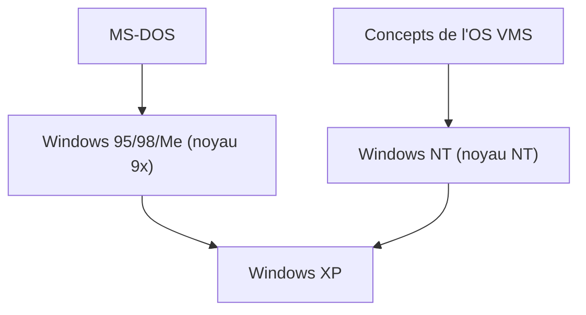

## 1. MS-DOS et Windows 1.0 à 3.1
Les premières versions de Windows n'étaient pas des systèmes d'exploitation indépendants, mais seulement des environnements shell GUI fonctionnant sur MS-DOS. Cependant, la diffusion de Windows 3.1 a définitivement marqué l'adoption de la GUI pour les PC.

## 2. Le choc de Windows 95
En 1995, Windows 95 est sorti. L'introduction du bouton Démarrer et de la barre des tâches, ainsi que l'intégration standard des fonctionnalités de connexion à Internet, en ont fait un succès explosif dans le monde entier.

## 3. L'intégration dans l'architecture NT
Le noyau de la série 9x destiné au grand public était instable, tandis que Windows NT, destiné aux entreprises, était robuste. En 2001, avec « Windows XP », les deux ont finalement été unifiés sous le noyau NT.

## 4. Windows 10/11 et le présent
Aujourd'hui, il continue d'évoluer en tant que Windows as a Service et s'est considérablement transformé en un environnement convivial pour les développeurs, intégrant notamment WSL (Windows Subsystem for Linux).

## Partie de vérification technique supplémentaire 1

## Partie de vérification technique supplémentaire 2

## Partie de vérification technique supplémentaire 3

## Partie de vérification technique supplémentaire 4

## Partie de vérification technique supplémentaire 5

## Partie de vérification technique supplémentaire 6

## Partie de vérification technique supplémentaire 7

## Partie de vérification technique supplémentaire 8

## Partie de vérification technique supplémentaire 9

## Partie de vérification technique supplémentaire 10

## Partie de vérification technique supplémentaire 11

## Partie de vérification technique supplémentaire 12

## Partie de vérification technique supplémentaire 13

## Partie de vérification technique supplémentaire 14

