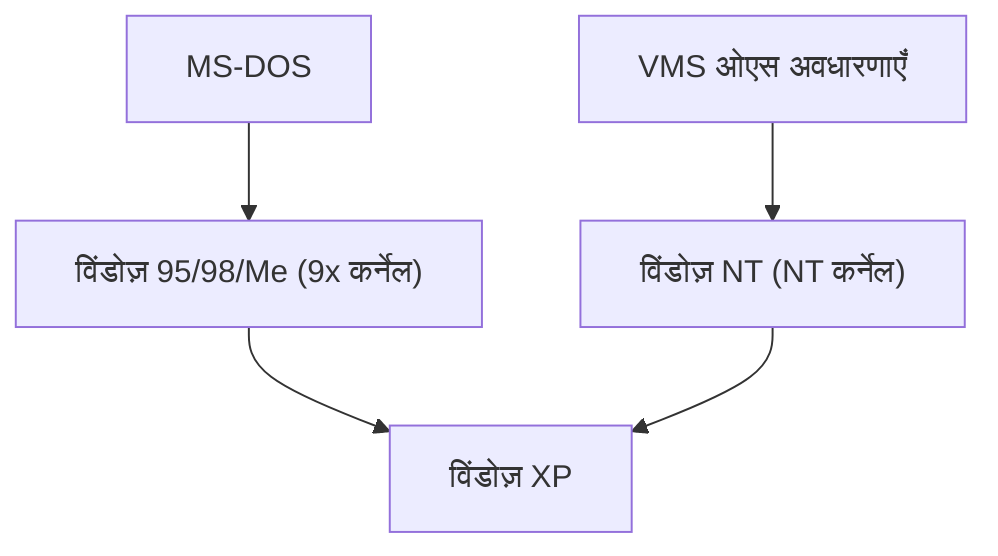

## 1. MS-DOS और विंडोज़ 1.0〜3.1
शुरुआती विंडोज़ एक स्वतंत्र ओएस नहीं था, बल्कि MS-DOS पर चलने वाला सिर्फ एक GUI शेल वातावरण था। हालाँकि, विंडोज़ 3.1 के लोकप्रिय होने से पीसी के लिए GUI का उपयोग तय हो गया।

## 2. विंडोज़ 95 का प्रभाव
1995 में, विंडोज़ 95 रिलीज़ हुआ। इसमें स्टार्ट बटन और टास्कबार पेश किया गया, और इंटरनेट कनेक्शन की सुविधा मानक रूप से शामिल होने के कारण, यह दुनिया भर में एक जबरदस्त हिट बन गया।

## 3. NT आर्किटेक्चर में एकीकरण
उपभोक्ताओं के लिए 9x-सीरीज़ कर्नेल अस्थिर था, लेकिन व्यावसायिक उपयोग के लिए विंडोज़ NT मजबूत था। 2001 में "विंडोज़ XP" के साथ, अंततः दोनों को NT कर्नेल में एकीकृत कर दिया गया।

## 4. विंडोज़ 10/11 और वर्तमान
वर्तमान में, यह Windows as a Service के रूप में विकसित हो रहा है, और WSL (लिनक्स के लिए विंडोज़ सबसिस्टम) जैसी सुविधाओं को शामिल करके यह एक डेवलपर-अनुकूल वातावरण में काफी हद तक बदल गया है।

## अतिरिक्त तकनीकी सत्यापन भाग 1

## अतिरिक्त तकनीकी सत्यापन भाग 2

## अतिरिक्त तकनीकी सत्यापन भाग 3

## अतिरिक्त तकनीकी सत्यापन भाग 4

## अतिरिक्त तकनीकी सत्यापन भाग 5

## अतिरिक्त तकनीकी सत्यापन भाग 6

### 4. विंडोज़ 10/11 और वर्तमान
वर्तमान में, यह Windows as a Service के रूप में विकसित हो रहा है, और WSL (लिनक्स के लिए विंडोज़ सबसिस्टम) जैसी सुविधाओं को शामिल करके यह एक डेवलपर-अनुकूल वातावरण में काफी हद तक बदल गया है。

## अतिरिक्त तकनीकी सत्यापन भाग 7

## अतिरिक्त तकनीकी सत्यापन भाग 8

## अतिरिक्त तकनीकी सत्यापन भाग 9

## अतिरिक्त तकनीकी सत्यापन भाग 10

## अतिरिक्त तकनीकी सत्यापन भाग 11

## अतिरिक्त तकनीकी सत्यापन भाग 12

## अतिरिक्त तकनीकी सत्यापन भाग 13

## अतिरिक्त तकनीकी सत्यापन भाग 14

