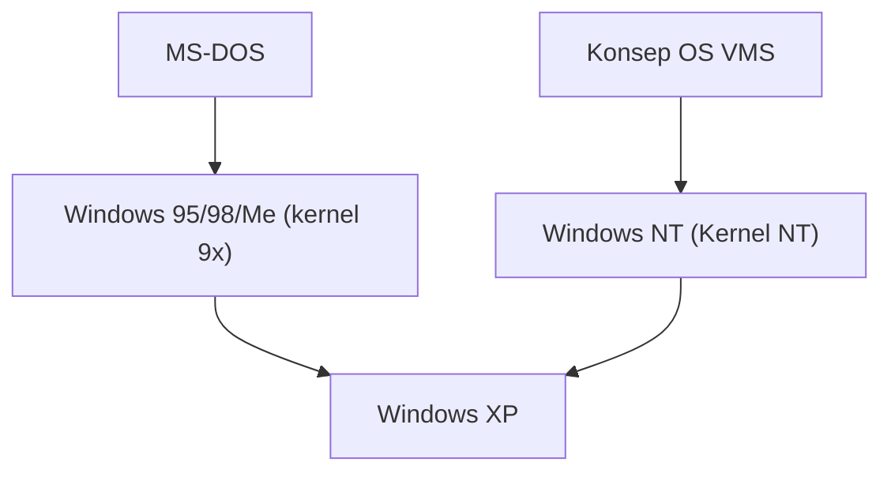

## 1. MS-DOS dan Windows 1.0〜3.1
Windows versi awal bukanlah OS yang berdiri sendiri, melainkan hanya lingkungan shell GUI yang berjalan di atas MS-DOS. Namun, popularitas Windows 3.1 memastikan transisi PC ke arah GUI.

## 2. Dampak Windows 95
Pada tahun 1995, Windows 95 dirilis. Dengan diperkenalkannya tombol Start dan taskbar, serta fungsi koneksi internet yang disertakan sebagai standar, sistem operasi ini mencatat kesuksesan luar biasa di seluruh dunia.

## 3. Integrasi ke Arsitektur NT
Kernel seri 9x untuk konsumen tidak stabil, sementara Windows NT untuk bisnis sangat tangguh. Melalui "Windows XP" pada tahun 2001, keduanya akhirnya diintegrasikan ke dalam kernel NT.

## 4. Windows 10/11 dan Masa Kini
Saat ini, Windows terus berevolusi sebagai Windows as a Service, dan dengan disematkannya WSL (Windows Subsystem for Linux), lingkungan ini telah banyak berubah menjadi lebih ramah pengembang.

## Bagian Verifikasi Teknologi Tambahan 1

### 1. MS-DOS dan Windows 1.0〜3.1
Windows versi awal bukanlah OS yang berdiri sendiri, melainkan hanya lingkungan shell GUI yang berjalan di atas MS-DOS. Namun, popularitas Windows 3.1 memastikan transisi PC ke arah GUI.

### 2. Dampak Windows 95
Pada tahun 1995, Windows 95 dirilis. Dengan diperkenalkannya tombol Start dan taskbar, serta fungsi koneksi internet yang disertakan sebagai standar, sistem operasi ini mencatat kesuksesan luar biasa di seluruh dunia.

### 3. Integrasi ke Arsitektur NT
Kernel seri 9x untuk konsumen tidak stabil, sementara Windows NT untuk bisnis sangat tangguh. Melalui "Windows XP" pada tahun 2001, keduanya akhirnya diintegrasikan ke dalam kernel NT.

### 4. Windows 10/11 dan Masa Kini
Saat ini, Windows terus berevolusi sebagai Windows as a Service, dan dengan disematkannya WSL (Windows Subsystem for Linux), lingkungan ini telah banyak berubah menjadi lebih ramah pengembang.

## Bagian Verifikasi Teknologi Tambahan 2

### 1. MS-DOS dan Windows 1.0〜3.1
Windows versi awal bukanlah OS yang berdiri sendiri, melainkan hanya lingkungan shell GUI yang berjalan di atas MS-DOS. Namun, popularitas Windows 3.1 memastikan transisi PC ke arah GUI.

### 2. Dampak Windows 95
Pada tahun 1995, Windows 95 dirilis. Dengan diperkenalkannya tombol Start dan taskbar, serta fungsi koneksi internet yang disertakan sebagai standar, sistem operasi ini mencatat kesuksesan luar biasa di seluruh dunia.

### 3. Integrasi ke Arsitektur NT
Kernel seri 9x untuk konsumen tidak stabil, sementara Windows NT untuk bisnis sangat tangguh. Melalui "Windows XP" pada tahun 2001, keduanya akhirnya diintegrasikan ke dalam kernel NT.

### 4. Windows 10/11 dan Masa Kini
Saat ini, Windows terus berevolusi sebagai Windows as a Service, dan dengan disematkannya WSL (Windows Subsystem for Linux), lingkungan ini telah banyak berubah menjadi lebih ramah pengembang.

## Bagian Verifikasi Teknologi Tambahan 3

### 1. MS-DOS dan Windows 1.0〜3.1
Windows versi awal bukanlah OS yang berdiri sendiri, melainkan hanya lingkungan shell GUI yang berjalan di atas MS-DOS. Namun, popularitas Windows 3.1 memastikan transisi PC ke arah GUI.

### 2. Dampak Windows 95
Pada tahun 1995, Windows 95 dirilis. Dengan diperkenalkannya tombol Start dan taskbar, serta fungsi koneksi internet yang disertakan sebagai standar, sistem operasi ini mencatat kesuksesan luar biasa di seluruh dunia.

### 3. Integrasi ke Arsitektur NT
Kernel seri 9x untuk konsumen tidak stabil, sementara Windows NT untuk bisnis sangat tangguh. Melalui "Windows XP" pada tahun 2001, keduanya akhirnya diintegrasikan ke dalam kernel NT.

### 4. Windows 10/11 dan Masa Kini
Saat ini, Windows terus berevolusi sebagai Windows as a Service, dan dengan disematkannya WSL (Windows Subsystem for Linux), lingkungan ini telah banyak berubah menjadi lebih ramah pengembang.

## Bagian Verifikasi Teknologi Tambahan 4

### 1. MS-DOS dan Windows 1.0〜3.1
Windows versi awal bukanlah OS yang berdiri sendiri, melainkan hanya lingkungan shell GUI yang berjalan di atas MS-DOS. Namun, popularitas Windows 3.1 memastikan transisi PC ke arah GUI.

### 2. Dampak Windows 95
Pada tahun 1995, Windows 95 dirilis. Dengan diperkenalkannya tombol Start dan taskbar, serta fungsi koneksi internet yang disertakan sebagai standar, sistem operasi ini mencatat kesuksesan luar biasa di seluruh dunia.

### 3. Integrasi ke Arsitektur NT
Kernel seri 9x untuk konsumen tidak stabil, sementara Windows NT untuk bisnis sangat tangguh. Melalui "Windows XP" pada tahun 2001, keduanya akhirnya diintegrasikan ke dalam kernel NT.

### 4. Windows 10/11 dan Masa Kini
Saat ini, Windows terus berevolusi sebagai Windows as a Service, dan dengan disematkannya WSL (Windows Subsystem for Linux), lingkungan ini telah banyak berubah menjadi lebih ramah pengembang.

## Bagian Verifikasi Teknologi Tambahan 5

### 1. MS-DOS dan Windows 1.0〜3.1
Windows versi awal bukanlah OS yang berdiri sendiri, melainkan hanya lingkungan shell GUI yang berjalan di atas MS-DOS. Namun, popularitas Windows 3.1 memastikan transisi PC ke arah GUI.

### 2. Dampak Windows 95
Pada tahun 1995, Windows 95 dirilis. Dengan diperkenalkannya tombol Start dan taskbar, serta fungsi koneksi internet yang disertakan sebagai standar, sistem operasi ini mencatat kesuksesan luar biasa di seluruh dunia.

### 3. Integrasi ke Arsitektur NT
Kernel seri 9x untuk konsumen tidak stabil, sementara Windows NT untuk bisnis sangat tangguh. Melalui "Windows XP" pada tahun 2001, keduanya akhirnya diintegrasikan ke dalam kernel NT.

### 4. Windows 10/11 dan Masa Kini
Saat ini, Windows terus berevolusi sebagai Windows as a Service, dan dengan disematkannya WSL (Windows Subsystem for Linux), lingkungan ini telah banyak berubah menjadi lebih ramah pengembang.

## Bagian Verifikasi Teknologi Tambahan 6

### 1. MS-DOS dan Windows 1.0〜3.1
Windows versi awal bukanlah OS yang berdiri sendiri, melainkan hanya lingkungan shell GUI yang berjalan di atas MS-DOS. Namun, popularitas Windows 3.1 memastikan transisi PC ke arah GUI.

### 2. Dampak Windows 95
Pada tahun 1995, Windows 95 dirilis. Dengan diperkenalkannya tombol Start dan taskbar, serta fungsi koneksi internet yang disertakan sebagai standar, sistem operasi ini mencatat kesuksesan luar biasa di seluruh dunia.

### 3. Integrasi ke Arsitektur NT
Kernel seri 9x untuk konsumen tidak stabil, sementara Windows NT untuk bisnis sangat tangguh. Melalui "Windows XP" pada tahun 2001, keduanya akhirnya diintegrasikan ke dalam kernel NT.

### 4. Windows 10/11 dan Masa Kini
Saat ini, Windows terus berevolusi sebagai Windows as a Service, dan dengan disematkannya WSL (Windows Subsystem for Linux), lingkungan ini telah banyak berubah menjadi lebih ramah pengembang.

## Bagian Verifikasi Teknologi Tambahan 7

### 1. MS-DOS dan Windows 1.0〜3.1
Windows versi awal bukanlah OS yang berdiri sendiri, melainkan hanya lingkungan shell GUI yang berjalan di atas MS-DOS. Namun, popularitas Windows 3.1 memastikan transisi PC ke arah GUI.

### 2. Dampak Windows 95
Pada tahun 1995, Windows 95 dirilis. Dengan diperkenalkannya tombol Start dan taskbar, serta fungsi koneksi internet yang disertakan sebagai standar, sistem operasi ini mencatat kesuksesan luar biasa di seluruh dunia.

### 3. Integrasi ke Arsitektur NT
Kernel seri 9x untuk konsumen tidak stabil, sementara Windows NT untuk bisnis sangat tangguh. Melalui "Windows XP" pada tahun 2001, keduanya akhirnya diintegrasikan ke dalam kernel NT.

### 4. Windows 10/11 dan Masa Kini
Saat ini, Windows terus berevolusi sebagai Windows as a Service, dan dengan disematkannya WSL (Windows Subsystem for Linux), lingkungan ini telah banyak berubah menjadi lebih ramah pengembang.

## Bagian Verifikasi Teknologi Tambahan 8

### 1. MS-DOS dan Windows 1.0〜3.1
Windows versi awal bukanlah OS yang berdiri sendiri, melainkan hanya lingkungan shell GUI yang berjalan di atas MS-DOS. Namun, popularitas Windows 3.1 memastikan transisi PC ke arah GUI.

### 2. Dampak Windows 95
Pada tahun 1995, Windows 95 dirilis. Dengan diperkenalkannya tombol Start dan taskbar, serta fungsi koneksi internet yang disertakan sebagai standar, sistem operasi ini mencatat kesuksesan luar biasa di seluruh dunia.

### 3. Integrasi ke Arsitektur NT
Kernel seri 9x untuk konsumen tidak stabil, sementara Windows NT untuk bisnis sangat tangguh. Melalui "Windows XP" pada tahun 2001, keduanya akhirnya diintegrasikan ke dalam kernel NT.

### 4. Windows 10/11 dan Masa Kini
Saat ini, Windows terus berevolusi sebagai Windows as a Service, dan dengan disematkannya WSL (Windows Subsystem for Linux), lingkungan ini telah banyak berubah menjadi lebih ramah pengembang.

## Bagian Verifikasi Teknologi Tambahan 9

### 1. MS-DOS dan Windows 1.0〜3.1
Windows versi awal bukanlah OS yang berdiri sendiri, melainkan hanya lingkungan shell GUI yang berjalan di atas MS-DOS. Namun, popularitas Windows 3.1 memastikan transisi PC ke arah GUI.

### 2. Dampak Windows 95
Pada tahun 1995, Windows 95 dirilis. Dengan diperkenalkannya tombol Start dan taskbar, serta fungsi koneksi internet yang disertakan sebagai standar, sistem operasi ini mencatat kesuksesan luar biasa di seluruh dunia.

### 3. Integrasi ke Arsitektur NT
Kernel seri 9x untuk konsumen tidak stabil, sementara Windows NT untuk bisnis sangat tangguh. Melalui "Windows XP" pada tahun 2001, keduanya akhirnya diintegrasikan ke dalam kernel NT.

### 4. Windows 10/11 dan Masa Kini
Saat ini, Windows terus berevolusi sebagai Windows as a Service, dan dengan disematkannya WSL (Windows Subsystem for Linux), lingkungan ini telah banyak berubah menjadi lebih ramah pengembang.

## Bagian Verifikasi Teknologi Tambahan 10

### 1. MS-DOS dan Windows 1.0〜3.1
Windows versi awal bukanlah OS yang berdiri sendiri, melainkan hanya lingkungan shell GUI yang berjalan di atas MS-DOS. Namun, popularitas Windows 3.1 memastikan transisi PC ke arah GUI.

### 2. Dampak Windows 95
Pada tahun 1995, Windows 95 dirilis. Dengan diperkenalkannya tombol Start dan taskbar, serta fungsi koneksi internet yang disertakan sebagai standar, sistem operasi ini mencatat kesuksesan luar biasa di seluruh dunia.

### 3. Integrasi ke Arsitektur NT
Kernel seri 9x untuk konsumen tidak stabil, sementara Windows NT untuk bisnis sangat tangguh. Melalui "Windows XP" pada tahun 2001, keduanya akhirnya diintegrasikan ke dalam kernel NT.

### 4. Windows 10/11 dan Masa Kini
Saat ini, Windows terus berevolusi sebagai Windows as a Service, dan dengan disematkannya WSL (Windows Subsystem for Linux), lingkungan ini telah banyak berubah menjadi lebih ramah pengembang.

## Bagian Verifikasi Teknologi Tambahan 11

### 1. MS-DOS dan Windows 1.0〜3.1
Windows versi awal bukanlah OS yang berdiri sendiri, melainkan hanya lingkungan shell GUI yang berjalan di atas MS-DOS. Namun, popularitas Windows 3.1 memastikan transisi PC ke arah GUI.

### 2. Dampak Windows 95
Pada tahun 1995, Windows 95 dirilis. Dengan diperkenalkannya tombol Start dan taskbar, serta fungsi koneksi internet yang disertakan sebagai standar, sistem operasi ini mencatat kesuksesan luar biasa di seluruh dunia.

### 3. Integrasi ke Arsitektur NT
Kernel seri 9x untuk konsumen tidak stabil, sementara Windows NT untuk bisnis sangat tangguh. Melalui "Windows XP" pada tahun 2001, keduanya akhirnya diintegrasikan ke dalam kernel NT.

### 4. Windows 10/11 dan Masa Kini
Saat ini, Windows terus berevolusi sebagai Windows as a Service, dan dengan disematkannya WSL (Windows Subsystem for Linux), lingkungan ini telah banyak berubah menjadi lebih ramah pengembang.

## Bagian Verifikasi Teknologi Tambahan 12

### 1. MS-DOS dan Windows 1.0〜3.1
Windows versi awal bukanlah OS yang berdiri sendiri, melainkan hanya lingkungan shell GUI yang berjalan di atas MS-DOS. Namun, popularitas Windows 3.1 memastikan transisi PC ke arah GUI.

### 2. Dampak Windows 95
Pada tahun 1995, Windows 95 dirilis. Dengan diperkenalkannya tombol Start dan taskbar, serta fungsi koneksi internet yang disertakan sebagai standar, sistem operasi ini mencatat kesuksesan luar biasa di seluruh dunia.

### 3. Integrasi ke Arsitektur NT
Kernel seri 9x untuk konsumen tidak stabil, sementara Windows NT untuk bisnis sangat tangguh. Melalui "Windows XP" pada tahun 2001, keduanya akhirnya diintegrasikan ke dalam kernel NT.

### 4. Windows 10/11 dan Masa Kini
Saat ini, Windows terus berevolusi sebagai Windows as a Service, dan dengan disematkannya WSL (Windows Subsystem for Linux), lingkungan ini telah banyak berubah menjadi lebih ramah pengembang.

## Bagian Verifikasi Teknologi Tambahan 13

### 1. MS-DOS dan Windows 1.0〜3.1
Windows versi awal bukanlah OS yang berdiri sendiri, melainkan hanya lingkungan shell GUI yang berjalan di atas MS-DOS. Namun, popularitas Windows 3.1 memastikan transisi PC ke arah GUI.

### 2. Dampak Windows 95
Pada tahun 1995, Windows 95 dirilis. Dengan diperkenalkannya tombol Start dan taskbar, serta fungsi koneksi internet yang disertakan sebagai standar, sistem operasi ini mencatat kesuksesan luar biasa di seluruh dunia.

### 3. Integrasi ke Arsitektur NT
Kernel seri 9x untuk konsumen tidak stabil, sementara Windows NT untuk bisnis sangat tangguh. Melalui "Windows XP" pada tahun 2001, keduanya akhirnya diintegrasikan ke dalam kernel NT.

### 4. Windows 10/11 dan Masa Kini
Saat ini, Windows terus berevolusi sebagai Windows as a Service, dan dengan disematkannya WSL (Windows Subsystem for Linux), lingkungan ini telah banyak berubah menjadi lebih ramah pengembang.

## Bagian Verifikasi Teknologi Tambahan 14

### 1. MS-DOS dan Windows 1.0〜3.1
Windows versi awal bukanlah OS yang berdiri sendiri, melainkan hanya lingkungan shell GUI yang berjalan di atas MS-DOS. Namun, popularitas Windows 3.1 memastikan transisi PC ke arah GUI.

### 2. Dampak Windows 95
Pada tahun 1995, Windows 95 dirilis. Dengan diperkenalkannya tombol Start dan taskbar, serta fungsi koneksi internet yang disertakan sebagai standar, sistem operasi ini mencatat kesuksesan luar biasa di seluruh dunia.

### 3. Integrasi ke Arsitektur NT
Kernel seri 9x untuk konsumen tidak stabil, sementara Windows NT untuk bisnis sangat tangguh. Melalui "Windows XP" pada tahun 2001, keduanya akhirnya diintegrasikan ke dalam kernel NT.

### 4. Windows 10/11 dan Masa Kini
Saat ini, Windows terus berevolusi sebagai Windows as a Service, dan dengan disematkannya WSL (Windows Subsystem for Linux), lingkungan ini telah banyak berubah menjadi lebih ramah pengembang.
