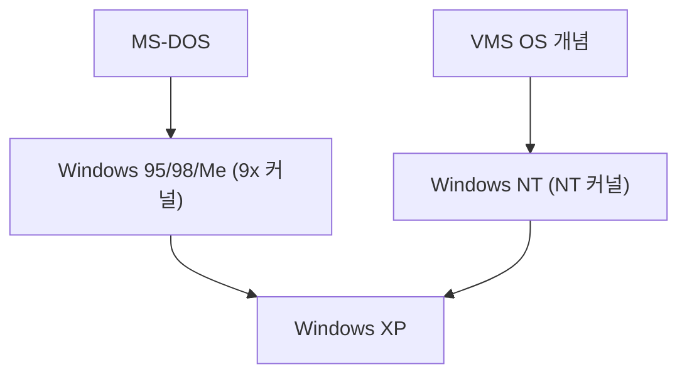

## 1. MS-DOS와 Windows 1.0〜3.1
초기의 Windows는 독립된 OS가 아니라, MS-DOS 위에서 동작하는 GUI 셸 환경에 불과했습니다. 그러나 Windows 3.1의 보급으로 PC의 GUI화가 결정지어졌습니다.

## 2. Windows 95의 충격
1995년, Windows 95가 발매. 시작 버튼이나 작업 표시줄이 도입되고 인터넷 접속 기능이 기본 탑재됨으로써, 전 세계적으로 폭발적인 히트를 기록했습니다.

## 3. NT 아키텍처로의 통합
일반 소비자용인 9x계 커널은 불안정했지만, 비즈니스용인 Windows NT는 견고했습니다. 2001년의 「Windows XP」를 통해, 마침내 양자는 NT 커널로 통합되었습니다.

## 4. Windows 10/11과 현재
현재는 Windows as a Service로서 진화를 계속하며, WSL (Windows Subsystem for Linux)을 탑재하는 등 개발자 친화적인 환경으로 크게 변화하고 있습니다.

## 추가 기술 검증 파트 1

## 추가 기술 검증 파트 2

## 추가 기술 검증 파트 3

## 추가 기술 검증 파트 4

## 추가 기술 검증 파트 5

## 추가 기술 검증 파트 6

## 추가 기술 검증 파트 7

## 추가 기술 검증 파트 8

## 추가 기술 검증 파트 9

## 추가 기술 검증 파트 10

## 추가 기술 검증 파트 11

## 추가 기술 검증 파트 12

## 추가 기술 검증 파트 13

## 추가 기술 검증 파트 14

