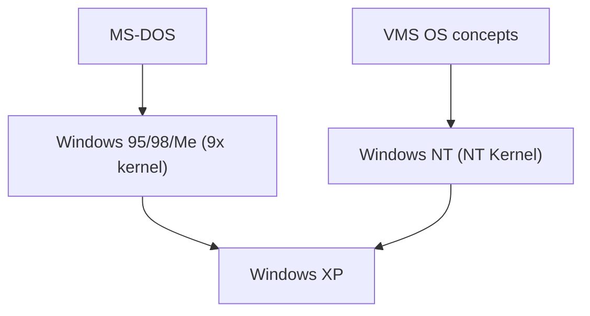

## 1. MS-DOSとWindows 1.0〜3.1
初期のWindowsは独立したOSではなく、MS-DOS上で動くGUIシェル環境に過ぎませんでした。しかし、Windows 3.1の普及によりPCのGUI化が決定づけられました。

## 2. Windows 95の衝撃
1995年、Windows 95が発売。スタートボタンやタスクバーが導入され、インターネットへの接続機能が標準搭載されたことで、世界中で爆発的なヒットを記録しました。

## 3. NTアーキテクチャへの統合
コンシューマー向けの9x系カーネルは不安定でしたが、ビジネス向けのWindows NTは堅牢でした。2001年の「Windows XP」により、ついに両者はNTカーネルに統合されました。

## 4. Windows 10/11と現在
現在はWindows as a Serviceとして進化を続け、WSL (Windows Subsystem for Linux) を搭載するなど、開発者フレンドリーな環境へと大きく変化しています。

## 追加技術検証パート 1

### 1. MS-DOSとWindows 1.0〜3.1
初期のWindowsは独立したOSではなく、MS-DOS上で動くGUIシェル環境に過ぎませんでした。しかし、Windows 3.1の普及によりPCのGUI化が決定づけられました。

### 2. Windows 95の衝撃
1995年、Windows 95が発売。スタートボタンやタスクバーが導入され、インターネットへの接続機能が標準搭載されたことで、世界中で爆発的なヒットを記録しました。

### 3. NTアーキテクチャへの統合
コンシューマー向けの9x系カーネルは不安定でしたが、ビジネス向けのWindows NTは堅牢でした。2001年の「Windows XP」により、ついに両者はNTカーネルに統合されました。

### 4. Windows 10/11と現在
現在はWindows as a Serviceとして進化を続け、WSL (Windows Subsystem for Linux) を搭載するなど、開発者フレンドリーな環境へと大きく変化しています。

## 追加技術検証パート 2

### 1. MS-DOSとWindows 1.0〜3.1
初期のWindowsは独立したOSではなく、MS-DOS上で動くGUIシェル環境に過ぎませんでした。しかし、Windows 3.1の普及によりPCのGUI化が決定づけられました。

### 2. Windows 95の衝撃
1995年、Windows 95が発売。スタートボタンやタスクバーが導入され、インターネットへの接続機能が標準搭載されたことで、世界中で爆発的なヒットを記録しました。

### 3. NTアーキテクチャへの統合
コンシューマー向けの9x系カーネルは不安定でしたが、ビジネス向けのWindows NTは堅牢でした。2001年の「Windows XP」により、ついに両者はNTカーネルに統合されました。

### 4. Windows 10/11と現在
現在はWindows as a Serviceとして進化を続け、WSL (Windows Subsystem for Linux) を搭載するなど、開発者フレンドリーな環境へと大きく変化しています。

## 追加技術検証パート 3

### 1. MS-DOSとWindows 1.0〜3.1
初期のWindowsは独立したOSではなく、MS-DOS上で動くGUIシェル環境に過ぎませんでした。しかし、Windows 3.1の普及によりPCのGUI化が決定づけられました。

### 2. Windows 95の衝撃
1995年、Windows 95が発売。スタートボタンやタスクバーが導入され、インターネットへの接続機能が標準搭載されたことで、世界中で爆発的なヒットを記録しました。

### 3. NTアーキテクチャへの統合
コンシューマー向けの9x系カーネルは不安定でしたが、ビジネス向けのWindows NTは堅牢でした。2001年の「Windows XP」により、ついに両者はNTカーネルに統合されました。

### 4. Windows 10/11と現在
現在はWindows as a Serviceとして進化を続け、WSL (Windows Subsystem for Linux) を搭載するなど、開発者フレンドリーな環境へと大きく変化しています。

## 追加技術検証パート 4

### 1. MS-DOSとWindows 1.0〜3.1
初期のWindowsは独立したOSではなく、MS-DOS上で動くGUIシェル環境に過ぎませんでした。しかし、Windows 3.1の普及によりPCのGUI化が決定づけられました。

### 2. Windows 95の衝撃
1995年、Windows 95が発売。スタートボタンやタスクバーが導入され、インターネットへの接続機能が標準搭載されたことで、世界中で爆発的なヒットを記録しました。

### 3. NTアーキテクチャへの統合
コンシューマー向けの9x系カーネルは不安定でしたが、ビジネス向けのWindows NTは堅牢でした。2001年の「Windows XP」により、ついに両者はNTカーネルに統合されました。

### 4. Windows 10/11と現在
現在はWindows as a Serviceとして進化を続け、WSL (Windows Subsystem for Linux) を搭載するなど、開発者フレンドリーな環境へと大きく変化しています。

## 追加技術検証パート 5

### 1. MS-DOSとWindows 1.0〜3.1
初期のWindowsは独立したOSではなく、MS-DOS上で動くGUIシェル環境に過ぎませんでした。しかし、Windows 3.1の普及によりPCのGUI化が決定づけられました。

### 2. Windows 95の衝撃
1995年、Windows 95が発売。スタートボタンやタスクバーが導入され、インターネットへの接続機能が標準搭載されたことで、世界中で爆発的なヒットを記録しました。

### 3. NTアーキテクチャへの統合
コンシューマー向けの9x系カーネルは不安定でしたが、ビジネス向けのWindows NTは堅牢でした。2001年の「Windows XP」により、ついに両者はNTカーネルに統合されました。

### 4. Windows 10/11と現在
現在はWindows as a Serviceとして進化を続け、WSL (Windows Subsystem for Linux) を搭載するなど、開発者フレンドリーな環境へと大きく変化しています。

## 追加技術検証パート 6

### 1. MS-DOSとWindows 1.0〜3.1
初期のWindowsは独立したOSではなく、MS-DOS上で動くGUIシェル環境に過ぎませんでした。しかし、Windows 3.1の普及によりPCのGUI化が決定づけられました。

### 2. Windows 95の衝撃
1995年、Windows 95が発売。スタートボタンやタスクバーが導入され、インターネットへの接続機能が標準搭載されたことで、世界中で爆発的なヒットを記録しました。

### 3. NTアーキテクチャへの統合
コンシューマー向けの9x系カーネルは不安定でしたが、ビジネス向けのWindows NTは堅牢でした。2001年の「Windows XP」により、ついに両者はNTカーネルに統合されました。

### 4. Windows 10/11と現在
現在はWindows as a Serviceとして進化を続け、WSL (Windows Subsystem for Linux) を搭載するなど、開発者フレンドリーな環境へと大きく変化しています。

## 追加技術検証パート 7

### 1. MS-DOSとWindows 1.0〜3.1
初期のWindowsは独立したOSではなく、MS-DOS上で動くGUIシェル環境に過ぎませんでした。しかし、Windows 3.1の普及によりPCのGUI化が決定づけられました。

### 2. Windows 95の衝撃
1995年、Windows 95が発売。スタートボタンやタスクバーが導入され、インターネットへの接続機能が標準搭載されたことで、世界中で爆発的なヒットを記録しました。

### 3. NTアーキテクチャへの統合
コンシューマー向けの9x系カーネルは不安定でしたが、ビジネス向けのWindows NTは堅牢でした。2001年の「Windows XP」により、ついに両者はNTカーネルに統合されました。

### 4. Windows 10/11と現在
現在はWindows as a Serviceとして進化を続け、WSL (Windows Subsystem for Linux) を搭載するなど、開発者フレンドリーな環境へと大きく変化しています。

## 追加技術検証パート 8

### 1. MS-DOSとWindows 1.0〜3.1
初期のWindowsは独立したOSではなく、MS-DOS上で動くGUIシェル環境に過ぎませんでした。しかし、Windows 3.1の普及によりPCのGUI化が決定づけられました。

### 2. Windows 95の衝撃
1995年、Windows 95が発売。スタートボタンやタスクバーが導入され、インターネットへの接続機能が標準搭載されたことで、世界中で爆発的なヒットを記録しました。

### 3. NTアーキテクチャへの統合
コンシューマー向けの9x系カーネルは不安定でしたが、ビジネス向けのWindows NTは堅牢でした。2001年の「Windows XP」により、ついに両者はNTカーネルに統合されました。

### 4. Windows 10/11と現在
現在はWindows as a Serviceとして進化を続け、WSL (Windows Subsystem for Linux) を搭載するなど、開発者フレンドリーな環境へと大きく変化しています。

## 追加技術検証パート 9

### 1. MS-DOSとWindows 1.0〜3.1
初期のWindowsは独立したOSではなく、MS-DOS上で動くGUIシェル環境に過ぎませんでした。しかし、Windows 3.1の普及によりPCのGUI化が決定づけられました。

### 2. Windows 95の衝撃
1995年、Windows 95が発売。スタートボタンやタスクバーが導入され、インターネットへの接続機能が標準搭載されたことで、世界中で爆発的なヒットを記録しました。

### 3. NTアーキテクチャへの統合
コンシューマー向けの9x系カーネルは不安定でしたが、ビジネス向けのWindows NTは堅牢でした。2001年の「Windows XP」により、ついに両者はNTカーネルに統合されました。

### 4. Windows 10/11と現在
現在はWindows as a Serviceとして進化を続け、WSL (Windows Subsystem for Linux) を搭載するなど、開発者フレンドリーな環境へと大きく変化しています。

## 追加技術検証パート 10

### 1. MS-DOSとWindows 1.0〜3.1
初期のWindowsは独立したOSではなく、MS-DOS上で動くGUIシェル環境に過ぎませんでした。しかし、Windows 3.1の普及によりPCのGUI化が決定づけられました。

### 2. Windows 95の衝撃
1995年、Windows 95が発売。スタートボタンやタスクバーが導入され、インターネットへの接続機能が標準搭載されたことで、世界中で爆発的なヒットを記録しました。

### 3. NTアーキテクチャへの統合
コンシューマー向けの9x系カーネルは不安定でしたが、ビジネス向けのWindows NTは堅牢でした。2001年の「Windows XP」により、ついに両者はNTカーネルに統合されました。

### 4. Windows 10/11と現在
現在はWindows as a Serviceとして進化を続け、WSL (Windows Subsystem for Linux) を搭載するなど、開発者フレンドリーな環境へと大きく変化しています。

## 追加技術検証パート 11

### 1. MS-DOSとWindows 1.0〜3.1
初期のWindowsは独立したOSではなく、MS-DOS上で動くGUIシェル環境に過ぎませんでした。しかし、Windows 3.1の普及によりPCのGUI化が決定づけられました。

### 2. Windows 95の衝撃
1995年、Windows 95が発売。スタートボタンやタスクバーが導入され、インターネットへの接続機能が標準搭載されたことで、世界中で爆発的なヒットを記録しました。

### 3. NTアーキテクチャへの統合
コンシューマー向けの9x系カーネルは不安定でしたが、ビジネス向けのWindows NTは堅牢でした。2001年の「Windows XP」により、ついに両者はNTカーネルに統合されました。

### 4. Windows 10/11と現在
現在はWindows as a Serviceとして進化を続け、WSL (Windows Subsystem for Linux) を搭載するなど、開発者フレンドリーな環境へと大きく変化しています。

## 追加技術検証パート 12

### 1. MS-DOSとWindows 1.0〜3.1
初期のWindowsは独立したOSではなく、MS-DOS上で動くGUIシェル環境に過ぎませんでした。しかし、Windows 3.1の普及によりPCのGUI化が決定づけられました。

### 2. Windows 95の衝撃
1995年、Windows 95が発売。スタートボタンやタスクバーが導入され、インターネットへの接続機能が標準搭載されたことで、世界中で爆発的なヒットを記録しました。

### 3. NTアーキテクチャへの統合
コンシューマー向けの9x系カーネルは不安定でしたが、ビジネス向けのWindows NTは堅牢でした。2001年の「Windows XP」により、ついに両者はNTカーネルに統合されました。

### 4. Windows 10/11と現在
現在はWindows as a Serviceとして進化を続け、WSL (Windows Subsystem for Linux) を搭載するなど、開発者フレンドリーな環境へと大きく変化しています。

## 追加技術検証パート 13

### 1. MS-DOSとWindows 1.0〜3.1
初期のWindowsは独立したOSではなく、MS-DOS上で動くGUIシェル環境に過ぎませんでした。しかし、Windows 3.1の普及によりPCのGUI化が決定づけられました。

### 2. Windows 95の衝撃
1995年、Windows 95が発売。スタートボタンやタスクバーが導入され、インターネットへの接続機能が標準搭載されたことで、世界中で爆発的なヒットを記録しました。

### 3. NTアーキテクチャへの統合
コンシューマー向けの9x系カーネルは不安定でしたが、ビジネス向けのWindows NTは堅牢でした。2001年の「Windows XP」により、ついに両者はNTカーネルに統合されました。

### 4. Windows 10/11と現在
現在はWindows as a Serviceとして進化を続け、WSL (Windows Subsystem for Linux) を搭載するなど、開発者フレンドリーな環境へと大きく変化しています。

## 追加技術検証パート 14

### 1. MS-DOSとWindows 1.0〜3.1
初期のWindowsは独立したOSではなく、MS-DOS上で動くGUIシェル環境に過ぎませんでした。しかし、Windows 3.1の普及によりPCのGUI化が決定づけられました。

### 2. Windows 95の衝撃
1995年、Windows 95が発売。スタートボタンやタスクバーが導入され、インターネットへの接続機能が標準搭載されたことで、世界中で爆発的なヒットを記録しました。

### 3. NTアーキテクチャへの統合
コンシューマー向けの9x系カーネルは不安定でしたが、ビジネス向けのWindows NTは堅牢でした。2001年の「Windows XP」により、ついに両者はNTカーネルに統合されました。

### 4. Windows 10/11と現在
現在はWindows as a Serviceとして進化を続け、WSL (Windows Subsystem for Linux) を搭載するなど、開発者フレンドリーな環境へと大きく変化しています。
