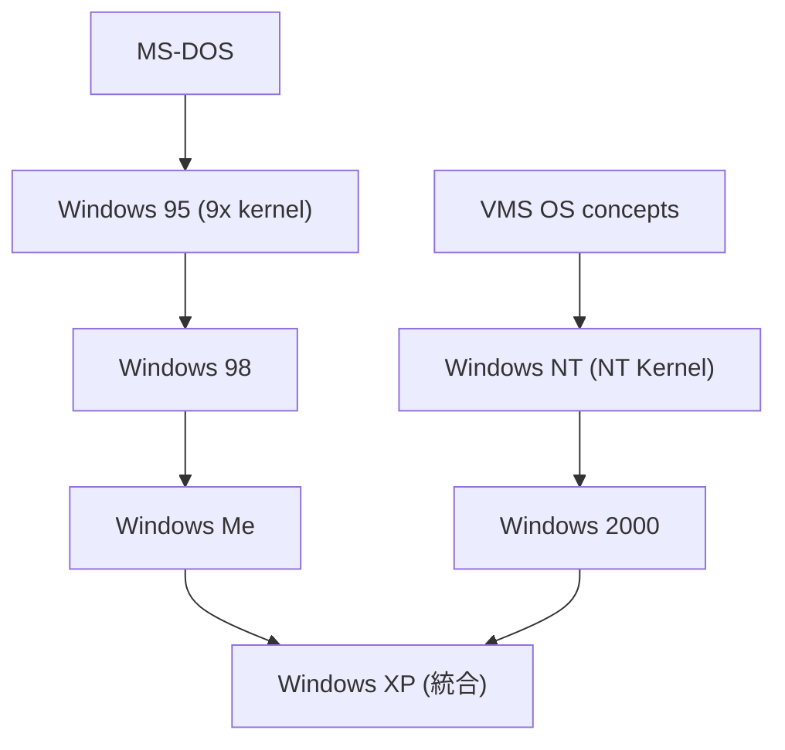

現代のパーソナルコンピューティングにおいて、Microsoft Windowsが果たしてきた役割の大きさを否定する人はいないでしょう。オフィスでの事務作業から、最新のPCゲーム、そしてソフトウェア開発に至るまで、Windowsは世界中で最も広く使われているオペレーティングシステム（OS）として君臨しています。

本記事では、Windowsがどのようにして生まれ、CUI（キャラクターユーザーインターフェース）の時代からGUI（グラフィカルユーザーインターフェース）へと移行し、そして現代の強固なNTアーキテクチャへと進化を遂げてきたのか、その長く興味深い歴史を詳細に振り返ります。

## 1. 黎明期：MS-DOSの時代とWindowsの誕生

Windowsの歴史を語る上で、その土台となった「MS-DOS」の存在を無視することはできません。1980年代前半、パーソナルコンピューター（PC）の操作はキーボードからコマンドを入力するCUIが主流でした。MicrosoftはIBM PC向けのOSとして「MS-DOS」を開発し、PC市場で圧倒的なシェアを獲得しました。

しかし、Appleが1984年にMacintoshを発売し、マウスを使った直感的な操作（GUI）の可能性を世界に示すと、Microsoftもそれに追随する必要に迫られました。

### Windows 1.0 (1985年)
1985年、Microsoftは「Windows 1.0」をリリースしました。これは厳密には独立したOSではなく、MS-DOS上で動作する「GUI環境（オペレーティング環境）」に過ぎませんでした。ウィンドウを重ねて表示することができず、タイル状に並べることしかできないなど、機能的にはまだまだ未成熟でしたが、マウスを使った操作やマルチタスクの概念をPC/AT互換機の世界に持ち込んだという点で、記念碑的な製品でした。

### Windows 2.0 (1987年) / Windows 3.0 (1990年)
その後リリースされたWindows 2.0では、ようやくウィンドウの重ね合わせ（オーバーラップ）が可能になりました。さらに、ExcelやWordといった強力なアプリケーションが登場し始めたことで、ビジネス用途での利用が徐々に広がり始めます。

1990年に登場したWindows 3.0は、VGAグラフィックスをサポートし、より洗練されたユーザーインターフェースを備え、初めて商業的に大きな成功を収めました。これにより、「PCのGUI化」というトレンドはもはや不可逆なものとなりました。

### Windows 3.1 (1992年)
Windows 3.1は、マルチメディア機能の強化、TrueTypeフォントのサポートなどが行われ、一般家庭にもPCとGUIが普及する大きな原動力となりました。日本でも「DOS/V」とWindows 3.1の組み合わせにより、NECのPC-9800シリーズの牙城が崩れ始めるという、PC市場の歴史的な転換点を迎えることになります。

## 2. 革命：Windows 95の衝撃とインターネット時代の幕開け

1995年は、IT業界において最も熱狂的な年のひとつとして記憶されています。その中心にあったのが「Windows 95」です。

### 全く新しいユーザーインターフェース
Windows 95は、それまでのプログラムマネージャーとファイルマネージャーを廃止し、現在でも使われている「スタートボタン」や「タスクバー」、「デスクトップ」といったUIの概念を導入しました。これにより、コンピュータ初心者でも直感的にアプリケーションを起動し、ファイルを管理できるようになりました。

### プラグアンドプレイと32ビット化
ハードウェアを接続するだけでOSが自動的に認識して設定を行う「プラグアンドプレイ（PnP）」が導入され、周辺機器の追加が劇的に簡単になりました（初期はトラブルも多く「プラグ・アンド・プレイ（祈る）」と皮肉られることもありましたが）。また、本格的な32ビットOSとしての基盤を築き、プリエンプティブ・マルチタスクの導入により、複数のアプリケーションを安定して同時に実行できるようになりました。

### インターネットへの接続
Windows 95の後期バージョン（OSR2以降）や、追加パックである「Microsoft Plus!」を通じて「Internet Explorer」が提供され、PCがインターネットに接続されるのが当たり前の時代を牽引しました。

## 3. 9x系の終焉とNTアーキテクチャの台頭

Windows 95の大成功の後、Microsoftは消費者向けの「9x系」OSと、企業向けの「NT系」OSという2つのラインを並行して開発する体制をとっていました。

### Windows 98 (1998年) と Windows Me (2000年)
Windows 98は、95の拡張版としてUSBの本格サポートやインターネットとの統合（Active Desktopなど）を進めました。続くWindows Me（Millennium Edition）は、システム復元機能やメディアプレイヤーの強化など、ホームユーザー向けの機能を盛り込みました。

しかし、これらの「9x系」OSは、内部的にMS-DOSとの互換性を引きずっていたため、リソース管理の甘さやカーネルの設計上の限界から、システムが不安定になりやすい（ブルースクリーンが頻発する）という致命的な弱点を抱えていました。

### Windows NTの進化
一方、1993年に登場した「Windows NT（New Technology）」は、全く異なる系譜に属していました。Microsoftは、かつてDECのVMSを設計した天才エンジニア、デヴィッド・カトラーを招聘し、ゼロから新しいOSカーネルを設計させました。

NTカーネルは、完全な32ビットアーキテクチャ、強力なメモリ保護、高度なセキュリティ機能、そしてマルチプロセッサのサポートなど、ミッションクリティカルな用途に耐えうる堅牢な設計を持っていました。当初は要求スペックが高く一般向けではありませんでしたが、Windows NT 4.0でWindows 95風のUIを獲得し、さらに「Windows 2000」で安定性と機能性が極まり、企業向けクライアントおよびサーバーOSとして絶大な信頼を勝ち取りました。

## 4. 歴史的統合：Windows XPとNTカーネルの勝利

2001年、MicrosoftはPCの歴史における重要なマイルストーンとなる「Windows XP」をリリースしました。

Windows XPの最大の功績は、ついに不安定だった9x系カーネルを廃止し、コンシューマー向けOSとビジネス向けOSの基盤を「NTカーネル」に完全に統合したことです。これにより、一般の家庭用PCでも、Windows 2000クラスの極めて高い安定性を享受できるようになりました。

「Luna」と呼ばれるカラフルで親しみやすい新しいユーザーインターフェース、強化されたマルチメディア機能、デジタルカメラや無線LANのサポートなど、XPは現代のPCライフスタイルの土台を完成させたOSと言えます。XPはあまりに完成度が高かったため、後継OSの普及後も長年にわたり多くのユーザーに愛用され続けました。

## 5. セキュリティとモダン化：VistaからWindows 7へ

Windows XPが長く使われる中で、インターネット上の脅威（マルウェアやスパイウェアなど）は急激に進化し、XPの初期のセキュリティアーキテクチャでは対応しきれない状況が生まれていました。

### Windows Vista (2006年)
Windows Vistaは、システムの根本的なセキュリティ強化（UAC：ユーザーアカウント制御の導入など）を主眼に置いて開発されました。さらに「Aero」と呼ばれる半透明の美しいグラス風UIを導入しました。しかし、強固なセキュリティ機能がユーザーに煩わしい警告を連発したことや、当時のPCの平均的なスペックに対して要求リソースが高すぎたため、動作が重いと批判され、商業的には苦戦を強いられました。

### Windows 7 (2009年)
Vistaで培われた新しいアーキテクチャを洗練し、パフォーマンスを大幅に改善したのがWindows 7です。タスクバーの改良やUIの調整が行われ、XP以来の「軽快で安定した使いやすいOS」として大成功を収めました。Windows 7は多くの企業で標準OSとして採用され、XPに次ぐ長期政権を築きました。

## 6. タッチインターフェースの模索：Windows 8からWindows 10へ

2010年代に入ると、AppleのiPadをはじめとするタブレット端末やスマートフォンの台頭により、「タッチ操作」がコンピューティングの新たなトレンドとなりました。

### Windows 8 (2012年) / Windows 8.1 (2013年)
MicrosoftはタブレットとPCをシームレスに統合しようと試み、Windows 8をリリースしました。スタートボタンを廃止し、タイル状の全画面UI（Modern UI）を強制したことは、従来のPCユーザーからの激しい反発を招きました。のちのWindows 8.1でスタートボタンが一部復活するなどの妥協が図られましたが、PCとタブレットの統合という野心的な試みは、一時的な混乱をもたらしました。

### Windows 10 (2015年)
Windows 8の反省を踏まえ、Microsoftは「Windows 10」で従来のデスクトップUIと新しいタッチUIのバランスを巧みに取り戻しました。スタートメニューが復活し、仮想デスクトップなど現代的な生産性向上機能が追加されました。

さらに、Windows 10は「Windows as a Service（サービスとしてのWindows）」という新しい概念を導入しました。数年おきに新しいメジャーバージョンをリリースする旧来のビジネスモデルを廃止し、年に数回の大型アップデートを無料で提供することで、OSを継続的に進化させる方針へと転換しました。

また、開発者向けには「WSL (Windows Subsystem for Linux)」が搭載され、Windows上で直接Linux環境を動作させることが可能になりました。これにより、Windowsはウェブ開発者やデータサイエンティストにとっても極めて魅力的なプラットフォームへと変貌を遂げました。

## 7. そして現在：Windows 11とAIの融合へ

2021年に登場した「Windows 11」は、Windows 10の堅牢な基盤を引き継ぎつつ、ユーザーインターフェースを根本から再設計しました。スタートボタンが中央に配置され、角丸のデザインが多用されるなど、よりモダンで洗練された外観となりました。

また、近年のIT業界最大のトレンドである「AI（人工知能）」の統合が強力に推進されています。「Windows Copilot」の導入により、OSレベルでAIアシスタントが統合され、設定の変更やドキュメントの要約、コードの生成などを自然言語で対話しながら行える時代が到来しています。

## おわりに

MS-DOSのシェルとしてひっそりと産声を上げたWindowsは、30年以上の歳月をかけて、数十億人が毎日利用する巨大で堅牢なプラットフォームへと進化しました。

かつての「不安定でブルースクリーンが頻発するOS」というイメージは、NTアーキテクチャへの統合によって完全に払拭されました。そして今、クラウドやAI、Linuxとの融合といった新しい波に乗りながら、Windowsは次世代のコンピューティング環境に向けて絶え間なく進化を続けています。

テクノロジーの歴史において、これほど長期間にわたり第一線で適応し、世界を変え続けたソフトウェアは他に類を見ません。私たちが普段何気なくクリックしている「スタートボタン」の背後には、数多くの天才エンジニアたちの挑戦と、数々のドラマチックな歴史が隠されているのです。
