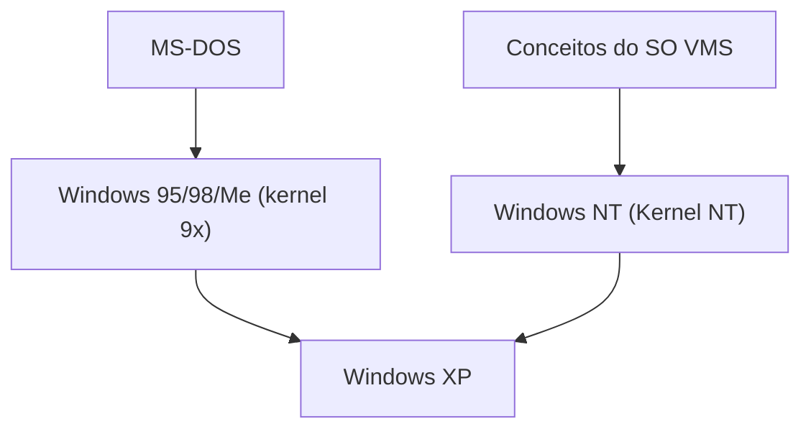

## 1. MS-DOS e Windows 1.0〜3.1
As primeiras versões do Windows não eram sistemas operacionais independentes, mas apenas ambientes de shell GUI executados sobre o MS-DOS. No entanto, a popularização do Windows 3.1 consolidou a transição dos PCs para interfaces GUI.

## 2. O Impacto do Windows 95
Em 1995, o Windows 95 foi lançado. Com a introdução do botão Iniciar e da barra de tarefas, além de recursos de conexão à Internet incluídos por padrão, tornou-se um sucesso estrondoso em todo o mundo.

## 3. Integração na Arquitetura NT
O kernel da família 9x voltado para o consumidor era instável, mas o Windows NT voltado para negócios era robusto. Com o "Windows XP" em 2001, ambos foram finalmente integrados no kernel NT.

## 4. Windows 10/11 e o Presente
Atualmente, continua evoluindo como Windows as a Service, incluindo o WSL (Windows Subsystem for Linux), mudando drasticamente para um ambiente amigável aos desenvolvedores.

## Parte de Verificação Técnica Adicional 1

## Parte de Verificação Técnica Adicional 2

## Parte de Verificação Técnica Adicional 3

## Parte de Verificação Técnica Adicional 4

## Parte de Verificação Técnica Adicional 5

## Parte de Verificação Técnica Adicional 6

## Parte de Verificação Técnica Adicional 7

## Parte de Verificação Técnica Adicional 8

## Parte de Verificação Técnica Adicional 9

## Parte de Verificação Técnica Adicional 10

## Parte de Verificação Técnica Adicional 11

## Parte de Verificação Técnica Adicional 12

## Parte de Verificação Técnica Adicional 13

## Parte de Verificação Técnica Adicional 14

