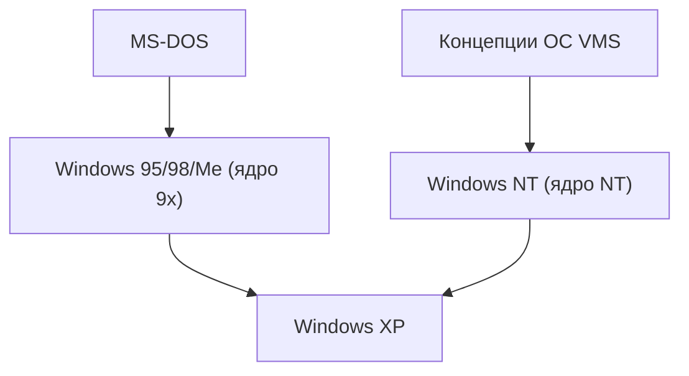

## 1. MS-DOS и Windows 1.0–3.1
Ранние версии Windows не были самостоятельными операционными системами, а представляли собой лишь среду GUI-оболочки, работающую поверх MS-DOS. Однако с распространением Windows 3.1 переход ПК на графический интерфейс был окончательно предопределен.

## 2. Прорыв Windows 95
В 1995 году была выпущена Windows 95. Благодаря внедрению кнопки Пуск и панели задач, а также стандартной поддержке подключения к Интернету, она стала взрывным хитом во всем мире.

## 3. Интеграция в архитектуру NT
Потребительские ядра серии 9x были нестабильны, в то время как бизнес-ориентированная Windows NT отличалась надежностью. С выходом "Windows XP" в 2001 году обе линейки наконец-то были объединены на базе ядра NT.

## 4. Windows 10/11 и современность
В настоящее время ОС продолжает развиваться как Windows as a Service. Появление таких функций, как WSL (Windows Subsystem for Linux), значительно изменило систему, превратив ее в удобную среду для разработчиков.

## Дополнительная техническая проверка, часть 1

## Дополнительная техническая проверка, часть 2

## Дополнительная техническая проверка, часть 3

## Дополнительная техническая проверка, часть 4

## Дополнительная техническая проверка, часть 5

## Дополнительная техническая проверка, часть 6

## Дополнительная техническая проверка, часть 7

## Дополнительная техническая проверка, часть 8

## Дополнительная техническая проверка, часть 9

## Дополнительная техническая проверка, часть 10

## Дополнительная техническая проверка, часть 11

## Дополнительная техническая проверка, часть 12

## Дополнительная техническая проверка, часть 13

## Дополнительная техническая проверка, часть 14

