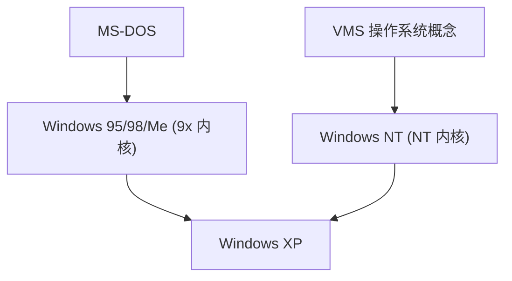

## 1. MS-DOS 与 Windows 1.0〜3.1
早期的 Windows 并不是一个独立的操作系统，而仅仅是运行在 MS-DOS 之上的 GUI 外壳环境。然而，Windows 3.1 的普及决定了 PC 的 GUI 化。

## 2. Windows 95 的冲击
1995 年，Windows 95 发布。随着开始按钮和任务栏的引入，以及标配的互联网连接功能，它在世界范围内创下了爆炸性的热销记录。

## 3. 整合至 NT 架构
面向消费者的 9x 系列内核不够稳定，而面向企业的 Windows NT 则非常坚固。借助 2001 年的“Windows XP”，两者终于被统一到了 NT 内核之中。

## 4. Windows 10/11 与现在
现在，它作为 Windows as a Service 继续演进，并搭载了 WSL (Windows Subsystem for Linux) 等功能，发生了向开发者友好环境的巨大转变。

## 附加技术验证部分 1

## 附加技术验证部分 2

## 附加技术验证部分 3

## 附加技术验证部分 4

## 附加技术验证部分 5

## 附加技术验证部分 6

## 附加技术验证部分 7

## 附加技术验证部分 8

## 附加技术验证部分 9

## 附加技术验证部分 10

## 附加技术验证部分 11

## 附加技术验证部分 12

## 附加技术验证部分 13

## 附加技术验证部分 14

