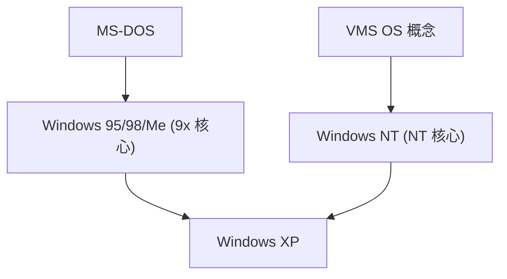

## 1. MS-DOS 與 Windows 1.0〜3.1
早期的 Windows 並非獨立的 OS，而只是在 MS-DOS 上運行的 GUI 殼層環境。然而，隨著 Windows 3.1 的普及，確立了個人電腦的 GUI 化。

## 2. Windows 95 的衝擊
1995 年，Windows 95 發售。導入了開始按鈕與工作列，並標準配備了連接網際網路的功能，在世界各地創下了爆炸性的銷售紀錄。

## 3. 整合至 NT 架構
針對消費者的 9x 系列核心並不穩定，但針對企業的 Windows NT 卻非常堅固。透過 2001 年的「Windows XP」，兩者終於被整合到了 NT 核心中。

## 4. Windows 10/11 與現在
現在則作為 Windows as a Service 持續進化，搭載了 WSL (Windows Subsystem for Linux) 等，正大幅轉變為對開發者友善的環境。

## 追加技術驗證部分 1

### 1. MS-DOS 與 Windows 1.0〜3.1
早期的 Windows 並非獨立的 OS，而只是在 MS-DOS 上運行的 GUI 殼層環境。然而，隨著 Windows 3.1 的普及，確立了個人電腦的 GUI 化。

### 2. Windows 95 的衝擊
1995 年，Windows 95 發售。導入了開始按鈕與工作列，並標準配備了連接網際網路的功能，在世界各地創下了爆炸性的銷售紀錄。

### 3. 整合至 NT 架構
針對消費者的 9x 系列核心並不穩定，但針對企業的 Windows NT 卻非常堅固。透過 2001 年的「Windows XP」，兩者終於被整合到了 NT 核心中。

### 4. Windows 10/11 與現在
現在則作為 Windows as a Service 持續進化，搭載了 WSL (Windows Subsystem for Linux) 等，正大幅轉變為對開發者友善的環境。

## 追加技術驗證部分 2

### 1. MS-DOS 與 Windows 1.0〜3.1
早期的 Windows 並非獨立的 OS，而只是在 MS-DOS 上運行的 GUI 殼層環境。然而，隨著 Windows 3.1 的普及，確立了個人電腦的 GUI 化。

### 2. Windows 95 的衝擊
1995 年，Windows 95 發售。導入了開始按鈕與工作列，並標準配備了連接網際網路的功能，在世界各地創下了爆炸性的銷售紀錄。

### 3. 整合至 NT 架構
針對消費者的 9x 系列核心並不穩定，但針對企業的 Windows NT 卻非常堅固。透過 2001 年的「Windows XP」，兩者終於被整合到了 NT 核心中。

### 4. Windows 10/11 與現在
現在則作為 Windows as a Service 持續進化，搭載了 WSL (Windows Subsystem for Linux) 等，正大幅轉變為對開發者友善的環境。

## 追加技術驗證部分 3

### 1. MS-DOS 與 Windows 1.0〜3.1
早期的 Windows 並非獨立的 OS，而只是在 MS-DOS 上運行的 GUI 殼層環境。然而，隨著 Windows 3.1 的普及，確立了個人電腦的 GUI 化。

### 2. Windows 95 的衝擊
1995 年，Windows 95 發售。導入了開始按鈕與工作列，並標準配備了連接網際網路的功能，在世界各地創下了爆炸性的銷售紀錄。

### 3. 整合至 NT 架構
針對消費者的 9x 系列核心並不穩定，但針對企業的 Windows NT 卻非常堅固。透過 2001 年的「Windows XP」，兩者終於被整合到了 NT 核心中。

### 4. Windows 10/11 與現在
現在則作為 Windows as a Service 持續進化，搭載了 WSL (Windows Subsystem for Linux) 等，正大幅轉變為對開發者友善的環境。

## 追加技術驗證部分 4

### 1. MS-DOS 與 Windows 1.0〜3.1
早期的 Windows 並非獨立的 OS，而只是在 MS-DOS 上運行的 GUI 殼層環境。然而，隨著 Windows 3.1 的普及，確立了個人電腦的 GUI 化。

### 2. Windows 95 的衝擊
1995 年，Windows 95 發售。導入了開始按鈕與工作列，並標準配備了連接網際網路的功能，在世界各地創下了爆炸性的銷售紀錄。

### 3. 整合至 NT 架構
針對消費者的 9x 系列核心並不穩定，但針對企業的 Windows NT 卻非常堅固。透過 2001 年的「Windows XP」，兩者終於被整合到了 NT 核心中。

### 4. Windows 10/11 與現在
現在則作為 Windows as a Service 持續進化，搭載了 WSL (Windows Subsystem for Linux) 等，正大幅轉變為對開發者友善的環境。

## 追加技術驗證部分 5

### 1. MS-DOS 與 Windows 1.0〜3.1
早期的 Windows 並非獨立的 OS，而只是在 MS-DOS 上運行的 GUI 殼層環境。然而，隨著 Windows 3.1 的普及，確立了個人電腦的 GUI 化。

### 2. Windows 95 的衝擊
1995 年，Windows 95 發售。導入了開始按鈕與工作列，並標準配備了連接網際網路的功能，在世界各地創下了爆炸性的銷售紀錄。

### 3. 整合至 NT 架構
針對消費者的 9x 系列核心並不穩定，但針對企業的 Windows NT 卻非常堅固。透過 2001 年的「Windows XP」，兩者終於被整合到了 NT 核心中。

### 4. Windows 10/11 與現在
現在則作為 Windows as a Service 持續進化，搭載了 WSL (Windows Subsystem for Linux) 等，正大幅轉變為對開發者友善的環境。

## 追加技術驗證部分 6

### 1. MS-DOS 與 Windows 1.0〜3.1
早期的 Windows 並非獨立的 OS，而只是在 MS-DOS 上運行的 GUI 殼層環境。然而，隨著 Windows 3.1 的普及，確立了個人電腦的 GUI 化。

### 2. Windows 95 的衝擊
1995 年，Windows 95 發售。導入了開始按鈕與工作列，並標準配備了連接網際網路的功能，在世界各地創下了爆炸性的銷售紀錄。

### 3. 整合至 NT 架構
針對消費者的 9x 系列核心並不穩定，但針對企業的 Windows NT 卻非常堅固。透過 2001 年的「Windows XP」，兩者終於被整合到了 NT 核心中。

### 4. Windows 10/11 與現在
現在則作為 Windows as a Service 持續進化，搭載了 WSL (Windows Subsystem for Linux) 等，正大幅轉變為對開發者友善的環境。

## 追加技術驗證部分 7

### 1. MS-DOS 與 Windows 1.0〜3.1
早期的 Windows 並非獨立的 OS，而只是在 MS-DOS 上運行的 GUI 殼層環境。然而，隨著 Windows 3.1 的普及，確立了個人電腦的 GUI 化。

### 2. Windows 95 的衝擊
1995 年，Windows 95 發售。導入了開始按鈕與工作列，並標準配備了連接網際網路的功能，在世界各地創下了爆炸性的銷售紀錄。

### 3. 整合至 NT 架構
針對消費者的 9x 系列核心並不穩定，但針對企業的 Windows NT 卻非常堅固。透過 2001 年的「Windows XP」，兩者終於被整合到了 NT 核心中。

### 4. Windows 10/11 與現在
現在則作為 Windows as a Service 持續進化，搭載了 WSL (Windows Subsystem for Linux) 等，正大幅轉變為對開發者友善的環境。

## 追加技術驗證部分 8

### 1. MS-DOS 與 Windows 1.0〜3.1
早期的 Windows 並非獨立的 OS，而只是在 MS-DOS 上運行的 GUI 殼層環境。然而，隨著 Windows 3.1 的普及，確立了個人電腦的 GUI 化。

### 2. Windows 95 的衝擊
1995 年，Windows 95 發售。導入了開始按鈕與工作列，並標準配備了連接網際網路的功能，在世界各地創下了爆炸性的銷售紀錄。

### 3. 整合至 NT 架構
針對消費者的 9x 系列核心並不穩定，但針對企業的 Windows NT 卻非常堅固。透過 2001 年的「Windows XP」，兩者終於被整合到了 NT 核心中。

### 4. Windows 10/11 與現在
現在則作為 Windows as a Service 持續進化，搭載了 WSL (Windows Subsystem for Linux) 等，正大幅轉變為對開發者友善的環境。

## 追加技術驗證部分 9

### 1. MS-DOS 與 Windows 1.0〜3.1
早期的 Windows 並非獨立的 OS，而只是在 MS-DOS 上運行的 GUI 殼層環境。然而，隨著 Windows 3.1 的普及，確立了個人電腦的 GUI 化。

### 2. Windows 95 的衝擊
1995 年，Windows 95 發售。導入了開始按鈕與工作列，並標準配備了連接網際網路的功能，在世界各地創下了爆炸性的銷售紀錄。

### 3. 整合至 NT 架構
針對消費者的 9x 系列核心並不穩定，但針對企業的 Windows NT 卻非常堅固。透過 2001 年的「Windows XP」，兩者終於被整合到了 NT 核心中。

### 4. Windows 10/11 與現在
現在則作為 Windows as a Service 持續進化，搭載了 WSL (Windows Subsystem for Linux) 等，正大幅轉變為對開發者友善的環境。

## 追加技術驗證部分 10

### 1. MS-DOS 與 Windows 1.0〜3.1
早期的 Windows 並非獨立的 OS，而只是在 MS-DOS 上運行的 GUI 殼層環境。然而，隨著 Windows 3.1 的普及，確立了個人電腦的 GUI 化。

### 2. Windows 95 的衝擊
1995 年，Windows 95 發售。導入了開始按鈕與工作列，並標準配備了連接網際網路的功能，在世界各地創下了爆炸性的銷售紀錄。

### 3. 整合至 NT 架構
針對消費者的 9x 系列核心並不穩定，但針對企業的 Windows NT 卻非常堅固。透過 2001 年的「Windows XP」，兩者終於被整合到了 NT 核心中。

### 4. Windows 10/11 與現在
現在則作為 Windows as a Service 持續進化，搭載了 WSL (Windows Subsystem for Linux) 等，正大幅轉變為對開發者友善的環境。

## 追加技術驗證部分 11

### 1. MS-DOS 與 Windows 1.0〜3.1
早期的 Windows 並非獨立的 OS，而只是在 MS-DOS 上運行的 GUI 殼層環境。然而，隨著 Windows 3.1 的普及，確立了個人電腦的 GUI 化。

### 2. Windows 95 的衝擊
1995 年，Windows 95 發售。導入了開始按鈕與工作列，並標準配備了連接網際網路的功能，在世界各地創下了爆炸性的銷售紀錄。

### 3. 整合至 NT 架構
針對消費者的 9x 系列核心並不穩定，但針對企業的 Windows NT 卻非常堅固。透過 2001 年的「Windows XP」，兩者終於被整合到了 NT 核心中。

### 4. Windows 10/11 與現在
現在則作為 Windows as a Service 持續進化，搭載了 WSL (Windows Subsystem for Linux) 等，正大幅轉變為對開發者友善的環境。

## 追加技術驗證部分 12

### 1. MS-DOS 與 Windows 1.0〜3.1
早期的 Windows 並非獨立的 OS，而只是在 MS-DOS 上運行的 GUI 殼層環境。然而，隨著 Windows 3.1 的普及，確立了個人電腦的 GUI 化。

### 2. Windows 95 的衝擊
1995 年，Windows 95 發售。導入了開始按鈕與工作列，並標準配備了連接網際網路的功能，在世界各地創下了爆炸性的銷售紀錄。

### 3. 整合至 NT 架構
針對消費者的 9x 系列核心並不穩定，但針對企業的 Windows NT 卻非常堅固。透過 2001 年的「Windows XP」，兩者終於被整合到了 NT 核心中。

### 4. Windows 10/11 與現在
現在則作為 Windows as a Service 持續進化，搭載了 WSL (Windows Subsystem for Linux) 等，正大幅轉變為對開發者友善的環境。

## 追加技術驗證部分 13

### 1. MS-DOS 與 Windows 1.0〜3.1
早期的 Windows 並非獨立的 OS，而只是在 MS-DOS 上運行的 GUI 殼層環境。然而，隨著 Windows 3.1 的普及，確立了個人電腦的 GUI 化。

### 2. Windows 95 的衝擊
1995 年，Windows 95 發售。導入了開始按鈕與工作列，並標準配備了連接網際網路的功能，在世界各地創下了爆炸性的銷售紀錄。

### 3. 整合至 NT 架構
針對消費者的 9x 系列核心並不穩定，但針對企業的 Windows NT 卻非常堅固。透過 2001 年的「Windows XP」，兩者終於被整合到了 NT 核心中。

### 4. Windows 10/11 與現在
現在則作為 Windows as a Service 持續進化，搭載了 WSL (Windows Subsystem for Linux) 等，正大幅轉變為對開發者友善的環境。

## 追加技術驗證部分 14

### 1. MS-DOS 與 Windows 1.0〜3.1
早期的 Windows 並非獨立的 OS，而只是在 MS-DOS 上運行的 GUI 殼層環境。然而，隨著 Windows 3.1 的普及，確立了個人電腦的 GUI 化。

### 2. Windows 95 的衝擊
1995 年，Windows 95 發售。導入了開始按鈕與工作列，並標準配備了連接網際網路的功能，在世界各地創下了爆炸性的銷售紀錄。

### 3. 整合至 NT 架構
針對消費者的 9x 系列核心並不穩定，但針對企業的 Windows NT 卻非常堅固。透過 2001 年的「Windows XP」，兩者終於被整合到了 NT 核心中。

### 4. Windows 10/11 與現在
現在則作為 Windows as a Service 持續進化，搭載了 WSL (Windows Subsystem for Linux) 等，正大幅轉變為對開發者友善的環境。
