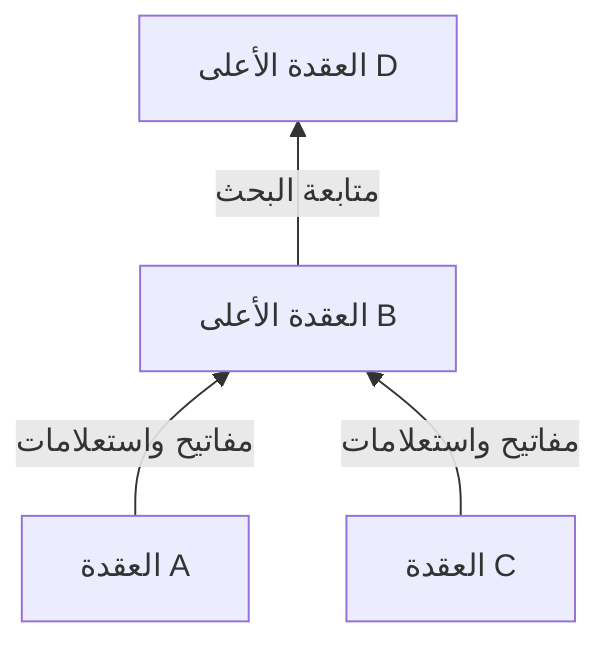
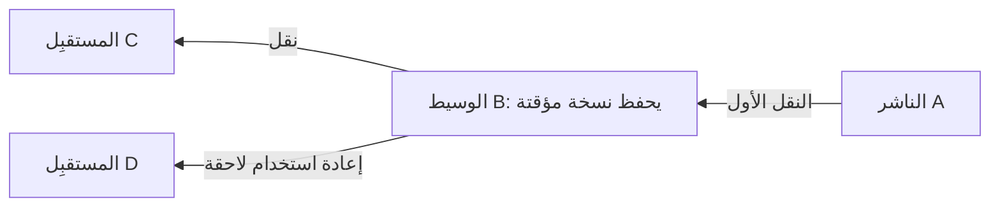

## 1. ما المشكلة التي حاول Winny حلها؟

نريد توزيع ملف كبير على أشخاص كثيرين، لكن المصدر الأول يملك قدرة رفع محدودة. ونريد أيضًا الاستغناء عن خادم بحث مركزي، مع جعل التعرف على الناشر الأول صعبًا. الجمع بين هذه الأهداف الثلاثة هو ما يجعل Winny مثيرًا للاهتمام تقنيًا.

Winny برنامج لمشاركة الملفات بنظام الند للند، طوّره إيسامو كانيكو. صدرت نسخته التجريبية الأولى في 6 مايو 2002. في **شبكة الند للند، أو P2P**، تقدم الحواسيب البيانات إلى الآخرين كما تستقبلها. ويُسمى كل مشارك ندًا أو عقدة. [حكم المحكمة العليا اليابانية، الترجمة الإنجليزية على WIPO Lex][court]

لكن مصطلح P2P وحده لا يحدد طريقة البحث ولا درجة إخفاء الهوية. يجب التمييز بين **العثور على العقد، والبحث عن الملفات، ونقل محتواها الفعلي**. الرسوم والحسابات التالية نماذج مفاهيمية وليست تسجيلات لاتصالات إصدار محدد.

## 2. لا خادم مركزي، لكن لا بد من نقطة بداية

في التوزيع المعتاد عبر الويب يتصل المستخدم بخادم محدد. ويمكن لشبكة CDN توزيع التسليم؛ لكننا نفترض هنا مصدرًا واحدًا لتبسيط المقارنة. في P2P يستطيع المستقبِل أن يصبح مزودًا بدوره.

لا يحتاج Winny إلى خادم بحث مركزي يجمع فهرس الملفات. مع ذلك، تحتاج العقدة الجديدة إلى معرفة عنوان أول تتصل به. تتيح معلومات عقد البداية إنشاء الاتصالات الأولى. غياب الفهرس المركزي لا يعني الاستغناء عن معلومات الاتصال الأولية أو البنية التحتية للإنترنت. [المادة التقنية من JPNIC][jpnic]

تشكل هذه الاتصالات المنطقية **شبكة تراكبية**، مثل خطوط الحافلات فوق شبكة الطرق. تتبادل كل عقدة المعلومات مع بعض الجيران، ولا تتصل مباشرة بكل المشاركين.

قد تحافظ المسارات البديلة على الاتصال عندما تغادر عقدة مجاورة. لكن الانضمام والمغادرة المتكررين يجعلان المعلومات قديمة. اللامركزية وحدها لا تضمن العثور على كل ملف أو تحمل كل عطل.

## 3. فصل مدخل الفهرس الصغير عن الملف الكبير

لا تجلب المكتبة كل الكتب عند كل عملية بحث. نراجع الفهرس ثم نطلب الكتاب المطلوب. وبالمثل يفصل Winny بيانات البحث الوصفية عن المحتوى.

| العنصر | الوظيفة | تمييز مهم |
|---|---|---|
| المفتاح | معلومات الفهرس، مثل الاسم والحجم والبصمة وعنوان الحصول على الملف | لا يعني هنا مفتاح فك التشفير |
| المحتوى/النسخة المؤقتة | حفظ محتوى الملف المشفر ونقله | حامل النسخة ليس بالضرورة الناشر الأول |
| بصمة التجزئة | المساعدة في تعريف الملفات ومقارنتها | ليست توقيعًا يثبت المؤلف أو الأمان |

يشرح تقرير محاضرة كانيكو هذا الفصل وحفظ المحتوى في العقد الوسيطة. [تقرير GLOCOM][glocom]

قد يحمل ملفان اسم `lecture.zip` مع اختلاف محتواهما. تساعد المعرّفات المرتبطة بالمحتوى على التمييز، لكن الملفات الخبيثة لها بصمات أيضًا. مطابقة الفهرس لا تعني أن تشغيل الملف آمن.

## 4. توجيه البحث بالتدرج والتجميع

سؤال الجميع في كل مرة يزيد حركة البحث مع نمو الشبكة. يبني Winny تدرجًا يراعي سرعة الاتصال، فتتجه المفاتيح والاستعلامات غالبًا نحو المستويات الأعلى. ويساعد **التجميع بحسب الاهتمامات** على ربط العقد ذات الكلمات المفتاحية المتشابهة وتحسين البحث. [JPNIC][jpnic]

هذا رسم لتوضيح الاتجاه. الأعلى لا يعني الشمال الجغرافي ولا خادمًا ثابتًا تديره مؤسسة. حتى الاتصال السريع محدود السعة، وقد يؤدي تركيز العمل في الأعلى إلى حمل زائد.

يمكن فهم التجميع بوصفه تسهيل العثور على معلومات موسيقية قرب مشاركين مهتمين بالموسيقى. تشابه الكلمات المفتاحية ليس تقييمًا بالذكاء الاصطناعي لصحة المحتوى أو جودته.

**وصف Winny بأنه DHT يوجه الطلب إلى العقدة ذات أقرب بصمة وصف مضلل.** جدول التجزئة الموزع يقسم مسؤولية فضاء المفاتيح على العقد، وهو تصميم مختلف. استخدام البصمات لتعريف الملفات لا يحول الشبكة تلقائيًا إلى DHT. معرّف الفهرس ومسار البحث عنه شيئان منفصلان.

## 5. الترحيل والتخزين المؤقت يزيدان عدد المزودين

بعد العثور على ملف مرشح نحتاج إلى جلب محتواه. لا يلزم أن تسلك معلومات البحث والبيانات المسار نفسه. يتضمن Winny آلية تغير فيها عقدة عنوان الجلب في المفتاح، وتستقبل الطلب، وتجلب البيانات من المصدر السابق، ثم تمررها وتحفظها. ويمكن للنسخة المؤقتة خدمة طلبات لاحقة. [JPNIC][jpnic]

يستخدم D نسخة B بدلًا من الاستقبال المباشر من A. يقل حمل A، ويختلف المرسل المباشر إلى D عن الناشر الأول. هذا لا يعني أن كل تنزيل يمر بالعدد نفسه من الوسطاء.

### إرسال 100 ميغابايت إلى 100 شخص

لنرمز لحجم الملف بـ $F$ ولعدد المستقبِلين بـ $n$. إذا أرسل مصدر واحد نسخة كاملة لكل شخص، فحجم رفعه هو:

$$
V_0 = nF
$$

عندما يكون $F=100$ ميغابايت و$n=100$، تكون النتيجة 10,000 ميغابايت. نقارن ذلك بحالة مثالية يرسل فيها المصدر نسخة واحدة، ويتولى حاملو النسخ المؤقتة عمليات التسليم الـ99 الباقية.

| افتراض التوزيع | رفع المصدر | رفع المشاركين الآخرين |
|---|---:|---:|
| المصدر يرسل مباشرة إلى الجميع | 10,000 ميغابايت | 0 ميغابايت |
| نسخة أولى ثم 99 عملية إعادة توزيع | 100 ميغابايت | 9,900 ميغابايت |

**ما يختفي هو تركز الحمل على المصدر، لا حركة البيانات اللازمة لإيصال جميع النسخ.** قد تزيد الوساطة وإعادة الإرسال والبحث الحجم الإجمالي. هذه ليست قياسات لـWinny ولا وعدًا بزيادة السرعة مئة مرة.

إذا كانت $u_i$ سرعة الرفع لكل واحد من $k$ مزودين، وكانت $d$ سعة تنزيل المستقبِل، فإن حدًا أعلى مفاهيميًا للسرعة الفعلية $r$، بافتراض الجلب المتوازي، هو:

$$
r \leq \min\left(d,\sum_{i=1}^{k}u_i\right)
$$

يؤثر أيضًا الازدحام وسرعة القرص وما يملكه كل مزود من بيانات. عشرة مزودين يتشاركون وصلة بطيئة لا يضاعفون سرعتها عشر مرات. قد تتكاثر نسخ الملف الشائع، بينما يختفي الملف النادر من المتناول عندما ينقطع حامله الوحيد.

## 6. التشفير لا يعني الاختفاء

جمع Winny بين التشفير والترحيل والتخزين المؤقت لتصعيب التعرف على الناشر. لكن يجب فصل أربع خصائص.

| الخاصية | السؤال | اعتبارات إضافية |
|---|---|---|
| السرية | هل يستطيع المراقب قراءة المحتوى؟ | الخوارزمية والتنفيذ وإدارة المفاتيح |
| إخفاء الهوية | هل يمكن ربط النشاط بشخص؟ | الجيران وتوقيت الحركة وحجمها |
| الأصالة | هل جاءت البيانات من المؤلف المعلن؟ | توقيعات أو مصادر موثوقة |
| أمان الجهاز | هل يمكن أن يضر فتح الملف بالحاسوب؟ | صلاحيات التنفيذ ومكافحة البرمجيات الخبيثة |

يتطلب اتصال IP المباشر عنوان وجهة. لا يمحو التشفير وجود الاتصال ولا كل معلومات طرفيه. مشاهدة إرسال من نسخة مؤقتة لا تثبت وحدها النشر الأول، لكن يمكن جمع ملاحظات من مواقع وأوقات مختلفة.

يحتاج ادعاء إخفاء الهوية إلى نموذج تهديد: من يستطيع رؤية ماذا؟ مراقبة جار واحد تختلف عن مراقبة اتصالات كثيرة. لذا لا يصح القول «مجهول تمامًا» أو «يستحيل تعقبه من حيث المبدأ».

## 7. التسرب: فصل اختراق الجهاز عن إعادة التوزيع

يمكن فهم تسربات Winny في مرحلتين: تكشف برمجية خبيثة أو سبب آخر بيانات خاصة من الجهاز، ثم تنسخها الشبكة. درست IPA الاستجابة لحوادث فعلية. [تقرير IPA][ipa]

تسلسل توضيحي شائع هو: **تشغيل ملف مشبوه ← جمع المعلومات ونشرها بواسطة برمجية خبيثة ← حصول عقد أخرى عليها ← إعادة توزيعها من النسخ المؤقتة**. لا يعني ذلك أن تشغيل Winny ينشر القرص كله حتمًا. يجب التمييز بين سلوك البرمجية الخبيثة وتوزيع P2P.

حذف الأصل لا يحذف بالضرورة النسخ الموجودة على أجهزة أخرى. إذا قرأت البرمجية الخبيثة البيانات غير المشفرة على الجهاز المصاب، فلا حاجة إلى كسر أي تشفير. تشفير النقل وحده لا يغلق هذا المدخل.

ما البيانات المشاركة؟ هل يستطيع المستخدم التحقق منها؟ ما مدى أثر الاختراق؟ هل يمكن سحب نشر عرضي؟ سهولة الاستخدام والتحكم مهمان بقدر كفاءة التوزيع.

## 8. فصل التاريخ والحكم القضائي عن التقييم التقني

| التاريخ | الحدث |
|---|---|
| مايو 2002 | صدور النسخة التجريبية الأولى |
| مايو 2003 | نسخة Winny 2 التجريبية بهدف إنشاء منتدى P2P |
| 2004 | اعتقال كانيكو للاشتباه في المساعدة على انتهاك حقوق المؤلف |
| 19 ديسمبر 2011 | المحكمة العليا ترفض طعن الادعاء، فتستقر براءة المطور |

كان منتدى Winny 2 تطبيقًا مبنيًا على توزيع البيانات. أما تجميع البحث فليس منتدى بحد ذاته. والتوزيع لا يضمن أصالة المنشورات أو بقاءها إلى الأبد أو مقاومتها لكل إزالة. [GLOCOM][glocom]

كان السؤال القضائي هو ما إذا كان توفير البرنامج يشكل مساعدة جنائية على انتهاكات المستخدمين في ظروف القضية. لم تقرر المحكمة العليا مسؤولية المطور جنائيًا في تلك القضية. ولم تجعل كل مشاركة ملفات مشروعة أو تمنح المطورين حصانة عامة. [الحكم][court]

## 9. أسئلة التصميم التي يتركها Winny

«مبتكر، إذن آمن» و«حدث ضرر، إذن التوزيع بلا قيمة» حكمان مبسطان أكثر من اللازم. البحث والتسليم والخصوصية والتحكم أهداف هندسية مختلفة.

فصل البيانات الوصفية عن المحتوى، وإعادة استخدام النسخ، وربط الاهتمامات المتشابهة يحسن استغلال الموارد. لكن زيادة النسخ تصعّب السحب، وزيادة الوسطاء تغير التأخير ونقاط المراقبة. المنافع والتكاليف تأتي من الآليات نفسها.

اطرح خمسة أسئلة على الأنظمة الحديثة أيضًا: **كيف نعثر على أول عقدة؟ أين يجري البحث؟ من يرسل المحتوى؟ ما الذي يخفى عن من؟ من يبقى قادرًا على التحكم بعد النشر؟** يقدم Winny مثالًا ملموسًا لدراسة هذه الأسئلة منفصلة.

## المصادر

- [JPNIC: أساسيات P2P وتشغيل الشبكات، Internet Week 2006، خصوصًا الصفحات 9–15 (باليابانية)][jpnic]
- [GLOCOM: تقرير محاضرة كانيكو عن تقنية Winny، 2006 (باليابانية)][glocom]
- [IPA: الاستجابة لتسرب المعلومات عبر Winny، 2007 (باليابانية)][ipa]
- [WIPO Lex: المحكمة العليا، 2009 (A) 1900، 19 ديسمبر 2011 (ترجمة إنجليزية)][court]

[jpnic]: https://www.nic.ad.jp/ja/materials/iw/2006/proceedings/T3-1.pdf
[glocom]: https://www.glocom.ac.jp/wp-content/uploads/2020/10/chijo106_042-053.pdf
[ipa]: https://www.ipa.go.jp/archive/files/000011527.pdf
[court]: https://www.wipo.int/wipolex/en/text/584277

