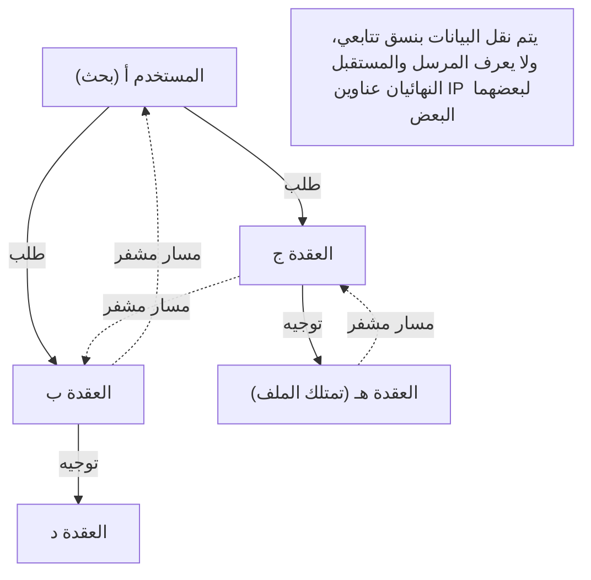

## 1. ما هو "Winny" الذي اجتاح أوائل العقد الأول من القرن الحادي والعشرين؟

في عام 2002، تم نشر برنامج واحد على لوحة التنزيلات في لوحة الإعلانات الإلكترونية الضخمة "2channel" بواسطة مبرمج مجهول أطلق على نفسه اسم "47". هذا البرنامج هو "**Winny**".

كان Winny عبارة عن "برنامج لمشاركة الملفات" يتيح للمستخدمين على الإنترنت تبادل الملفات مباشرة مع بعضهم البعض. وقد تميز بمستوى عالٍ من إخفاء الهوية وكفاءة نقل هائلة ميزته عن الأنظمة الحالية، واكتسب ملايين المستخدمين في غمضة عين.
ولكن، بسبب ارتفاع مستوى إخفاء الهوية، أصبح مرتعاً لانتهاكات حقوق النشر، وتطور إلى مشكلة اجتماعية كبيرة مع تواتر حوادث تسريب المعلومات السرية بسبب الفيروسات. في عام 2004، تم القبض على المطور، السيد إيسامو كانيكو (المدعو 47)، للاشتباه في المساعدة والتحريض على انتهاك حقوق النشر، مما أدى إلى مأساة ستبقى في تاريخ تكنولوجيا المعلومات في اليابان.

في هذه المقالة، سنقوم بشرح عميق لابتكار "تكنولوجيا شبكات P2P (الند للند) التي كانت الأكثر تقدماً في العالم في ذلك الوقت" والتي تضمنها Winny، من منظور علوم الكمبيوتر البحتة، وهي جوانب نادراً ما يتم التحدث عنها خلف الجوانب الاجتماعية مثل قضايا حقوق النشر.

## 2. ما هي P2P (الند للند)؟

لفهم تكنولوجيا Winny، من الضروري أولاً معرفة البنية الأساسية للشبكات.

### نموذج العميل والخادم (النموذج التقليدي)
معظم ما نستخدمه عادة على الإنترنت، مثل مواقع الويب و YouTube، يعتمد على هذا النموذج.
يوجد "خادم" قوي في المركز، ويطلب العديد من "العملاء" (أجهزة الكمبيوتر والهواتف الذكية الخاصة بنا) البيانات من هذا الخادم. في حين أن الهيكل بسيط وسهل الإدارة، إلا أن له نقاط ضعف: فقد يتعطل الخادم إذا تركزت عليه حركة المرور، ويكلف مديري الخوادم مبالغ طائلة.

### نموذج P2P (الند للند)
لا يوجد خادم مركزي، وأجهزة الكمبيوتر الفردية (الأنداد أو الأقران) المشاركة في الشبكة تتواصل بشكل مباشر مع بعضها البعض على قدم المساواة لتوفير البيانات لبعضها البعض.
يتميز هذا النموذج بخصائص قوية تتمثل في أنه كلما زاد عدد المشاركين، زادت قدرة المعالجة والنطاق الترددي للنظام بأكمله.

## 3. ابتكار Winny: الـ P2P النقي وبنية Freenet

برامج مشاركة الملفات الأجنبية في ذلك الوقت (مثل Napster) كانت تعتمد نظام "P2P الهجين"، حيث "يتم تبادل الملفات نفسها بين المستخدمين (P2P)، لكن خادم البحث الذي يتتبع من يمتلك أي ملف موجود في المركز". كان لهذا ضعف يتمثل في موت الشبكة بأكملها في حال إيقاف الخادم المركزي.

في المقابل، حقق Winny "**P2P النقي**" دون أن يمتلك أي خوادم مركزية.
اعتمد نموذج شبكة Winny على بنية "Freenet"، التي طُورت لتحقيق مستوى عالٍ من إخفاء الهوية، مع تحسينات فريدة وممتازة للغاية أضافها السيد كانيكو.

### التوجيه الموزع المستقل المعتمد على المفاتيح
في شبكة Winny، يتم تخصيص "مفتاح" بناءً على قيمة تجزئة فريدة للملف (تشبه بصمة الملف)، كما يتم تخصيص "معرف عقدة" (Node ID) لكل عقدة (كمبيوتر المستخدم) بناءً على أرقام عشوائية.

عند إجراء بحث، لا يحدد المستخدم عنوان IP معين، بل ينقل طلبًا يسأل فيه: "من هي العقدة التي تمتلك معلومات قريبة من هذا المفتاح؟" عبر تمريره مثل سباق التتابع إلى العقدة المجاورة.
تقوم كل عقدة بتمرير الطلب من المعلومات التي تمتلكها إلى "العقدة الأقرب للطلب"، مما يجعل الشبكة بأكملها تعمل كـ "قاعدة بيانات موزعة ضخمة" بشكل مستقل، متضمنة خوارزميات رياضية تضمن الوصول إلى الملف المطلوب بكفاءة.

## 4. آلية "ذاكرة التخزين المؤقت التتابعية" التي ولدت إخفاء الهوية المطلق

السبب الأكبر الذي أثار دهشة المهندسين في ذلك الوقت حول Winny هو آلية **إخفاء الهوية** القوية التي يتمتع بها.

في أنظمة P2P العادية، عند تنزيل ملف، يتم توصيل المصدر (البذرة) والمستلم (المُنزل) مباشرة عبر عناوين IP، مما يجعل من السهل تحديد من أرسل الملف إلى من.
لكن Winny اعتمد آلية "**تمرير الملفات في سباق تتابع والتخزين المؤقت التلقائي**".

1. **مسار النقل المشفر**: لا يتم إرسال الملف مباشرة، بل يتم تمريره (تتابع) عبر عدة عقد غير ذات صلة في المنتصف، وكانت جميع الاتصالات على هذا المسار مشفرة.
2. **انتشار المالكين بواسطة التخزين المؤقت التلقائي**: هذه هي النقطة الأهم. يُحفظ جزء من الملف المنقول كـ "ذاكرة تخزين مؤقت مشفرة" بشكل تلقائي على الأقراص الصلبة (HDD) للعقد غير ذات الصلة التي عملت كنقاط ترحيل.
3. **إخفاء المصدر**: بفضل هذا، حتى لو تم اكتشاف أن عقدة ما تقوم بإرسال ملف، أصبح من المستحيل من حيث المبدأ على النظام التمييز ما إذا كان ذلك الشخص هو "الناشر الأصلي للملف" أم أنه مجرد "شخص غير ذي صلة أُجبر على تمرير الملف".

تتجلى عبقرية السيد كانيكو في أنه ربط بشكل مثالي بين الزيادة في العبء على الشبكة الناتجة عن "التمرير التتابعي لإخفاء الهوية" وبين تحسين الكفاءة من خلال "توزيع التخزين المؤقت عبر الشبكة بأكملها، بحيث كلما كان الملف شائعًا، أمكن تنزيله بسرعات أعلى من العقد القريبة (تأثير شبيه بشبكات CDN)".

## 5. التجميع (Clustering): احتواء ميزة لوحة الإعلانات (BBS)

بدءًا من الإصدار Winny2، لم يقتصر الأمر على مشاركة الملفات بل شمل أيضًا تنفيذ ميزة "لوحة الإعلانات" على شبكة P2P.
إنها لوحة إعلانات لا مركزية ومستحيلة الرقابة تمامًا ولا تتطلب خادم 2channel المركزي.

هنا، تم تبني "تكنولوجيا التجميع" المبنية على اهتمامات المستخدمين. حيث يتغير الطوبولوجيا (شكل الاتصال) للشبكة ديناميكيًا من خلال تعلم سلوك المستخدمين، فتترتب العقد المهتمة بالأنمي معًا، والعقد المهتمة بالموسيقى معًا، وهكذا يتم وضع الأشخاص المتشابهين تلقائيًا بالقرب من بعضهم البعض.
وقد مكّن ذلك من النشر الفعال للغاية للمعلومات دون إجراء بحث غير مجدي في الشبكة الضخمة بأكملها. تتمتع خوارزمية التجميع المتقدمة هذه برؤية مستقبلية تتوافق مع أنظمة التوصية للذكاء الاصطناعي وتقنيات المعالجة الموزعة في العصر الحديث.

## 6. النور والظلام: تطور التكنولوجيا واحتكاكها بالمجتمع

كانت المفاهيم التقنية المضمنة في Winny مثل "اللامركزية التامة" و "إخفاء الاتصالات من خلال التشفير" و "التوجيه الفعال والتوزيع الذاتي" متقدمة جدًا وتتصل بشكل مباشر بأفكار ظهرت لاحقًا مثل "**بلوكتشين**" (التي يعتمد عليها البيتكوين وغيره) والويب اللامركزي (Web3) مثل IPFS.

لو لم يُعتقل السيد إيسامو كانيكو، ولو تم توجيه هذه الموهبة الاستثنائية نحو تطوير بنى تحتية قانونية لإنتاج نظام موزع يصبح معيارًا عالميًا من اليابان، لربما اختلفت خريطة السيطرة على الإنترنت في الوقت الحاضر بعض الشيء.

التكنولوجيا في حد ذاتها ليست خيرة ولا شريرة. ولكن عندما تكون التكنولوجيا قوية للغاية وتتجاوز التشريعات القانونية للمجتمع، ينشأ احتكاك قوي. يطرح تاريخ Winny أمامنا أسئلة ثقيلة لا تزال راهنة حتى اليوم حول الابتكار والمسؤولية الاجتماعية، وكيف يجب حماية ورعاية المهندسين التقنيين.
