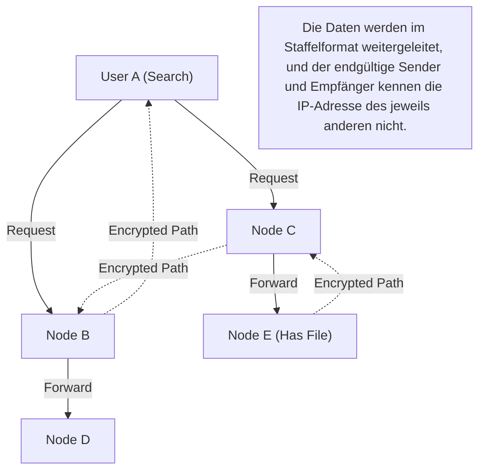

## 1. Was ist "Winny", das Anfang der 2000er Jahre den Markt eroberte?

Im Jahr 2002 wurde auf dem Download-Board des riesigen elektronischen Bulletin-Boards "2channel" von einem anonymen Programmierer, der sich "47-shi" (Herr 47) nannte, eine Software veröffentlicht. Das war "**Winny**".

Winny war eine "Dateitauschsoftware", die es Benutzern im Internet ermöglichte, Dateien direkt miteinander auszutauschen. Es rühmte sich einer hohen Anonymität und einer überwältigenden Übertragungseffizienz, die sich deutlich von bestehenden Systemen abhob, und gewann im Handumdrehen Millionen von Nutzern.
Aufgrund seiner hohen Anonymität wurde es jedoch zu einer Brutstätte für Urheberrechtsverletzungen, und zudem entwickelten sich häufige Vorfälle von durch Viren verursachten Lecks vertraulicher Informationen zu einem großen gesellschaftlichen Problem. Im Jahr 2004 führte dies zur Verhaftung des Entwicklers Isamu Kaneko (47-shi) wegen des Verdachts auf Beihilfe zur Urheberrechtsverletzung, was den Auslöser für eine Tragödie darstellte, die in die japanische IT-Geschichte eingehen sollte.

In diesem Artikel werden wir abseits der sozialen Aspekte wie Urheberrechtsprobleme, über die oft gesprochen wird, die Innovationskraft der "damals weltweit führenden P2P (Peer-to-Peer)-Netzwerktechnologie", die in Winny steckte, aus der reinen Perspektive der Informatik detailliert erklären.

## 2. Was ist P2P (Peer-to-Peer)?

Um die Technologie von Winny zu verstehen, muss man zunächst die Grundstruktur von Netzwerken kennen.

### Client-Server-Modell (Konventionelles Modell)
Websites und YouTube, also der Großteil des Internets, das wir normalerweise nutzen, verwenden dieses System.
In der Mitte existiert ein leistungsstarker "Server", und zahlreiche "Clients" (unsere PCs und Smartphones) fordern Daten vom Server an. Während die Struktur einfach und leicht zu verwalten ist, hat sie die Schwäche, dass der Server bei einer Häufung von Zugriffen abstürzen kann oder dem Serveradministrator enorme Kosten entstehen.

### P2P-Modell (Peer-to-Peer)
Es gibt keinen zentralen Server. Die einzelnen am Netzwerk teilnehmenden PCs (Peers) kommunizieren auf Augenhöhe direkt miteinander und stellen sich gegenseitig Daten zur Verfügung.
Es besitzt die robuste Eigenschaft, dass die Verarbeitungskapazität und Bandbreite des gesamten Systems umso stärker skalieren, je mehr Teilnehmer es gibt.

## 3. Die Innovationskraft von Winny: Pure P2P und Freenet-Architektur

Damalige ausländische Dateitauschprogramme (wie Napster) verwendeten ein "Hybrid-P2P"-System: "Der Dateiaustausch selbst findet zwischen den Nutzern (P2P) statt, aber der Suchserver, der weiß, wer welche Datei hat, befindet sich im Zentrum". Dies hatte die Schwäche, dass das gesamte Netzwerk abstarb, wenn der zentraler Server gestoppt wurde.

Im Gegensatz dazu realisierte Winny ein "**Pure P2P**" (Reines P2P), das überhaupt keinen zentralen Server besaß.
Das Netzwerkmodell von Winny basierte auf einer Architektur namens "Freenet", die entwickelt wurde, um hohe Anonymität zu erreichen, und wurde durch Herrn Kanekos eigene, äußerst brillante Verbesserungen ergänzt.

### Autonomes dezentrales Routing basierend auf Schlüsseln (Keys)
Im Netzwerk von Winny wird Dateien ein "Schlüssel" zugewiesen, der auf einem eindeutigen Hash-Wert (einer Art Fingerabdruck der Datei) basiert, und auch jedem einzelnen Knoten (Node, dem PC des Nutzers) wird eine auf einer Zufallszahl basierende "Node-ID" zugewiesen.

Bei einer Suche gibt der Nutzer keine bestimmte IP-Adresse an, sondern gibt die Anfrage "Wer ist der Knoten, der Informationen nahe diesem Schlüssel hat?" wie bei einer Eimerkette an den benachbarten Knoten weiter.
Jeder Knoten leitet die Anfrage anhand seiner eigenen Informationen an "einen Knoten, der der Anfrage näher ist" weiter. Dadurch wurde ein mathematischer Algorithmus integriert, bei dem das gesamte Netzwerk autonom als eine Art "riesige dezentrale Datenbank" fungiert und effizient die Zieldatei erreicht.

## 4. Das "Cache-Relay"-System, das die ultimative Anonymität schuf

Der größte Grund, warum Winny die damaligen Techniker in Erstaunen versetzte, war sein robuster Mechanismus der **Anonymität**.

Beim normalen P2P verbinden Sender (Seed) und Empfänger (Downloader) beim Herunterladen einer Datei direkt ihre IP-Adressen, wodurch leicht identifiziert werden kann, wer wem eine Datei gesendet hat.
Winny führte jedoch das System der "**Dateien-Eimerkette und des automatischen Cachings**" ein.

1. **Verschlüsselter Übertragungsweg**: Die Datei wird nicht direkt gesendet, sondern über mehrere unbeteiligte Knoten (Nodes) in der Mitte weitergeleitet (Relay), und die gesamte Kommunikation auf diesem Weg war verschlüsselt.
2. **Verbreitung von Besitzern durch automatisches Caching**: Das ist der wichtigste Punkt. Auf der Festplatte der unbeteiligten Knoten, die als Relaisstationen fungierten, wird automatisch ein Teil der übertragenen Datei als "verschlüsselter Cache" gespeichert.
3. **Geheimhaltung des Senders**: Selbst wenn man entdeckt, dass ein bestimmter Knoten eine Datei sendet, wird es dadurch prinzipiell unmöglich, im System zu unterscheiden, ob diese Person der "ursprüngliche Veröffentlicher der Datei" ist oder einfach nur eine "unbeteiligte Person, die nur als Relaisstation fungieren muss".

Das Geniale an Herrn Kaneko war, dass er diese "Erhöhung der Netzwerkbelastung durch Relaisübertragung zur Anonymisierung" auf bewundernswerte Weise mit Effizienz verknüpfte, indem "durch die Verteilung von Caches über das gesamte Netzwerk beliebtere Dateien schneller von nahegelegenen Knoten heruntergeladen werden können (ein CDN-ähnlicher Effekt)".

## 5. Clustering: Integration der BBS (Bulletin Board)-Funktion

Ab Winny2 wurde nicht nur der Dateiaustausch, sondern auch eine "Bulletin Board"-Funktion im P2P-Netzwerk implementiert.
Es handelt sich um ein vollständig zensurresistentes, dezentrales Bulletin Board, das den zentralen 2channel-Server nicht benötigt.

Hier wurde eine "Clustering-Technologie" basierend auf den Interessen der Nutzer eingesetzt. Die Topologie (Verbindungsstruktur) des Netzwerks lernt aus dem Verhalten der Nutzer und verändert sich dynamisch, sodass Knoten mit Interesse an Anime, Knoten mit Interesse an Musik usw., also Gleichgesinnte, automatisch in der Nähe voneinander platziert werden.
Dadurch wurde eine äußerst effiziente Informationsverbreitung realisiert, ohne dass das gesamte riesige Netzwerk unnötig durchsucht werden muss. Dieser fortschrittliche Clustering-Algorithmus besaß eine Weitsicht, die mit modernen KI-Empfehlungssystemen und verteilten Verarbeitungstechnologien vergleichbar ist.

## 6. Licht und Schatten: Technologische Evolution und gesellschaftliche Reibung

Die in Winny enthaltenen technologischen Konzepte wie "vollständige Dezentralisierung", "Geheimhaltung der Kommunikation durch Verschlüsselung" und "autonomes, dezentrales, effizientes Routing" waren äußerst fortschrittlich und sind direkt mit den Ideen der **Blockchain**, die später mit Bitcoin aufkam, und dem dezentralen Web (Web3) wie IPFS verbunden.

Wäre Isamu Kaneko nicht verhaftet worden und dieses außergewöhnliche Talent auf die Entwicklung einer legalen Infrastruktur gerichtet worden, so dass aus Japan ein verteiltes System mit Weltstandard hervorgegangen wäre, sähe das aktuelle Bild der Internet-Vorherrschaft möglicherweise etwas anders aus.

Technologie an sich ist weder gut noch böse. Wenn jedoch diese Technologie zu mächtig ist und die gesetzlichen Rahmenbedingungen der Gesellschaft überholt, entstehen starke Reibungen. Die Geschichte von Winny stellt uns auch heute noch tiefgreifende Fragen zu Innovation und gesellschaftlicher Verantwortung und dazu, wie Techniker geschützt und gefördert werden sollten.
