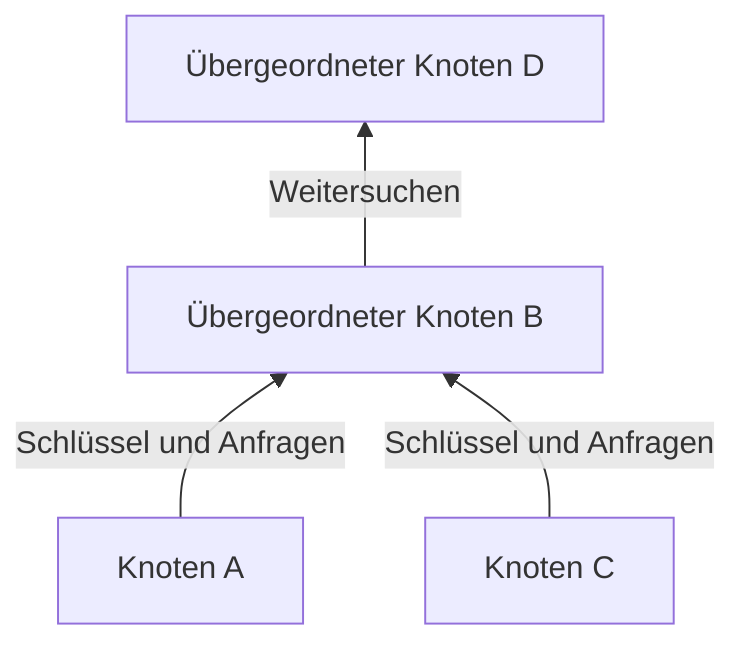
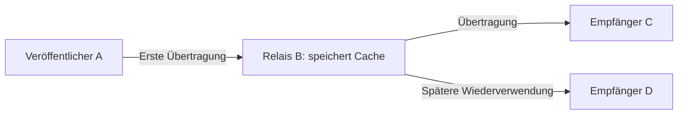

## 1. Welches Problem sollte Winny lösen?

Eine große Datei soll viele Menschen erreichen, obwohl der ursprüngliche Anbieter wenig Upload-Kapazität hat. Zugleich soll es keinen zentralen Suchserver geben und der Erstveröffentlicher schwer zu erkennen sein. Diese drei Ziele zu verbinden macht Winny technisch interessant.

Winny ist ein von Isamu Kaneko entwickeltes P2P-Dateitauschprogramm. Die erste Testversion erschien am 6. Mai 2002. **Peer-to-Peer** bedeutet, dass teilnehmende Rechner Daten nicht nur empfangen, sondern auch anderen anbieten. Jeder Teilnehmer ist ein Peer oder Knoten. [Urteil des japanischen Obersten Gerichtshofs, englische Übersetzung bei WIPO Lex][court]

P2P allein legt weder Suchverfahren noch Anonymität fest. Wir müssen **Nachbarn finden, Dateien suchen und Dateiinhalte übertragen** unterscheiden. Die folgenden Diagramme und Zahlen sind konzeptionelle Modelle, keine Protokollmitschnitte einer bestimmten Version.

## 2. Ohne Zentralserver, aber nicht ohne Einstiegspunkt

Beim üblichen Webabruf kontaktiert der Nutzer einen vorgegebenen Server. Ein CDN kann die Auslieferung verteilen; zum Vergleich nehmen wir hier eine einzelne Quelle an. Bei P2P kann ein Empfänger selbst zum Anbieter werden.

Winny benötigt keinen zentralen Suchserver mit dem gesamten Dateikatalog. Trotzdem muss ein neuer Knoten eine erste Kontaktadresse kennen. Informationen über Einstiegsknoten ermöglichen die ersten Verbindungen. Kein zentraler Katalog bedeutet nicht, dass Kontaktinformationen oder Internet-Infrastruktur entfallen. [Technische Unterlagen von JPNIC][jpnic]

Diese logischen Verbindungen bilden ein **Overlay-Netz**, ähnlich wie Buslinien auf vorhandenen Straßen. Ein Knoten tauscht Informationen mit einigen Nachbarn aus, nicht direkt mit allen Teilnehmern.

Alternative Wege können den Betrieb fortsetzen, wenn ein Nachbar aussteigt. Häufiges Kommen und Gehen lässt Verbindungsinformationen jedoch veralten. Dezentralisierung garantiert weder die Auffindbarkeit jeder Datei noch Schutz vor jedem Ausfall.

## 3. Kleinen Katalogeintrag und große Datei trennen

In einer Bibliothek werden nicht für jede Suche alle Bücher herbeigetragen. Man durchsucht den Katalog und bestellt das gewünschte Buch. Winny trennt ebenso Metadaten und Inhalt.

| Element | Aufgabe | Wichtige Abgrenzung |
|---|---|---|
| Schlüssel | Katalogdaten wie Name, Größe, Hash und Bezugsadresse | Hier kein kryptografischer Entschlüsselungsschlüssel |
| Inhalt/Cache | Verschlüsselten Dateiinhalt speichern und übertragen | Der Besitzer ist nicht zwingend der Erstveröffentlicher |
| Hashwert | Dateien identifizieren und vergleichen | Keine Signatur, die Urheberschaft oder Sicherheit belegt |

Ein Bericht über Kanekos Vortrag erläutert diese Trennung und die Speicherung in weiterleitenden Knoten. [GLOCOM-Vortragsbericht][glocom]

Zwei Dateien namens `lecture.zip` können unterschiedliche Inhalte haben. Inhaltsbezogene Kennungen helfen bei der Unterscheidung, aber auch Schadsoftware besitzt einen Hashwert. Übereinstimmung mit einem Katalogeintrag ist nicht gleichbedeutend mit sicherer Ausführung.

## 4. Hierarchie und Gruppierung lenken die Suche

Stets alle Teilnehmer zu fragen würde mit wachsendem Netz immer mehr Suchverkehr erzeugen. Winny bildet eine Hierarchie unter Berücksichtigung der Verbindungsgeschwindigkeit. Schlüssel und Suchanfragen bewegen sich überwiegend nach oben. **Clustering** verbindet Knoten mit ähnlichen Interessenschlagwörtern und verbessert so die Suche. [JPNIC][jpnic]

Das Diagramm zeigt nur die Richtung. „Oben“ bedeutet weder geografischen Norden noch einen festen Firmenserver. Auch schnelle Anschlüsse haben begrenzte Kapazität, und oben konzentrierte Arbeit erzeugt Last.

Clustering lässt sich so verstehen: Musikbezogene Informationen sind eher in der Nähe musikinteressierter Teilnehmer zu finden. Ähnliche Schlagwörter sind keine KI-Bewertung des Wahrheitsgehalts oder der Qualität.

**Winny als DHT zu beschreiben, die zum Knoten mit dem nächstgelegenen Hash routet, ist irreführend.** Eine verteilte Hashtabelle verteilt die Zuständigkeit für einen Schlüsselraum auf Knoten; das ist ein anderes Konzept. Hashwerte zur Dateiidentifikation machen ein Netz nicht automatisch zur DHT. Katalogkennung und Suchweg sind verschiedene Dinge.

## 5. Weiterleitung und Cache schaffen weitere Anbieter

Auf die Suche folgt der Abruf. Suchinformationen und Dateiinhalte müssen nicht denselben Weg nehmen. Winny kennt einen Mechanismus, bei dem ein Knoten die Bezugsadresse eines Schlüssels ändert, eine Anfrage annimmt, Daten von der bisherigen Quelle holt und sie weiterleitet und speichert. Der Cache kann spätere Anfragen bedienen. [JPNIC][jpnic]

D nutzt Bs Kopie statt direkt von A zu empfangen. Das entlastet A und trennt den unmittelbaren Absender für D vom Erstveröffentlicher. Daraus folgt nicht, dass jeder Download gleich viele Relais durchläuft.

### 100 MB an 100 Empfänger senden

Seien $F$ die Dateigröße und $n$ die Empfängerzahl. Sendet eine Quelle jedem eine vollständige Kopie, beträgt ihr Upload-Volumen:

$$
V_0 = nF
$$

Bei $F=100\,\mathrm{MB}$ und $n=100$ sind das 10.000 MB. Im idealisierten Vergleich sendet die Quelle nur eine Kopie, während Cache-Besitzer die übrigen 99 Auslieferungen übernehmen.

| Annahme | Upload der Quelle | Upload anderer Teilnehmer |
|---|---:|---:|
| Quelle beliefert alle 100 direkt | 10.000 MB | 0 MB |
| Eine erste Kopie, danach 99 Weiterverteilungen | 100 MB | 9.900 MB |

**Es entfällt die Konzentration an der Quelle, nicht der Verkehr zur Versorgung aller Empfänger.** Relais, Wiederholungen und Suchverkehr können das Gesamtvolumen sogar erhöhen. Das sind keine Winny-Messwerte und kein Versprechen hundertfacher Geschwindigkeit.

Sei $u_i$ die Upload-Rate jedes der $k$ Anbieter und $d$ die Download-Kapazität des Empfängers. Bei parallelem Abruf gilt als konzeptionelle obere Grenze der effektiven Rate $r$:

$$
r \leq \min\left(d,\sum_{i=1}^{k}u_i\right)
$$

Überlastung, Festplattentempo und vorhandene Daten spielen ebenfalls eine Rolle. Zehn Anbieter auf derselben langsamen Leitung verzehnfachen deren Geschwindigkeit nicht. Beliebte Dateien sammeln Kopien; seltene können verschwinden, sobald ihr einziger Besitzer offline geht.

## 6. Verschlüsselung bedeutet nicht Unsichtbarkeit

Winny kombinierte Verschlüsselung, Relais und Cache, um den Veröffentlicher schwerer erkennbar zu machen. Vier Eigenschaften sind zu unterscheiden.

| Eigenschaft | Frage | Weitere Gesichtspunkte |
|---|---|---|
| Vertraulichkeit | Kann ein Beobachter den Inhalt lesen? | Verfahren, Implementierung, Schlüsselverwaltung |
| Anonymität | Lässt sich Verhalten einer Person zuordnen? | Nachbarn, Zeitpunkte und Verkehrsvolumen |
| Authentizität | Stammt der Inhalt vom behaupteten Urheber? | Vertrauenswürdige Signaturen oder Bezugsquellen |
| Endgerätesicherheit | Kann das Öffnen dem Rechner schaden? | Ausführungsrechte und Schutz vor Schadsoftware |

Direkte IP-Kommunikation benötigt eine Zieladresse. Verschlüsselung beseitigt weder die Existenz einer Verbindung noch sämtliche Informationen über deren Endpunkte. Eine beobachtete Cache-Übertragung beweist allein keine Erstveröffentlichung; Beobachtungen über mehrere Orte und Zeitpunkte lassen sich aber möglicherweise kombinieren.

Aussagen zur Anonymität benötigen ein Bedrohungsmodell: Wer kann was beobachten? Ein einzelner Nachbar und ein Beobachter vieler Verbindungen haben unterschiedliche Möglichkeiten. „Vollständig anonym“ und „prinzipiell nicht rückverfolgbar“ sind deshalb unpassend.

## 7. Datenlecks: Kompromittierung und Weiterverteilung trennen

Winny-bezogene Lecks lassen sich in zwei Schritten verstehen: Schadsoftware oder eine andere Ursache legt private Daten auf dem Rechner offen, danach kopiert das Netz sie weiter. IPA untersuchte die Bearbeitung tatsächlicher Vorfälle. [IPA-Bericht][ipa]

Eine typische Erklärungskette lautet: **verdächtige Datei ausführen → Schadsoftware sammelt und veröffentlicht Informationen → andere Knoten rufen sie ab → Caches verteilen sie weiter**. Das bedeutet nicht, dass ein Winny-Start zwangsläufig die gesamte Festplatte veröffentlicht. Schadprogramm und P2P-Verteilung sind getrennt zu betrachten.

Das Löschen des Originals entfernt nicht unbedingt bereits verteilte Kopien. Liest Schadsoftware Klartext auf dem infizierten Rechner, muss sie keine Verschlüsselung brechen. Transportverschlüsselung allein schließt diesen Zugang nicht.

Welche Daten werden geteilt? Kann der Nutzer das prüfen? Wie weit reicht ein Einbruch? Lässt sich eine versehentliche Veröffentlichung zurückholen? Bedienbarkeit und Kontrolle zählen ebenso wie Effizienz.

## 8. Geschichte und Urteil von der Technikbewertung trennen

| Zeitpunkt | Ereignis |
|---|---|
| Mai 2002 | Erste Testversion |
| Mai 2003 | Testversion von Winny 2 mit dem Ziel eines P2P-Diskussionsforums |
| 2004 | Kaneko wegen Verdachts der Beihilfe zu Urheberrechtsverletzungen verhaftet |
| 19. Dezember 2011 | Oberster Gerichtshof verwirft das Rechtsmittel der Staatsanwaltschaft; Freispruch wird rechtskräftig |

Das Forum von Winny 2 war eine Anwendung auf der verteilten Datenübertragung. Such-Clustering war nicht selbst ein Forum. Verteilung garantiert weder echte Beiträge noch Dauerhaftigkeit oder Widerstand gegen jede Löschung. [GLOCOM][glocom]

Im Verfahren ging es darum, ob die Softwarebereitstellung unter den konkreten Umständen eine strafbare Hilfe zu den Urheberrechtsverletzungen der Nutzer darstellte. Der Oberste Gerichtshof verneinte die Strafbarkeit des Entwicklers in diesem Fall. Er legalisierte weder jeden Dateitausch noch schuf er allgemeine Immunität für Entwickler. [Urteil][court]

## 9. Die bleibenden Entwurfsfragen

„Innovativ, also sicher“ und „Schäden entstanden, also ist Verteilung wertlos“ greifen zu kurz. Suche, Auslieferung, Privatsphäre und Kontrolle sind verschiedene technische Ziele.

Metadaten vom Inhalt zu trennen, Kopien wiederzuverwenden und ähnliche Interessen zu verbinden spart Ressourcen. Mehr Kopien erschweren jedoch den Rückruf, zusätzliche Relais verändern Latenz und Beobachtungspunkte. Nutzen und Kosten stammen aus denselben Mechanismen.

Fünf Fragen helfen auch bei heutigen Systemen: **Wie wird der erste Peer gefunden? Wo wird gesucht? Wer sendet den Inhalt? Was bleibt vor wem verborgen? Wer behält nach der Veröffentlichung Kontrolle?** Winny liefert einen konkreten Fall, um diese Fragen getrennt zu prüfen.

## Quellen

- [JPNIC: P2P-Grundlagen und Netzbetrieb, Internet Week 2006, besonders S. 9–15 (Japanisch)][jpnic]
- [GLOCOM: Bericht zu Kanekos Vortrag über Winny, 2006 (Japanisch)][glocom]
- [IPA: Umgang mit Datenlecks über Winny, 2007 (Japanisch)][ipa]
- [WIPO Lex: Oberster Gerichtshof, 2009 (A) 1900, 19. Dezember 2011 (englische Übersetzung)][court]

[jpnic]: https://www.nic.ad.jp/ja/materials/iw/2006/proceedings/T3-1.pdf
[glocom]: https://www.glocom.ac.jp/wp-content/uploads/2020/10/chijo106_042-053.pdf
[ipa]: https://www.ipa.go.jp/archive/files/000011527.pdf
[court]: https://www.wipo.int/wipolex/en/text/584277
