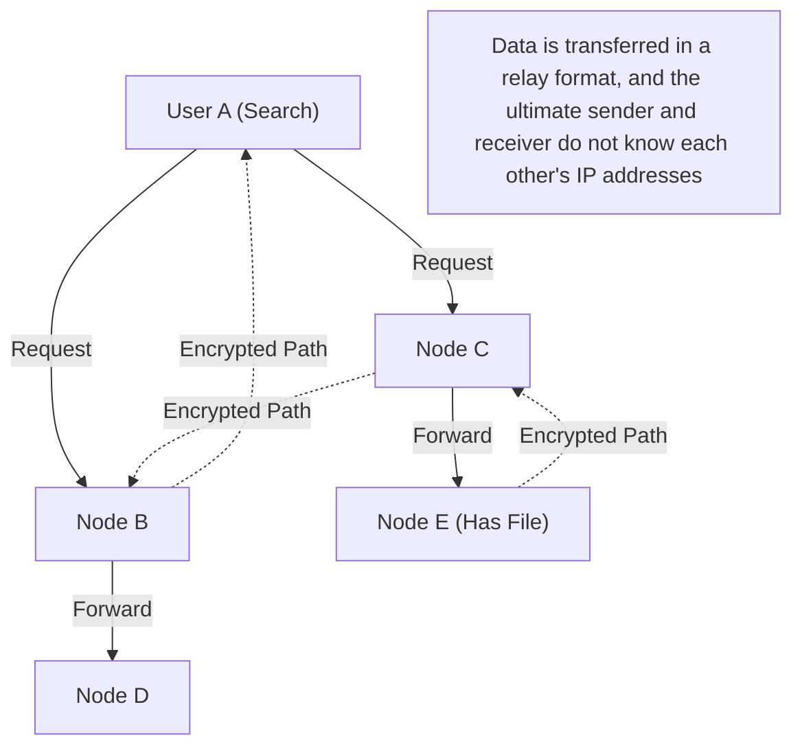

## 1. What is "Winny", the Software that Swept the Early 2000s?

In 2002, on the download board of the massive internet forum "2channel", a piece of software was released by an anonymous programmer calling himself "Mr. 47". That was "**Winny**".

Winny was a "file-sharing software" that allowed users on the Internet to directly exchange files with each other. Boasting high anonymity and overwhelming transfer efficiency that set it apart from existing systems, it acquired millions of users in the blink of an eye.
However, its high anonymity made it a hotbed for copyright infringement, and a series of incidents involving the leakage of confidential information via viruses developed into a major social problem. In 2004, the developer, Isamu Kaneko (Mr. 47), was arrested on suspicion of aiding and abetting copyright infringement, triggering a tragedy that remains in Japanese IT history.

In this article, we will explain in depth from a purely computer science perspective the innovativeness of the "world's most advanced P2P (Peer-to-Peer) network technology at the time" contained in Winny, which is rarely discussed, hidden behind social aspects such as copyright issues.

## 2. What is P2P (Peer-to-Peer)?

To understand Winny's technology, you first need to know the basic structure of networks.

### Client-Server Model (Conventional)
Most of the Internet we use on a daily basis, such as websites and YouTube, uses this method.
There is a powerful "server" in the center, and many "clients" (our PCs and smartphones) request data from the server. While the structure is simple and easy to manage, it has weaknesses such as the server going down when access is concentrated, and the enormous cost imposed on the server administrators.

### P2P Model (Peer-to-Peer)
This is a method where there is no central server, and individual PCs (peers) participating in the network communicate directly with each other on an equal footing to provide data to each other.
It has the robust property that the processing power and bandwidth of the entire system scale up as the number of participants increases.

## 3. Winny's Innovativeness: Pure P2P and Freenet Architecture

Overseas file-sharing software at the time (such as Napster) used a "hybrid P2P" system, where "the file exchange itself is done between users (P2P), but a search server to track who has which file exists in the center." This had the weakness that if the central server was stopped, the entire network would die.

In contrast, Winny realized a "**Pure P2P**", which did not have any central servers.
Winny's network model was based on an architecture called "Freenet", developed to achieve high anonymity, with Mr. Kaneko's own extremely excellent improvements added.

### Autonomous Decentralized Routing Based on Keys
In the Winny network, files are assigned a "key" based on a unique hash value (like a fingerprint of the file), and individual nodes (user PCs) are also assigned a "node ID" based on random numbers.

When performing a search, instead of specifying a particular IP address, the user passes a request, "Who is the node that has information close to this key?", to neighboring nodes like a bucket brigade.
Since each node forwards the request from its own information to the "node closer to the request", a mathematical algorithm was incorporated so that the entire network autonomously functions as a kind of "huge distributed database", efficiently reaching the target file.

## 4. The "Cache Relay" System That Created Ultimate Anonymity

The biggest reason why Winny amazed engineers at the time was its robust mechanism for **anonymity**.

In regular P2P, when downloading a file, the sender (seed) and the receiver (downloader) connect their IP addresses directly to communicate, making it easy to identify who sent a file to whom.
However, Winny adopted a mechanism called "**bucket relay of files and automatic caching**".

1. **Encrypted Transfer Route**: Files are not sent directly, but transferred via multiple unrelated intermediate nodes (relayed), and all communications along that route were encrypted.
2. **Diffusion of Owners via Automatic Caching**: This is the most important point. A part of the file being transferred is automatically saved as an "encrypted cache" on the HDDs of the unrelated nodes that served as relay points.
3. **Concealment of the Sender**: Because of this, even if someone discovers a node transmitting a file, it became theoretically impossible to distinguish on the system whether that person is the "original publisher of the file" or simply an "unrelated person forced to relay it".

Mr. Kaneko's genius lay in how he brilliantly combined the increased network load caused by this "relay transfer for anonymization" with efficiency, in the form of "caches being distributed across the entire network, allowing popular files to be downloaded faster from nearby nodes (a CDN-like effect)".

## 5. Clustering: Inclusion of BBS (Bulletin Board) Functionality

Starting with Winny2, not only file sharing but also a "bulletin board" feature was implemented on the P2P network.
It is a fully uncensorable decentralized bulletin board that does not require the central 2channel server.

Here, a "clustering technology" based on user interests was adopted. The network topology (connection structure) learns from user behavior and dynamically changes, so that nodes interested in anime or nodes interested in music automatically get placed near similar users.
By doing so, it achieved extremely efficient information propagation without pointlessly searching the entire huge network. This highly advanced clustering algorithm possessed foresight that connects to modern AI recommendation systems and distributed processing technologies.

## 6. Light and Shadow: Technological Evolution and Social Friction

The technological concepts contained in Winny, such as "complete decentralization", "concealment of communication through encryption", and "autonomous decentralized efficient routing", were extremely advanced, directly connecting to the philosophies of later emerging technologies like **blockchain** in Bitcoin and the decentralized Web (Web3) like IPFS.

If Isamu Kaneko had not been arrested, and this rare talent had been directed toward legal infrastructure development, creating a world-standard decentralized system from Japan, the current map of Internet hegemony might have been slightly different.

Technology itself has no good or evil. However, when the technology is so powerful that it overtakes society's legal framework, intense friction occurs. The history of Winny poses a heavy question to us that applies even today: about innovation, social responsibility, and how to protect and nurture engineers.
