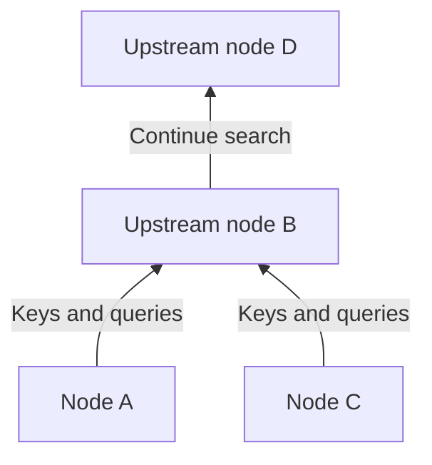
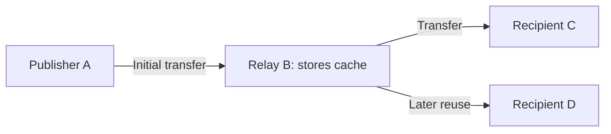

## 1. The problem Winny tried to solve

Suppose you want to distribute a large file to many people, but the original sender has limited upload capacity. You also want to avoid a central search server and make the original publisher difficult to identify. Reconciling these goals is what makes Winny technically interesting.

Winny is a P2P file-sharing program developed by Isamu Kaneko. Its first trial version appeared on May 6, 2002. **Peer-to-peer** means that participating computers can supply data as well as receive it. Each participant is called a peer or node. [Supreme Court judgment, English translation at WIPO Lex][court]

P2P alone says nothing about how search works or how anonymous a system is. We must distinguish **finding peers, searching for files, and transferring the actual data**. The diagrams and numerical examples below are conceptual models, not packet traces of a particular version.

## 2. No central server does not mean no starting point

In ordinary web distribution, clients contact a designated server. Real websites can spread delivery across a CDN; our comparison uses a single source for simplicity. With P2P, a recipient can become a supplier.

Winny does not require one central search server holding the file catalog. Nevertheless, a new node must learn an initial contact address. Seed-node information provides the starting point for building connections. Dispensing with a central catalog does not dispense with bootstrap information or Internet infrastructure. [JPNIC technical slides][jpnic]

The application’s logical connections form an **overlay network**, like bus routes laid over existing roads. A node exchanges information with some neighbors, rather than connecting directly to every participant.

Alternative paths can keep communication going when a neighbor leaves. But frequent arrivals and departures make connection information stale. Decentralization alone guarantees neither that a file will be found nor that every failure can be survived.

## 3. Separate the small catalog entry from the large file

A library does not bring you every book when you search. You consult its catalog, then request the book you want. Winny similarly separates search metadata from file contents.

| Element | Purpose | Important distinction |
|---|---|---|
| Key | Catalog information such as name, size, hash, and retrieval address | Here “key” does not mean a decryption key |
| Body/cache | Stores and transfers encrypted file contents | A cache holder need not be the original publisher |
| Hash | Helps identify and compare files | It is not a signature proving authorship or safety |

A report of Kaneko’s lecture explains this separation and the storage of content at relaying nodes. [GLOCOM lecture report][glocom]

Two files named `lecture.zip` need not contain the same data. Content-related identifiers help distinguish candidates, but malicious files have hashes too. Matching a catalog entry is different from being safe to execute.

## 4. Hierarchy and clustering make search more focused

Asking everyone every time would generate increasing search traffic. Winny builds a hierarchy that takes connection speed into account: keys mainly travel upstream, as do searches. **Clustering** connects nodes with similar interest keywords to improve search efficiency. [JPNIC technical slides][jpnic]

This is a directional sketch. “Upstream” is neither geographic north nor a fixed server operated by a central organization. Fast connections still have finite capacity, and concentrating work upstream can create load.

Clustering is like making music-related information easier to find near participants interested in music. Keyword similarity is not an AI judgment about a file’s truth or quality.

**Describing Winny as a DHT that routes to the node with the nearest hash is misleading.** A distributed hash table assigns responsibility for a key space to nodes; that is a different design. Using hashes to identify files does not automatically make a network a DHT. A catalog identifier and the route used to search the catalog are separate things.

## 5. Relays and caches create additional suppliers

Finding a candidate is followed by retrieving its contents. The path followed by search information need not be the path followed by the data. Winny includes a mechanism in which a node changes the retrieval address in a key, accepts a request, fetches the data from the previous source, and relays and stores it. The resulting cache can serve later requests. [JPNIC technical slides][jpnic]

D uses B’s copy instead of receiving directly from A. This reduces A’s load and separates D’s immediate sender from the original publisher. It does not imply that every download passes through the same number of relays.

### Sending 100 MB to 100 recipients

Let file size be $F$ and the number of recipients be $n$. If one source sends a complete copy to each person, its upload volume is:

$$
V_0 = nF
$$

For $F=100\,\mathrm{MB}$ and $n=100$, that is 10,000 MB. Compare this with an ideal case where the source sends one copy and cache holders perform the other 99 deliveries.

| Delivery assumption | Source upload | Other participants’ upload |
|---|---:|---:|
| Source sends directly to all 100 recipients | 10,000 MB | 0 MB |
| One initial copy, followed by 99 redistributions | 100 MB | 9,900 MB |

**What disappears is concentration at the source, not the traffic needed to deliver everyone a copy.** Relaying, retries, and search overhead can increase total traffic. These are not Winny measurements or a prediction of a hundredfold speedup.

Likewise, let $u_i$ be the upload rate of each of $k$ suppliers and $d$ the recipient’s download capacity. Assuming parallel retrieval, a conceptual upper bound on effective rate $r$ is:

$$
r \leq \min\left(d,\sum_{i=1}^{k}u_i\right)
$$

Congestion, disk speed, and which data each supplier holds also matter. Ten suppliers sharing one slow link do not give ten times its speed. Popular files can accumulate copies; a rare file can become unavailable when its only holder disconnects.

## 6. Encryption does not mean invisibility

Winny combined encryption, relaying, and caching to obscure the publisher. Four different properties must be distinguished.

| Property | Question | Further considerations |
|---|---|---|
| Confidentiality | Can an observer read the contents? | Cipher, implementation, key handling |
| Anonymity | Can activity be linked to a person? | Neighbors, timing, and traffic-volume observations |
| Authenticity | Does the data come from its claimed creator? | Trusted signatures or distribution sources |
| Endpoint security | Can opening a file harm the computer? | Execution privileges and malware defenses |

Direct communication over IP requires a destination IP address. Encryption does not erase the existence of a connection or all information about its endpoints. Observing a cache upload does not by itself establish original publication, but observations across locations and times may be combined.

An anonymity claim needs a threat model: who can observe what? An observer watching one neighbor and one monitoring many connections have different capabilities. “Completely anonymous” and “impossible in principle to trace” are therefore inappropriate descriptions.

## 7. Data leaks: distinguish compromise from redistribution

Winny-related leaks are easier to understand as two stages: malware or another cause exposes private data from a computer, and the network subsequently copies it. IPA investigated responses to actual incidents. [IPA report][ipa]

A typical explanatory chain is **running a suspicious file → malware collects and publishes information → other nodes retrieve it → caches redistribute it**. This does not mean starting Winny necessarily publishes an entire disk. The behavior of malicious software and P2P distribution must be kept separate.

Deleting the original cannot necessarily delete copies already on other computers. No cipher needs to be broken if malware reads plaintext on the infected endpoint. Transport encryption alone cannot close that entry point.

Which data are shared? Can users inspect that choice? How far can a compromise spread? Can an accidental publication be recalled? Usability and control matter as much as delivery efficiency.

## 8. Separate history and legal judgment from technical evaluation

| Date | Event |
|---|---|
| May 2002 | First trial version released |
| May 2003 | Winny 2 trial released, aiming to support a P2P bulletin board |
| 2004 | Kaneko arrested on suspicion of aiding copyright infringement |
| December 19, 2011 | Supreme Court dismissed the prosecution’s appeal, leaving the developer’s acquittal in place |

Winny 2’s bulletin board was an application built on distributed delivery. Search clustering itself was not a bulletin board. Distribution alone does not guarantee authentic posts, permanence, or resistance to every form of removal. [GLOCOM lecture report][glocom]

The case concerned whether providing the software constituted criminal assistance to the users’ copyright infringement in the circumstances at issue. The Supreme Court did not find the developer criminally liable in that case. It did not legalize every use of file sharing or establish universal immunity for software developers. [Supreme Court judgment][court]

## 9. The design questions Winny leaves us

“Innovative, therefore safe” and “harm occurred, therefore distribution is worthless” are both too crude. Search, delivery, privacy, and control are separate engineering goals.

Separating metadata from content, reusing copies, and connecting participants with similar interests can use resources efficiently. Yet more copies make recall harder, while additional relays change latency and observation points. Benefits and costs arise from the same mechanisms.

Ask five questions of modern distributed systems too: **How is the first peer found? Where does search happen? Who sends the contents? What is hidden from whom? Who retains control after publication?** Winny provides a concrete way to examine these questions separately.

## Sources

- [JPNIC: Internet Week 2006, P2P fundamentals and network operation, especially pp. 9–15 (Japanese)][jpnic]
- [GLOCOM: report of Kaneko’s lecture on Winny’s technology, 2006 (Japanese)][glocom]
- [IPA: responses to information leaks through Winny, 2007 (Japanese)][ipa]
- [WIPO Lex: Supreme Court, 2009 (A) 1900, December 19, 2011 (English translation)][court]

[jpnic]: https://www.nic.ad.jp/ja/materials/iw/2006/proceedings/T3-1.pdf
[glocom]: https://www.glocom.ac.jp/wp-content/uploads/2020/10/chijo106_042-053.pdf
[ipa]: https://www.ipa.go.jp/archive/files/000011527.pdf
[court]: https://www.wipo.int/wipolex/en/text/584277

