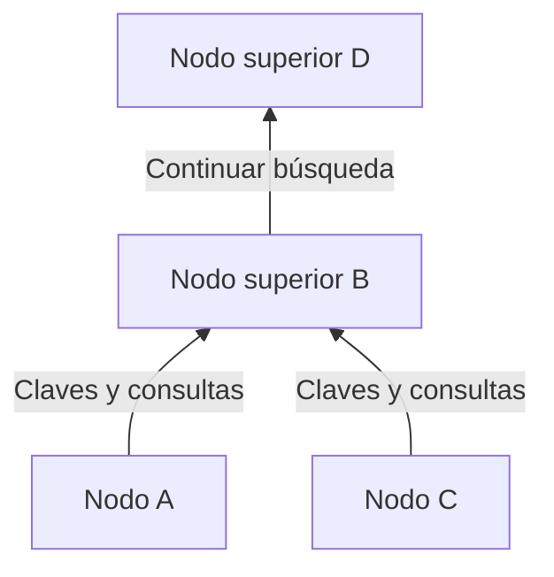
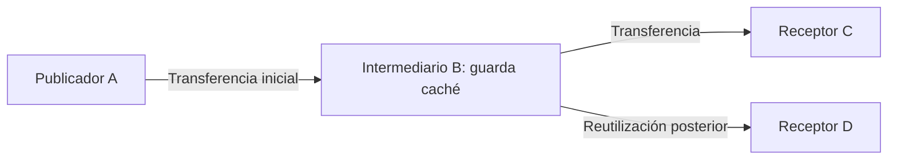

## 1. El problema que Winny intentaba resolver

Queremos distribuir un archivo grande a muchas personas, pero el emisor original tiene poca capacidad de subida. También queremos prescindir de un servidor central de búsqueda y dificultar la identificación de quien publicó el archivo. Conciliar estos tres objetivos es lo que hace interesante a Winny.

Winny es un programa de intercambio P2P creado por Isamu Kaneko. Su primera versión de prueba apareció el 6 de mayo de 2002. En una red **entre pares**, los equipos proporcionan datos además de recibirlos. Cada participante es un par o nodo. [Sentencia del Tribunal Supremo japonés, traducción inglesa en WIPO Lex][court]

P2P no determina por sí solo cómo se busca ni cuánto anonimato existe. Hay que separar **encontrar otros nodos, buscar archivos y transferir su contenido**. Los diagramas y cálculos siguientes son modelos conceptuales, no registros de comunicaciones de una versión concreta.

## 2. Sin servidor central, pero con un punto de entrada

En la distribución web habitual, el usuario contacta con un servidor designado. Una CDN puede repartir la entrega; aquí suponemos un único origen para simplificar. En P2P, quien recibe también puede convertirse en proveedor.

Winny no necesita un servidor central que concentre el catálogo. Sin embargo, un nodo nuevo debe conocer alguna dirección inicial. La información de nodos de arranque permite establecer las primeras conexiones. Prescindir del catálogo central no elimina la necesidad de contactos iniciales ni de infraestructura de Internet. [Material técnico de JPNIC][jpnic]

Estas conexiones lógicas forman una **red superpuesta**, como rutas de autobús sobre una red de carreteras. Cada nodo intercambia información con algunos vecinos, no directamente con todos los participantes.

Si existen rutas alternativas, la comunicación puede continuar cuando un vecino se desconecta. Pero las entradas y salidas frecuentes dejan información obsoleta. Descentralizar no garantiza encontrar cualquier archivo ni resistir todos los fallos.

## 3. Separar el catálogo pequeño del archivo grande

Una biblioteca no trae todos sus libros para cada búsqueda: se consulta el catálogo y se solicita el ejemplar deseado. Winny también separa metadatos y contenido.

| Elemento | Función | Distinción importante |
|---|---|---|
| Clave | Metadatos: nombre, tamaño, hash y dirección de obtención | No significa aquí clave de descifrado |
| Cuerpo/caché | Almacenar y transferir el contenido cifrado | Quien conserva la caché no tiene por qué ser el autor de la publicación |
| Hash | Identificar y comparar archivos | No es una firma que pruebe autoría o seguridad |

El informe de una conferencia de Kaneko explica esta separación y el almacenamiento en nodos intermediarios. [Informe de GLOCOM][glocom]

Dos archivos llamados `lecture.zip` pueden contener datos distintos. Un identificador relacionado con el contenido ayuda a distinguirlos, pero los archivos maliciosos también tienen un hash. Coincidir con el catálogo no equivale a ser seguro al ejecutarlo.

## 4. Jerarquía y agrupación para orientar la búsqueda

Preguntar siempre a todos incrementaría el tráfico con el tamaño de la red. Winny organiza una jerarquía según la velocidad de conexión: las claves y búsquedas se dirigen principalmente hacia niveles superiores. La **agrupación por intereses** conecta nodos con palabras clave similares para mejorar la búsqueda. [JPNIC][jpnic]

Es un esquema de dirección. «Superior» no significa norte geográfico ni servidor fijo de una organización. Una conexión rápida sigue teniendo capacidad limitada y puede acumular trabajo.

La agrupación facilita, por ejemplo, encontrar información musical cerca de participantes interesados en música. La semejanza de palabras clave no es una evaluación mediante IA de la veracidad o calidad del contenido.

**Es incorrecto describir Winny como una DHT que encamina al nodo con el hash más próximo.** Una tabla hash distribuida reparte la responsabilidad del espacio de claves entre nodos: es otro diseño. Usar hashes para identificar archivos no convierte automáticamente una red en DHT. El identificador del catálogo y el camino de búsqueda son cosas distintas.

## 5. Retransmisión y caché: más proveedores

Tras encontrar un candidato, hay que obtener el contenido. La ruta de los metadatos no tiene por qué coincidir con la de los datos. Winny incluye un mecanismo por el que un nodo modifica la dirección de obtención de una clave, recibe la solicitud, obtiene los datos del proveedor anterior y los retransmite y almacena. La caché puede atender solicitudes posteriores. [JPNIC][jpnic]

D utiliza la copia de B en vez de recibir directamente de A. Se reduce la carga de A y se separa el emisor inmediato de D del publicador original. No significa que todas las descargas atraviesen el mismo número de intermediarios.

### Enviar 100 MB a 100 personas

Sean $F$ el tamaño del archivo y $n$ el número de receptores. Si un origen envía una copia completa a cada persona, su volumen de subida es:

$$
V_0 = nF
$$

Para $F=100\,\mathrm{MB}$ y $n=100$, son 10 000 MB. Comparemos con el caso ideal de enviar una sola copia y dejar las otras 99 entregas a quienes poseen caché.

| Supuesto | Subida del origen | Subida de otros participantes |
|---|---:|---:|
| El origen entrega directamente las 100 copias | 10 000 MB | 0 MB |
| Una copia inicial y 99 redistribuciones | 100 MB | 9 900 MB |

**Desaparece la concentración en el origen, no el tráfico necesario para entregar todas las copias.** Las retransmisiones, los reintentos y las búsquedas pueden aumentar el tráfico total. No son mediciones de Winny ni una predicción de una velocidad cien veces mayor.

Si $u_i$ es la velocidad de subida de cada uno de $k$ proveedores y $d$ la capacidad de descarga del receptor, bajo el supuesto de obtención paralela la velocidad efectiva $r$ tiene este límite conceptual:

$$
r \leq \min\left(d,\sum_{i=1}^{k}u_i\right)
$$

También importan la congestión, el disco y qué datos tiene cada proveedor. Diez equipos que comparten un enlace lento no multiplican su velocidad por diez. Los archivos populares acumulan copias; uno poco común puede dejar de estar disponible cuando se desconecta su único poseedor.

## 6. Cifrar no significa volverse invisible

Winny combinaba cifrado, intermediarios y caché para dificultar la identificación del publicador. Conviene separar cuatro propiedades.

| Propiedad | Pregunta | Otros factores |
|---|---|---|
| Confidencialidad | ¿Puede un observador leer el contenido? | Cifrado, implementación, gestión de claves |
| Anonimato | ¿Puede relacionarse una actividad con una persona? | Vecinos, tiempos y volúmenes de tráfico |
| Autenticidad | ¿Proceden los datos del autor declarado? | Firmas o fuentes de distribución fiables |
| Seguridad del equipo | ¿Puede dañarlo abrir el archivo? | Permisos de ejecución y protección contra malware |

La comunicación IP directa necesita una dirección de destino. El cifrado no borra la existencia de una conexión ni toda la información de sus extremos. Observar una subida desde caché no basta para identificar al publicador original, pero pueden combinarse observaciones de varios lugares y momentos.

Una afirmación de anonimato necesita un modelo de amenazas: ¿quién puede observar qué? Vigilar un vecino y observar muchas conexiones son capacidades distintas. «Completamente anónimo» e «imposible de rastrear por principio» son descripciones inadecuadas.

## 7. Filtraciones: separar la intrusión de la redistribución

Las filtraciones relacionadas con Winny se entienden mejor en dos etapas: malware u otra causa expone información privada del equipo y después la red la copia. IPA investigó la respuesta a incidentes reales. [Informe de IPA][ipa]

Una cadena explicativa típica es **ejecutar un archivo sospechoso → el malware recopila y publica información → otros nodos la obtienen → las cachés la redistribuyen**. No significa que iniciar Winny publique necesariamente todo el disco. El comportamiento del malware y el mecanismo P2P deben distinguirse.

Borrar el original no elimina necesariamente las copias que ya están en otros equipos. Si el malware lee texto claro en el dispositivo infectado, no necesita romper ningún cifrado. Cifrar el transporte no cierra esa entrada.

¿Qué datos se comparten? ¿Puede el usuario comprobarlo? ¿Hasta dónde llega una intrusión? ¿Es posible retirar una publicación accidental? La facilidad de uso y el control importan tanto como la eficiencia.

## 8. Historia y sentencia, separadas de la evaluación técnica

| Fecha | Hecho |
|---|---|
| Mayo de 2002 | Primera versión de prueba |
| Mayo de 2003 | Prueba de Winny 2, orientada a un foro P2P |
| 2004 | Detención de Kaneko por sospecha de complicidad en infracciones de derechos de autor |
| 19 de diciembre de 2011 | El Tribunal Supremo desestimó el recurso de la fiscalía, quedando firme la absolución |

El foro de Winny 2 era una aplicación sobre la distribución de datos. La agrupación de búsquedas no era en sí un foro. Distribuir tampoco garantiza publicaciones auténticas, permanentes o resistentes a cualquier eliminación. [GLOCOM][glocom]

El litigio trataba de si proporcionar el programa constituía cooperación delictiva en las infracciones de sus usuarios en las circunstancias del caso. El Supremo no consideró penalmente responsable al desarrollador en ese caso. No legalizó todo intercambio de archivos ni estableció inmunidad universal para desarrolladores. [Sentencia][court]

## 9. Las preguntas de diseño que deja Winny

«Innovador, luego seguro» y «hubo daños, luego la distribución carece de valor» son conclusiones demasiado simples. Búsqueda, entrega, privacidad y control son objetivos diferentes.

Separar metadatos y contenido, reutilizar copias y conectar intereses similares aprovecha recursos. Pero más copias dificultan la retirada y más intermediarios cambian la latencia y los puntos de observación. Ventajas y costes nacen del mismo mecanismo.

Apliquemos cinco preguntas a sistemas actuales: **¿Cómo se encuentra el primer nodo? ¿Dónde se busca? ¿Quién envía el contenido? ¿Qué se oculta y a quién? ¿Quién conserva el control tras publicar?** Winny ofrece un caso concreto para examinarlas por separado.

## Fuentes

- [JPNIC: fundamentos de P2P y operación de redes, Internet Week 2006, especialmente pp. 9–15 (japonés)][jpnic]
- [GLOCOM: informe de la conferencia de Kaneko sobre Winny, 2006 (japonés)][glocom]
- [IPA: respuesta a filtraciones mediante Winny, 2007 (japonés)][ipa]
- [WIPO Lex: Tribunal Supremo, 2009 (A) 1900, 19 de diciembre de 2011 (traducción inglesa)][court]

[jpnic]: https://www.nic.ad.jp/ja/materials/iw/2006/proceedings/T3-1.pdf
[glocom]: https://www.glocom.ac.jp/wp-content/uploads/2020/10/chijo106_042-053.pdf
[ipa]: https://www.ipa.go.jp/archive/files/000011527.pdf
[court]: https://www.wipo.int/wipolex/en/text/584277
