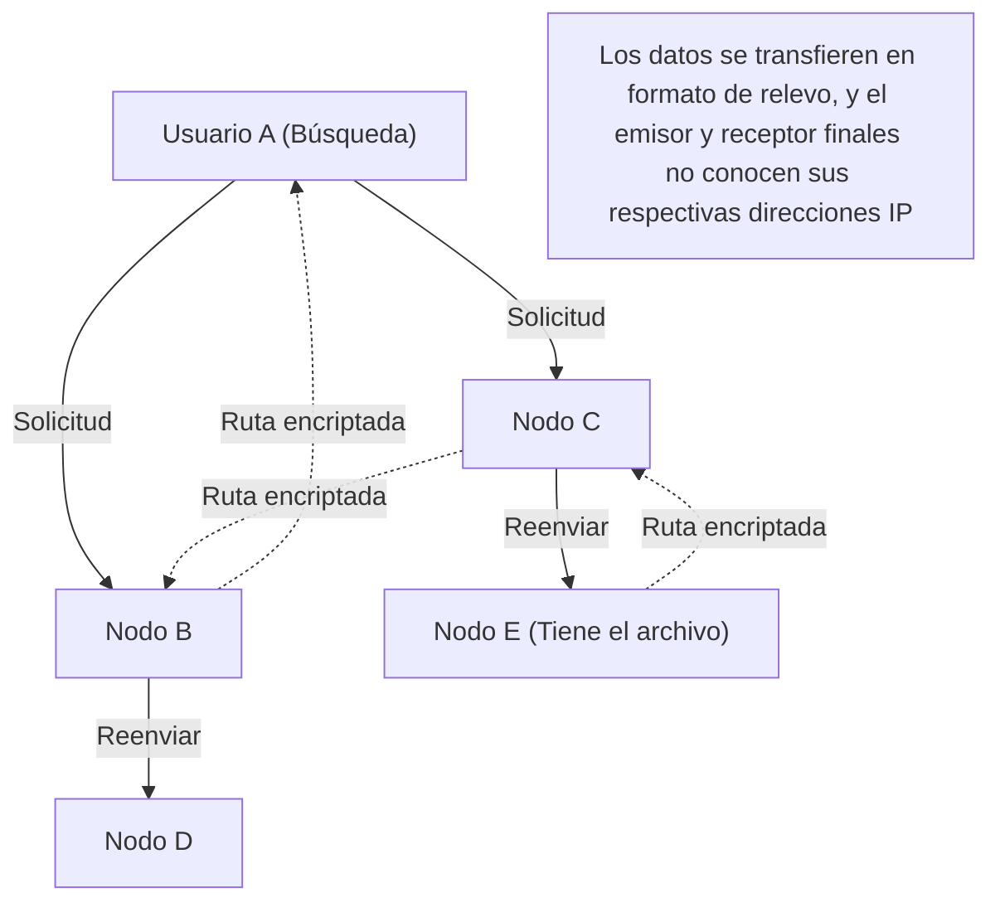

## 1. ¿Qué es "Winny", que arrasó a principios de la década de 2000?

En 2002, un programador anónimo bajo el seudónimo de "Sr. 47" publicó un software en el tablón de descargas del gigantesco foro electrónico "2channel". Ese software era "**Winny**".

Winny era un "software de intercambio de archivos" que permitía a los usuarios de internet compartir archivos directamente entre sí. Se distinguía de los sistemas existentes por su alto anonimato y su abrumadora eficiencia de transferencia, consiguiendo millones de usuarios en un abrir y cerrar de ojos.
Sin embargo, debido a su alto nivel de anonimato, se convirtió en un semillero de violaciones a la ley de derechos de autor, y tras múltiples incidentes de fuga de información confidencial causados por virus, evolucionó a un grave problema social. En 2004, el arresto del desarrollador Isamu Kaneko (Sr. 47) bajo sospecha de complicidad en la violación de la ley de derechos de autor desencadenó una tragedia que quedaría en la historia de la informática en Japón.

Este artículo explica en profundidad la innovación de la "tecnología de redes P2P (Peer-to-Peer) más avanzada del mundo en ese momento" incorporada en Winny, a menudo oculta tras aspectos sociales como los problemas de derechos de autor, desde una perspectiva puramente de ciencias de la computación.

## 2. ¿Qué es P2P (Peer-to-Peer)?

Para entender la tecnología de Winny, primero debemos conocer la estructura básica de las redes.

### Modelo cliente-servidor (convencional)
La mayor parte de internet que usamos habitualmente, como sitios web o YouTube, utiliza este método.
Existe un poderoso "servidor" central al que numerosos "clientes" (nuestros PC o smartphones) solicitan datos. Si bien tiene la ventaja de una estructura simple y fácil de administrar, tiene el punto débil de que si el acceso se concentra, el servidor puede caer, además de suponer enormes costos para sus administradores.

### Modelo P2P (Peer-to-Peer)
No existe un servidor central; cada PC (nodo) que participa en la red se comunica directamente en pie de igualdad, proveyéndose datos mutuamente.
Tiene la robusta propiedad de que, a medida que aumentan los participantes, la capacidad de procesamiento y el ancho de banda de todo el sistema escalan de manera eficiente.

## 3. La innovación de Winny: P2P puro y la arquitectura Freenet

Los programas de intercambio de archivos extranjeros de la época (como Napster) utilizaban un método "P2P híbrido": "el intercambio de archivos en sí se realiza entre los usuarios (P2P), pero el servidor de búsqueda que rastrea quién tiene qué archivo se encuentra en el centro". Esto tenía la debilidad de que, si se detenía el servidor central, toda la red colapsaba.

En contraste, Winny implementó un "**P2P puro (pure P2P)**" sin ningún servidor central.
El modelo de red de Winny se basaba en la arquitectura "Freenet", desarrollada para lograr un alto anonimato, a la que el Sr. Kaneko añadió mejoras propias excepcionalmente brillantes.

### Enrutamiento autónomo descentralizado basado en claves (keys)
En la red de Winny, a los archivos se les asigna una "clave" basada en un valor hash único (una especie de huella digital del archivo), y a cada nodo individual (el PC del usuario) también se le asigna un "ID de nodo" basado en números aleatorios.

Al realizar una búsqueda, el usuario no especifica una dirección IP, sino que transmite una solicitud en cadena al nodo vecino preguntando: "¿Quién es el nodo que tiene información cercana a esta clave?".
Dado que cada nodo reenvía la solicitud al "nodo más cercano a la solicitud" de entre la información que posee, toda la red funciona de manera autónoma como una especie de "base de datos descentralizada gigante", con un algoritmo matemático incorporado para llegar al archivo deseado de forma eficiente.

## 4. El sistema "Cache Relay" que originó el anonimato definitivo

La mayor razón por la que Winny asombró a los ingenieros de la época fue su robusto mecanismo de **anonimato**.

En el P2P normal, al descargar un archivo, el emisor (seed) y el receptor (downloader) se conectan directamente por sus direcciones IP para comunicarse, lo que facilita rastrear quién envió el archivo a quién.
Sin embargo, Winny adoptó un sistema de "**relevo de archivos y caché automático**".

1. **Rutas de transferencia encriptadas**: Los archivos no se enviaban directamente, sino que se transferían (relevaban) a través de múltiples nodos intermedios no relacionados, y toda la comunicación en esa ruta estaba encriptada.
2. **Difusión de poseedores mediante caché automático**: Este es el punto principal. En los discos duros de los nodos no relacionados que sirvieron de puntos de relevo, se guarda automáticamente una parte del archivo en transferencia como una "caché encriptada".
3. **Ocultación del emisor**: Gracias a esto, incluso si se descubre a un nodo enviando un archivo, es teóricamente imposible para el sistema distinguir si esa persona es el "publicador original del archivo" o simplemente "una persona sin relación a la que se le hace reenviar como intermediario".

El rasgo de genialidad del Sr. Kaneko radicó en vincular magistralmente el aumento de la carga en la red debido a esta "transferencia de relevo para el anonimato" con la eficiencia, logrando que "al distribuirse la caché por toda la red, los archivos más populares se puedan descargar más rápido desde los nodos más cercanos (efecto tipo CDN)".

## 5. Clustering: Inclusión de funciones BBS (Foros)

A partir de Winny2, se implementó no solo el intercambio de archivos, sino también una función de "foro" sobre la red P2P.
Un foro descentralizado completamente incensurable que no requería del servidor central de 2channel.

Aquí se adoptó la "tecnología de clustering" basada en los intereses de los usuarios. La topología (forma de conexión) de la red, como grupos de nodos interesados en anime o en música, cambiaba dinámicamente aprendiendo del comportamiento de los usuarios, colocando automáticamente a aquellos con gustos similares cerca unos de otros.
Con esto, lograron una difusión de la información extremadamente eficiente sin necesidad de realizar búsquedas inútiles en toda la enorme red. Este avanzado algoritmo de clustering tenía una visión pionera que conecta con los sistemas de recomendación de la IA moderna y las tecnologías de procesamiento distribuido.

## 6. Luces y sombras: Evolución tecnológica y fricción social

Los conceptos técnicos incorporados en Winny, como "descentralización completa", "ocultación de comunicaciones mediante encriptación" y "enrutamiento eficiente autónomo y distribuido", fueron precursores sumamente avanzados que conectan directamente con la filosofía del "**blockchain**" de sistemas posteriores como Bitcoin o la web descentralizada (Web3) como IPFS.

Si Isamu Kaneko no hubiera sido arrestado, y si este talento excepcional se hubiera canalizado hacia el desarrollo legal de infraestructuras, creando un sistema distribuido desde Japón que se convirtiera en un estándar global, el mapa hegemónico del internet actual podría haber sido algo distinto.

La tecnología en sí misma no es buena ni mala. Sin embargo, cuando esa tecnología es demasiado poderosa y sobrepasa el marco legal de la sociedad, se produce una fricción intensa. La historia de Winny nos plantea preguntas profundas que siguen vigentes hoy en día sobre la innovación, la responsabilidad social y cómo debemos proteger y fomentar a nuestros ingenieros.
