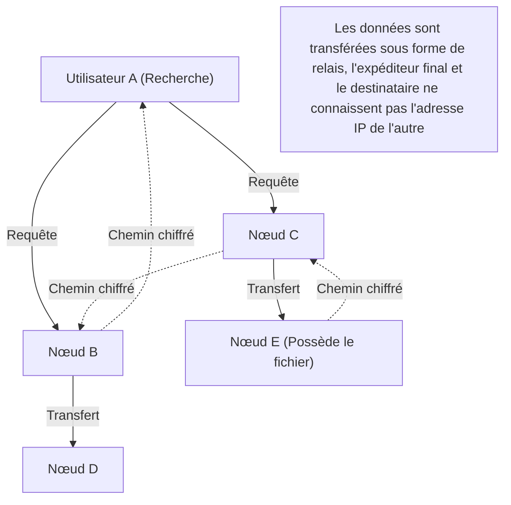

## 1. Qu'est-ce que « Winny », qui a balayé le début des années 2000 ?

En 2002, sur le forum de téléchargement de l'immense bulletin électronique « 2channel », un logiciel a été publié par un programmeur anonyme se faisant appeler « 47 ». Il s'agissait de « **Winny** ».

Winny était un « logiciel de partage de fichiers » permettant aux utilisateurs d'Internet d'échanger des fichiers directement entre eux. Bénéficiant d'un haut niveau d'anonymat et d'une efficacité de transfert écrasante qui le distinguaient des systèmes existants, il a rapidement acquis des millions d'utilisateurs.
Cependant, en raison de ce haut niveau d'anonymat, il est devenu un foyer de violations de la loi sur le droit d'auteur, et de nombreux incidents de fuites d'informations confidentielles dues à des virus se sont produits, ce qui a dégénéré en un problème de société majeur. En 2004, son développeur, Isamu Kaneko (Monsieur 47), a été arrêté pour complicité de violation de la loi sur le droit d'auteur, déclenchant ainsi une tragédie qui restera dans l'histoire de l'informatique japonaise.

Dans cet article, nous expliquerons en profondeur, d'un point de vue purement informatique, le caractère innovant de « la technologie des réseaux P2P (Peer-to-Peer) alors à la pointe du monde » intégrée dans Winny, dont on parle rarement car occultée par les aspects sociaux tels que les problèmes de droits d'auteur.

## 2. Qu'est-ce que le P2P (Peer-to-Peer) ?

Pour comprendre la technologie de Winny, il faut d'abord connaître la structure de base des réseaux.

### Modèle client-serveur (modèle traditionnel)
La majorité de l'Internet que nous utilisons quotidiennement, comme les sites Web et YouTube, utilise ce modèle.
Un « serveur » puissant existe au centre, et de nombreux « clients » (nos PC ou smartphones) demandent des données au serveur. Bien que sa structure soit simple et facile à gérer, il présente l'inconvénient que le serveur peut tomber en panne si l'accès est concentré, ou qu'il entraîne des coûts énormes pour l'administrateur du serveur.

### Modèle P2P (Peer-to-Peer)
Il n'y a pas de serveur central, et les PC individuels (pairs) participant au réseau communiquent directement entre eux sur un pied d'égalité pour se fournir mutuellement des données.
Il possède une nature robuste où plus le nombre de participants augmente, plus la capacité de traitement et la bande passante du système global augmentent (mise à l'échelle).

## 3. L'innovation de Winny : Le P2P pur et l'architecture Freenet

Les logiciels de partage de fichiers étrangers de l'époque (comme Napster) utilisaient un modèle « P2P hybride » : « l'échange de fichiers lui-même s'effectue entre les utilisateurs (P2P), mais le serveur de recherche qui sait qui possède quel fichier est centralisé ». Cela avait pour faiblesse de provoquer la mort du réseau entier si le serveur central était arrêté.

En revanche, Winny réalisait un « **P2P pur (pure P2P)** » sans aucun serveur central.
Le modèle de réseau de Winny était basé sur l'architecture « Freenet », développée pour atteindre un haut niveau d'anonymat, à laquelle s'ajoutaient les propres améliorations extrêmement brillantes de Kaneko.

### Routage autonome décentralisé basé sur des clés
Dans le réseau de Winny, une « clé » basée sur une valeur de hachage unique (sorte d'empreinte digitale du fichier) est attribuée au fichier, et un « ID de nœud » basé sur un nombre aléatoire est également attribué à chaque nœud (le PC de l'utilisateur).

Lors d'une recherche, l'utilisateur ne spécifie pas une adresse IP spécifique, mais transmet la requête : « Qui est le nœud ayant les informations les plus proches de cette clé ? » au nœud voisin, comme dans une course de relais.
Chaque nœud transférant vers « un nœud plus proche de la requête » parmi ses propres informations, l'ensemble du réseau fonctionnait de manière autonome comme une sorte de « gigantesque base de données distribuée », intégrant un algorithme mathématique pour atteindre efficacement le fichier cible.

## 4. Le système de « cache relay » qui a créé l'anonymat ultime

La principale raison pour laquelle Winny a émerveillé les ingénieurs de l'époque est son mécanisme d'**anonymat** robuste.

Dans un P2P normal, lors du téléchargement d'un fichier, l'expéditeur (seed) et le destinataire (downloader) communiquent en connectant directement leurs adresses IP, de sorte qu'il est facile d'identifier qui a envoyé le fichier à qui.
Cependant, Winny a adopté un mécanisme de « **relais de fichiers et de cache automatique** ».

1. **Chemin de transfert chiffré** : Les fichiers ne sont pas envoyés directement, mais transférés (relayés) via plusieurs nœuds intermédiaires non liés, et toutes les communications sur ce chemin étaient chiffrées.
2. **Diffusion des détenteurs par cache automatique** : C'est le point clé. Une partie du fichier en cours de transfert est automatiquement sauvegardée sous forme de « cache chiffré » sur le disque dur des nœuds non liés qui ont servi de points de relais.
3. **Dissimulation de l'expéditeur** : Ainsi, même si l'on découvre qu'un nœud transmet un fichier, il est théoriquement impossible de distinguer au niveau du système si cette personne est le « publieur original du fichier » ou simplement une « personne non liée obligée de servir de relais ».

Le génie de Kaneko réside dans le fait qu'il a brillamment associé l'augmentation de la charge sur le réseau due à ce « transfert par relais pour l'anonymisation » à une amélioration de l'efficacité sous la forme : « Plus un fichier est populaire, plus le cache est distribué dans l'ensemble du réseau, ce qui permet de le télécharger à grande vitesse à partir d'un nœud proche (un effet similaire à un CDN) ».

## 5. Clustering : L'intégration de la fonctionnalité BBS (forum)

À partir de Winny2, non seulement le partage de fichiers, mais aussi la fonctionnalité de « forum (BBS) » a été implémentée sur le réseau P2P.
Il s'agit d'un forum décentralisé, totalement incensurable, ne nécessitant pas de serveur central 2channel.

Ici, la technologie de « clustering » basée sur les centres d'intérêt des utilisateurs a été adoptée. Des groupes de nœuds intéressés par les animes, des groupes de nœuds intéressés par la musique, etc., la topologie du réseau (forme de connexion) apprenait le comportement des utilisateurs et changeait dynamiquement, de sorte que les personnes partageant les mêmes idées étaient automatiquement placées à proximité les unes des autres.
Cela permettait une propagation extrêmement efficace de l'information sans avoir à chercher inutilement dans l'ensemble du gigantesque réseau. Cet algorithme de clustering avancé avait une vision avant-gardiste, comparable aux systèmes de recommandation de l'IA moderne et aux technologies de traitement distribué.

## 6. L'ombre et la lumière : Évolution technologique et frictions sociales

Les concepts techniques intégrés dans Winny, tels que la « décentralisation complète », la « dissimulation des communications par chiffrement » et le « routage efficace autonome et décentralisé », étaient extrêmement avancés, menant directement aux philosophies de la « **blockchain** » telles que Bitcoin apparu plus tard, et du Web décentralisé (Web3) comme IPFS.

Si Isamu Kaneko n'avait pas été arrêté et que ce talent rare avait été orienté vers le développement d'infrastructures légales, créant ainsi un système distribué standard mondial depuis le Japon, la cartographie de l'hégémonie de l'Internet actuel aurait pu être légèrement différente.

La technologie en elle-même n'est ni bonne ni mauvaise. Cependant, lorsque cette technologie est si puissante qu'elle dépasse le cadre juridique de la société, des frictions intenses se produisent. L'histoire de Winny nous pose de lourdes questions toujours pertinentes aujourd'hui concernant l'innovation et la responsabilité sociale, ainsi que la manière de protéger et de cultiver les ingénieurs.
