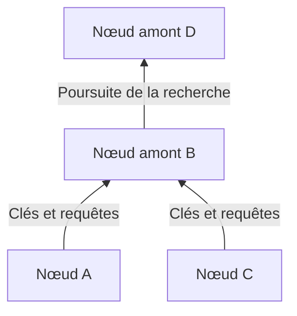
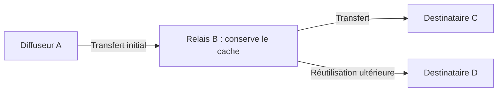

## 1. Le problème que Winny cherchait à résoudre

Comment distribuer un gros fichier à de nombreuses personnes avec une faible capacité d’envoi à l’origine, sans serveur central de recherche, tout en rendant difficile l’identification du premier diffuseur ? Concilier ces trois objectifs fait l’intérêt technique de Winny.

Winny est un logiciel de partage P2P développé par Isamu Kaneko. Sa première version d’essai a été publiée le 6 mai 2002. Dans un réseau **pair à pair**, chaque ordinateur peut fournir des données aussi bien qu’en recevoir. Chaque participant est un pair, ou nœud. [Arrêt de la Cour suprême japonaise, traduction anglaise sur WIPO Lex][court]

Le terme P2P ne définit ni la recherche ni le degré d’anonymat. Il faut distinguer **la découverte des pairs, la recherche de fichiers et le transfert de leur contenu**. Les schémas et calculs ci-dessous sont des modèles conceptuels, pas des traces réseau d’une version précise.

## 2. Sans serveur central, mais avec un point de départ

Sur le Web, le client contacte généralement un serveur désigné. Un CDN peut répartir la diffusion ; ici, nous retenons une source unique pour simplifier. En P2P, le destinataire peut devenir fournisseur.

Winny n’exige pas de serveur central regroupant le catalogue. Pourtant, un nouveau nœud doit connaître une première adresse à contacter. Des informations sur des nœuds d’amorçage permettent d’établir les connexions. L’absence de catalogue central ne supprime ni ce besoin ni l’infrastructure Internet. [Documentation de JPNIC][jpnic]

Ces connexions logiques forment un **réseau superposé**, comme des lignes de bus sur un réseau routier. Chaque nœud échange avec certains voisins, sans contacter directement tous les participants.

Des chemins alternatifs permettent parfois de continuer lorsqu’un voisin se déconnecte. Mais les arrivées et départs rendent les informations périmées. Décentraliser ne garantit ni de trouver tous les fichiers ni de résister à toutes les pannes.

## 3. Séparer la petite fiche du gros fichier

Dans une bibliothèque, on ne déplace pas tous les livres pour chaque recherche : on consulte le catalogue avant de demander un ouvrage. Winny sépare pareillement les métadonnées du contenu.

| Élément | Rôle | Distinction importante |
|---|---|---|
| Clé | Nom, taille, empreinte et adresse de récupération, entre autres | Ce n’est pas ici une clé de déchiffrement |
| Corps/cache | Stockage et transfert du contenu chiffré | Son détenteur n’est pas forcément le diffuseur initial |
| Empreinte de hachage | Identification et comparaison des fichiers | Ce n’est pas une signature attestant l’auteur ou l’innocuité |

Le compte rendu d’une conférence de Kaneko décrit cette séparation et la conservation du contenu dans les relais. [Compte rendu de GLOCOM][glocom]

Deux fichiers nommés `lecture.zip` peuvent être différents. Un identifiant lié au contenu aide à les distinguer, mais un fichier malveillant possède aussi une empreinte. Correspondre à une fiche ne signifie pas pouvoir être exécuté sans danger.

## 4. Hiérarchie et regroupement pour orienter les recherches

Interroger tout le monde à chaque recherche augmenterait le trafic avec la taille du réseau. Winny organise une hiérarchie tenant compte de la vitesse de connexion : les clés et les recherches remontent principalement vers l’amont. Le **regroupement par centres d’intérêt** rapproche les nœuds ayant des mots-clés similaires. [JPNIC][jpnic]

Ce schéma indique une direction. L’amont n’est ni le nord géographique ni un serveur fixe d’une organisation. Une connexion rapide conserve une capacité limitée, et la concentration du travail peut la charger.

On peut imaginer que les informations musicales deviennent plus faciles à trouver près de participants intéressés par la musique. La proximité des mots-clés n’est pas une évaluation par IA de la vérité ou de la qualité du contenu.

**Présenter Winny comme une DHT acheminant les requêtes vers le nœud à l’empreinte la plus proche est trompeur.** Une table de hachage distribuée répartit un espace de clés entre des nœuds : c’est une autre conception. Identifier des fichiers par hachage ne suffit pas à faire d’un réseau une DHT. Identifiant de catalogue et chemin de recherche sont distincts.

## 5. Relais et cache : multiplier les fournisseurs

Après avoir trouvé un candidat, il faut récupérer son contenu. Métadonnées et données ne suivent pas nécessairement le même chemin. Winny prévoit qu’un nœud modifie l’adresse de récupération d’une clé, reçoive la demande, récupère les données auprès de la source précédente, puis les transmette et les conserve. Le cache peut servir des demandes ultérieures. [JPNIC][jpnic]

D utilise la copie de B plutôt que de recevoir directement d’A. La charge d’A diminue et l’expéditeur immédiat de D se distingue du diffuseur initial. Cela ne signifie pas que chaque téléchargement traverse le même nombre de relais.

### Envoyer 100 Mo à 100 personnes

Soient $F$ la taille du fichier et $n$ le nombre de destinataires. Si une source envoie une copie complète à chacun, son volume d’envoi est :

$$
V_0 = nF
$$

Pour $F=100\,\mathrm{Mo}$ et $n=100$, cela donne 10 000 Mo. Comparons avec le cas idéal où la source envoie une copie et où les détenteurs du cache assurent les 99 autres livraisons.

| Hypothèse | Envoi de la source | Envoi des autres participants |
|---|---:|---:|
| La source envoie directement aux 100 destinataires | 10 000 Mo | 0 Mo |
| Une copie initiale, puis 99 redistributions | 100 Mo | 9 900 Mo |

**C’est la concentration à la source qui disparaît, pas le trafic nécessaire pour fournir toutes les copies.** Relais, retransmissions et recherches peuvent augmenter le trafic total. Il ne s’agit ni de mesures de Winny ni d’une promesse de vitesse multipliée par cent.

Si $u_i$ est le débit montant de chacun des $k$ fournisseurs et $d$ la capacité de réception, une borne conceptuelle du débit effectif $r$, en supposant une récupération parallèle, est :

$$
r \leq \min\left(d,\sum_{i=1}^{k}u_i\right)
$$

Congestion, disque et répartition des données comptent également. Dix fournisseurs partageant une liaison lente ne multiplient pas sa vitesse par dix. Les fichiers populaires accumulent des copies ; un fichier rare peut devenir indisponible si son unique détenteur se déconnecte.

## 6. Chiffrer ne rend pas invisible

Winny associait chiffrement, relais et cache pour rendre le diffuseur moins identifiable. Quatre propriétés doivent être séparées.

| Propriété | Question | Autres éléments à examiner |
|---|---|---|
| Confidentialité | Un observateur peut-il lire le contenu ? | Chiffrement, implémentation, gestion des clés |
| Anonymat | Peut-on relier l’activité à une personne ? | Voisins, horaires et volumes de trafic |
| Authenticité | Les données viennent-elles de l’auteur annoncé ? | Signatures ou sources fiables |
| Sécurité du poste | Ouvrir le fichier peut-il endommager l’ordinateur ? | Droits d’exécution et protection contre les logiciels malveillants |

Une communication IP directe nécessite une adresse de destination. Le chiffrement n’efface ni l’existence de la connexion ni toutes les informations sur ses extrémités. Voir un envoi depuis un cache ne suffit pas à désigner le diffuseur initial, mais plusieurs observations, dans le temps et l’espace, peuvent être combinées.

Une affirmation d’anonymat exige un modèle de menace : qui observe quoi ? Observer un voisin ou surveiller de nombreuses connexions ne donne pas les mêmes capacités. « Totalement anonyme » et « impossible à retracer par principe » sont donc inappropriés.

## 7. Fuites : distinguer compromission et redistribution

Les fuites liées à Winny se comprennent en deux étapes : un logiciel malveillant ou une autre cause expose des données privées du poste, puis le réseau les copie. L’IPA a étudié les réponses à des incidents réels. [Rapport de l’IPA][ipa]

Un enchaînement explicatif typique est : **exécution d’un fichier suspect → collecte et publication par un logiciel malveillant → récupération par d’autres nœuds → redistribution des caches**. Lancer Winny ne publie donc pas nécessairement tout le disque. Le comportement du programme malveillant et la diffusion P2P sont deux choses distinctes.

Supprimer l’original ne supprime pas forcément les copies déjà présentes ailleurs. Si le logiciel malveillant lit le texte clair sur le poste infecté, aucun chiffrement ne doit être cassé. Chiffrer le transport ne ferme pas cette porte.

Quelles données sont partagées ? L’utilisateur peut-il le vérifier ? Jusqu’où s’étend une compromission ? Peut-on retirer une publication accidentelle ? L’ergonomie et le contrôle comptent autant que l’efficacité.

## 8. Distinguer histoire, justice et évaluation technique

| Date | Événement |
|---|---|
| Mai 2002 | Première version d’essai |
| Mai 2003 | Version d’essai de Winny 2, visant un forum P2P |
| 2004 | Arrestation de Kaneko, soupçonné de complicité d’atteinte au droit d’auteur |
| 19 décembre 2011 | Rejet du recours du ministère public par la Cour suprême, rendant l’acquittement définitif |

Le forum de Winny 2 était une application construite sur la diffusion distribuée. Le regroupement pour la recherche n’était pas lui-même un forum. La distribution ne garantit ni authenticité des messages, ni permanence, ni résistance à toute suppression. [GLOCOM][glocom]

La question judiciaire était de savoir si fournir le logiciel constituait une aide criminelle aux infractions des utilisateurs dans les circonstances jugées. La Cour suprême n’a pas retenu la responsabilité pénale du développeur dans cette affaire. Elle n’a ni légalisé tout partage ni accordé une immunité générale aux développeurs. [Arrêt][court]

## 9. Les questions de conception à retenir

« Innovant, donc sûr » et « nuisible dans certains cas, donc sans valeur » sont des jugements trop sommaires. Recherche, diffusion, vie privée et contrôle sont des objectifs distincts.

Séparer métadonnées et contenu, réutiliser des copies et rapprocher les intérêts économise des ressources. Mais davantage de copies complique le retrait ; davantage de relais modifie latence et points d’observation. Avantages et coûts viennent des mêmes mécanismes.

Posons aussi cinq questions aux systèmes actuels : **Comment trouve-t-on le premier pair ? Où cherche-t-on ? Qui envoie le contenu ? Que cache-t-on, et à qui ? Qui garde le contrôle après publication ?** Winny constitue un cas concret pour les examiner séparément.

## Sources

- [JPNIC : bases du P2P et exploitation des réseaux, Internet Week 2006, notamment p. 9–15 (japonais)][jpnic]
- [GLOCOM : compte rendu de la conférence de Kaneko sur Winny, 2006 (japonais)][glocom]
- [IPA : réponses aux fuites de données via Winny, 2007 (japonais)][ipa]
- [WIPO Lex : Cour suprême, 2009 (A) 1900, 19 décembre 2011 (traduction anglaise)][court]

[jpnic]: https://www.nic.ad.jp/ja/materials/iw/2006/proceedings/T3-1.pdf
[glocom]: https://www.glocom.ac.jp/wp-content/uploads/2020/10/chijo106_042-053.pdf
[ipa]: https://www.ipa.go.jp/archive/files/000011527.pdf
[court]: https://www.wipo.int/wipolex/en/text/584277

