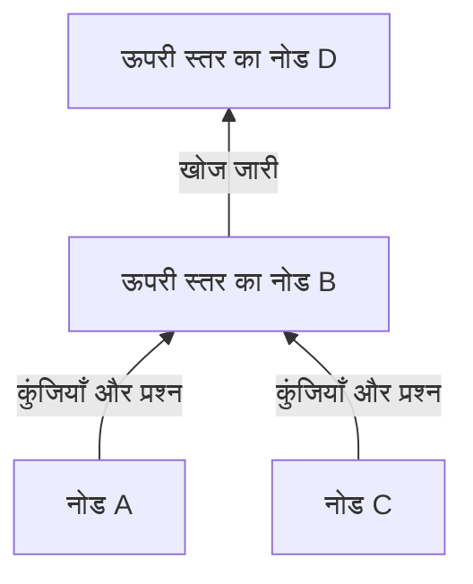
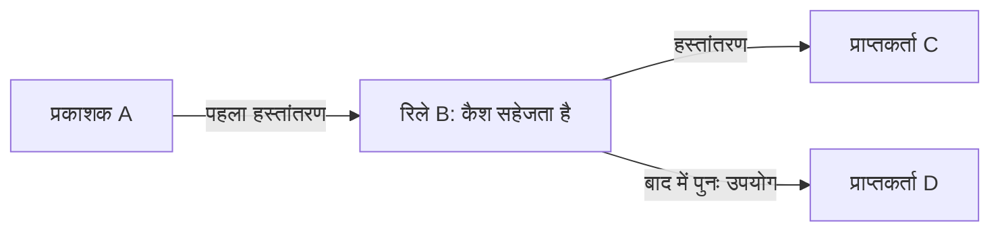

## 1. Winny किस समस्या को हल करना चाहता था?

एक बड़ी फ़ाइल बहुत से लोगों तक पहुँचानी है, लेकिन मूल स्रोत की अपलोड क्षमता कम है। साथ ही केंद्रीय खोज सर्वर नहीं रखना है और पहली बार फ़ाइल प्रकाशित करने वाले की पहचान कठिन बनानी है। इन तीन लक्ष्यों का मेल Winny को तकनीकी रूप से रोचक बनाता है।

Winny, इसामु कानेको द्वारा विकसित P2P फ़ाइल साझा करने का प्रोग्राम है। इसका पहला परीक्षण संस्करण 6 मई 2002 को जारी हुआ। **पीयर-टू-पीयर** में भाग लेने वाले कंप्यूटर डेटा पाने के साथ दूसरों को डेटा देते भी हैं। प्रत्येक सहभागी को पीयर या नोड कहते हैं। [जापान के सर्वोच्च न्यायालय का निर्णय, WIPO Lex पर अंग्रेज़ी अनुवाद][court]

केवल P2P कहने से खोज का तरीका या गुमनामी तय नहीं होती। **दूसरे नोड खोजना, फ़ाइल खोजना और उसका वास्तविक डेटा भेजना** अलग काम हैं। नीचे दिए चित्र और गणनाएँ अवधारणात्मक मॉडल हैं, किसी विशेष संस्करण के वास्तविक संचार रिकॉर्ड नहीं।

## 2. केंद्रीय सर्वर नहीं, फिर भी शुरुआती संपर्क चाहिए

सामान्य वेब वितरण में उपयोगकर्ता निर्धारित सर्वर से संपर्क करता है। CDN से वितरण बाँटा जा सकता है; तुलना सरल रखने के लिए यहाँ एक स्रोत मानते हैं। P2P में प्राप्तकर्ता स्वयं अगला प्रदाता बन सकता है।

Winny को पूरी फ़ाइल सूची रखने वाले केंद्रीय खोज सर्वर की ज़रूरत नहीं होती। लेकिन नए नोड को संपर्क करने के लिए कम-से-कम एक पता तो जानना होगा। शुरुआती नोड की जानकारी से पहले कनेक्शन बनते हैं। केंद्रीय सूची न होने का अर्थ शुरुआती संपर्कों या इंटरनेट के बुनियादी ढाँचे की आवश्यकता समाप्त होना नहीं है। [JPNIC की तकनीकी सामग्री][jpnic]

ये तार्किक कनेक्शन **ओवरले नेटवर्क** बनाते हैं, जैसे सड़कों के ऊपर बसों के मार्ग। हर नोड सभी सहभागियों से सीधे जुड़ने के बजाय कुछ पड़ोसियों से जानकारी साझा करता है।

वैकल्पिक रास्ता हो तो पड़ोसी के हटने पर भी संचार चल सकता है। लेकिन बार-बार जुड़ने और हटने से जानकारी पुरानी पड़ती है। विकेंद्रीकरण से हर फ़ाइल मिलने या हर विफलता सहने की गारंटी नहीं मिलती।

## 3. छोटी सूची-प्रविष्टि और बड़ी फ़ाइल अलग रखें

पुस्तकालय हर खोज पर सभी किताबें नहीं लाता। पहले सूची देखते हैं, फिर इच्छित पुस्तक मँगाते हैं। Winny भी खोज के मेटाडेटा और फ़ाइल के वास्तविक डेटा को अलग रखता है।

| तत्व | भूमिका | ज़रूरी अंतर |
|---|---|---|
| कुंजी | नाम, आकार, हैश और प्राप्ति का पता जैसी सूची-सूचना | यहाँ इसका अर्थ डिक्रिप्शन कुंजी नहीं है |
| मूल डेटा/कैश | एन्क्रिप्टेड फ़ाइल डेटा रखना और भेजना | कैश रखने वाला पहला प्रकाशक हो, यह ज़रूरी नहीं |
| हैश | फ़ाइल पहचानने और तुलना करने में मदद | लेखक या सुरक्षा प्रमाणित करने वाला डिजिटल हस्ताक्षर नहीं |

कानेको के व्याख्यान की रिपोर्ट इस विभाजन और बीच के नोडों में डेटा सहेजने की व्यवस्था बताती है। [GLOCOM की रिपोर्ट][glocom]

`lecture.zip` नाम वाली दो फ़ाइलों का डेटा अलग हो सकता है। डेटा से जुड़े पहचानकर्ता उन्हें अलग करने में मदद करते हैं, लेकिन हानिकारक फ़ाइल का भी हैश होता है। सूची से मेल खाना और चलाने के लिए सुरक्षित होना अलग बातें हैं।

## 4. स्तरों और समूहों से खोज को दिशा देना

हर बार सभी से पूछने पर नेटवर्क के आकार के साथ खोज का ट्रैफ़िक बढ़ेगा। Winny कनेक्शन की गति के आधार पर स्तर बनाता है। कुंजियाँ और खोज मुख्यतः ऊपर के स्तरों की ओर जाती हैं। **क्लस्टरिंग** समान रुचि वाले कीवर्ड रखने वाले नोडों को जोड़कर खोज बेहतर बनाती है। [JPNIC][jpnic]

यह दिशा दिखाने वाला चित्र है। ऊपर का अर्थ भौगोलिक उत्तर या किसी संस्था का स्थायी सर्वर नहीं है। तेज़ कनेक्शन की क्षमता भी सीमित है और ऊपर काम जमा होने से भार बढ़ सकता है।

क्लस्टरिंग को इस तरह समझें: संगीत में रुचि रखने वालों के आसपास संगीत संबंधी जानकारी ढूँढ़ना आसान हो सकता है। मिलते-जुलते कीवर्ड का उपयोग, सामग्री की सच्चाई या गुणवत्ता का AI द्वारा मूल्यांकन नहीं है।

**Winny को निकटतम हैश वाले नोड तक पहुँचाने वाली DHT कहना भ्रामक है।** वितरित हैश तालिका कुंजी-क्षेत्र की ज़िम्मेदारी नोडों में बाँटती है; यह अलग डिज़ाइन है। फ़ाइल पहचानने के लिए हैश का उपयोग करने से नेटवर्क स्वतः DHT नहीं बनता। सूची का पहचानकर्ता और उसे खोजने का मार्ग अलग हैं।

## 5. रिले और कैश से प्रदाता बढ़ते हैं

उपयुक्त फ़ाइल मिलने के बाद उसका डेटा प्राप्त करना होता है। खोज की जानकारी और फ़ाइल डेटा का रास्ता एक होना आवश्यक नहीं। Winny में एक व्यवस्था है जिसमें नोड कुंजी का प्राप्ति-पता बदलता है, अनुरोध स्वीकार करता है, पुराने स्रोत से डेटा लाता है और आगे भेजते हुए सहेजता है। यह कैश बाद के अनुरोधों में काम आता है। [JPNIC][jpnic]

D सीधे A से लेने के बजाय B की प्रति लेता है। A का भार घटता है और D का तत्काल प्रेषक मूल प्रकाशक से अलग हो जाता है। इसका अर्थ हर डाउनलोड में रिले की संख्या समान होना नहीं है।

### 100 लोगों को 100 MB भेजना

मान लें फ़ाइल का आकार $F$ और प्राप्तकर्ताओं की संख्या $n$ है। एक स्रोत हर व्यक्ति को पूरी प्रति भेजे तो उसकी अपलोड मात्रा होगी:

$$
V_0 = nF
$$

$F=100\,\mathrm{MB}$ और $n=100$ पर यह 10,000 MB है। आदर्श स्थिति में स्रोत एक प्रति भेजता है और बाकी 99 बार कैश रखने वाले वितरण करते हैं।

| वितरण की धारणा | स्रोत का अपलोड | अन्य सहभागियों का अपलोड |
|---|---:|---:|
| स्रोत सभी 100 लोगों को सीधे भेजता है | 10,000 MB | 0 MB |
| एक शुरुआती प्रति, फिर 99 पुनर्वितरण | 100 MB | 9,900 MB |

**कम होता है स्रोत पर केंद्रित भार, सभी तक प्रतियाँ पहुँचाने के लिए आवश्यक ट्रैफ़िक नहीं।** रिले, दोबारा भेजना और खोज कुल ट्रैफ़िक बढ़ा सकते हैं। ये Winny के मापे गए परिणाम या सौ गुना गति का वादा नहीं हैं।

यदि $k$ प्रदाताओं में प्रत्येक की अपलोड दर $u_i$ और प्राप्तकर्ता की डाउनलोड क्षमता $d$ हो, तो समानांतर प्राप्ति मानने पर प्रभावी दर $r$ की अवधारणात्मक ऊपरी सीमा है:

$$
r \leq \min\left(d,\sum_{i=1}^{k}u_i\right)
$$

भीड़, डिस्क की गति और किस प्रदाता के पास कौन-सा डेटा है, ये भी मायने रखते हैं। एक धीमे कनेक्शन को साझा करने वाले दस प्रदाता उसकी गति दस गुनी नहीं करते। लोकप्रिय फ़ाइल की प्रतियाँ बढ़ सकती हैं; दुर्लभ फ़ाइल का एकमात्र धारक हट जाए तो वह उपलब्ध नहीं रहेगी।

## 6. एन्क्रिप्शन का अर्थ अदृश्य होना नहीं

Winny ने प्रकाशक को पहचानना कठिन बनाने के लिए एन्क्रिप्शन, रिले और कैश जोड़े। चार गुण अलग रखने चाहिए।

| गुण | प्रश्न | अन्य विचार |
|---|---|---|
| गोपनीयता | क्या पर्यवेक्षक डेटा पढ़ सकता है? | एल्गोरिदम, कार्यान्वयन, कुंजी प्रबंधन |
| गुमनामी | क्या गतिविधि को व्यक्ति से जोड़ा जा सकता है? | पड़ोसी, समय और ट्रैफ़िक की मात्रा |
| प्रामाणिकता | क्या डेटा बताए गए लेखक का है? | विश्वसनीय हस्ताक्षर या वितरण स्रोत |
| उपकरण की सुरक्षा | फ़ाइल खोलना कंप्यूटर को नुकसान पहुँचा सकता है? | चलाने की अनुमतियाँ और मैलवेयर से बचाव |

सीधे IP संचार के लिए गंतव्य का IP पता चाहिए। एन्क्रिप्शन कनेक्शन का अस्तित्व या उसके सिरों की सारी जानकारी नहीं मिटाता। कैश से भेजते दिखना अकेले प्रथम प्रकाशन का प्रमाण नहीं, लेकिन अलग स्थानों और समयों के अवलोकन जोड़े जा सकते हैं।

गुमनामी के दावे में खतरे का मॉडल स्पष्ट होना चाहिए: कौन क्या देख सकता है? एक पड़ोसी को देखने वाला और बहुत से कनेक्शन देखने वाला समान नहीं हैं। इसलिए “पूरी तरह गुमनाम” या “सैद्धांतिक रूप से पता लगाना असंभव” कहना उचित नहीं।

## 7. सूचना लीक: घुसपैठ और पुनर्वितरण अलग हैं

Winny से जुड़े लीक को दो चरणों में समझें: मैलवेयर या अन्य कारण कंप्यूटर का निजी डेटा बाहर निकालता है, फिर नेटवर्क उसकी प्रतियाँ बनाता है। IPA ने वास्तविक घटनाओं की प्रतिक्रिया का अध्ययन किया। [IPA की रिपोर्ट][ipa]

एक सामान्य व्याख्यात्मक क्रम है: **संदिग्ध फ़ाइल चलाना → मैलवेयर जानकारी एकत्र कर प्रकाशित करता है → दूसरे नोड उसे लेते हैं → कैश पुनर्वितरण करते हैं**। इसका अर्थ Winny चालू करते ही पूरी डिस्क का प्रकाशित होना नहीं है। मैलवेयर का व्यवहार और P2P वितरण अलग रखने चाहिए।

मूल फ़ाइल मिटाने से दूसरे कंप्यूटरों की प्रतियाँ आवश्यक रूप से नहीं मिटतीं। संक्रमित उपकरण में मैलवेयर बिना एन्क्रिप्शन वाला डेटा पढ़ ले तो उसे कोई कूट तोड़ना नहीं पड़ता। केवल संचार एन्क्रिप्शन इस रास्ते को बंद नहीं करता।

कौन-सा डेटा साझा होता है? क्या उपयोगकर्ता जाँच सकता है? घुसपैठ का असर कितना फैलता है? गलती से प्रकाशित डेटा वापस लिया जा सकता है? उपयोग में आसानी और नियंत्रण भी दक्षता जितने महत्त्वपूर्ण हैं।

## 8. इतिहास और न्यायिक निष्कर्ष को तकनीकी मूल्यांकन से अलग रखें

| समय | घटना |
|---|---|
| मई 2002 | पहला परीक्षण संस्करण |
| मई 2003 | P2P चर्चा मंच के लक्ष्य वाला Winny 2 परीक्षण संस्करण |
| 2004 | कॉपीराइट उल्लंघन में सहायता के संदेह में कानेको की गिरफ़्तारी |
| 19 दिसंबर 2011 | सर्वोच्च न्यायालय ने अभियोजन की अपील खारिज की; दोषमुक्ति अंतिम हुई |

Winny 2 का चर्चा मंच वितरित डेटा वितरण पर बना अनुप्रयोग था। खोज की क्लस्टरिंग स्वयं चर्चा मंच नहीं थी। वितरण से पोस्ट की प्रामाणिकता, स्थायित्व या हर तरह के हटाए जाने से सुरक्षा की गारंटी नहीं मिलती। [GLOCOM][glocom]

मुकदमे का प्रश्न था कि उस मामले की परिस्थितियों में सॉफ़्टवेयर देना उपयोगकर्ताओं के कॉपीराइट उल्लंघन में आपराधिक सहायता था या नहीं। सर्वोच्च न्यायालय ने उस मामले में डेवलपर को आपराधिक रूप से ज़िम्मेदार नहीं माना। उसने हर फ़ाइल साझाकरण को वैध या सभी डेवलपरों को सार्वभौमिक छूट नहीं दी। [निर्णय][court]

## 9. Winny से मिलने वाले डिज़ाइन के प्रश्न

“नवीन है, इसलिए सुरक्षित है” और “हानि हुई, इसलिए वितरित तकनीक बेकार है” दोनों बहुत सरल निष्कर्ष हैं। खोज, वितरण, निजता और नियंत्रण अलग लक्ष्य हैं।

मेटाडेटा और डेटा अलग करना, प्रतियों का फिर उपयोग और समान रुचियों को जोड़ना संसाधन बचाता है। लेकिन अधिक प्रतियाँ वापस लेना कठिन बनाती हैं; अधिक रिले विलंब और देखने के बिंदु बदलते हैं। लाभ और लागत एक ही तंत्र से आते हैं।

आधुनिक प्रणालियों से भी पाँच प्रश्न पूछें: **पहला नोड कैसे मिलता है? खोज कहाँ होती है? डेटा कौन भेजता है? क्या किससे छिपता है? प्रकाशन के बाद नियंत्रण किसके पास है?** Winny इन्हें अलग-अलग समझने का ठोस उदाहरण है।

## स्रोत

- [JPNIC: P2P की बुनियाद और नेटवर्क संचालन, Internet Week 2006, विशेषतः पृ. 9–15 (जापानी)][jpnic]
- [GLOCOM: Winny पर कानेको के व्याख्यान की रिपोर्ट, 2006 (जापानी)][glocom]
- [IPA: Winny से सूचना लीक पर प्रतिक्रिया, 2007 (जापानी)][ipa]
- [WIPO Lex: सर्वोच्च न्यायालय, 2009 (A) 1900, 19 दिसंबर 2011 (अंग्रेज़ी अनुवाद)][court]

[jpnic]: https://www.nic.ad.jp/ja/materials/iw/2006/proceedings/T3-1.pdf
[glocom]: https://www.glocom.ac.jp/wp-content/uploads/2020/10/chijo106_042-053.pdf
[ipa]: https://www.ipa.go.jp/archive/files/000011527.pdf
[court]: https://www.wipo.int/wipolex/en/text/584277
