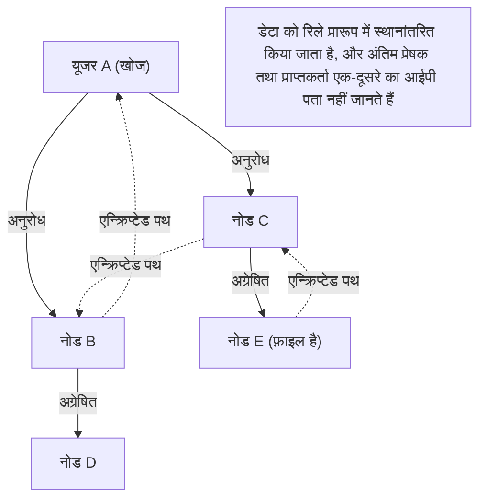

## 1. 2000 के दशक की शुरुआत में धूम मचाने वाला "विनी" (Winny) क्या है?

2002 में, विशाल इलेक्ट्रॉनिक बुलेटिन बोर्ड "2channel" के डाउनलोड बोर्ड पर "श्री 47 (47氏)" नामक एक अज्ञात प्रोग्रामर द्वारा एक सॉफ्टवेयर प्रकाशित किया गया था। वह "**विनी (Winny)**" है।

विनी एक "फाइल शेयरिंग सॉफ्टवेयर" था जो इंटरनेट पर उपयोगकर्ताओं को सीधे फाइलों का आदान-प्रदान करने की अनुमति देता था। मौजूदा प्रणालियों से अलग उच्च गुमनामी और अत्यधिक स्थानांतरण दक्षता का दावा करते हुए, इसने पलक झपकते ही लाखों उपयोगकर्ताओं को प्राप्त कर लिया।
हालांकि, अपनी उच्च गुमनामी के कारण, यह कॉपीराइट कानून के उल्लंघन का केंद्र बन गया, और वायरस के कारण गोपनीय जानकारी के लीक होने की लगातार घटनाओं से यह एक बड़ी सामाजिक समस्या बन गया। 2004 में, इसने जापानी आईटी इतिहास में एक त्रासदी को जन्म दिया, जब डेवलपर इसामु कानेको (श्री 47) को कॉपीराइट उल्लंघन में सहायता करने के संदेह में गिरफ्तार किया गया था।

इस लेख में, हम विशुद्ध कंप्यूटर विज्ञान के दृष्टिकोण से विनी में शामिल "उस समय दुनिया की सबसे उन्नत पी2पी (पीयर-टू-पीयर) नेटवर्क तकनीक" के नवाचार की गहराई से व्याख्या करेंगे, जिसके बारे में कॉपीराइट के मुद्दों जैसे सामाजिक पहलुओं के पीछे छिपकर बहुत कम बात की जाती है।

## 2. पी2पी (पीयर-टू-पीयर) क्या है?

विनी की तकनीक को समझने के लिए, सबसे पहले नेटवर्क की मूल संरचना को जानना आवश्यक है।

### क्लाइंट-सर्वर मॉडल (पारंपरिक प्रकार)
वेबसाइटें और यूट्यूब जैसे इंटरनेट का अधिकांश भाग जिसका हम आमतौर पर उपयोग करते हैं, इसी पद्धति पर आधारित है।
केंद्र में एक शक्तिशाली "सर्वर" मौजूद होता है, और बड़ी संख्या में "क्लाइंट (हमारे पीसी और स्मार्टफोन)" सर्वर से डेटा का अनुरोध करते हैं। इसकी संरचना सरल है और इसे प्रबंधित करना आसान है, लेकिन इसकी कमजोरी यह है कि अगर पहुंच केंद्रित हो जाती है तो सर्वर डाउन हो सकता है, और सर्वर प्रशासक को भारी लागत उठानी पड़ती है।

### पी2पी मॉडल (पीयर-टू-पीयर)
कोई केंद्रीय सर्वर नहीं होता है, और नेटवर्क में भाग लेने वाले व्यक्तिगत पीसी (पीयर) समान स्तर पर एक-दूसरे से सीधे संवाद करते हैं और एक-दूसरे को डेटा प्रदान करते हैं।
इसमें एक मजबूत विशेषता है कि जितने अधिक प्रतिभागी बढ़ते हैं, पूरे सिस्टम की प्रसंस्करण क्षमता और बैंडविड्थ उतनी ही अधिक बढ़ जाती है।

## 3. विनी का नवाचार: शुद्ध पी2पी और फ्रीनेट आर्किटेक्चर

उस समय विदेशी फाइल शेयरिंग सॉफ्टवेयर (जैसे नैप्स्टर) ने "हाइब्रिड पी2पी" पद्धति का इस्तेमाल किया था, जिसमें "फाइलों का आदान-प्रदान स्वयं उपयोगकर्ताओं (पी2पी) के बीच किया जाता था, लेकिन किसके पास कौन सी फाइल है इसके लिए एक खोज सर्वर केंद्र में मौजूद था"। इसकी एक कमजोरी थी कि यदि केंद्रीय सर्वर बंद हो जाता, तो पूरा नेटवर्क नष्ट हो जाता।

इसके विपरीत, विनी ने "**शुद्ध पी2पी (प्योर पी2पी)**" को साकार किया था जिसमें कोई केंद्रीय सर्वर नहीं था।
विनी का नेटवर्क मॉडल "फ्रीनेट" नामक आर्किटेक्चर पर आधारित था, जिसे उच्च गुमनामी प्राप्त करने के लिए विकसित किया गया था, और इसमें कानेको के अपने अत्यंत उत्कृष्ट सुधार शामिल थे।

### कुंजी (की) पर आधारित स्वायत्त विकेन्द्रीकृत रूटिंग
विनी के नेटवर्क में, एक अद्वितीय हैश मान (एक फ़ाइल के फिंगरप्रिंट की तरह) के आधार पर फ़ाइलों को एक "कुंजी" सौंपी जाती है, और प्रत्येक नोड (उपयोगकर्ता के पीसी) को एक यादृच्छिक संख्या के आधार पर एक "नोड आईडी" भी सौंपी जाती है।

खोज करते समय, उपयोगकर्ता एक विशिष्ट आईपी पते को निर्दिष्ट नहीं करते हैं, बल्कि वे "वह कौन सा नोड है जिसके पास इस कुंजी के करीब जानकारी है?" का अनुरोध एक बकेट रिले (बाल्टी-रिले) की तरह पड़ोसी नोड को देते हैं।
प्रत्येक नोड इसे अपनी जानकारी से "अनुरोध के करीब वाले नोड" पर अग्रेषित करता है, इसलिए संपूर्ण नेटवर्क स्वायत्त रूप से एक प्रकार के "विशाल विकेन्द्रीकृत डेटाबेस" के रूप में कार्य करता है, और इसमें एक गणितीय एल्गोरिथ्म शामिल था जो कुशलतापूर्वक लक्ष्य फ़ाइल तक पहुंचता था।

## 4. "कैशे रिले" विधि जिसने चरम गुमनामी पैदा की

विनी ने उस समय के इंजीनियरों को चकित कर देने का सबसे बड़ा कारण इसके मजबूत **गुमनामी** के तंत्र थे।

सामान्य पी2पी में, फ़ाइल डाउनलोड करते समय प्रेषक (सीड) और प्राप्तकर्ता (डाउनलोडर) सीधे अपने आईपी पते को जोड़कर संवाद करते हैं, इसलिए यह आसानी से पहचाना जा सकता है कि किसने किसको फ़ाइल भेजी है।

हालाँकि, विनी ने "**फ़ाइल बकेट रिले और स्वचालित कैशे**" का एक तंत्र अपनाया।

1. **एन्क्रिप्टेड स्थानांतरण पथ**: फ़ाइलें सीधे नहीं भेजी जाती थीं, बल्कि उन्हें बीच में कई असंबद्ध नोड्स के माध्यम से (रिले करके) स्थानांतरित किया जाता था, और उस पथ पर सभी संचार एन्क्रिप्ट किए गए थे।
2. **स्वचालित कैशे के माध्यम से धारकों का प्रसार**: यह सबसे महत्वपूर्ण बिंदु है। स्थानांतरण के दौरान फ़ाइल का एक हिस्सा स्वचालित रूप से मध्यवर्ती रिले बिंदु के रूप में कार्य करने वाले असंबद्ध नोड्स की एचडीडी (HDD) में "एन्क्रिप्टेड कैशे" के रूप में सहेजा जाता है।
3. **प्रेषक को छिपाना**: नतीजतन, भले ही यह पता चले कि कोई नोड एक फ़ाइल भेज रहा है, सैद्धांतिक रूप से यह सिस्टम पर भेद करना असंभव हो गया कि क्या वह व्यक्ति "मूल फ़ाइल का प्रकाशक" है या केवल "एक असंबद्ध व्यक्ति है जिसे रिले करने के लिए कहा जा रहा है"।

कानेको की प्रतिभा इस बात में थी कि उन्होंने "गुमनामी के लिए रिले स्थानांतरण" के कारण नेटवर्क पर बढ़े हुए भार को इस तरह से शानदार ढंग से दक्षता के साथ जोड़ा कि "चूंकि कैशे पूरे नेटवर्क में वितरित किए जाते हैं, इसलिए लोकप्रिय फ़ाइलों को पास के नोड्स से तेज़ी से डाउनलोड किया जा सकता है (सीडीएन (CDN) जैसा प्रभाव)"।

## 5. क्लस्टरिंग: बीबीस (BBS) (बुलेटिन बोर्ड) फ़ंक्शन को शामिल करना

विनी 2 (Winny2) से, न केवल फ़ाइल शेयरिंग, बल्कि "बुलेटिन बोर्ड" फ़ंक्शन भी पी2पी नेटवर्क पर लागू किया गया था।
यह एक पूरी तरह से सेंसर न किया जा सकने वाला विकेन्द्रीकृत बुलेटिन बोर्ड है जिसमें केंद्रीय 2channel सर्वर की आवश्यकता नहीं है।

यहाँ, उपयोगकर्ताओं की रुचियों पर आधारित "क्लस्टरिंग तकनीक" को अपनाया गया था। नेटवर्क की टोपोलॉजी (कनेक्शन का रूप) उपयोगकर्ता के व्यवहार को सीखकर गतिशील रूप से बदलती है, जैसे एनीमे में रुचि रखने वाले नोड्स का समूह या संगीत में रुचि रखने वाले नोड्स का समूह, ताकि समान रुचि वाले लोग स्वचालित रूप से एक-दूसरे के करीब आ जाएँ।
इसने पूरे विशाल नेटवर्क में बेकार में खोज किए बिना सूचना का अत्यधिक कुशल प्रसार हासिल किया। इस उन्नत क्लस्टरिंग एल्गोरिदम में दूरदर्शिता थी जो आधुनिक एआई (AI) की अनुशंसा प्रणालियों और वितरित प्रसंस्करण प्रौद्योगिकियों की ओर ले जाती है।

## 6. प्रकाश और छाया: प्रौद्योगिकी का विकास और सामाजिक घर्षण

विनी में शामिल तकनीकी अवधारणाएं जैसे "पूर्ण विकेंद्रीकरण", "एन्क्रिप्शन के माध्यम से संचार को छिपाना", और "स्वायत्त विकेन्द्रीकृत कुशल रूटिंग" अत्यंत उन्नत थीं और सीधे बिटकॉइन जैसे बाद के "**ब्लॉकचेन**" और आईपीएफएस (IPFS) जैसे विकेंद्रीकृत वेब (Web3) के विचारों से जुड़ी थीं।

यदि इसामु कानेको को गिरफ्तार नहीं किया गया होता और यह असाधारण प्रतिभा कानूनी बुनियादी ढांचे के विकास की ओर निर्देशित की जाती, जिससे जापान से एक विश्व-मानक वितरित प्रणाली का निर्माण होता, तो आज के इंटरनेट का आधिपत्य परिदृश्य थोड़ा अलग हो सकता था।

तकनीक अपने आप में न तो अच्छी है और न ही बुरी। हालाँकि, जब वह तकनीक इतनी शक्तिशाली हो जाती है कि यह समाज के कानूनी ढांचे को पीछे छोड़ देती है, तो एक तीव्र घर्षण पैदा होता है। विनी का इतिहास हमारे सामने नवाचार और सामाजिक जिम्मेदारी, और इंजीनियरों की रक्षा और पोषण कैसे करें, जैसे गंभीर सवाल खड़े करता है, जो आज भी प्रासंगिक हैं।
